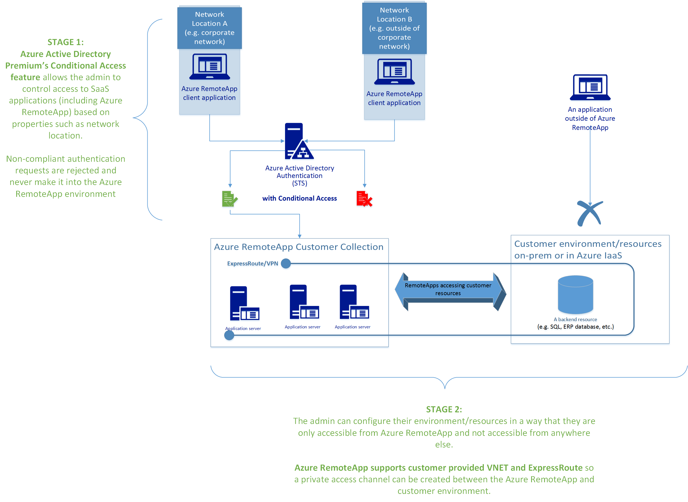
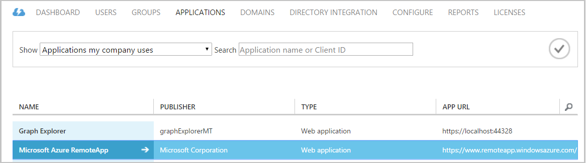
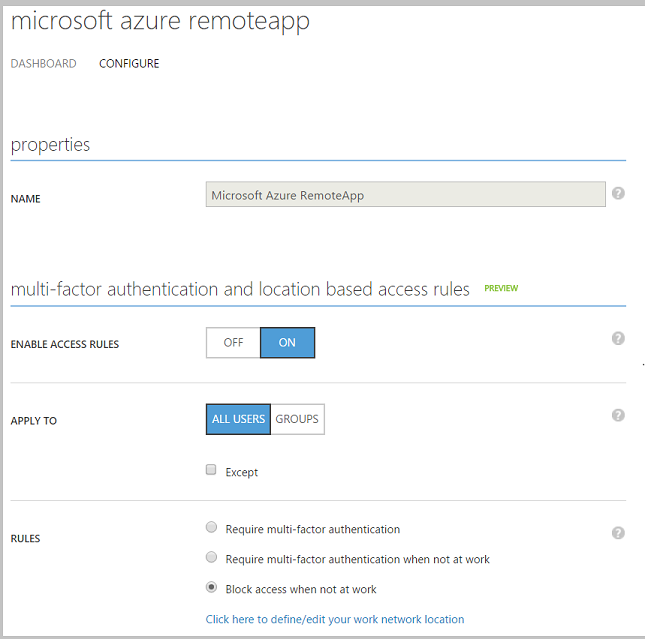
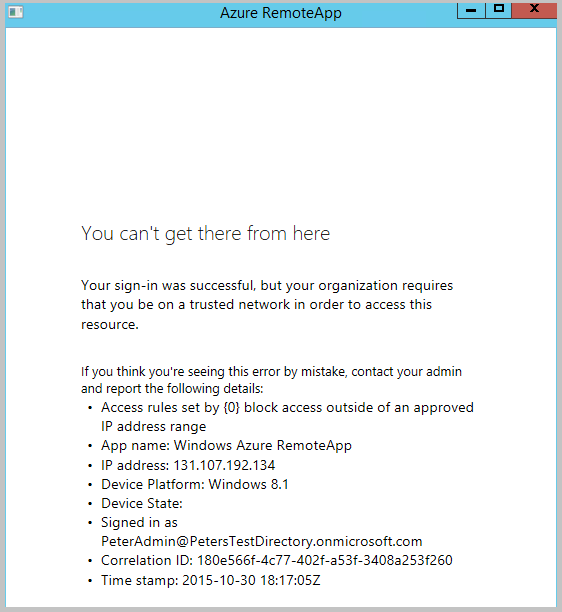
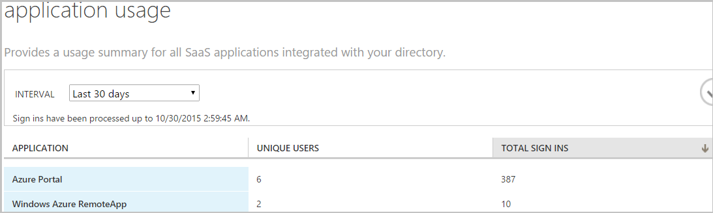
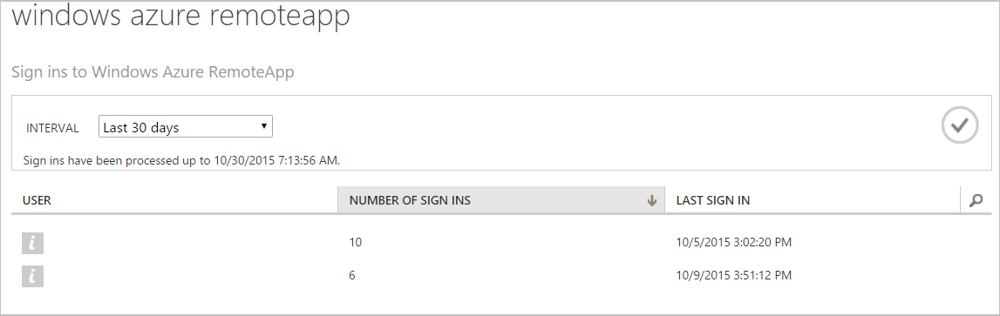
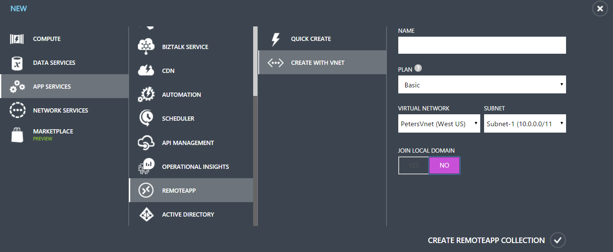

<properties 
    pageTitle="Securing access to Azure RemoteApp, and beyond | Microsoft Azure"
	description="Learn how secure access to Azure RemoteApp by using conditional access in Azure Active Directory"
	services="remoteapp"
	documentationCenter="" 
	authors="piotrci" 
	manager="mbaldwin" />

<tags 
    ms.service="remoteapp" 
    ms.workload="compute" 
    ms.tgt_pltfrm="na" 
    ms.devlang="na" 
    ms.topic="article" 
    ms.date="06/27/2016" 
    ms.author="elizapo" />

# Securing access to Azure RemoteApp, and beyond

In this article we will give an overview of how an administrator can set up a secure access channel starting from the end user, through Azure RemoteApp and ending with a secure resource such as a SQL database or another application back-end. The goal is to make sure that only authorized users meeting the desired conditions can access remote applications, and that the secure back-end can only be accessed from the controlled Azure RemoteApp environment and not from other locations.

There are 3 major areas the admin needs to look at:

Read on for information and answers to these questions.

## Who can access the collection?
The administrator chooses the users that can access remote applications in the collection. You can use Azure Active Directory (Azure AD) work or school accounts (previously called, "organizational accounts") or Microsoft accounts (e.g. @outlook.com). Most enterprise scenarios use Azure AD accounts; they let you use conditional access features discussed later and are also the only choice for domain-joined collections. The rest of the article assumes you are using Azure AD accounts with Azure RemoteApp.

**What we have accomplished:**

Using Azure AD accounts to control access to Azure RemoteApp gives us two things:

1.	We always know who can access the applications we have published and access any back-ends those applications connect to.
2.	We control the underlying Azure AD so we can create and delete user accounts, set password policies, use multi-factor authentication, etc. 

## How is the collection accessed? From where?
Commonly administrators want to define policies for accessing a public Internet-facing environment, such as Azure RemoteApp. For example, they want to ensure that users accessing the environment from outside of the corporate network have to use multi-factor authentication (MFA) to gain access; or perhaps they should be blocked altogether.

Azure RemoteApp administrators can use the functionality available through Azure AD Premium to set conditional access policies for their Azure RemoteApp environment. They can also use rich reporting and alerting features to monitor how the environment is being accessed.

### How to set up conditional access for Azure RemoteApp
We are going to walk through an example scenario – the Azure RemoteApp administrator wants to block access to the environment when users are outside of the corporate network.

>[AZURE.NOTE] We assume you have upgraded Azure AD to the Premium tier and that you have created at least one Azure RemoteApp collection.

1.	In Azure portal click the **Active Directory** tab. Then click the directory you want to configure.

	Remember: Conditional access is a property of your directory and not of Azure RemoteApp, so all configuration is done at the directory level. This also means you need to be the directory administrator to make these changes.

2.	Click **Applications**, and then click **Microsoft Azure RemoteApp** to set up conditional access. Note that you can set up conditional access for each “software as a service” application in your directory separately.

 

3.	On the **Configure** tab, set **Enable Access Rules** to ON.

 

4.	You can now configure various rules and choose who to apply them to:

	1. Choose **Block access when not at work** to completely prevent users from accessing Azure RemoteApp outside of the network environment you specify.
	2. Click the option below to define the IP address ranges that constitute your “trusted network”. Everything outside of those will be rejected.

5.	Test your configuration by launching the Azure RemoteApp client from an IP address outside of the range you specified. After you sign in with your Azure AD credentials you should see a message like this:

 

### Future conditional access features 
The Azure Active Directory team is working on new capabilities in Conditional Access. Administrators will be able to create new types of rules beyond network location based rules. A public preview of the new functionality should be available soon.

### How to monitor access to Azure RemoteApp
A great feature to use alongside conditional access is the Azure Active Directory Premium reporting functionality. You can use reports to monitor who is accessing your environment and detect any suspicious activity.

For example, you can see the names of the users who accessed Azure RemoteApp, how many times they did it and when.

1.	In Azure portal, click **Active Directory**, and then click your directory.

2.	Go to the **Reports** tab.

3.	From the list of reports, select **Application usage** under **Integrated applications**.

	You'll see some aggregated statistics for Azure RemoteApp. 

 
5.	Click the application to reveal information about users accessing Azure RemoteApp.

 
### Summary
With Azure Active Directory Premium you can set up access rules to Azure RemoteApp (and other software as a service applications available through Azure AD). Rules are currently limited to network location based policies but will in the future be extended to other aspects of enterprise management.

Azure AD Premium also offers reporting and monitoring capabilities that further extend the control the admin has over their Azure RemoteApp environment.

## How do I make sure my secure resource is accessible only from my Azure RemoteApp environment?
In previous sections of this article we focused on securing access to the Azure RemoteApp environment. We have accomplished that by choosing the users who are allowed access and setting up access rules to further control how they can use the service.

A common scenario for Azure RemoteApp deployments is that the remote applications need to communicate with a back-end resource, for example a SQL database. This resource is hosted either on-premises (e.g. in a corporate network) or in the cloud (e.g. in Azure IaaS). Administrators often want to make sure that the back-end resource can only be accessed by applications deployed via Azure RemoteApp and not for example by an application running directly on a user’s PC and accessing over public Internet. Azure RemoteApp is often seen as the centrally-managed and secured environment and thus the only path through which users should interact with the back-end resource.

The solution is to place both the Azure RemoteApp environment and the secure resource in the same Azure Virtual Network (VNET). If the resource is in a different site, you can establish a site-to-site VPN connection, for example to create a VNet spanning the Azure data center and the customer on-premises environment.

Azure RemoteApp supports two types of collection deployments where you can provide your own VNET:

-	Non-domain-joined: the applications will have “line of sight” of the other resources in the VNET. For example, this can be used to connect applications to a SQL database that uses SQL authentication (applications authenticate the user directly against the database)

-	Domain-joined: the virtual machines used by Azure RemoteApp are joined to a domain controller in the VNET. This is useful when the applications need to authenticate against a Windows Domain Controller in order to get access to a back-end resource.

 
### How to create a secure connection between Azure and my on-premises environment
There are several configuration options for connecting your Azure and on-premises environments. A good overview of the options is available here.

With Azure RemoteApp you need to configure your VNet first, and then use it during the creation process of your collection. 

## The complete solution
The diagram below shows the complete solution where we have built a secure access channel from the end user, through Azure RemoteApp (ARA), into the backend resource.

In Stage 1 we selected the users and created access rules that govern how ARA can be accessed. In the example below we only allow access for users working from the corporate network. Non-compliant users will not be able to access the ARA environment at all.
In “Stage 2” we have exposed the backend resource only through the VNet/VPN configuration which we control. Azure RemoteApp has been placed in the same VNet. The end result is that the resource can only be accessed through the ARA environment.

