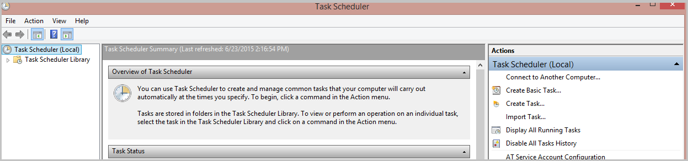
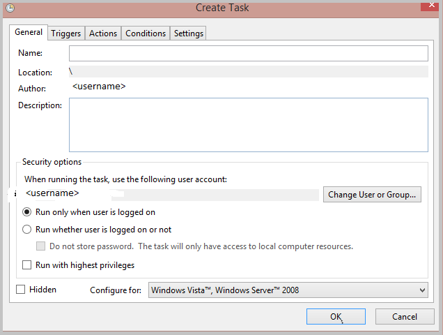
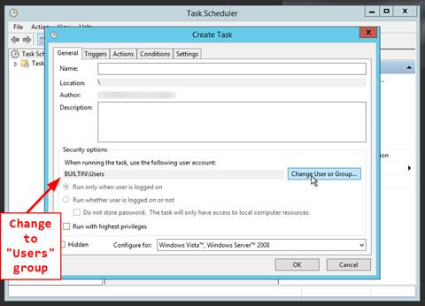
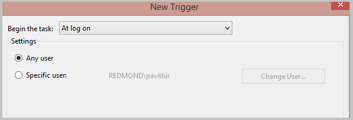

<properties 
    pageTitle="How does Azure RemoteApp save user data and settings? | Microsoft Azure"
	description="Learn how Azure RemoteApp saves user data using the user profile disk."
	services="remoteapp"
	documentationCenter="" 
	authors="lizap" 
	manager="mbaldwin" />

<tags 
    ms.service="remoteapp" 
    ms.workload="compute" 
    ms.tgt_pltfrm="na" 
    ms.devlang="na" 
    ms.topic="article" 
    ms.date="06/30/2016" 
    ms.author="elizapo" />

# How does Azure RemoteApp save user data and settings?

Azure RemoteApp saves user identity and customizations across devices and sessions. This user data is stored in a per-user per-collection disk, known as a user profile disk (UPD). The disk follows the user and ensures the user has a consistent experience, regardless of where they sign in. 
saves 

User profile disks are completely transparent to the user — users save documents to their Documents folder (on what appears to be a local drive) and change their app settings as usual. At the same time, all personal settings persist when connecting to Azure RemoteApp from any device. All the user sees is their data in the same place.

Each UPD has 50GB of persistent storage and contains both user data and application settings. 

Read on for specifics on user profile data.

>[AZURE.NOTE] Need to disable the UPD? You can do that now - check out Pavithra's blog post, [Disable User Profile Disks (UPDs) in Azure RemoteApp](https://blogs.technet.microsoft.com/enterprisemobility/2015/11/11/disable-user-profile-disks-upds-in-azure-remoteapp/), for details.

## How can an admin get to the data?

If you need to access the data for one of your users (for disaster recovery or if the user leaves the company), contact [Azure RemoteApp](mailto:remoteappforum@microsoft.com) and provide the subscription information for the collection and the user identity. The Azure RemoteApp team will provide you a URL to the VHD. Download that VHD and retrieve any documents or files you need. Note that the VHD is 50GB, so it will take a bit to download it.

## Is the data backed up?

Yes, we save a backup of the user data per geographic location. The data is read-only and can be accessed in the same way as the regular data would be (contact Azure RemoteApp to get it), if the primary data center is down. The data is copied real-time to the backup location and we do not keep copies of different versions. So, on data corruption, we will not be able to restore it to a previously known good version but if the primary data center is down, you will be able to get user data from the other location.

## How do users see the UPD on the server side?

Each user will have their own directory on the server that maps to their UPD: c:\Users\username.

## What's the best way to use Outlook and UPD?

Azure RemoteApp saves the Outlook state (mailboxes, PSTs) between sessions. To enable this, we need the PST to be stored in the user profile data (c:\users\<username>). This is the default location for the data, so as long as you do not change the location, the data will persist between sessions.

We also recommend that you use "cached" mode in Outlook and use "server/online" mode for searching.

Check out [this article](remoteapp-outlook.md) for more information on using Outlook and Azure RemoteApp.

## What about redirection?
You can configure Azure RemoteApp to let users access local devices by setting up [redirection](remoteapp-redirection.md). Local devices will then be able to access the data on the UPD.

## Can I use my UPD as a network share?
No. UPDs cannot be used as a network share. A UPD is only available to the user when the user is actively connected to Azure RemoteApp.

## If I delete a user from a collection, is their UPD deleted?

No, when you delete a user, we do not automatically delete the UPD - instead, we store the data until you delete the collection. 90 days after you delete the collection, we delete all UPDs. 

If you need to delete a UPD from a collection, contact Azure RemoteApp - we can delete UPD from our side.

## Can I access my users' UPDs (either current or deleted users)?

Yes, if you contact [Azure RemoteApp](mailto:remoteappforum@microsoft.com), we can set you up with a URL to access the data. You'll have about 10 hours to download any data or files from the UPD before the access expires.

## Are UPDs available offline?

Right now we do not provide offline access to UPDs, beyond the 10 hour access window described above. This means that we do not currently have a way to provide you with access for long enough to complete more complicated tasks, like running anti-virus software on the UPDs or accessing data for an audit.

## Do registry key settings persist?
Yes, anything written to HKEY_Current_User is part of the UPD.

## Can I disable UPDs for a collection?

Yes, you can ask Azure RemoteApp to disable UPDs for a subscription, but you cannot do that yourself. This means that UPDs will be disabled for all collections in the subscription.

You might want to disable UPDs in any of the following situations: 

- You need complete access and control of user data (for audit and review purposes such as financial institutions).
- You have 3rd-party user profile management solutions on-premises and want to continue using them in your domain-joined Azure RemoteApp deployment. This would require the profile agent to be loaded into the gold image. 
- You don’t need any local data storage or you have all data in the cloud or file share and would like to control saving of data locally using Azure RemoteApp.

See  [Disable User Profile Disks (UPDs) in Azure RemoteApp](https://blogs.technet.microsoft.com/enterprisemobility/2015/11/11/disable-user-profile-disks-upds-in-azure-remoteapp/) for more information.

## Can I restrict users from saving data to the system drive?

Yes, but you'll need to set that up in the template image before you create the collection. Use the following steps to block access to the system drive:

1. Run **gpedit.msc** on the template image.
2. Navigate to **User Configuration > Administrative Templates > Windows Components > Explorer**.
3. Select the following options:
	- **Hide these specified drives in My Computer**
	- **Prevent access to drives from My Computer**

## Can I seed UPDs? I want to put some data in the UPD that's available the first time the user signs in.

Yes, when you create the template image, you can add information to the default profile. That information is then added to the UPD.

## Can I change the size of the UPD depending on how much data I want to store?

No, all UPDs have 50 GB of storage. If you want to store different amounts of data, try the following:

1. Disable UPDs for the collection.
2. Set up a file share for users to access.
3. Load the file share by using a startup script. See below for details on startup scripts in Azure RemoteApp.
4. Direct users to save all data to the file share.

## How do I run a startup script in Azure RemoteApp?

If you want to run a startup script, start by creating a scheduled task in the template image you are going to use for the collection. (Do this *before* you run sysprep.) 

On the **General** tab, be sure to change the **User Account** under Security to "BUILTIN\Users."

The scheduled task will launch your startup script, using the user's credentials. Schedule the task to run every a time a user logs on.

You can also use [Group Policy-based startup scripts](https://technet.microsoft.com/library/cc779329%28v=ws.10%29.aspx). 

## What about placing a startup script in the Start menu? Would that work?

In other words, can I create a .bat file that runs a config window script and save it to the c:\ProgramData\Microsoft\Windows\Start Menu\Programs\StartUp folder, and then have that script run whenever a user starts a RemoteApp session?

No, that's not supported with Azure RemoteApp, which uses RDSH, which also does not support startup scripts in the Start menu.

## Can I use mstsc.exe (the Remote Desktop program) to configure logon scripts?

Nope, not supported by Azure RemoteApp.

## Can I store data on the VM locally?

NO, data stored anywhere on the VM other than in the UPD will be lost. There is a high chance the user will not get the same VM the next time that they sign into Azure RemoteApp. We do not maintain user-VM persistence, so the user will not sign into the same VM, and the data will be lost. Additionally, when we update the collection, the existing VMs are replaced with a new set of VMs - that means any data stored on the VM itself is lost. The recommendation is to store data in the UPD, shared storage like Azure Files, a file server inside a VNET, or on the cloud using a cloud storage system like DropBox.

## How do I mount an Azure File share on a VM, using PowerShell?

You can use the Net-PSDrive cmdlet to mount the drive, as follows:

    New-PSDrive -Name <drive-name> -PSProvider FileSystem -Root \\<storage-account-name>.file.core.windows.net\<share-name> -Credential :<storage-account-name>

You can also save your credentials by running the following:

    cmdkey /add:<storage-account-name>.file.core.windows.net /user:<storage-account-name> /pass:<storage-account-key>

That lets you skip the -Credential parameter in the New-PSDrive cmdlet.
