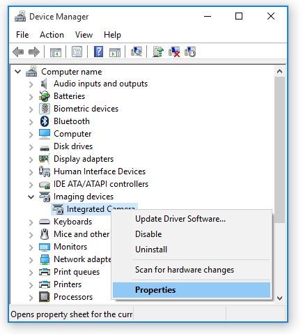
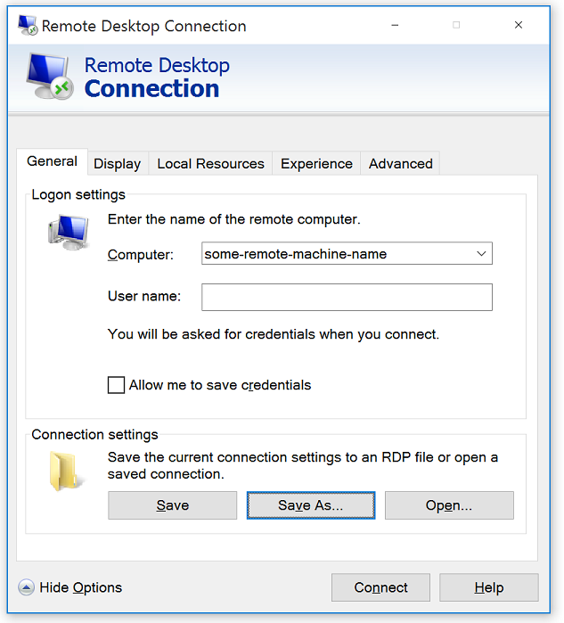

<properties 
    pageTitle="How do you redirect USB devices in Azure RemoteApp? | Microsoft Azure" 
    description="Learn how to use redirection for USB devices in Azure RemoteApp." 
    services="remoteapp" 
	documentationCenter="" 
    authors="lizap" 
    manager="mbaldwin" />

<tags 
    ms.service="remoteapp" 
    ms.workload="compute" 
    ms.tgt_pltfrm="na" 
    ms.devlang="na" 
    ms.topic="article" 
    ms.date="08/15/2016" 
    ms.author="elizapo" />

# How do you redirect USB devices in Azure RemoteApp?

> [AZURE.IMPORTANT]
> Azure RemoteApp is being discontinued. Read the [announcement](https://go.microsoft.com/fwlink/?linkid=821148) for details.

Device redirection lets users use the USB devices attached to their computer or tablet with the apps in Azure RemoteApp. For example, if you shared Skype through Azure RemoteApp, your users need to be able to use their device cameras.

Before you go further, make sure you read the USB redirection information in [Using redirection in Azure RemoteApp](remoteapp-redirection.md). However the recommended  nusbdevicestoredirect:s:* won't work for USB web cameras and may not work for some USB printers or USB multifunctional devices. By design and for security reasons, the Azure RemoteApp administrator has to enable redirection either by device class GUID or by device instance ID before your users can use those devices.

Although this article talks about web camera redirection, you can use a similar approach to redirect USB printers and other USB multifunctional devices that are not redirected by the **nusbdevicestoredirect:s:*** command.

## Redirection options for USB devices
Azure RemoteApp uses very similar mechanisms for redirecting USB devices as the ones available for Remote Desktop Services. The underlying technology lets you choose the correct redirection method for a given device, to get the best of both high-level and RemoteFX USB device redirection using the **usbdevicestoredirect:s:** command. There are four elements to this command:

| Processing order | Parameter           | Description                                                                                                                |
|------------------|---------------------|----------------------------------------------------------------------------------------------------------------------------|
| 1                | *                   | Selects all devices that aren't picked up by high-level redirection. Note: By design, * doesn't work for USB web cameras.  |
|                  | {Device class GUID} | Selects all devices that match the specified device setup class.                                                           |
|                  | USB\InstanceID      | Selects a USB device specified for the given instance ID.                                                                  |
| 2                | -USB\Instance ID    | Removes the redirection settings for the specified device.                                                                 |

## Redirecting a USB device by using the device class GUID
There are two ways to find the device class GUID that can be used for redirection. 

The first option is to use the [System-Defined Device Setup Classes Available to Vendors](https://msdn.microsoft.com/library/windows/hardware/ff553426.aspx). Pick the class that most closely matches the device attached to the local computer. For digital cameras this could be an Imaging Device class or Video Capture Device class. You'll need to do some experimentation with the device classes to find the correct class GUID that works with the locally attached USB device (in our case the web camera).

A better way, or the second option, is to follow these steps to find the specific device class GUID:

1. Open the Device Manager, locate the device that will be redirected and right-click it, and then open the properties.

2. On the **Details** tab, choose the property **Class Guid**. The value which appears is the Class GUID for that type of device.

3. Use the Class Guid value to redirect devices that match it.

For example:

		Set-AzureRemoteAppCollection -CollectionName <collection name> -CustomRdpProperty "nusbdevicestoredirect:s:<Class Guid value>"

You can combine multiple device redirections in the same cmdlet. For example: to redirect local storage and a USB web camera, cmdlet looks like this:

		Set-AzureRemoteAppCollection -CollectionName <collection name> -CustomRdpProperty "drivestoredirect:s:*`nusbdevicestoredirect:s:<Class Guid value>"

When you set device redirection by class GUID all devices that match that class GUID in the specified collection are redirected. For example, if there are multiple computers on the local network that have the same USB web cameras, you can run a single cmdlet to redirect all of the web cameras.

## Redirecting a USB device by using the device instance ID

If you want more fine-grained control and want to control redirection per device, you can use the **USB\InstanceID** redirection parameter.

The hardest part of this method is finding the USB device instance ID. You'll need access to the computer and the specific USB device. Then follow these steps:

1. Enable the device redirection in Remote Desktop Session as described in [How can I use my devices and resources in a Remote Desktop session?](http://windows.microsoft.com/en-us/windows7/How-can-I-use-my-devices-and-resources-in-a-Remote-Desktop-session)
2. Open a Remote Desktop Connection and click **Show Options**.
3. Click **Save as** to save the current connection settings to an RDP file.  
	
4. Choose a file name and a location, for example “MyConnection.rdp” and “This PC\Documents”, and save the file.
5. Open the MyConnection.rdp file using a text editor and find the instance ID of the device you want to redirect.

Now, use the instance ID in the following cmdlet:

	Set-AzureRemoteAppCollection -CollectionName <collection name> -CustomRdpProperty "nusbdevicestoredirect:s: USB\<Device InstanceID value>"

### Help us help you 
Did you know that in addition to rating this article and making comments down below, you can make changes to the article itself? Something missing? Something wrong? Did I write something that's just confusing? Scroll up and click **Edit on GitHub** to make changes - those will come to us for review, and then, once we sign off on them, you'll see your changes and improvements right here.