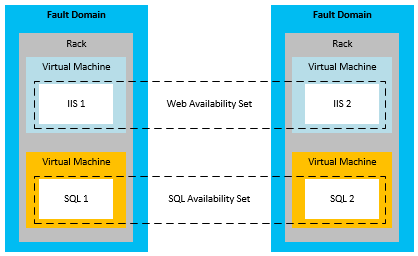
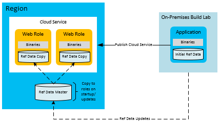
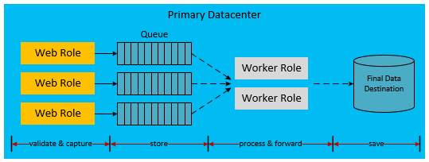

<properties
   pageTitle="High Availability for Azure Applications | Microsoft Azure"
   description="Technical overviews and depth information on designing and building applications for high availability on Microsoft Azure."
   services=""
   documentationCenter="na"
   authors="adamglick"
   manager="hongfeig"
   editor=""/>

<tags
   ms.service="resiliency"
   ms.devlang="na"
   ms.topic="article"
   ms.tgt_pltfrm="na"
   ms.workload="na"
   ms.date="05/18/2016"
   ms.author="hanuk;jroth;aglick"/>

#High availability for applications built on Microsoft Azure
##Introduction to high availability
A highly available application absorbs fluctuations in availability, load, and temporary failures in the dependent services and hardware. The application continues to operate at an acceptable user and systemic response level as defined by business requirements or application service level agreements.

##Azure high availability features
Azure has many built-in platform features that support highly available applications. This section describes some of those key features. For a more comprehensive analysis of the platform, see [Azure resiliency technical guidance](./resiliency-technical-guidance.md).

The Azure Fabric Controller (FC) is responsible for provisioning and monitoring the condition of the Azure compute instances. The Fabric Controller checks the status of the hardware and software of the host and guest machine instances. When it detects a failure, it enforces SLAs by automatically relocating the VM instances. The concept of fault and upgrade domains further supports the compute SLA.

When multiple role instances are deployed, Azure deploys these instances to different fault domains. A fault domain boundary is basically a different hardware rack in the same region. Fault domains reduce the probability that a localized hardware failure will interrupt the service of an application. You cannot manage the number of fault domains that are allocated to your worker or web roles. The Fabric Controller uses dedicated resources that are separate from Azure hosted applications. It has 100% uptime because it serves as the nucleus of the Azure system. It monitors and manages role instances across fault domains. The following diagram shows Azure shared resources that are deployed and managed by the FC across different fault domains.

###Fault domain isolation - simplified view

_Fault Domain Isolation - Simplified View_

Upgrade domains are similar to fault domains in function, but they support upgrades rather than failures. An upgrade domain is a logical unit of instance separation that determines which instances in a particular service will be upgraded at a point in time. By default, for your hosted service deployment, five upgrade domains are defined. However, you can change that value in the service definition file. For example, you have eight instances of your web role. There will be two instances in three upgrade domains and two instances in one upgrade domain. Azure defines the update sequence, but it is based on the number of upgrade domains. For more information on upgrade domains, see [Update an Azure Service](../cloud-services/cloud-services-update-azure-service.md).

In addition to these platform features that support high compute availability, Azure embeds high availability features into its other services. For example, Azure Storage maintains three replicas of all blob, table, and queue data. It also allows the option of geo-replication to store backups of blobs and tables in a secondary region. The Content Delivery Network (CDN) allows blobs to be cached around the world for both redundancy and scalability. Azure SQL Database maintains multiple replicas as well. In addition to the [Resiliency technical guidance](https://aka.ms/bctechguide) series of articles, see the [Best Practices for the Design of Large-Scale Services on Azure Cloud Services](https://azure.microsoft.com/blog/best-practices-for-designing-large-scale-services-on-windows-azure/) paper. These papers provide a deeper discussion of the Azure platform availability features.

Although Azure provides multiple features that support high availability, it is important to understand their limitations. For compute, Azure guarantees that your roles are available and running, but it does not know if your application is running or overloaded. For Azure SQL Database, data is replicated synchronously within the region. These database replicas are not point-in-time backups. For Azure Storage, table and blob data is replicated by default to an alternate region. However, you cannot access the replicas until Microsoft chooses to fail over to the alternate site. A region failover only occurs in the case of a prolonged region-wide service disruption, and there is no SLA for geo-failover time. It is also important to note that any data corruption quickly spreads to the replicas. For these reasons, you must supplement the platform availability features with application-specific availability features. These application availability features include the blob snapshot feature to create point-in-time backups of blob data.

The majority of this paper focuses on cloud services, which use a Platform as a Service (PaaS) model. However, there are also specific availability features for Azure Virtual Machines, which use an Infrastructure as a Service (IaaS) model. In order to achieve high availability with Virtual Machines, you must use availability sets. An availability set serves a similar function to fault and upgrade domains. Within an availability set, Azure positions the virtual machines in a way that prevents localized hardware faults and maintenance activities from bringing down all of the machines in that group. Availability sets are required to achieve the Azure SLA for the availability of Virtual Machines. The following diagram provides a representation of two availability sets that group web and SQL Server virtual machines respectively.

###Availability Sets for Azure Virtual Machines

_Availability Sets for Azure Virtual Machines_

>[AZURE.NOTE]In the previous diagram, SQL Server is installed and running on virtual machines. This is different from the previous discussion of Azure SQL Database, which provides database as a managed service.

##Application strategies for high availability
Most application strategies for high availability involve either redundancy or the removal of hard dependencies between application components. Application design should support fault tolerance during sporadic downtime of Azure or third-party services. The following sections describe several application patterns for increasing availability of your cloud services.

##Asynchronous communication and durable queues
Consider asynchronous communication between loosely-coupled services to increase availability in Azure applications. In this pattern, write messages to either storage queues or Service Bus queues for later processing. When you write the message to the queue, control immediately returns to the sender of the message. Another tier of the application handles the message processing, typically implemented as a worker role. If the worker role goes down, the messages accumulate in the queue until the processing service is restored. As long as the queue is available, there is no direct dependency between the front-end sender and the message processor. This eliminates the requirement for synchronous service calls that can be a throughput bottleneck in distributed applications.

A variation of this uses Azure Storage (blobs, tables, queues) or Service Bus queues as a failover location for failed database calls. For example, a synchronous call within an application to another service (such as Azure SQL Database) fails repeatedly. You may be able to serialize that data into durable storage. At some later point when the service or database is back on-line, the application can re-submit the request from storage. The difference in this model is that the intermediate location is not a constant part of the application workflow. It is used only in failure scenarios.

In both scenarios, asynchronous communication and intermediate storage prevents a downed backend service from bringing the entire application down. Queues serve as a logical intermediary. For more guidance on choosing the correct queuing service, see [Azure Queues and Azure Service Bus Queues - Compared and Contrasted](../service-bus/service-bus-azure-and-service-bus-queues-compared-contrasted.md).

##Fault detection and retry logic
A key point in highly available application design is to utilize retry logic within code to gracefully handle a service that is temporarily down. The [Transient Fault Handling Application Block](https://msdn.microsoft.com/library/hh680934.aspx), developed by the Microsoft Patterns and Practices team, assists application developers in this process. The word “transient” means a temporary condition lasting only for a relatively short time. In the context of this paper, handling transient failures is part of developing a highly available application. Examples of transient conditions include intermittent network errors and lost database connections.

The Transient Fault Handling Application Block is a simplified way for you to handle failures within your code in a graceful manner. It allows you to improve the availability of your applications by adding robust transient fault handling logic. In most cases, retry logic handles the brief interruption and reconnects the sender and receiver after one or more failed attempts. A successful retry attempt typically goes unnoticed to application users.

There are three options for developers to manage their retry logic: incremental, fixed interval, and exponential. Incremental waits longer before each retry in an increasing linear fashion (for example, 1, 2, 3, and 4 seconds). Fixed interval waits the same amount of time between each retry (for example, 2 seconds). For a more random option, the exponential back-off waits longer between retries. However, it uses exponential behavior (for example, 2, 4, 8, and 16 seconds).

The high-level strategy within your code is:
1. Define your retry strategy and policy
1. Try the operation that could result in a transient fault
1. If transient fault occurs, invoke the retry policy
1. If all retries fail, catch a final exception 

Test your retry logic in simulated failures to ensure that retries on successive operations do not result in an unanticipated lengthy delay. Do this before deciding to fail the overall task.

##Reference data pattern for high availability
Reference data is the read-only data of an application. This data provides the business context within which the application generates transactional data during the course of a business operation. Transactional data is a point-in-time function of the reference data. Therefore, its integrity depends on the snapshot of the reference data at the time of the transaction. This is a somewhat loose definition, but should suffice for our purpose here.

Reference data in the context of an application is necessary for the functioning of the application. The respective applications create and maintain reference data; Master Data Management systems often perform this function. These systems are responsible for the life-cycle of the reference data. Examples of reference data include product catalog, employee master, parts master, and equipment master. Reference data can also originate from outside the organization, for example, zip codes or tax rates. Strategies for increasing the availability of reference data are typically less difficult than those for transactional data. Reference data has the advantage of being mostly immutable.

You can make Azure web and worker roles that consume reference data autonomous at run time by deploying the reference data along with the application. If the size of the local storage allows such a deployment, this is an ideal state. Embedded databases (SQL, NOSQL) or XML files deployed to a local file system will help with the autonomy of Azure compute scale-units. However, you should have a mechanism to update the data in each role without requiring redeployment. To do this, place any updates to the reference data to a cloud storage endpoint (for example, Azure Blob storage or SQL Database). Add code to each role that downloads the data updates into the compute nodes at role startup. Alternatively, add code that allows an administrator to perform a forced download into the role instances. To increase availability, the roles should also contain a set of reference data in case storage is down. This enables the roles to start with a basic set of reference data until the storage resource becomes available for the updates.

###High availability through autonomous compute nodes

_Application high availability through autonomous compute nodes_

One consideration for this pattern is the deployment and startup speed for your roles. If you are deploying or downloading large amounts of reference data on startup, this can increase the amount of time it takes to spin up new deployments or role instances. This might be an acceptable tradeoff for the autonomy of having the reference data immediately available on each role rather than depending on external storage services.

##Transactional data pattern for high availability
Transactional data is the data generated by the application in a business context. Transactional data is a combination of the set of business processes the application implements and the reference data that supports these processes. Transactional data examples can include orders, advanced shipping notices, invoices, and CRM opportunities. The transactional data thus generated will be fed to external systems for record keeping or for further processing.

Keep in mind that reference data can change within the systems that are responsible for this data. For this reason, transactional data must save the point-in-time reference data context so that it has minimal external dependencies for its semantic consistency. For example, consider the removal of a product from the catalog a few months after an order was fulfilled. The best practice is to embed as much reference data context as feasible into the transaction. This preserves the semantics associated with the transaction even if the reference data were to change after the transaction is captured.

As mentioned previously, architectures that use loose coupling and asynchronous communication lend themselves to higher levels of availability. This holds true for transactional data as well, but the implementation is more complex. Traditional transactional notions typically rely on the database for guaranteeing the transaction. When you introduce intermediate layers, the application code must correctly handle the data at various layers to ensure sufficient consistency and durability.

The following sequence describes a workflow that separates the capture of transactional data from its processing:

1. Web Compute Node: Present reference data.
1. External Storage: Save intermediate transactional data.
1. Web Compute Node: Complete the end-user transaction.
1. Web Compute Node: Send the completed transactional data along with the reference data context to a temporary durable storage that is guaranteed to give predictable response.
1. Web Compute Node: Signal end-user the completion of the transaction.
1. Background Compute Node: Extract the transactional data, post processes it if necessary, and send it to its final storage location in the current system.

The following diagram shows one possible implementation of this design in an Azure hosted cloud service.

###High availability through loose coupling

_Application high availability through loose coupling_

The dashed arrows in the above diagram indicate asynchronous processing. The front-end web role is not aware of this asynchronous processing. This leads to the storage of the transaction at its final destination with reference to the current system. Due to the latency introduced by this asynchronous model, the transactional data is not immediately available for query. Therefore, each unit of the transactional data needs to be saved in a cache or user session to meet the immediate UI needs.

Consequently, the web role is autonomous from the rest of the infrastructure. Its availability profile is a combination of the web role and the Azure queue and not the entire infrastructure. In addition to high availability, this approach allows the web role to scale horizontally, independent of the backend storage. This high availability model can have an impact on the economics of operations. Additional components like Azure queues and worker roles can impact monthly usage costs.
Note that the previous diagram shows one implementation of this decoupled approach to transactional data. There are many other possible implementations. The following list provides some alternative variations.

 * A worker role might be placed between the web role and the storage queue.
 * A Service Bus queue can be used instead of an Azure Storage queue.
 * The final destination might be Azure Storage or a different database provider.
 * Azure Caching can be used at the web layer to provide the immediate caching requirements following the transaction.

##Scalability patterns
In addition to the patterns discussed in this section, it is important to note that the scalability of the cloud service directly impacts availability. If increased load causes your service to be unresponsive, the user impression is that the application is down. Follow best practices for scalability based on your expected application load and future expectations. The highest scale involves many considerations, such as the use of single vs. multiple storage accounts, sharing across multiple databases, and caching strategies. For an in-depth look at these patterns, see [Best Practices for the Design of Large-Scale Services on Azure Cloud Services](https://azure.microsoft.com/blog/best-practices-for-designing-large-scale-services-on-windows-azure/).

##Next steps
This article is part of a series of articles focused on [Disaster recovery and high availability for applications built on Microsoft Azure](./resiliency-disaster-recovery-high-availability-azure-applications.md). The next article in this series is [Disaster recovery for applications built on Microsoft Azure](./resiliency-disaster-recovery-azure-applications.md).
