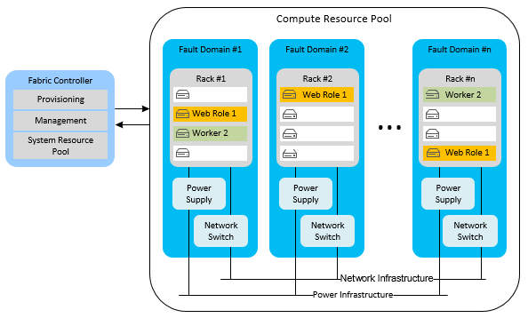
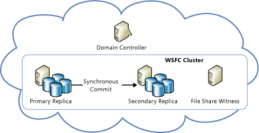
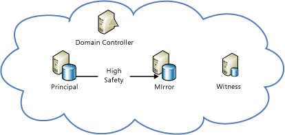

<properties
   pageTitle="Technical guidance: Recovery from local failures in Azure | Microsoft Azure"
   description="Article on understanding and designing resilient, highly available, fault-tolerant applications, as well as planning for disaster recovery focused on local failures within Azure."
   services=""
   documentationCenter="na"
   authors="adamglick"
   manager="hongfeig"
   editor=""/>

<tags
   ms.service="resiliency"
   ms.devlang="na"
   ms.topic="article"
   ms.tgt_pltfrm="na"
   ms.workload="na"
   ms.date="08/01/2016"
   ms.author="aglick"/>

#Azure resiliency technical guidance: Recovery from local failures in Azure

There are two primary threats to application availability:

* The failure of devices, such as drives and servers
* The exhaustion of critical resources, such as compute under peak load conditions

Azure provides a combination of resource management, elasticity, load balancing, and partitioning to enable high availability under these circumstances. Some of these features are performed automatically for all Azure services. However, in some cases, the application developer must do some additional work to benefit from them.

##Cloud Services

Azure Cloud Services consists of collections of one or more web or worker roles. One or more instances of a role can run concurrently. The configuration determines the number of instances. Role instances are monitored and managed through a component called the fabric controller. The fabric controller detects and responds to both software and hardware failures automatically.

Every role instance runs in its own virtual machine (VM) and communicates with its fabric controller through a guest agent. The guest agent collects resource and node metrics, including VM usage, status, logs, resource usage, exceptions, and failure conditions. The fabric controller queries the guest agent at configurable intervals, and it restarts the VM if the guest agent fails to respond. In the event of hardware failure, the associated fabric controller moves all affected role instances to a new hardware node and reconfigures the network to route traffic there.

To benefit from these features, developers should ensure that all service roles avoid storing state on the role instances. Instead, all persistent data should be accessed from durable storage, such as Azure Storage or Azure SQL Database. This allows any roles to handle requests. It also means that role instances can go down at any time without creating inconsistencies in the transient or persistent state of the service.

The requirement to store state externally to the roles has several implications. It implies, for example, that all related changes to an Azure Storage table should be changed in a single entity-group transaction, if possible. Of course, it isn't always possible to make all changes in a single transaction. You must take special care to ensure that role instance failures do not cause problems when they interrupt long-running operations that span two or more updates to the persistent state of the service. If another role attempts to retry such an operation, it should anticipate and handle the case where the work was partially completed.

For example, consider a service that partitions data across multiple stores. If a worker role goes down while it's relocating a shard, the relocation of the shard might not finish. Or the relocation might be repeated from its inception by a different worker role, potentially causing orphaned data or data corruption. To prevent problems, long-running operations must be one or both of the following:

 * *Idempotent*: Repeatable without side effects. To be idempotent, a long-running operation should have the same effect no matter how many times it's executed, even when it's interrupted during execution.
 * *Incrementally restartable*: Able to continue from the most recent point of failure. To be incrementally restartable, a long-running operation should consist of a sequence of smaller atomic operations. It should also record its progress in durable storage, so that each subsequent invocation picks up where its predecessor stopped.

Finally, all long-running operations should be invoked repeatedly until they succeed. For example, a provisioning operation might be placed in an Azure queue, and then removed from the queue by a worker role only when it succeeds. Garbage collection might be necessary to clean up data that interrupted operations create.

###Elasticity

The initial number of instances running for each role is determined in each role’s configuration. Administrators should initially configure each role to run with two or more instances based on expected load. But you can easily scale role instances up or down as usage patterns change. You can do this manually in the Azure portal, or you can automate the process by using Windows PowerShell, the Service Management API, or third-party tools. For more information, see [How to autoscale an application](../cloud-services/cloud-services-how-to-scale.md).

###Partitioning

The Azure fabric controller uses two types of partitions:

* An *update domain* is used to upgrade a service’s role instances in groups. Azure deploys service instances into multiple update domains. For an in-place update, the fabric controller brings down all the instances in one update domain, updates them, and then restarts them before moving to the next update domain. This approach prevents the entire service from being unavailable during the update process.
* A *fault domain* defines potential points of hardware or network failure. For any role that has more than one instance, the fabric controller ensures that the instances are distributed across multiple fault domains, to prevent isolated hardware failures from disrupting service. Fault domains govern all exposure to server and cluster failures.

The [Azure service-level agreement (SLA)](https://azure.microsoft.com/support/legal/sla/) guarantees that when two or more web role instances are deployed to different fault and upgrade domains, they'll have external connectivity at least 99.95 percent of the time. Unlike update domains, there's no way to control the number of fault domains. Azure automatically allocates fault domains and distributes role instances across them. At least the first two instances of every role are placed in different fault and upgrade domains to ensure that any role with at least two instances will satisfy the SLA. This is represented in the following diagram.

###Load balancing

All inbound traffic to a web role passes through a stateless load balancer, which distributes client requests among the role instances. Individual role instances do not have public IP addresses, and they are not directly addressable from the Internet. Web roles are stateless so that any client request can be routed to any role instance. A [StatusCheck](https://msdn.microsoft.com/library/microsoft.windowsazure.serviceruntime.roleenvironment.statuscheck.aspx) event is raised every 15 seconds. You can use this to indicate whether the role is ready to receive traffic, or whether it's busy and should be taken out of the load-balancer rotation.

##Virtual Machines

Azure Virtual Machines differs from platform as a service (PaaS) compute roles in several respects in relation to high availability. In some instances, you must do additional work to ensure high availability.

###Disk durability

Unlike PaaS role instances, data stored on virtual machine drives is persistent even when the virtual machine is relocated. Azure virtual machines use VM disks that exist as blobs in Azure Storage. Because of the availability characteristics of Azure Storage, the data stored on a virtual machine’s drives is also highly available.

Note that drive D (in Windows VMs) is the exception to this rule. Drive D is actually physical storage on the rack server that hosts the VM, and its data will be lost if the VM is recycled. Drive D is intended for temporary storage only. In Linux, Azure “usually” (but not always) exposes the local temporary disk as /dev/sdb block device. It is often mounted by the Azure Linux Agent as /mnt/resource or /mnt mount points (configurable via /etc/waagent.conf).

###Partitioning

Azure natively understands the tiers in a PaaS application (web role and worker role) and thus can properly distribute them across fault and update domains. In contrast, the tiers in an infrastructure as a service (IaaS) application must be manually defined through availability sets. Availability sets are required for an SLA under IaaS.

In the preceding diagram, the Internet Information Services (IIS) tier (which works as a web app tier) and the SQL tier (which works as a data tier) are assigned to different availability sets. This ensures that all instances of each tier have hardware redundancy by distributing virtual machines across fault domains, and that entire tiers are not taken down during an update.

###Load balancing

If the VMs should have traffic distributed across them, you must group the VMs in an application and load balance across a specific TCP or UDP endpoint. For more information, see [Load balancing virtual machines](../virtual-machines/virtual-machines-linux-load-balance.md). If the VMs receive input from another source (for example, a queuing mechanism), a load balancer is not required. The load balancer uses a basic health check to determine whether traffic should be sent to the node. It's also possible to create your own probes to implement application-specific health metrics that determine whether the VM should receive traffic.

##Storage

Azure Storage is the baseline durable data service for Azure. It provides blob, table, queue, and VM disk storage. It uses a combination of replication and resource management to provide high availability within a single datacenter. The Azure Storage availability SLA guarantees that at least 99.9 percent of the time:

* Correctly formatted requests to add, update, read, and delete data will be successfully and correctly processed.
* Storage accounts will have connectivity to the Internet gateway.

###Replication

Azure Storage facilitates data durability by maintaining multiple copies of all data on different drives across fully independent physical storage subsystems within the region. Data is replicated synchronously, and all copies are committed before the write is acknowledged. Azure Storage is strongly consistent, meaning that reads are guaranteed to reflect the most recent writes. In addition, copies of data are continually scanned to detect and repair bit rot, an often overlooked threat to the integrity of stored data.

Services benefit from replication just by using Azure Storage. The service developer doesn't need to do additional work to recover from a local failure.

###Resource management

Storage accounts created after May 2014, can grow to up to 500 TB (the previous maximum was 200 TB). If additional space is required, applications must be designed to use multiple storage accounts.

###Virtual machine disks

A virtual machine’s disk is stored as a page blob in Azure Storage, giving it all the same durability and scalability properties as Blob storage. This design makes the data on a virtual machine’s disk persistent, even if the server running the VM fails and the VM must be restarted on another server.

##Database

###SQL Database

Azure SQL Database provides database as a service. It allows applications to quickly provision, insert data into, and query relational databases. It provides many of the familiar SQL Server features and functionality, while abstracting the burden of hardware, configuration, patching, and resiliency.

>[AZURE.NOTE] Azure SQL Database does not provide one-to-one feature parity with SQL Server. It's intended to fulfill a different set of requirements--one that's uniquely suited to cloud applications (elastic scale, database as a service to reduce maintenance costs, and so on). For more information, see [Choose a cloud SQL Server option: Azure SQL Database (PaaS) or SQL Server on Azure VMs (IaaS)](../sql-database/data-management-azure-sql-database-and-sql-server-iaas.md).

####Replication

Azure SQL Database provides built-in resiliency to node-level failure. All writes into a database are automatically replicated to two or more background nodes through a quorum commit technique. (The primary and at least one secondary must confirm that the activity is written to the transaction log before the transaction is deemed successful and returns.) In the case of node failure, the database automatically fails over to one of the secondary replicas. This causes a transient connection interruption for client applications. For this reason, all Azure SQL Database clients must implement some form of transient connection handling. For more information, see [Retry service specific guidance](../best-practices-retry-service-specific.md).

####Resource management

Each database, when created, is configured with an upper size limit. The currently available maximum size is 1 TB (size limits vary based on your service tier, see [service tiers and performance levels of Azure SQL Databases](../sql-database/sql-database-resource-limits.md#service-tiers-and-performance-levels). When a database hits its upper size limit, it rejects additional INSERT or UPDATE commands. (Querying and deleting data is still possible.)

Within a database, Azure SQL Database uses a fabric to manage resources. However, instead of a fabric controller, it uses a ring topology to detect failures. Every replica in a cluster has two neighbors and is responsible for detecting when they go down. When a replica goes down, its neighbors trigger a reconfiguration agent to re-create it on another machine. Engine throttling is provided to ensure that a logical server doesn't use too many resources on a machine or exceed the machine’s physical limits.

###Elasticity

If the application requires more than the 1 TB database limit, it must implement a scale-out approach. You scale out with Azure SQL Database by manually partitioning, also known as sharding, data across multiple SQL databases. This scale-out approach provides the opportunity to achieve nearly linear cost growth with scale. Elastic growth or capacity on demand can grow with incremental costs as needed because databases are billed based on the average actual size used per day, not based on maximum possible size.

##SQL Server on Virtual Machines

By installing SQL Server (version 2014 or later) on Azure Virtual Machines, you can take advantage of the traditional availability features of SQL Server. These features include AlwaysOn Availability Groups and database mirroring. Note that Azure VMs, storage, and networking have different operational characteristics than an on-premises, non-virtualized IT infrastructure. A successful implementation of a high availability/disaster recovery (HA/DR) SQL Server solution in Azure requires that you understand these differences and design your solution to accommodate them.

###High-availability nodes in an availability set

When you implement a high-availability solution in Azure, you can use the availability set in Azure to place the high-availability nodes into separate fault domains and upgrade domains. To be clear, the availability set is an Azure concept. It's a best practice that you should follow to make sure that your databases are indeed highly available, whether you're using AlwaysOn Availability Groups, database mirroring, or something else. If you don't follow this best practice, you might be under the false assumption that your system is highly available. But in reality, your nodes can all fail simultaneously because they happen to be placed in the same fault domain in the Azure region.

This recommendation is not as applicable with log shipping. As a disaster recovery feature, you should ensure that the servers are running in separate Azure regions. By definition, these regions are separate fault domains.

For Azure Cloud Services VMs deployed through the classic portal to be in the same availability set, you must deploy them in the same Cloud Service. VMs deployed through Azure Resource Manager (the current portal) do not have this limitation. For classic portal deployed VMs in Azure Cloud Service, only nodes in the same Cloud Service can participate in the same availability set. In addition, the Cloud Services VMs should be in the same virtual network to ensure that they maintain their IPs even after service healing. This avoids DNS update disruptions.

###Azure-only: High-availability solutions

You can have a high-availability solution for your SQL Server databases in Azure by using AlwaysOn Availability Groups or database mirroring.

The following diagram demonstrates the architecture of AlwaysOn Availability Groups running on Azure Virtual Machines. This diagram was taken from the in-depth article on this subject, [High availability and disaster recovery for SQL Server on Azure Virtual Machines](../virtual-machines/virtual-machines-windows-sql-high-availability-dr.md).

You can also automatically provision an AlwaysOn Availability Groups deployment end-to-end on Azure VMs by using the AlwaysOn template in the Azure portal. For more information, see [SQL Server AlwaysOn Offering in Microsoft Azure Portal Gallery](https://blogs.technet.microsoft.com/dataplatforminsider/2014/08/25/sql-server-alwayson-offering-in-microsoft-azure-portal-gallery/).

The following diagram demonstrates the use of database mirroring on Azure Virtual Machines. It was also taken from the in-depth topic [High availability and disaster recovery for SQL Server on Azure Virtual Machines](../virtual-machines/virtual-machines-windows-sql-high-availability-dr.md).

>[AZURE.NOTE] Both architectures require a domain controller. However, with database mirroring, it's possible to use server certificates to eliminate the need for a domain controller.

##Other Azure platform services

Applications that are built on Azure benefit from platform capabilities to recover from local failures. In some cases, you can take specific actions to increase availability for your specific scenario.

###Service Bus

To mitigate against a temporary outage of Azure Service Bus, consider creating a durable client-side queue. This temporarily uses an alternate, local storage mechanism to store messages that cannot be added to the Service Bus queue. The application can decide how to handle the temporarily stored messages after the service is restored. For more information, see [Best practices for performance improvements using Service Bus brokered messaging](../service-bus/service-bus-performance-improvements.md) and [Service Bus (disaster recovery)](./resiliency-technical-guidance-recovery-loss-azure-region.md#service-bus).

###Mobile Services

There are two availability considerations for Azure Mobile Services. First, regularly back up the SQL database that's associated with your mobile service. Second, back up the mobile service scripts. For more information, see [Recover your mobile service in the event of a disaster](../mobile-services/mobile-services-disaster-recovery.md).

If Mobile Services experiences a temporary outage, you might have to temporarily use an alternate Azure datacenter. For more information, see [Mobile Services (disaster recovery)](./resiliency-technical-guidance-recovery-loss-azure-region.md#mobile-services).

###HDInsight

The data that's associated with Azure HDInsight is stored by default in Azure Blob storage. Azure Storage specifies high-availability and durability properties for Blob storage. The multiple-node processing that's associated with Hadoop MapReduce jobs occurs on a transient Hadoop Distributed File System (HDFS) that is provisioned when HDInsight needs it. Results from a MapReduce job are also stored by default in Azure Blob storage, so that the processed data is durable and remains highly available after the Hadoop cluster is deprovisioned. For more information, see [HDInsight (disaster recovery)](./resiliency-technical-guidance-recovery-loss-azure-region.md#hdinsight).

##Checklists for local failures

###Cloud Services

  1. Review the [Cloud Services](#cloud-services) section of this document.
  2. Configure at least two instances for each role.
  3. Persist state in durable storage, not on role instances.
  4. Correctly handle the StatusCheck event.
  5. Wrap related changes in transactions when possible.
  6. Verify that worker role tasks are idempotent and restartable.
  7. Continue to invoke operations until they succeed.
  8. Consider autoscaling strategies.

###Virtual Machines

  1. Review the [Virtual Machines](#virtual-machines) section of this document.
  2. Do not use drive D for persistent storage.
  3. Group machines in a service tier into an availability set.
  4. Configure load balancing and optional probes.

###Storage

  1. Review the [Storage](#storage) section of this document.
  2. Use multiple storage accounts when data or bandwidth exceeds quotas.

###SQL Database

  1. Review the [SQL Database](#sql-database) section of this document.
  2. Implement a retry policy to handle transient errors.
  3. Use partitioning/sharding as a scale-out strategy.

###SQL Server on Virtual Machines

  1. Review the [SQL Server on Virtual Machines](#sql-server-on-virtual-machines) section of this document.
  2. Follow the previous recommendations for Virtual Machines.
  3. Use SQL Server high availability features, such as AlwaysOn.

###Service Bus

  1. Review the [Service Bus](#service-bus) section of this document.
  2. Consider creating a durable client-side queue as a backup.

###HDInsight

  1. Review the [HDInsight](#hdinsight) section of this document.
  2. No additional availability steps are required for local failures.

##Next steps

This article is part of a series focused on [Azure resiliency technical guidance](./resiliency-technical-guidance.md). The next article in this series is [Recovery from a region-wide service disruption](./resiliency-technical-guidance-recovery-loss-azure-region.md).
