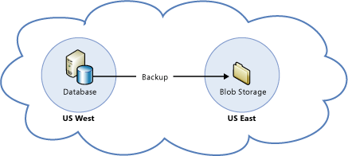

<properties
   pageTitle="Resiliency for recovery from loss of an Azure region technical guidance | Microsoft Azure"
   description="Whitepaper on understanding and designing resilient, highly available, fault tolerant applications as well as planning for disaster recovery"
   services=""
   documentationCenter="na"
   authors="adamglick"
   manager="hongfeig"
   editor=""/>

<tags
   ms.service="resiliency"
   ms.devlang="na"
   ms.topic="article"
   ms.tgt_pltfrm="na"
   ms.workload="na"
   ms.date="05/13/2016"
   ms.author="patw;jroth;aglick"/>

#Azure Resiliency Technical Guidance - Recovery from loss of an Azure region

Azure is divided physically and logically into units called regions. A region consists of one or more datacenters in close proximity. At the time of this writing, Azure has eight regions (4 in North America, 2 in Asia, and 2 in Europe).
Under rare circumstances facilities in an entire region can become inaccessible, for example due to network failures, or lost entirely for example due to natural disasters. This section explains Azure’s capabilities for creating applications which are distributed across regions. Regions are designed to minimize the possibility that a failure in one region could affect other regions.

##Cloud Services

###Resource Management

Distributing compute instances across regions is accomplished by creating a separate cloud service in each target region and publishing the deployment package to each cloud service. However, note that distributing traffic across cloud services in different regions must be implemented by the application developer or with a traffic management service.

Determining the number of spare role instances to deploy in advance for disaster recovery is an important aspect of capacity planning. Having a full-scale secondary deployment ensures that capacity is already available when needed; however, this effectively doubles the cost. A common pattern is to have a small secondary deployment just large enough to run critical services. We recommend creating at least a small secondary deployment, both to reserve capacity, and for testing configuration of the secondary environment.

>[AZURE.NOTE]The subscription quota is not a capacity guarantee. The quota is simply a credit limit. To guarantee capacity the required number of roles must be defined in the service model and the roles must be deployed.

###Load Balancing

To load balance traffic across regions requires usage of a traffic management solution. Azure provides [Azure Traffic Manager](https://azure.microsoft.com/services/traffic-manager/). You can also take advantage of third-party services that provide similar traffic management capabilities.

###Strategies

Many alternative strategies are available for implementing distributed compute across regions. These must be tailored to the specific business requirements and circumstances of the application. At a high level the approaches can be divided into 3 categories:

  * __Redeploy on disaster__: In this approach the application is redeployed from scratch at the time of disaster. This is appropriate for non-critical applications that don’t require a guaranteed recovery time.

  * __Warm Spare (Active/Passive)__: A secondary hosted service is created in an alternate region, and roles are deployed to guarantee minimal capacity; however, the roles don’t receive production traffic. This approach is useful for applications which have not been designed to distribute traffic across regions.

  * __Hot Spare (Active/Active)__: The application is designed to receive production load in multiple regions. The cloud services in each region might be configured for higher capacity than required for DR purposes. Alternatively, the cloud services might scale out as necessary at the time of a disaster and failover. This approach requires substantial investment in application design but has significant benefits including low and guaranteed recovery time, continuous testing of all recovery locations, and efficient usage of capacity.

A complete discussion of distributed design is outside the scope of this document. For further information see [Disaster Recovery and High Availability for Azure Applications](https://msdn.microsoft.com/library/azure/dn251004.aspx). 

##Virtual Machines

Recovery of infrastructure as a service(IaaS) virtual machines(VMs) is similar to platform as a service (PaaS) compute recovery in many respects, however there are important differences due to the fact that an IaaS VM consists of both the VM and the VM Disk.

  * __Use the Blob Copy API to duplicate VM Disks__: In order to create VMs in multiple regions the VM Disk must be copied to the alternate region. Because VM Disks are just blobs this can be accomplished using the [AzCopy Command Like Utility](../articles/storage-use-azcopy/).

  * __Separate the Data disk from the OS disk__: An important consideration for IaaS VMs is that you cannot change the OS disk without recreating the VM. This is not a problem if your recovery strategy is to redeploy after disaster. However, it might be a problem if you are using the Warm Spare approach to reserve capacity. To implement this properly you must have the correct OS disk deployed to both the primary and secondary locations and the application data must be stored on a separate drive. If possible use a standard OS configuration that can be provided on both locations. After a failover you must then attach the data drive to your existing IaaS VMs in the secondary DC. Use AzCopy to copy snapshots of the data disk(s) to a remote site.

  * __Potential consistency issues after a geo-failover of multiple VM Disks__: VM Disks are implemented as Azure Storage blobs, and have the same geo-replication characteristic (see below). VM Disks are guaranteed to be in a crash consistent state after a geo-failover, however there are no guarantees of consistency across disks because disks, because geo-replication is asynchronous and replicates independently. This could cause problems in some cases (for example, in the case of disk striping). Additional work might be required to restore consistency after a geo-failover in these cases. To ensure correctness of backups a backup product such as Data Protection Manager should be used to backup and restore application data.

##Storage

###Recovery using Geo Redundant Storage of Blob, Table, Queue and VM Disk Storage

In Azure blobs, tables, queues, and VM Disks are all geo-replicated by default. This is referred to as Geo-Redundant Storage (GRS). GRS replicates storage data to a paired datacenter hundreds of miles apart within a specific geographic region. GRS is designed to provide additional durability in case there is a major data center disaster. Microsoft controls when failover occurs and failover is limited to major disasters in which the original primary location is deemed unrecoverable in a reasonable amount of time. Under some scenarios this can be several days. Data is typically replicated within a few minutes, although synchronization interval is not yet covered by an SLA.

In the event of a geo-failover there will be no change to how the account is accessed (the URL and account key will not change), however, the storage account will be in a different region after failover, which could impact applications which require regional affinity with their storage account. Even for services and applications that do not require a storage account in the same data center, the cross-datacenter latency and bandwidth charges might be a compelling reason to move traffic to the failover region temporarily. This could factor into an overall disaster recovery strategy.

In addition to automatic failover provided by GRS, Azure has introduced a service that gives you read access to the copy of your data in the secondary storage location. This is called Read Access - Geo Redundant Storage (RA-GRS).

For more information about both GRS and the RA-GRS preview, see [Azure Storage replication](../storage/storage-redundancy/).

###Geo-Replication Region Mappings:

It is important to know where your data is geo-replicated to in order to know where to deploy the other instances of your data which require regional affinity with your storage. The following table shows the primary and secondary location pairings:
 
[AZURE.INCLUDE [paired-region-list](../../includes/paired-region-list.md)]

###Geo-Replication Pricing:

Geo-replication is included in current pricing for Azure Storage. This is called Geo-Redundant Storage. If you do not want your data geo-replicated you can disable geo-replication for your account. This is called Locally Redundant Storage, and is charged at a discounted price over geo-replicated storage.
Determining if a geo-failover has occurred

If a geo-failover occurs this will be posted to the [Azure Service Health Dashboard](https://azure.microsoft.com/status/), however, applications can implement an automated means of detecting this by monitoring the geo-region for their storage account. This can be used to trigger other recovery operations such as activation of compute resources in the geo-region where their storage moved to. This is queryable from the service management API using [Get Storage Account Properties](https://msdn.microsoft.com/library/ee460802.aspx). The relevant properties are:
```html
<GeoPrimaryRegion>primary-region</GeoPrimaryRegion>
<StatusOfPrimary>[Available|Unavailable]</StatusOfPrimary>
<LastGeoFailoverTime>DateTime</LastGeoFailoverTime>
<GeoSecondaryRegion>secondary-region</GeoSecondaryRegion>
<StatusOfSecondary>[Available|Unavailable]</StatusOfSecondary>
```

###VM Disks and geo-failover

As discussed in the section on VM Disks, there are no guarantees for data consistency across VM disks after a failover. To ensure correctness of backups a backup product such as Data Protection Manager should be used to backup and restore application data.

##Database

###SQL Database

Recovery of Azure Azure SQL Databases can be achieved by taking advantage of Point in Time Restore for Basic, Standard, or Premium tiers. For more information, see [Azure SQL Database Backup and Restore](../sql-database/sql-database-business-continuity/).

In addition to using Point in Time Restore, you can manually export the database to an Azure Storage blob using the Azure Azure SQL Database Import/Export service. This can be implemented in three ways:

  * Export to a blob using storage account in a different data center
  * Export to a blob using storage account in the same data center (and rely on Azure Storage geo-replication to the separate data center).
  * Import to your on-premises SQL Server.

For implementation details see the article [Business Continuity in Azure SQL Database](../sql-database/sql-database-business-continuity/).

###SQL Server on Virtual Machines

There are two recommended options for recovering an SQL Server database running on virtual machines in Azure (sometimes referred to as infrastructure as a service (IaaS)) to an alternate Azure datacenter: cross-region AlwaysOn Availability Groups or backup and restore with storage blobs.

It is also possible to use database mirroring, but this feature will be removed in a future version of SQL Server. When using database mirroring for disaster recovery, you must have the principal and mirror servers running in different Azure datacenters. This means that you must deploy using server certificates, because an Active Directory domain cannot span multiple Azure datacenters without routing traffic through an on-premises network. The following diagram illustrates this setup.

 in Microsoft Azure")

The following diagram demonstrates standard backup and restore with Azure storage blobs.



For more information, see [High availability and disaster recovery for SQL Server in Azure Virtual Machines](../virtual-machines/virtual-machines-windows-sql-high-availability-dr/).

##Other Azure Platform Services

When attempting to run your cloud service in multiple Azure regions, you must consider the implications for each of your dependencies. In the following sections, the service-specific guidance assumes that you must use the same Azure service in an alternate Azure datacenter. This involves both configuration and data-replication tasks.

>[AZURE.NOTE]In some cases, these steps can help to mitigate a service-specific outage rather than an entire datacenter event. From the application perspective, a service-specific outage might be just as limiting and would require temporarily migrating the service to an alternate Azure region.

###Access Control Service
**replace with Azure Active Directory** ./articles/active-directory-dotnet-how-to-use-access-control/

The Access Control Service (ACS) uses a unique namespace name that does not span Azure regions. ACS 2.0 takes backups of all namespaces once per day and stores them in a secure offsite location. In the case of a disaster, the ACS operation staff may attempt to recover customers’ subscriptions in a remote Azure region using the most recent backup. Due to the frequency of backups data loss up to 24 hours may occur. There is no SLA for regional failover and the recovery time can be several days depending on the scenario.

To use ACS in an alternate region, customers must configure an ACS namespace in that region. ACS 2.0 customers concerned about potential for data loss are encouraged to review the ACS 2.0 Management Service. This interface allows administrators to manage their namespaces and import and extract all relevant data. Through the use of this interface, ACS customers have the ability develop custom backup and restore solutions for a higher level of data consistency than is currently offered by ACS. For other availability considerations, see [Access Control Service (Availability)](./https://msdn.microsoft.com/library/azure/hh873027.aspx#LocalAccessControl).

###Service Bus

Azure Service Bus uses a unique namespace that does not span Azure regions. So the first requirement is to setup the necessary service bus namespaces in the alternate region. However, there are also considerations for the durability of the queued messages. There are several strategies for replicating messages across Azure regions. For the details on these replication strategies and other disaster recovery strategies, see [Best practices for insulating applications against Service Bus outages and disasters](../service-bus/service-bus-outages-disasters/). For other availability considerations, see [Service Bus (Availability)](./resiliency-technical-guidance-recovery-local-failures.md#service-bus).

###Web Apps

To migrate an Azure Web App to a secondary Azure region, you must have a backup of the website available for publishing. If the outage does not involve the entire Azure datacenter, it might be possible to use FTP to download a recent backup of the site content. Then create a new Web App in the alternate region, unless you have previously done this to reserve capacity. Publish the site to the new region, and make any necessary configuration changes. These changes could include database connection strings or other region-specific settings. If necessary, add the site’s SSL certificate and change the DNS CNAME record so that the custom domain name points to the redeployed Azure Web App URL.

###Mobile Services

In the secondary Azure region, create a backup mobile service for your application. Restore the Azure SQL Database to the alternate region as well. Then use Azure command-line tools to move the mobile service to the alternate region. Then configure the mobile service to use the restored database. For more information on this process, see [Recover your mobile service in the event of a disaster](../mobile-services/mobile-services-disaster-recovery/). For other availability considerations, see [Mobile Services (Availability)](./resiliency-technical-guidance-recovery-local-failures.md#mobile).

###HDInsight

The data associated with HDInsight is stored by default in Azure Blob Storage. HDInsight requires that a Hadoop cluster processing MapReduce jobs must be collocated in the same region as the storage account that contains the data being analyzed. Provided you use the geo-replication feature available to Azure Storage, you can access your data in the secondary region where the data was replicated if for some reason the primary region is no longer available. You can create a new Hadoop cluster in the region where the data has been replicated and continue processing it. For other availability considerations, see [HDInsight (Availability)](./resiliency-technical-guidance-recovery-local-failures.md#hdinsight).

###SQL Reporting

At this time, recovering from the loss of an Azure region requires multiple SQL Reporting instances in different Azure regions. These SQL Reporting instances should access the same data, and that data should have its own recovery plan in the event of a disaster. You can also maintain external backup copies of the RDL file for each report.

###Media Services

Azure Media Services has a different recovery approach for encoding and streaming. Typically, streaming is more critical during a regional outage. To prepare for this, you should have a Media Services account in two different Azure regions. The encoded content should be located in both regions. During a failure, you can redirect the streaming traffic to the alternate region. Encoding can be performed in any Azure region. If encoding is time-sensitive, for example during live event processing, you must be prepared to submit jobs to an alternate datacenter during failures.

###Virtual Network

Configuration files provide the quickest way to setup a virtual network in an alternate Azure region. After configuring the virtual network in the primary Azure region, [export the virtual network settings](../virtual-network/virtual-networks-create-vnet-classic-portal/) for the current network to a network configuration file. In the event of an outage in the primary region, [restore the virtual network](../virtual-network/virtual-networks-create-vnet-classic-portal/) from the stored configuration file. Then configure other cloud services, virtual machines, or cross-premises settings to work with the new virtual network.

##Checklists for disaster recovery
 
##[Cloud Services](#cloud-services) Checklist
  1. Create a cross-region disaster recovery strategy
  2. Understand trade-offs in reserving capacity in alternate regions
  3. Use traffic routing tools, such as Azure Traffic Manager

##[Virtual Machines)](#virtual-machines) Checklist
  1. Copy your VHDs from your Blob Storage to an alternate region
  2. Perform regular backups of the virtual machine disk or disk contents

##[Storage](#storage) Checklist
  1. Do not disable geo-replication of storage resources
  2. Understand alternate region for geo-replication in the event of failover
  3. Create custom backup strategies for user-controlled failover strategies

##[SQL Database](#sql-database) Checklist
  1. Use Azure SQL Database Point in Time Restore
  2. Export Azure SQL Database to blob storage
  3. Create a disaster recovery plan based on previous storage considerations

##[SQL Server on Virtual Machines](#sql-server-on-virtual-machines) Checklist
  1. Use cross-region AlwaysOn Availability Groups or database mirroring
  2. Alternately use backup and restore to blob storage

##**update to AAD**[Access Control Service](#access-control-service) Checklist
  1. Configure an ACS namespace in an alternate region
  2. Use the ACS 2.0 Management Service to create custom backup solutions

##[Service Bus](#service-bus) Checklist
  1. Configure a Service Bus namespace in an alternate region
  2. Consider custom replication strategies for messages across regions

##[Web Apps](#web-apps) Checklist
  1. Maintain web site backups outside of the primary region
  2. If outage is partial, attempt to retrieve current site with FTP
  3. Plan to deploy web site to new or existing web site in an alternate region
  4. Plan configuration changes for both application and DNS CNAME records

##[Mobile Services](#mobile-services) Checklist
  1. Create a backup mobile service in an alternate region
  2. Manage backups of the associated Azure SQL Database to restore during failover
  3. Use Azure command-line tools to move mobile service

#[HDInsight](#hdinsight) Checklist
  1. Create a new Hadoop cluster in the region with replicated data

##[SQL Reporting](#sql-reporting) Checklist
  1. Maintain an alternate SQL Reporting instance in a different region
  2. Maintain a separate plan to replicate the target to that region

##[Media Services](#media-services) Checklist
  1. Create a Media Services account in an alternate region
  2. Encode the same content in both regions to support streaming failover
  3. Submit encoding jobs to an alternate region in the event of an outage

##[Virtual Network](#virtual-network) Checklist
  1. Use exported virtual network settings to recreate it in another region
