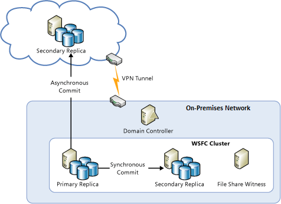
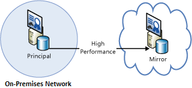
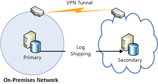
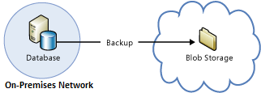

<properties
   pageTitle="Technical guidance: Recovery from on-premises to Azure | Microsoft Azure"
   description="Article on understanding and designing recovery systems from on-premises infrastructure to Azure"
   services=""
   documentationCenter="na"
   authors="adamglick"
   manager="hongfeig"
   editor=""/>

<tags
   ms.service="resiliency"
   ms.devlang="na"
   ms.topic="article"
   ms.tgt_pltfrm="na"
   ms.workload="na"
   ms.date="08/01/2016"
   ms.author="aglick"/>

#Azure resiliency technical guidance: Recovery from on-premises to Azure

Azure provides a comprehensive set of services for enabling the extension of an on-premises datacenter to Azure for high availability and disaster recovery purposes:

* __Networking__: With a virtual private network, you securely extend your on-premises network to the cloud.
* __Compute__: Customers using Hyper-V on-premises can “lift and shift” existing virtual machines (VMs) to Azure.
* __Storage__: StorSimple extends your file system to Azure Storage. The Azure Backup service provides backup for files and SQL databases to Azure Storage.
* __Database replication__: With SQL Server 2014 (or later) Availability Groups, you can implement high availability and disaster recovery for your on-premises data.

##Networking

You can use Azure Virtual Network to create a logically isolated section in Azure and securely connect it to your on-premises datacenter or a single client machine by using an IPsec connection. With Virtual Network, you can take advantage of the scalable, on-demand infrastructure in Azure while providing connectivity to data and applications on-premises, including systems running on Windows Server, mainframes, and UNIX. See [Azure networking documentation](../virtual-network/virtual-networks-overview.md) for more information.

##Compute

If you're using Hyper-V on-premises, you can “lift and shift” existing virtual machines to Azure and service providers running Windows Server 2012 (or later), without making changes to the VM or converting VM formats. For more information, see [About disks and VHDs for Azure virtual machines](../virtual-machines/virtual-machines-linux-about-disks-vhds.md).

##Azure Site Recovery

If you want disaster recovery as a service (DRaaS), Azure provides [Azure Site Recovery](https://azure.microsoft.com/services/site-recovery/). Azure Site Recovery offers comprehensive protection for VMware, Hyper-V, and physical servers. With Azure Site Recovery, you can use another on-premises server or Azure as your recovery site. For more information on Azure Site Recovery, see the [Azure Site Recovery documentation](https://azure.microsoft.com/documentation/services/site-recovery/).

##Storage

There are several options for using Azure as a backup site for on-premises data.

###StorSimple

StorSimple securely and transparently integrates cloud storage for on-premises applications. It also offers a single appliance that delivers high-performance tiered local and cloud storage, live archiving, cloud-based data protection, and disaster recovery. For more information, see the [StorSimple product page](https://azure.microsoft.com/services/storsimple/).

###Azure Backup

Azure Backup enables cloud backups by using the familiar backup tools in Windows Server 2012 (or later), Windows Server 2012 Essentials (or later), and System Center 2012 Data Protection Manager (or later). These tools provide a workflow for backup management that is independent of the storage location of the backups, whether a local disk or Azure Storage. After data is backed up to the cloud, authorized users can easily recover backups to any server.

With incremental backups, only changes to files are transferred to the cloud. This helps to efficiently use storage space, reduce bandwidth consumption, and support point-in-time recovery of multiple versions of the data. You can also choose to use additional features, such as data retention policies, data compression, and data transfer throttling. Using Azure as the backup location has the obvious advantage that the backups are automatically “offsite”. This eliminates the extra requirements to secure and protect on-site backup media.

For more information, see [What is Azure Backup?](../backup/backup-introduction-to-azure-backup.md) and [Configure Azure Backup for DPM data](https://technet.microsoft.com/library/jj728752.aspx).

##Database

You can have a disaster recovery solution for your SQL Server databases in a hybrid-IT environment by using AlwaysOn Availability Groups, database mirroring, log shipping, and backup and restore with Azure Blob storage. All of these solutions use SQL Server running on Azure Virtual Machines.

AlwaysOn Availability Groups can be used in a hybrid-IT environment where database replicas exist both on-premises and in the cloud. This is shown in the following diagram.

Database mirroring can also span on-premises servers and the cloud in a certificate-based setup. The following diagram illustrates this concept.

Log shipping can be used to synchronize an on-premises database with a SQL Server database in an Azure virtual machine.

Finally, you can back up an on-premises database directly to Azure Blob storage.

For more information, see [High availability and disaster recovery for SQL Server in Azure virtual machines](../virtual-machines/virtual-machines-windows-sql-high-availability-dr.md) and [Backup and restore for SQL Server in Azure virtual machines](../virtual-machines/virtual-machines-windows-sql-backup-recovery.md).

##Checklists for on-premises recovery in Microsoft Azure

###Networking

  1. Review the [Networking](#networking) section of this document.
  2. Use Virtual Network to securely connect on-premises to the cloud.

###Compute

  1. Review the [Compute](#compute) section of this document.
  2. Relocate VMs between Hyper-V and Azure.

###Storage
  1. Review the [Storage](#storage) section of this document.
  2. Take advantage of StorSimple services for using cloud storage.
  3. Use the Azure Backup service.

###Database

  1. Review the [Database](#database) section of this document.
  2. Consider using SQL Server on Azure VMs as the backup.
  3. Set up AlwaysOn Availability Groups.
  4. Configure certificate-based database mirroring.
  5. Use log shipping.
  6. Back up on-premises databases to Azure Blob storage.

##Next steps

This article is part of a series focused on [Azure resiliency technical guidance](./resiliency-technical-guidance.md). The next article in this series is [Recovery from data corruption or accidental deletion](./resiliency-technical-guidance-recovery-data-corruption.md).
