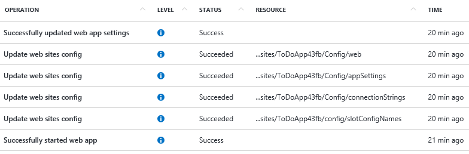

<properties 
	pageTitle="Audit operations with Resource Manager | Microsoft Azure" 
	description="Use the audit log in Resource Manager to review user actions and errors. Shows PowerShell, Azure CLI, and REST." 
	services="azure-resource-manager" 
	documentationCenter="" 
	authors="tfitzmac" 
	manager="wpickett" 
	editor=""/>

<tags 
	ms.service="azure-resource-manager" 
	ms.workload="multiple" 
	ms.tgt_pltfrm="na" 
	ms.devlang="na" 
	ms.topic="article" 
	ms.date="10/27/2015" 
	ms.author="tomfitz"/>

# Audit operations with Resource Manager

When you encounter a problem during deployment or during the lifetime of your solution, you need to discover what went wrong. Resource Manager provides two ways for you to find out what happened and why it happened. 
You can use deployment commands to retrieve information about particular deployments and operations. Or, you can use the audit logs to retrieve information about deployments and other actions 
taken during the lifetime of the solution. This topic focuses on audit logs. 

The audit log contains all actions performed on your resources. So, if a user in your organization modifies a resource, you will be able to identify the action, time, and user.

There are two important limitations to keep in mind when working with audit logs:

1. Audit logs are only retained for 90 days.
2. You can only query for a range of 15 days or less.

You can retrieve information from the audit logs through Azure PowerShell, Azure CLI, REST API, or the Azure preview portal.

## PowerShell

[AZURE.INCLUDE [powershell-preview-inline-include](../includes/powershell-preview-inline-include.md)]

To retrieve log entries, run the **Get-AzureRmLog** command  (or **Get-AzureResourceGroupLog** for PowerShell versions earlier than 1.0 Preview). You provide additional parameters to filter the list of entries . 

The following example shows how to use the audit log to research actions taken during the lifecycle of the solution. You can see when the action occurred and who requested it. The start and end dates are specified in a date format.

    PS C:\> Get-AzureRmLog -ResourceGroup ExampleGroup -StartTime 2015-08-28T06:00 -EndTime 2015-09-10T06:00

Or, you can use date functions to specify the date range, such as the last 15 days.

    PS C:\> Get-AzureRmLog -ResourceGroup ExampleGroup -StartTime (Get-Date).AddDays(-15)

Depending on the start time you specify, the previous commands can return a long list actions for that resource group. You can filter the results for what you are looking for by providing search criteria. For example, if you
are trying to research how a web app was stopped you could run the following command and see that a stop action was performed by someone@example.com.

    PS C:\> Get-AzureRmLog -ResourceGroup ExampleGroup -StartTime (Get-Date).AddDays(-15) | Where-Object OperationName -eq Microsoft.Web/sites/stop/action

    Authorization     :
                        Scope     : /subscriptions/xxxxx/resourcegroups/ExampleGroup/providers/Microsoft.Web/sites/ExampleSite
                        Action    : Microsoft.Web/sites/stop/action
                        Role      : Subscription Admin
                        Condition :
    Caller            : someone@example.com
    CorrelationId     : 84beae59-92aa-4662-a6fc-b6fecc0ff8da
    EventSource       : Administrative
    EventTimestamp    : 8/28/2015 4:08:18 PM
    OperationName     : Microsoft.Web/sites/stop/action
    ResourceGroupName : ExampleGroup
    ResourceId        : /subscriptions/xxxxx/resourcegroups/ExampleGroup/providers/Microsoft.Web/sites/ExampleSite
    Status            : Succeeded
    SubscriptionId    : xxxxx
    SubStatus         : OK

In the next example, we'll just look for failed actions after the specified start time. We'll also include the **DetailedOutput** parameter to see the error messages.

    PS C:\> Get-AzureRmLog -ResourceGroup ExampleGroup -StartTime (Get-Date).AddDays(-15) -Status Failed –DetailedOutput
    
If this command returns too many entries and properties, you can focus your auditing efforts by retrieving the **properties** property.

    PS C:\> (Get-AzureRmLog -Status Failed -ResourceGroup ExampleGroup -DetailedOutput).Properties

    Content
    -------
    {}
    {[statusCode, Conflict], [statusMessage, {"Code":"Conflict","Message":"Website with given name mysite already exists...
    {[statusCode, Conflict], [serviceRequestId, ], [statusMessage, {"Code":"Conflict","Message":"Website with given name...

And, you can further refine the results by looking at the status message.

    PS C:\> (Get-AzureRmLog -Status Failed -ResourceGroup ExampleGroup -DetailedOutput).Properties[1].Content["statusMessage"] | ConvertFrom-Json

    Code       : Conflict
    Message    : Website with given name mysite already exists.
    Target     :
    Details    : {@{Message=Website with given name mysite already exists.}, @{Code=Conflict}, @{ErrorEntity=}}
    Innererror :

## Azure CLI

To retrieve log entries, you run the **azure group log show** command.

    azure group log show ExampleGroup

You can filter results with a JSON utility such as [jq](http://stedolan.github.io/jq/download/). The following example shows how to look for operations that involved updating a web configuration file.

    azure group log show ExampleGroup --json | jq ".[] | select(.operationName.localizedValue == \"Update web sites config\")"

You can add the **–-last-deployment** parameter to limit the returned entries to only operations from the last deployment.

    azure group log show ExampleGroup --last-deployment

If the list of operations from the last deployment is too long, you can filter the results for just operations that failed.

    azure group log show tfCopyGroup --last-deployment --json | jq ".[] | select(.status.value == \"Failed\")"

                                   /Microsoft.Web/Sites/ExampleSite
    data:    SubscriptionId:       <guid>
    data:    EventTimestamp (UTC): Thu Aug 27 2015 13:03:27 GMT-0700 (Pacific Daylight Time)
    data:    OperationName:        Update website
    data:    OperationId:          cb772193-b52c-4134-9013-673afe6a5604
    data:    Status:               Failed
    data:    SubStatus:            Conflict (HTTP Status Code: 409)
    data:    Caller:               someone@example.com
    data:    CorrelationId:        a8c7a2b4-5678-4b1b-a50a-c17230427b1e
    data:    Description:
    data:    HttpRequest:          clientRequestId: <guid>
                                   clientIpAddress: 000.000.000.000
                                   method:          PUT

    data:    Level:                Error
    data:    ResourceGroup:        ExampleGroup
    data:    ResourceProvider:     Azure Web Sites
    data:    EventSource:          Administrative
    data:    Properties:           statusCode:       Conflict
                                   serviceRequestId:
                                   statusMessage:    {"Code":"Conflict","Message":"Website with given name
                                   ExampleSite already exists.","Target":null,"
                                   Details
                                   ":[{"Message":"Website with given name ExampleSite already exists."},
                                   {"Code":"Conflict"},
                                   {"ErrorEntity":{"Code":"Conflict","Message":"Website with given
                                   name ExampleSite already exists.","ExtendedCode
                                   ":"
                                   54001","MessageTemplate":"Website with given name {0} already exists.",
                                   "Parameters":["ExampleSite"],"
                                   InnerErrors":null}}],"Innererror":null}

## REST API

The REST operations for working with the audit log are part of the [Insights REST API](https://msdn.microsoft.com/library/azure/dn931943.aspx). To retrieve audit log events, see [List the management events in a subscription](https://msdn.microsoft.com/library/azure/dn931934.aspx).

## Preview portal

You can also view logged operations through the preview portal. Simply select the audit logs blade.

 

And, view the list of latest operations.

You can select any operation for more details about it.

## Next steps

- To learn about setting security policies, see [Managing access to resources](./azure-portal/resource-group-rbac.md).
- To learn about granting access to a service principal, see [Authenticating a service principal with Azure Resource Manager](resource-group-authenticate-service-principal.md).
- To learn how to actions on a resource for all users, see [Lock resources with Azure Resource Manager](resource-group-lock-resources.md).
