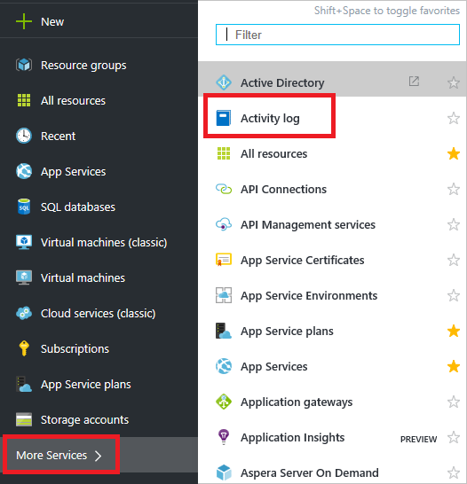
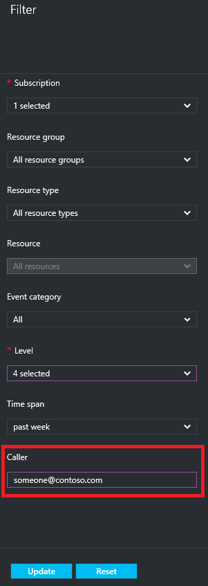
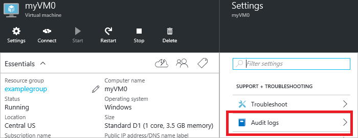
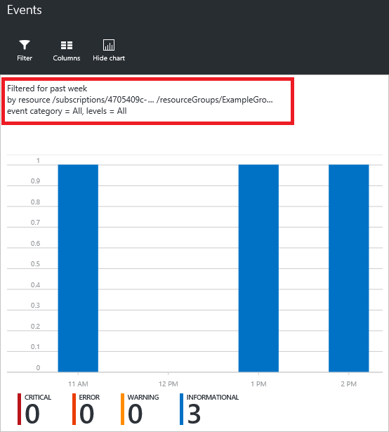

<properties
	pageTitle="Audit operations with Resource Manager | Microsoft Azure"
	description="Use the audit log in Resource Manager to review user actions and errors. Shows Azure Portal PowerShell, Azure CLI, and REST."
	services="azure-resource-manager"
	documentationCenter=""
	authors="tfitzmac"
	manager="timlt"
	editor="tysonn"/>

<tags
	ms.service="azure-resource-manager"
	ms.workload="multiple"
	ms.tgt_pltfrm="na"
	ms.devlang="na"
	ms.topic="article"
	ms.date="06/13/2016"
	ms.author="tomfitz"/>

# Audit operations with Resource Manager

Through audit logs, you can determine:

- what operations were taken on the resources in your subscription
- who initiated the operation (although operations initiated by a backend service do not return a user as the caller)
- when the operation occurred
- the status of the operation
- the values of other properties that might help you research the operation

[AZURE.INCLUDE [resource-manager-audit-limitations](../includes/resource-manager-audit-limitations.md)]

This topic focuses on auditing operations. To learn about using the audit logs to troubleshoot a deployment, see [Troubleshooting resource group deployments in Azure](resource-manager-troubleshoot-deployments-portal.md).

You can retrieve information from the audit logs through the Azure portal, Azure PowerShell, Azure CLI, Insights REST API, or [Insights .NET Library](https://www.nuget.org/packages/Microsoft.Azure.Insights/).

## Portal to view audit logs

1. To view the audit logs through the portal, select **Browse** and **Audit Logs**.

    

2. In the **Audit Logs** blade, you will see a summary of recent operations for all of the resource groups in your subscription. It includes a graphical representation of the time and status of the operations, as well as a list of the operations.

    

3. To look up a particular type of action, you can filter which operations are displayed in the audit logs blade. Select **Filter** at the top of the blade.

    

4. From the **Filter** blade, you can select many different conditions to restrict the number of operations displayed. For example, you can see all of the actions taken by a particular user for the past week.

    

After updating the view of the audit logs, you will only see the operations that meet the specified condition. Those settings are retained the next time you view the audit logs, so you may need to change those values to broaden your view of the operations.

You can also automatically filter for a particular resource by selecting audit logs from that resource blade. In the portal, select the resource to audit, and select **Audit logs**.

Notice that the audit log is automatically filered by the selected resource for the past week.

## PowerShell to view audit logs

1. To retrieve log entries, run the **Get-AzureRmLog** command. You provide additional parameters to filter the list of entries. If you do not specify a start and end time, entries for the last hour are returned.
For example, to retrieve the operations for a resource group during the past hour run:

        Get-AzureRmLog -ResourceGroup ExampleGroup

    The following example shows how to use the audit log to research operations taken during a specified time. The start and end dates are specified in a date format.

        Get-AzureRmLog -ResourceGroup ExampleGroup -StartTime 2015-08-28T06:00 -EndTime 2015-09-10T06:00

    Or, you can use date functions to specify the date range, such as the last 14 days.

        Get-AzureRmLog -ResourceGroup ExampleGroup -StartTime (Get-Date).AddDays(-14)

2. Depending on the start time you specify, the previous commands can return a long list of operations for the resource group. You can filter the results for what you are looking for by providing search criteria. For example, if you
are trying to research how a web app was stopped, you could run the following command.  

        Get-AzureRmLog -ResourceGroup ExampleGroup -StartTime (Get-Date).AddDays(-14) | Where-Object OperationName -eq Microsoft.Web/sites/stop/action
        
    Which for this example shows that a stop action was performed by someone@contoso.com. 
        
        Authorization     :
        Scope     : /subscriptions/xxxxx/resourcegroups/ExampleGroup/providers/Microsoft.Web/sites/ExampleSite
        Action    : Microsoft.Web/sites/stop/action
        Role      : Subscription Admin
        Condition :
        Caller            : someone@contoso.com
        CorrelationId     : 84beae59-92aa-4662-a6fc-b6fecc0ff8da
        EventSource       : Administrative
        EventTimestamp    : 8/28/2015 4:08:18 PM
        OperationName     : Microsoft.Web/sites/stop/action
        ResourceGroupName : ExampleGroup
        ResourceId        : /subscriptions/xxxxx/resourcegroups/ExampleGroup/providers/Microsoft.Web/sites/ExampleSite
        Status            : Succeeded
        SubscriptionId    : xxxxx
        SubStatus         : OK

3. You can look up the actions taken by a particular user, even for a resource group that no longer exists.

        Get-AzureRmLog -ResourceGroup deletedgroup -StartTime (Get-Date).AddDays(-14) -Caller someone@contoso.com

## Azure CLI to view audit logs

1. To retrieve log entries, you run the **azure group log show** command.

        azure group log show ExampleGroup

2. You can filter results with a JSON utility such as [jq](http://stedolan.github.io/jq/download/). The following example shows how to look for operations that updated a web configuration file.

        azure group log show ExampleGroup --json | jq ".[] | select(.operationName.localizedValue == \"Update web sites config\")"

3. You can look up the actions for a particular user.

        azure group log show ExampleGroup --json | jq ".[] | select(.caller==\"someone@contoso.com\")"

## REST API to view audit logs

The REST operations for working with the audit log are part of the [Insights REST API](https://msdn.microsoft.com/library/azure/dn931943.aspx). To retrieve audit log events, see [List the management events in a subscription](https://msdn.microsoft.com/library/azure/dn931934.aspx).

## Next steps

- Azure Audit logs can be used with Power BI to gain greater insights about the actions in your subscription. See [View and analyze Azure Audit Logs in Power BI and more](https://azure.microsoft.com/blog/analyze-azure-audit-logs-in-powerbi-more/).
- To learn about setting security policies, see [Azure Role-based Access Control](./active-directory/role-based-access-control-configure.md).
- To learn about the commands for troubleshooting deployments, see [Troubleshooting resource group deployments in Azure](resource-manager-troubleshoot-deployments-portal.md).
- To learn how to prevent deletions on a resource for all users, see [Lock resources with Azure Resource Manager](resource-group-lock-resources.md).

