<properties
   pageTitle="Create service principal in portal | Microsoft Azure"
   description="Describes how to create a new Active Directory application and service principal that can be used with the role-based access control in Azure Resource Manager to manage access to resources."
   services="azure-resource-manager"
   documentationCenter="na"
   authors="tfitzmac"
   manager="timlt"
   editor="tysonn"/>

<tags
   ms.service="azure-resource-manager"
   ms.devlang="na"
   ms.topic="article"
   ms.tgt_pltfrm="na"
   ms.workload="na"
   ms.date="07/19/2016"
   ms.author="tomfitz"/>

# Use portal to create Active Directory application and service principal that can access resources

> [AZURE.SELECTOR]
- [PowerShell](resource-group-authenticate-service-principal.md)
- [Azure CLI](resource-group-authenticate-service-principal-cli.md)
- [Portal](resource-group-create-service-principal-portal.md)

When you have an application that needs to access or modify resources, you must set up an Active Directory (AD) application and assign the required permissions to it. This topic shows you how to perform those steps through the portal. Currently, you must use the classic portal to create a new Active Directory application, and then switch to the Azure portal to assign a role to the application. 

> [AZURE.NOTE] You may find it easier to set up your AD application and service principal through [PowerShell](resource-group-authenticate-service-principal.md) or [Azure CLI](resource-group-authenticate-service-principal-cli.md), especially if you want to use a certificate for authentication. This topic does not show how to use a certificate.

For an explanation of Active Directory concepts, see [Application Objects and Service Principal Objects](./active-directory/active-directory-application-objects.md). 
For more information about Active Directory authentication, see [Authentication Scenarios for Azure AD](./active-directory/active-directory-authentication-scenarios.md).

For detailed steps on integrating an application into Azure for managing resources, see [Developer's guide to authorization with the Azure Resource Manager API](resource-manager-api-authentication.md).

## Create an Active Directory application

1. Login to your Azure Account through the [classic portal](https://manage.windowsazure.com/).

2. Select **Active Directory** from the left pane.

     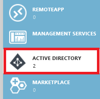
     
3. Select the Active Directory that you want to use for creating the new application. If you have more than one Active Directory, you usually want to create the application in the directory where your subscription resides. You can only grant access to resource in your subscription for applications in the same directory as your subscription.  

     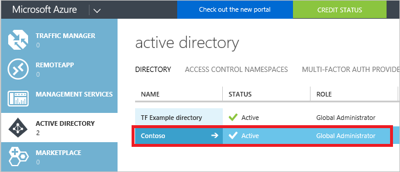
     
    If you need to find the directory for your subscription, select **Settings** and look for the directory name.
   
     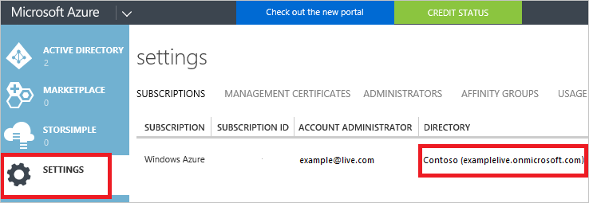

3. To view the applications in your directory, click on **Applications**.

     

4. If you haven't created an application in that directory before you should see something similar to following image. Click on **ADD AN APPLICATION**

     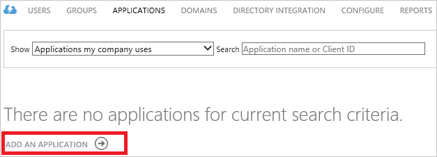

     Or, click **Add** in the bottom pane.

     

5. Select the type of application you would like to create. For this tutorial, select **Add an application my organization is developing**. 

     

6. Provide a name for the application and select the type of application you want to create. For this tutorial, create a **WEB APPLICATION AND/OR WEB API** and click the next button. If you select **NATIVE CLIENT APPLICATION**, the remaining steps of this article will not match your experience.

     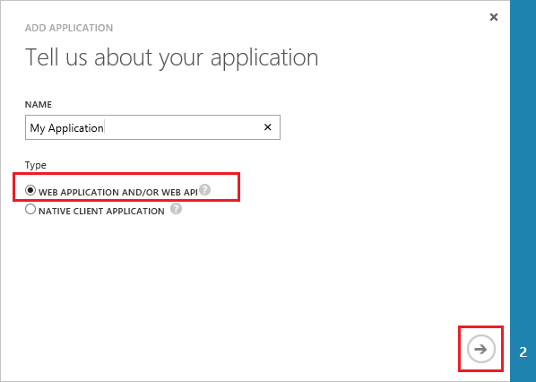

7. Fill in the properties for your app. For **SIGN-ON URL**, provide the URI to a web site that describes your application. The existence of the web site is not validated. 
For **APP ID URI**, provide the URI that identifies your application.

     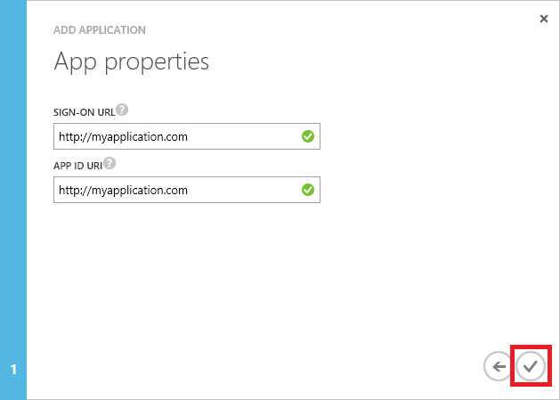

You have created your application.

## Get client id and authentication key

When programmatically logging in, you need the id for your application. If the application runs under its own credentials, you will also need an authentication key.

1. Click on the **Configure** tab to configure your application's password.

     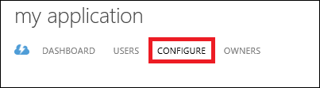

2. Copy the **CLIENT ID**.
  
     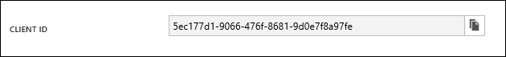

3. If the application will run under its own credentials, scroll down to the **Keys** section and select how long you would like your password to be valid.

     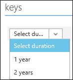

4. Select **Save** to create your key.

     

     The saved key is displayed and you can copy it. You will not be able to retrieve the key later so you will want to copy it now.

     

## Get tenant id

When programmatically logging in, you need to pass the tenant id with your authentication request. For Web Apps and Web API Apps, you can retrieve the tenant id by selecting **View endpoints** at the bottom of the screen and retrieving the id as shown below.  

   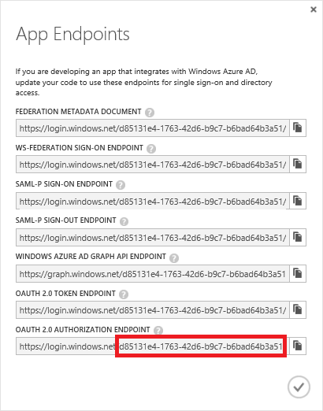

You can also retrieve the tenant id through PowerShell:

    Get-AzureRmSubscription

Or, Azure CLI:

    azure account show --json

## Set delegated permissions

If your application accesses resources on behalf of a signed-in user, you must grant your application the delegated permission to access other applications. You do this in the **permissions to other applications** section of the **Configure** tab. By default, a delegated permission is already enabled for the Azure Active Directory. Leave this delegated permission unchanged.

1. Select **Add application**.

2. From the list, select the **Azure Service Management API**. Then, select the complete icon.

      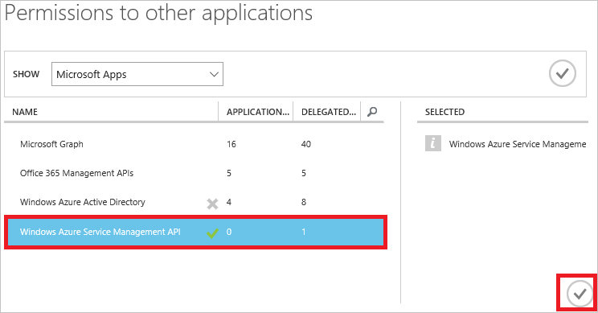

3. In the dropdown list for delegated permissions, select **Access Azure Service Management as organization**.

      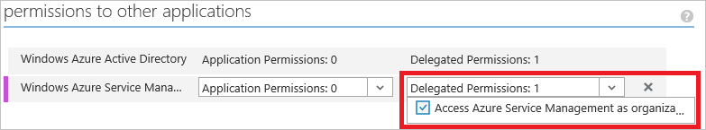

4. Save the change.

## Configure multi-tenant application

If users from other Azure Active Directories can consent to the application and sign in to it, you must enable multi-tenancy. In the **Configure** tab, set **Application is multi-tenant** to **Yes**.

## Assign application to role

If your application is running under its own credentials, you must assign the application to a role. You must decide which role represents the right permissions for the application. To learn about the available roles, see [RBAC: Built in Roles](./active-directory/role-based-access-built-in-roles.md). 

You can set the scope at the level of the subscription, resource group, or resource. The permissions are inherited to lower levels of scope (for example, adding an application to the Reader role for a resource group means it can read the resource group and any resources it contains).

1. To assign the application to a role, switch from the classic portal to the [Azure portal](https://portal.azure.com).

1. In the portal, navigate to the level of scope you wish to assign the application to. For this topic, you can navigate to a resource group, and from the resource group blade, select the **Access** icon.

     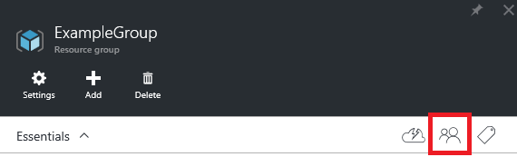

2. Select **Add**.

     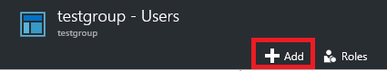

3. Select the **Reader** role (or whatever role you wish to assign the application to).

     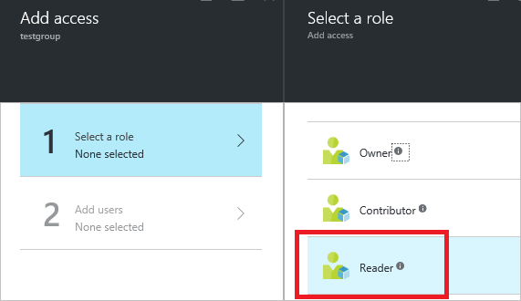

4. When you first see the list of users you can add to the role, you will not see applications. You will only see group and users.

     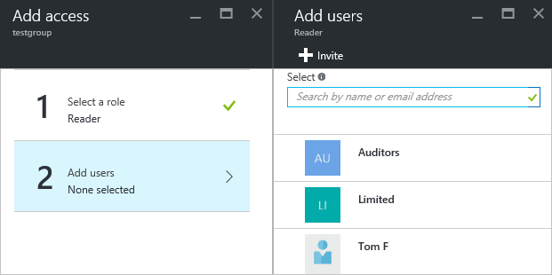

5. To find your application, you must search for it. Start typing the name of your application, and the list of available options will change. Select your application when you see it in the list.

     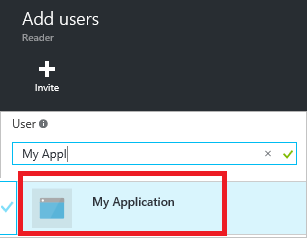

6. Select **Okay** to finish assigning the role. You should now see your application in the list of uses assigned to a role for the resource group.

     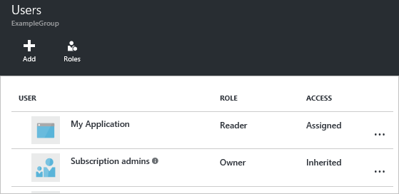

For more information about assigning users and applications to roles through the portal, see [Manage access using the Azure Management Portal](role-based-access-control-configure.md#manage-access-using-the-azure-management-portal).

## Sample applications

The following sample applications show how to log in as the service principal.

**.NET**

- [Deploy an SSH Enabled VM with a Template with .NET](https://azure.microsoft.com/documentation/samples/resource-manager-dotnet-template-deployment/)
- [Manage Azure resources and resource groups with .NET](https://azure.microsoft.com/documentation/samples/resource-manager-dotnet-resources-and-groups/)

**Java**

- [Getting Started with Resources - Deploy Using Azure Resource Manager Template - in Java](https://azure.microsoft.com/documentation/samples/resources-java-deploy-using-arm-template/)
- [Getting Started with Resources - Manage Resource Group - in Java](https://azure.microsoft.com/documentation/samples/resources-java-manage-resource-group//)

**Python**

- [Deploy an SSH Enabled VM with a Template in Python](https://azure.microsoft.com/documentation/samples/resource-manager-python-template-deployment/)
- [Managing Azure Resource and Resource Groups with Python](https://azure.microsoft.com/documentation/samples/resource-manager-python-resources-and-groups/)

**Node.js**

- [Deploy an SSH Enabled VM with a Template in Node.js](https://azure.microsoft.com/documentation/samples/resource-manager-node-template-deployment/)
- [Manage Azure resources and resource groups with Node.js](https://azure.microsoft.com/documentation/samples/resource-manager-node-resources-and-groups/)

**Ruby**

- [Deploy an SSH Enabled VM with a Template in Ruby](https://azure.microsoft.com/documentation/samples/resource-manager-ruby-template-deployment/)
- [Managing Azure Resource and Resource Groups with Ruby](https://azure.microsoft.com/documentation/samples/resource-manager-ruby-resources-and-groups/)

## Next Steps

- To learn about specifying security policies, see [Azure Role-based Access Control](./active-directory/role-based-access-control-configure.md).  
- For a video demonstration of these steps, see [Enabling Programmatic Management of an Azure Resource with Azure Active Directory](https://channel9.msdn.com/Series/Azure-Active-Directory-Videos-Demos/Enabling-Programmatic-Management-of-an-Azure-Resource-with-Azure-Active-Directory).

