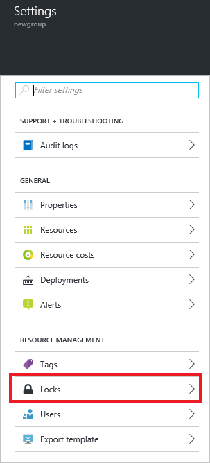
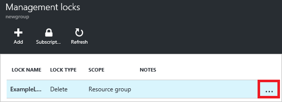

<properties 
	pageTitle="Lock Resources with Resource Manager | Microsoft Azure" 
	description="Prevent users from updating or deleting certain resources by applying a restriction to all users and roles." 
	services="azure-resource-manager" 
	documentationCenter="" 
	authors="tfitzmac" 
	manager="timlt" 
	editor="tysonn"/>

<tags 
	ms.service="azure-resource-manager" 
	ms.workload="multiple" 
	ms.tgt_pltfrm="na" 
	ms.devlang="na" 
	ms.topic="article" 
	ms.date="05/26/2016" 
	ms.author="tomfitz"/>

# Lock resources with Azure Resource Manager

As an administrator, you may need to lock a subscription, resource group or resource to prevent other users in your organization from accidentally deleting or modifying critical resources. 
You can set the lock level to **CanNotDelete** or **ReadOnly**. 

- **CanNotDelete** means authorized users can still read and modify a resource, but they can't delete it. 
- **ReadOnly** means authorized users can read from a resource, but they can't delete it or perform any actions on it. The permission on the resource is restricted to the **Reader** role. Applying **ReadOnly** can lead to unexpected results because some operations that seem like read operations actually require additional actions. For example, placing a **ReadOnly** lock on a storage account will prevent all users from listing the keys. The list keys operation is handled through a POST request because the returned keys are available for write operations. For another example, placing a **ReadOnly** lock on an App Service resource will prevent Visual Studio Server Explorer from being able to display files for the resource because that interaction requires write access.

Unlike role-based access control, you use management locks to apply a restriction across all users and roles. To learn about setting permissions for users and roles, see 
[Azure Role-based Access Control](./active-directory/role-based-access-control-configure.md).

When you apply a lock at a parent scope, all child resources inherit the same lock. The most restrictive lock in the inheritance takes precedence.

## Who can create or delete locks in your organization

To create or delete management locks, you must have access to **Microsoft.Authorization/\*** or **Microsoft.Authorization/locks/\*** actions. Of the built-in roles, only **Owner** and **User Access Administrator** are granted those actions.

## Creating a lock through the portal

1. In the Settings blade for the resource, resource group, or subscription that you wish to lock, select **Locks**.

      

2. To add a lock, select **Add**. If you want to instead create a lock at a parent level which will be inherited by the currently selected resource, select the parent (such as subscription shown below).

       

3. Give the lock a name and lock level. Optionally, you can add notes that describe why the lock is needed.

       

4. To delete the lock, select the ellipsis and **Delete** from the available options.

       

## Creating a lock in a template

The example below shows a template that creates a lock on a storage account. The storage account on which to apply the lock is provided as a parameter. The name of the lock is created by concatenating the resource name with **/Microsoft.Authorization/** and the name of the lock, in this case **myLock**.

The type provided is specific to the resource type. For storage, this type is "Microsoft.Storage/storageaccounts/providers/locks".

    {
      "$schema": "https://schema.management.azure.com/schemas/2015-01-01/deploymentTemplate.json#",
      "contentVersion": "1.0.0.0",
      "parameters": {
        "lockedResource": {
          "type": "string"
        }
      },
      "resources": [
        {
          "name": "[concat(parameters('lockedResource'), '/Microsoft.Authorization/myLock')]",
          "type": "Microsoft.Storage/storageAccounts/providers/locks",
          "apiVersion": "2015-01-01",
          "properties": {
            "level": "CannotDelete"
          }
        }
      ]
    }

## Creating a lock with REST API

You can lock deployed resources with the [REST API for management locks](https://msdn.microsoft.com/library/azure/mt204563.aspx). The REST API enables you to create and delete locks, and 
retrieve information about existing locks.

To create a lock, run:

    PUT https://management.azure.com/{scope}/providers/Microsoft.Authorization/locks/{lock-name}?api-version={api-version}

The scope could be a subscription, resource group or resource. The lock-name is whatever you want to call the lock. For api-version, use **2015-01-01**.

In the request, include a JSON object that specifies the properties for the lock.

    {
      "properties": {
        "level": "CanNotDelete",
        "notes": "Optional text notes."
      }
    } 

For examples, see [REST API for management locks](https://msdn.microsoft.com/library/azure/mt204563.aspx).

## Creating a lock with Azure PowerShell

You can lock deployed resources with Azure PowerShell by using the **New-AzureRmResourceLock** as shown below.

    New-AzureRmResourceLock -LockLevel CanNotDelete -LockName LockSite -ResourceName examplesite -ResourceType Microsoft.Web/sites -ResourceGroupName exampleresourcegroup

Azure PowerShell provides other commands for working locks, such as **Set-AzureRmResourceLock** to update a lock and **Remove-AzureRmResourceLock** to delete a lock.

## Next steps

- For more information about working with resource locks, see [Lock Down Your Azure Resources](http://blogs.msdn.com/b/cloud_solution_architect/archive/2015/06/18/lock-down-your-azure-resources.aspx)
- To learn about logically organizing your resources, see [Using tags to organize your resources](resource-group-using-tags.md)
- To change which resource group a resource resides in, see [Move resources to new resource group](resource-group-move-resources.md)
- You can apply restrictions and conventions across your subscription with customized policies. For more information, see [Use Policy to manage resources and control access](resource-manager-policy.md).
