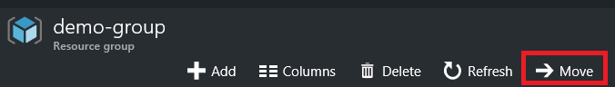

<properties 
	pageTitle="Move resources to new resource group | Microsoft Azure" 
	description="Use Azure Resource Manager to move resources to a new resource group or subscription." 
	services="azure-resource-manager" 
	documentationCenter="" 
	authors="tfitzmac" 
	manager="timlt" 
	editor="tysonn"/>

<tags 
	ms.service="azure-resource-manager" 
	ms.workload="multiple" 
	ms.tgt_pltfrm="na" 
	ms.devlang="na" 
	ms.topic="article" 
	ms.date="09/12/2016" 
	ms.author="tomfitz"/>

# Move resources to new resource group or subscription

This topic shows how to move resources from one resource group to another resource group. You can also move resources to a new subscription (however the subscription must exist within the same [tenant](./active-directory/active-directory-howto-tenant.md)). You may need to move resources when you decide that:

1. For billing purposes, a resource needs to live in a different subscription.
2. A resource no longer shares the same lifecycle as the resources it was previously grouped with. You want to move it to a new resource group so you can manage that resource separately from the other resources.

When moving resources, both the source group and the target group are locked during the operation. Write and delete operations are blocked on the groups until the move completes.

You cannot change the location of the resource. Moving a resource only moves it to a new resource group. The new resource group may have a different location, but that does not change the location of the resource.

> [AZURE.NOTE] This article describes how to move resources within an existing Azure account offering. If you actually want to change your Azure account offering (such as upgrading from pay-as-you-go to pre-pay) while continuing to work with your existing resources, see [Switch your Azure subscription to another offer](billing-how-to-switch-azure-offer.md). 

## Checklist before moving resources

There are some important steps to perform before moving a resource. By verifying these conditions, you can avoid errors.

1. The service must support the ability to move resources. See the list below for information about which [services support moving resources](#services-that-support-move).
2. The destination subscription must be registered for the resource provider of the resource being moved. If not, you receive an error stating that the **subscription is not registered for a resource type**. You might encounter this problem when moving a resource to a new subscription, but that subscription has never been used 
with that resource type. To learn how to 
check the registration status and register resource providers, see [Resource providers and types](../resource-manager-supported-services.md#resource-providers-and-types).
3. If you are using Azure PowerShell or Azure CLI, use the latest version. To update your version, run the Microsoft Web Platform Installer and check if a 
new version is available. For more information, see [How to install and configure Azure PowerShell](powershell-install-configure.md) and [Install the Azure CLI](xplat-cli-install.md).
4. If you are moving App Service app, you have reviewed [App Service limitations](#app-service-limitations).
5. If you are moving resources deployed through classic model, you have reviewed [Classic deployment limitations](#classic-deployment-limitations).

## Services that support move

For now, the services that support moving to both a new resource group and subscription are:

- API Management
- App Service apps (web apps) - see [App Service limitations](#app-service-limitations)
- Automation
- Batch
- CDN
- Cloud Services - see [Classic deployment limitations](#classic-deployment-limitations)
- Data Factory
- DNS
- DocumentDB
- HDInsight clusters
- IoT Hubs
- Key Vault
- Media Services
- Mobile Engagement
- Notification Hubs
- Operational Insights
- Redis Cache
- Scheduler
- Search
- Service Bus
- Storage
- Storage (classic) - see [Classic deployment limitations](#classic-deployment-limitations)
- SQL Database server - The database and server must reside in the same resource group. When you move a SQL server, all of its databases are also moved.
- Virtual Machines
- Virtual Machines (classic) - see [Classic deployment limitations](#classic-deployment-limitations)
- Virtual Networks

## Services that do not support move

The services that currently do not support moving a resource are:

- Application Gateway
- Application Insights
- Express Route
- Recovery Services vault - also do not move the Compute, Network, and Storage resources associated with the Recovery Services vault, see [Recovery Services limitations](#recovery-services-limitations).
- Virtual Machines Scale Sets
- Virtual Networks (classic) - see [Classic deployment limitations](#classic-deployment-limitations)
- VPN Gateway

## App Service limitations

When working with App Service apps, you cannot move only an App Service plan. To move App Service apps, your options are:

- Move the App Service plan and all other App Service resources in that resource group to a new resource group that does not already have App Service resources. This requirement means you must move even the App Service resources that are not associated with the App Service plan. 
- Move the apps to a different resource group, but keep all App Service plans in the original resource group.

If your original resource group also includes an Application Insights resource, you cannot move that resource because Application Insights does not currently support the move operation. If you include the Application Insights resource when moving App Service apps, the entire move operation fails. However, the Application Insights and App Service plan do not need to reside in the same resource group as the app for the app to function correctly.

For example, if your resource group contains:

- **web-a** which is associated with **plan-a** and **app-insights-a**
- **web-b** which is associated with **plan-b** and **app-insights-b**

Your options are:

- Move **web-a**, **plan-a**, **web-b**, and **plan-b**
- Move **web-a** and **web-b**
- Move **web-a**
- Move **web-b**

All other combinations involve either moving a resource type that can't move (Application Insights) or leaving behind a resource type that can't be left behind when moving an App Service plan (any type of App Service resource).

If your web app resides in a different resource group than its App Service plan but you want to move both to a new resource group, you must perform the move in two steps. For example:

- **web-a** resides in **web-group**
- **plan-a** resides in **plan-group**
- You want **web-a** and **plan-a** to reside in **combined-group**

To accomplish this move, perform two separate move operations in the following sequence:

1. Move the **web-a** to **plan-group**
2. Move **web-a** and **plan-a** to **combined-group**.

## Recovery Services limitations

Move is not supported for Storage, Network, or Compute resources used to set up disaster recovery with Azure Site Recovery. 

For example, suppose you have set up replication of your on-premises machines to a storage account (Storage1) and want the protected machine to come up after failover to Azure as a virtual machine (VM1) attached to a virtual network (Network1). You cannot move any of these Azure resources - Storage1, VM1, and Network1 - across resource groups within the same subscription or across subscriptions.

## Classic deployment limitations

The options for moving resources deployed through the classic model differ based on whether you are moving the resources within a subscription or to a new subscription. 

When moving resources from one resource group to another resource group **within the same subscription**, the following restrictions apply:

- Virtual networks (classic) cannot be moved.
- Virtual machines (classic) must be moved with the cloud service. 
- Cloud service can only be moved when the move includes all its virtual machines.
- Only one cloud service can be moved at a time.
- Only one storage account (classic) can be moved at a time.
- Storage account (classic) cannot be moved in the same operation with a virtual machine or a cloud service.

When moving resources to a **new subscription**, the following restrictions apply:

- All classic resources in the subscription must be moved in the same operation.
- The target subscription must not contain any other classic resources.
- The move can only be requested through a separate REST API for classic moves. The standard Resource Manager move commands do not work when moving classic resources to a new subscription.

To move classic resources to a new resource group **within the same subscription**, use the [portal](#use-portal), [Azure PowerShell](#use-powershell), [Azure CLI](#use-azure-cli), or [REST API](#use-rest-api).

To move **classic resources to a new subscription**, you must use REST operations that are specific to classic resources. To check if a subscription can participate as the source or target subscription in a cross-subscription move of classic resources, use the following operation:

    POST https://management.azure.com/subscriptions/{subscriptionId}/providers/Microsoft.ClassicCompute/validateSubscriptionMoveAvailability?api-version=2016-04-01
    
For the source subscription, use request body:

    {
        "role": "source"
    }

For the target subscription, use request body:

    {
        "role": "target"
    }

The response for either validation operation is:

    {
        "status": "{status}",
        "reasons": [
            "reason1",
            "reason2"
        ]
    }

To move all classic resources from one subscription to another subscription, use the following operation:

    POST https://management.azure.com/subscriptions/{subscription-id}/providers/Microsoft.ClassicCompute/moveSubscriptionResources?api-version=2016-04-01

With request body:

    {
        "target": "/subscriptions/{target-subscription-id}"
    }

## Use portal

To move resources to a new resource group in the **same subscription**, select the resource group containing those resources, and then select the **Move** button.

To move resources to a **new subscription**, select the resource group containing those resources, and then select the edit subscription icon.

Select the resources to move and the destination resource group. Acknowledge that you need to update scripts for these resources and select **OK**. If you selected the edit subscription icon in the previous step, you must also select the destination subscription.

In **Notifications**, you see that the move operation is running.

When it has completed, you are notified of the result.

## Use PowerShell

To move existing resources to another resource group or subscription, use the **Move-AzureRmResource** command.

The first example shows how to move one resource to a new resource group.

    $resource = Get-AzureRmResource -ResourceName ExampleApp -ResourceGroupName OldRG
    Move-AzureRmResource -DestinationResourceGroupName NewRG -ResourceId $resource.ResourceId

The second example shows how to move multiple resources to a new resource group.

    $webapp = Get-AzureRmResource -ResourceGroupName OldRG -ResourceName ExampleSite
    $plan = Get-AzureRmResource -ResourceGroupName OldRG -ResourceName ExamplePlan
    Move-AzureRmResource -DestinationResourceGroupName NewRG -ResourceId $webapp.ResourceId, $plan.ResourceId

To move to a new subscription, include a value for the **DestinationSubscriptionId** parameter.

You are asked to confirm that you want to move the specified resources.

    Confirm
    Are you sure you want to move these resources to the resource group
    '/subscriptions/{guid}/resourceGroups/newRG' the resources:

    /subscriptions/{guid}/resourceGroups/destinationgroup/providers/Microsoft.Web/serverFarms/exampleplan
    /subscriptions/{guid}/resourceGroups/destinationgroup/providers/Microsoft.Web/sites/examplesite
    [Y] Yes  [N] No  [S] Suspend  [?] Help (default is "Y"): y

## Use Azure CLI

To move existing resources to another resource group or subscription, use the **azure resource move** command. The following example shows how to move a Redis Cache to a new resource group. In the **-i** parameter, provide a comma-separated list of the resource id's to move.

    azure resource move -i "/subscriptions/{guid}/resourceGroups/OldRG/providers/Microsoft.Cache/Redis/examplecache" -d "NewRG"
	
You are asked to confirm that you want to move the specified resource.
	
    info:    Executing command resource move
    Move selected resources in OldRG to NewRG? [y/n] y
    + Moving selected resources to NewRG
    info:    resource move command OK

## Use REST API

To move existing resources to another resource group or subscription, run:

    POST https://management.azure.com/subscriptions/{source-subscription-id}/resourcegroups/{source-resource-group-name}/moveResources?api-version={api-version} 

In the request body, you specify the target resource group and the resources to move. For more information about the move REST operation, see [Move resources](https://msdn.microsoft.com/library/azure/mt218710.aspx).

## Next steps
- To learn about PowerShell cmdlets for managing your subscription, see [Using Azure PowerShell with Resource Manager](powershell-azure-resource-manager.md).
- To learn about Azure CLI commands for managing your subscription, see [Using the Azure CLI with Resource Manager](xplat-cli-azure-resource-manager.md).
- To learn about portal features for managing your subscription, see [Using the Azure portal to manage resources](./azure-portal/resource-group-portal.md).
- To learn about applying a logical organization to your resources, see [Using tags to organize your resources](resource-group-using-tags.md).
