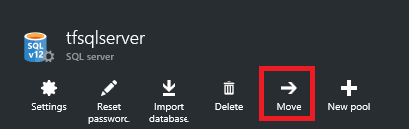
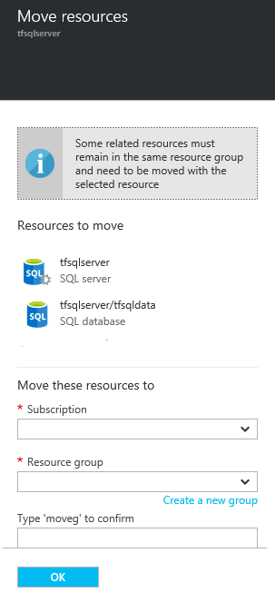

<properties 
	pageTitle="Move Resources to New Resource Group" 
	description="Use Azure PowerShell or REST API to move resources to a new resource group for Azure Resource Manager." 
	services="azure-resource-manager" 
	documentationCenter="" 
	authors="tfitzmac" 
	manager="timlt" 
	editor="tysonn"/>

<tags 
	ms.service="azure-resource-manager" 
	ms.workload="multiple" 
	ms.tgt_pltfrm="na" 
	ms.devlang="na" 
	ms.topic="article" 
	ms.date="04/27/2016" 
	ms.author="tomfitz"/>

# Move resources to new resource group or subscription

This topic shows how to move resources from one resource group to another resource group. You can also move resources to a new subscription (however the subscription must exist within the same [tenant](./active-directory/active-directory-howto-tenant.md)). You may need to move resources when you decide that:

1. For billing purposes, a resource needs to live in a different subscription.
2. A resource no longer shares the same lifecycle as the resources it was previously grouped with. You want to move it to a new resource group so you can manage that resource separately from the other resources.
3. A resource now shares the same lifecycle as other resources in a different resource group. You want to move it to the resource group with the other resources so you can manage them together.

When moving resources, both the source group and the target group are locked for the duration of the operation. Write and delete operations are blocked on the groups until the move completes.

You cannot change the location of the resource. Moving a resource only moves it to a new resource group. The new resource group may have a different location, but that does not change the location of the resource.

## Checklist before moving resources

There are some important steps to perform before moving a resource. By verifying these conditions you can avoid errors.

1. The service must support the ability to move resources. See the list below for information about which [services support moving resources](#services-that-support-move).
2. The destination subscription must be registered for the resource provider of the resource being moved. If not, you will receive an error stating that the **subscription is not registered for a resource type**. You might encounter this problem when moving a resource to a new subscription, but that subscription has never been used 
with that resource type. To learn how to 
check the registration status and register resource providers, see [Resource providers and types](../resource-manager-supported-services/#resource-providers-and-types).
3. If you are using Azure PowerShell or Azure CLI, use the latest version. To update your version, run the Microsoft Web Platform Installer and check if a 
new version is available. For more information, see [How to install and configure Azure PowerShell](powershell-install-configure.md) and [Install the Azure CLI](xplat-cli-install.md).
4. If you are moving App Service app, you have reviewed [App Service limitations](#app-service-limitations).

## Services that support move

For now, the services that support moving to both a new resource group and subscription are:

- API Management
- App Service apps (see [App Service limitations](#app-service-limitations) below)
- Automation
- Batch
- CDN
- Data Factory
- DocumentDB
- HDInsight clusters
- Key Vault
- Mobile Engagement
- Notification Hubs
- Operational Insights
- Redis Cache
- Search
- SQL Database server (see [SQL Database limitations](#sql-database-limitations) below)

## Services that partially support move

The services that support moving to a new resource group but not a new subscription are:

- Cloud Services
- Storage (classic)
- Virtual Machines (classic)
- Virtual Networks

## Services that do not support move

The services that currently do not support moving a resource are:

- Application Insights
- Express Route
- Storage
- Virtual Machines

## App Service limitations

When working with App Service apps, you cannot move only an App Service plan. To move App Service apps, your options are:

- Move all of the resources from one resource group to a different resource group, if the destination resource group does not already have Microsoft.Web resources.
- Move the web apps to a different resource group, but keep the App Service plan in the original resource group.

## SQL Database limitations

You cannot move a SQL database separately from its server. The database and server must reside in the same resource group. When you move a SQL server, all of its databases are also moved. 

## Using PowerShell to move resources

To move existing resources to another resource group or subscription, use the **Move-AzureRmResource** command.

The first example shows how to move one resource to a new resource group.

    $resource = Get-AzureRmResource -ResourceName ExampleApp -ResourceGroupName OldRG
    Move-AzureRmResource -DestinationResourceGroupName NewRG -ResourceId $resource.ResourceId

The second example shows how to move multiple resources to a new resource group.

    $webapp = Get-AzureRmResource -ResourceGroupName OldRG -ResourceName ExampleSite
    $plan = Get-AzureRmResource -ResourceGroupName OldRG -ResourceName ExamplePlan
    Move-AzureRmResource -DestinationResourceGroupName NewRG -ResourceId $webapp.ResourceId, $plan.ResourceId

To move to a new subscription, include a value for the **DestinationSubscriptionId** parameter.

## Using Azure CLI to move resources

To move existing resources to another resource group or subscription, use the **azure resource move** command. The following example shows how to move a Redis Cache to a new resource group. In the **-i** parameter, provide a comma-separated list of the resource id's to move.

    azure resource move -i "/subscriptions/{guid}/resourceGroups/OldRG/providers/Microsoft.Cache/Redis/examplecache" -d "NewRG"
    info:    Executing command resource move
    Move selected resources in OldRG to NewRG? [y/n] y
    + Moving selected resources to NewRG
    info:    resource move command OK

## Using REST API to move resources

To move existing resources to another resource group or subscription, run:

    POST https://management.azure.com/subscriptions/{source-subscription-id}/resourcegroups/{source-resource-group-name}/moveResources?api-version={api-version} 

In the request body, you specify the target resource group and the resources to move. For more information about the move REST operation, see [Move resources](https://msdn.microsoft.com/library/azure/mt218710.aspx).

## Using portal to move resources

You can move some resources through the portal; however, not all resource providers that support the move operation provide that functionality through the portal. 

To move a resource, select the resource and then select the **Move** button.

You specify where you would like to move the resource. If other resources must be moved with the resource, they are listed.

## Next steps
- To learn about PowerShell cmdlets for managing your subscription, see [Using Azure PowerShell with Resource Manager](powershell-azure-resource-manager.md).
- To learn about Azure CLI commands for managing your subscription, see [Using the Azure CLI with Resource Manager](xplat-cli-azure-resource-manager.md).
- To learn about portal features for managing your subscription, see [Using the Azure Portal to manage resources](./azure-portal/resource-group-portal.md).
- To learn about applying a logical organization to your resources, see [Using tags to organize your resources](resource-group-using-tags.md).
