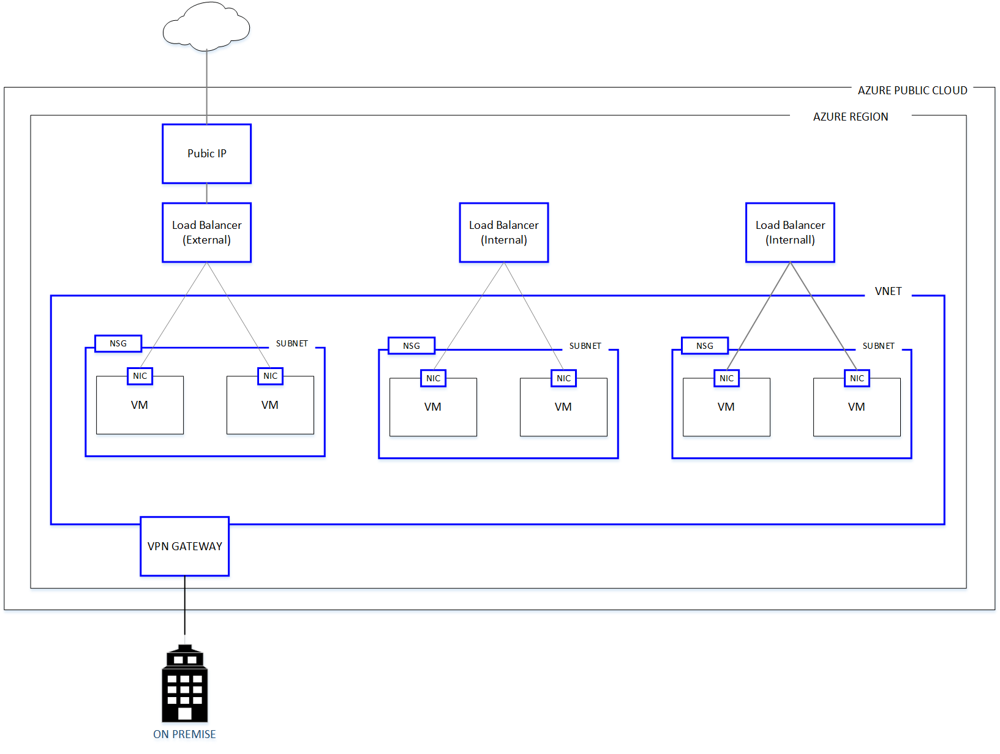
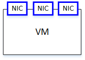
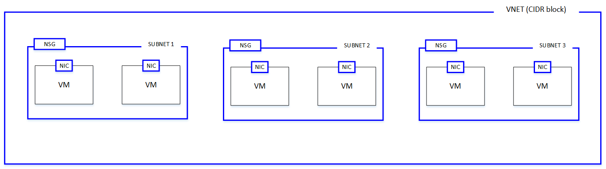
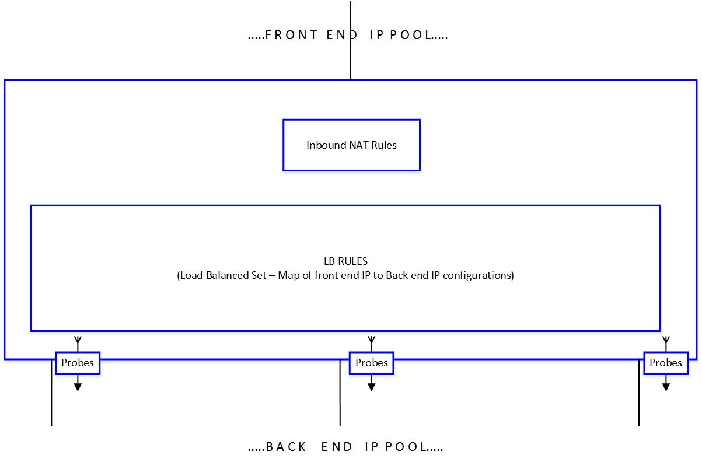

<properties 
   pageTitle="Network Resource Provider"
   description="Network Resource Provider"
   services="azure-portal"
   documentationCenter="na"
   authors="telmosampaio"
   manager="adinah"
   editor="tysonn" />
<tags 
   ms.service="azure-portal"
   ms.devlang="na"
   ms.topic="article"
   ms.tgt_pltfrm="na"
   ms.workload="infrastructure-services"
   ms.date="04/22/2015"
   ms.author="telmos" />

# Network Resource Provider
An underpinning need in today’s business success, is the ability to build and manage large scale network aware applications in an agile, flexible, secure and repeatable way. Azure Resource Manager (ARM) enables you to create such applications, as a single collection of resources in resource groups. Such resources are managed through various resource providers under ARM. 

Azure Resource Manager (ARM) enables you to create such applications and the associated collection of network resources as a single collection of resources in a resource group. The application and the network resources run as a single unit in an ARM resource group. 

You can manage networking resources by using any of the following management interfaces:

- REST based API
- PowerShell
- .NET SDK
- Node.JS SDK
- Java SDK
- Azure CLI
- Azure Portal
- ARM template language

With the introduction of Network Resource Providers, you can take advantage of the following benefits:

- **Metadata** – you can add information to resources using tags. These tags can be used to track resource utilization across resource groups and subscriptions.
- **Greater control of your network** - network resources are loosely coupled and you can control them in a more granular fashion. This means you have more flexibility in managing the networking resources.
- **Faster configuration** - because network resources are loosely coupled, you can create and orchestrate network resources in parallel. This has drastically reduced configuration time.
- **Role Based Access Control** - RBAC provides default roles, with specific security scope, in addition to allowing the creation of custom roles for secure management. 
- **Easier management and deployment** - it’s easier to deploy and manage applications since you can can create an entire application stack as a single collection of resources in a resource group. And faster to deploy, since you can deploy by simply providing a template JSON payload.
- **Rapid customization** - you can use declarative-style templates to enable repeatable and rapid customization of deployments. 
- **Repeatable customization** - you can use declarative-style templates to enable repeatable and rapid customization of deployments.

## Network resources 
You can now manage network resources independently, instead of having them all managed through a single compute resource (a virtual machine). This ensures a higher degree of flexibility and agility in composing a complex and large scale infrastructure in a resource group.
 
The diagram below illustrates a high-level view of the network resource model and its associations. Top level resources are colored with a blue outline. In addition to top level resources, you can see child resources colored with a gray outline. You can manage each resource individually. 

A conceptual view of a sample deployment involving a multi-tiered application is presented below. All network resources are colored with a blue outline. 

## REST API 
As mentioned earlier, network resources can be managed via a variety of interfaces, including REST API,.NET SDK, Node.JS SDK, Java SDK, PowerShell, CLI, Azure Portal and templates. 

The Rest API’s conform to the HTTP 1.1 protocol specification. The general URI structure of the API is presented below: 

	https://management.azure.com/subscriptions/{subscription-id}/providers/{resource-provider-namespace}/locations/{region-location}/register?api-version={api-version}

And the parameters in braces represent the following elements:

- **subscription-id** - your Azure subscription id.
- **resource-provider-namespace** - namespace for the provider being used. THe value for the network resource provider is *Microsoft.Network*.
- **region-name** - the Azure region name

The following HTTP methods are supported when making calls to the REST API:

- **PUT** - used to create a resource of a given type, modify a resource property or change an association between resources. 
- **GET** - used to retrieve information for a provisioned resource.
- **DELETE** - used to delete an existing resource.

Both the request and response conform to a JSON payload format. For more details, see [Azure Resource Management APIs](https://msdn.microsoft.com/library/azure/dn948464.aspx).

## ARM template language
In addition to managing resources imperatively (via APIs or SDK), you can also use a declarative programming style to build and manage network resources by using the ARM Template Language. 

A sample representation of a template is provided below – 

	{
	  "$schema": "http://schema.management.azure.com/schemas/2014-04-01-preview/deploymentTemplate.json",
	  "contentVersion": "<version-number-of-template>",
	  "parameters": { <parameter-definitions-of-template> },
	  "variables": { <variable-definitions-of-template> },
	  "resources": [ { <definition-of-resource-to-deploy> } ],
	  "outputs": { <output-of-template> }    
	}

The template is primarily a JSON description of the resources and the instance values injected via parameters. The example below can be used to create a virtual network with 2 subnets.

	{
	    "$schema": "http://schema.management.azure.com/schemas/2014-04-01-preview/VNET.json",
	    "contentVersion": "1.0.0.0",
	    "parameters" : {
	      "location": {
	        "type": "String",
	        "allowedValues": ["East US", "West US", "West Europe", "East Asia", "South East Asia"],
	        "metadata" : {
	          "Description" : "Deployment location"
	        }
	      },
	      "virtualNetworkName":{
	        "type" : "string",
	        "defaultValue":"myVNET",
	        "metadata" : {
	          "Description" : "VNET name"
	        }
	      },
	      "addressPrefix":{
	        "type" : "string",
	        "defaultValue" : "10.0.0.0/16",
	        "metadata" : {
	          "Description" : "Address prefix"
	        }
	
	      },
	      "subnet1Name": {
	        "type" : "string",
	        "defaultValue" : "Subnet-1",
	        "metadata" : {
	          "Description" : "Subnet 1 Name"
	        }
	      },
	      "subnet2Name": {
	        "type" : "string",
	        "defaultValue" : "Subnet-2",
	        "metadata" : {
	          "Description" : "Subnet 2 name"
	        }
	      },
	      "subnet1Prefix" : {
	        "type" : "string",
	        "defaultValue" : "10.0.0.0/24",
	        "metadata" : {
	          "Description" : "Subnet 1 Prefix"
	        }
	      },
	      "subnet2Prefix" : {
	        "type" : "string",
	        "defaultValue" : "10.0.1.0/24",
	        "metadata" : {
	          "Description" : "Subnet 2 Prefix"
	        }
	      }
	    },
	    "resources": [
	    {
	      "apiVersion": "2015-05-01-preview",
	      "type": "Microsoft.Network/virtualNetworks",
	      "name": "[parameters('virtualNetworkName')]",
	      "location": "[parameters('location')]",
	      "properties": {
	        "addressSpace": {
	          "addressPrefixes": [
	            "[parameters('addressPrefix')]"
	          ]
	        },
	        "subnets": [
	          {
	            "name": "[parameters('subnet1Name')]",
	            "properties" : {
	              "addressPrefix": "[parameters('subnet1Prefix')]"
	            }
	          },
	          {
	            "name": "[parameters('subnet2Name')]",
	            "properties" : {
	              "addressPrefix": "[parameters('subnet2Prefix')]"
	            }
	          }
	        ]
	      }
	    }
	    ]
	}

You have the option of providing the parameter values manually when using a template, or you can use a parameter file. The example below shows a possible set of parameter values to be used with the template above:

	{
	  "location": {
	      "value": "East US"
	  },
	  "virtualNetworkName": {
	      "value": "VNET1"
	  },
	  "subnet1Name": {
	      "value": "Subnet1"
	  },
	  "subnet2Name": {
	      "value": "Subnet2"
	  },
	  "addressPrefix": {
	      "value": "192.168.0.0/16"
	  },
	  "subnet1Prefix": {
	      "value": "192.168.1.0/24"
	  },
	  "subnet2Prefix": {
	      "value": "192.168.2.0/24"
	  }
	}

The main advantages of using templates are:

- You can build a complex infrastructure in a resource group in a declarative style. The orchestration of creating the resources, including dependency management, is handled by ARM. 
- The infrastructure can be created in a repeatable way across various regions and within a region by simply changing parameters. 
- The declarative style leads to shorter lead time in building the templates and rolling out the infrastructure. 

For sample templates, see [Azure quickstart templates](https://github.com/Azure/azure-quickstart-templates).

For more information on the ARM Template Language, see [Azure Resource Manager Template Language](https://msdn.microsoft.com/library/azure/dn835138.aspx).

The sample template above uses the virtual network and subnet resources. There are other network resources you can use as listed below:

## NIC
Network Interface Card, or NIC, represents a network interface that can be associated to a virtual machine (VM). A VM can have one or more NICs.

Key properties of a NIC resource include:

- IP settings

A NIC can also be associated with the following network resources:

- Network Security Group (NSG) 
- Load balancer

## Virtual Network and Subnet
Virtual Networks (VNET) and subnets help define a security boundary for workloads running in Azure. A VNET is characterized by an address space, also referred to as CIDR block. 

A subnet is a child resource of a VNET, and helps define segments of address spaces within a CIDR block, using IP address prefixes. VMs that execute various workloads essentially operate in a subnet boundary. 

Key properties of a VNET resource include:

- IP address space (CIDR block) 
- VNET name
- subnets

A VNET can also be associated with the following network resources:

- VPN Gateway

Key properties of a subnet include:

- IP address prefix
- Subnet name

A subnet can also be associated with the following network resources:

- NSG

## Load Balancer
A load balancer is used when you want to scale your applications. Typical deployment scenarios involve applications running on multiple VM instances. The VM instances are fronted by a load balancer that helps to distribute network traffic to the various instances. 

Load balancers contain the following child resources:

- **Front end IP configuration** – a Load balancer can include one or more front end IP addresses, otherwise known as a virtual IPs (VIPs). These IP addresses serve as ingress for the traffic. 
- **Backend address pool** – these are IP addresses associated with the VM NICs to which load will be distributed.
- **Load balancing rules** – a rule property maps a given front end IP and port combination to a set of back end IP addresses and port combination. With a single definition of a load balancer resource, you can define multiple load balancing rules, each rule reflecting a combination of a front end IP and port and back end IP and port associated with VMs. 
- **Probes** – probes enable you to keep track of the health of VM instances. If a health probe fails, the VM instance will be taken out of rotation automatically.
- **Inbound NAT rules** – NAT rules defining the inbound traffic flowing through the front end IP and distributed to the back end IP.

## Public IP
A public IP address resource provides either a reserved or dynamic public IP address.  
A Public IP address can be assigned to a load balancer, NAT, or associated with a private IP address on a NIC of a VM.  

Key properties of a public IP resource include:

- **IP allocation method** – reserved or dynamic. 

## Network Security Group (NSG)
An NSG resource enables the creation of security boundary for workloads, by implementing allow and deny rules. Such rules can be applied at the NIC level (VM instance level) or at the subnet level (group of VMs).

Key properties of NSG resource include:

- **Security rule** - An NSG can have multiple security rules defined. Each rule can allow or deny different types of traffic.

## Security Rule
A security rule is a child resource of an NSG. 

Key properties of a Security rule include: 

- **Protocol** – network protocol this rule applies to.
- **Source Port Range** - source port, or range from, 0 to 65535.  A wildcard can be used to match all ports. 
- **Destination Port Range** - Destination port, or range, from 0 to 65535.  A wildcard can be used to match all ports.
- **Source Address Prefix** – source IP address range. 
- **Destination Address Prefix** – destination IP address range.
- **Access** – *Allow* or *Deny* traffic.
- **Priority** – a value between 100 and 4096. The priority number must be unique for each rule in collection of security rules. The lower the priority number, the higher the priority of the rule.
- **Direction** – specifies if the rule will be applied to traffic in the *Inbound* or *Outbound* direction. 

## VPN Gateway 
A VPN gateway resource enables you to create a secure connection between their on-premises data center and Azure. A VPN gateway resource can be configured in three different ways:
 
- **Point to Site** – you can securely access your Azure resources hosted in a VNET by using a VPN client from any computer. 
- **Multi-site connection** – you can securely connect from your on-premises data centers to resources running in a VNET. 
- **VNET to VNET** – you can securely connect across Azure VNETS within the same region, or across regions to build workloads with geo-redundancy.

Key properties of a VPN gateway include:
 
- **Gateway type** - dynamically routed or a static routed gateway. 
- **VPN Client Address Pool Prefix** – IP addresses to be assigned to clients connecting in a point to site configuration.

## Traffic Manager Profile
Traffic manager and its child endpoint resource enable distribution of your traffic to endpoints in Azure and outside of Azure. Such traffic distribution is governed by policies. Traffic manager also allows endpoint health to be monitored, and traffic diverted appropriately based on the health of an endpoint. 

Key properties of a traffic manager profile include:

- **Traffic routing method** - possible values are *Performance*, *Weighted*, and *Priority*.
- **DNS configuration** - FQDN for the profile.
- **Protocol** - monitoring protocol, possible values are *HTTP* and *HTTPS*.
- **Port** - monitoring port. 
- **Path** - monitoring path.
- **Endpoints** - container for endpoint resources.

## Endpoint 
An endpoint is a child resource of a Traffic Manager Profile. It represents a service or web endpoint to which user traffic is distributed based on the configured policy in the Traffic Manager Profile resource. 

Key properties of an endpoint include:
 
- **Type** - the type of the endpoint, possible values are *Azure End point*, *External Endpoint*, and  *Nested Endpoint*. 
- **Target Resource ID** – public IP address of a service or web endpoint. This can be an Azure or external endpoint.
- **Weight** - endpoint weight used in traffic management. 
- **Priority** - priority of the endpoint, used to define a failover action. 

## Using a template

You can deploy services to Azure from a template by using PowerShell, AzureCLI, or by performing a click to deploy from GitHub. To deploy services from a template in GitHub, execute the following steps:

1. Open the template3 file from GitHub. As an example, open [Virtual network with two subnets](https://github.com/Azure/azure-quickstart-templates/tree/master/101-virtual-network).
2. Click on **Deploy to Azure**, and then sign in on to the Azure portal with your credentials.
3. Verify the template, and then click **Save**.
4. Click **Edit parameters** and select a location, such as *West US*, for the vnet and subnets.
5. If necessary, change the **ADDRESSPREFIX** and **SUBNETPREFIX** parameters, and then click **OK**.
6. Click **Select a resource group** and then click on the resource group you want to add the vnet and subnets to. Alternatively, you can create a new resource group by clicking **Or create new**.
3. Click **Create**. Notice the tile displaying **Provisioning Template deployment**. Once the deployment is done, you will see a screen similar to one below.

## See Also

[Azure Networking API reference](https://msdn.microsoft.com/library/azure/dn948464.aspx)

[Azure PowerShell reference for networking](https://msdn.microsoft.com/library/azure/mt163510.aspx)

[Azure Resource Manager Template Language](https://msdn.microsoft.com/library/azure/dn835138.aspx)

[Azure Networking – commonly used templates](https://github.com/Azure/azure-quickstart-templates)

[Compute Resource Provider](../virtual-machines-azurerm-versus-azuresm)

[Azure Resource Manager Overview](../resource-group-overview)

[Role based access control in Azure Resource Manager](https://msdn.microsoft.com/library/azure/dn906885.aspx) 

[Using Tags in Azure Resource Manager](https://msdn.microsoft.com/library/azure/dn848368.aspx)

[Template deployments](https://msdn.microsoft.com/library/azure/dn790549.aspx)