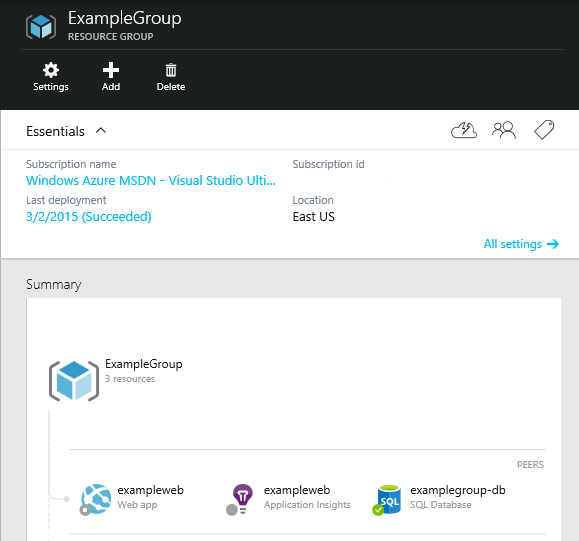
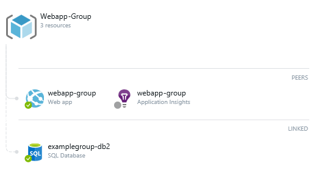
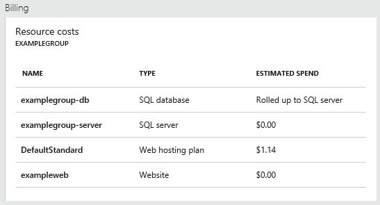
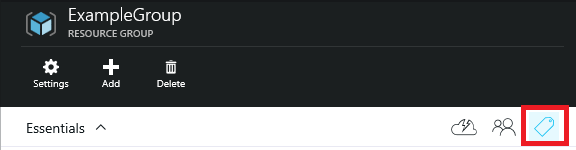
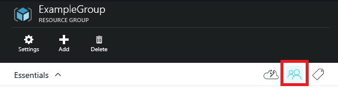

<properties
   pageTitle="Azure Resource Manager Overview"
   description="Describes how to use Azure Resource Manager for deployment, management, and access control of resources on Azure."
   services="azure-portal"
   documentationCenter="na"
   authors="tfitzmac"
   manager="wpickett"
   editor=""/>

<tags
   ms.service="azure-portal"
   ms.devlang="na"
   ms.topic="article"
   ms.tgt_pltfrm="na"
   ms.workload="na"
   ms.date="04/29/2015"
   ms.author="tomfitz"/>

# Azure Resource Manager Overview 

Applications are typically made up of many components – maybe a web app, database, database server, storage, and 3rd party services. You do not see these components as separate entities, instead you see them as related and interdependent parts of a single entity. You want to deploy, manage, and monitor them as a group. Azure Resource Manager enables you to work with the resources in your application as a group. You can deploy, update or delete all of the resources for your application in a single, coordinated operation. You use a template for deployment and that template can work for different environments such as testing, staging and production. You can clarify billing for your organization by viewing the rolled-up costs for the entire group.  

Azure Resource Manager natively integrates access control into the management platform so you can specify which actions a user in your organization can take for a resource group.  

> [AZURE.NOTE] This topic describes resources, groups, and templates using the preview portal to demonstrate the concepts. However, you can also create, manage, and delete Azure resources using the [Azure CLI for Mac, Linux, and Windows](xplat-cli-azure-resource-manager.md) as well as [PowerShell](powershell-azure-resource-manager.md).

## Resource Groups

A resource group is a container that holds related resources for an application. The resource group could include all of the resources for an application, or only those resources that are logically grouped together. You can decide how you want to allocate resources to resource groups based on what makes the most sense for your organization.

There are some important factors to consider when defining your resource group:

1. All of the resources in your group must share the same lifecycle. You will deploy, update and delete them together. If one resource, such as a database server, needs to exist on a different deployment cycle it should be in another resource group.
2. Each resource can only exist in one resource group.
3. You can add or remove a resource to a resource group at any time.
4. A resource group can contain resources that reside in different regions.
5. A resource group can be used to scope access control for administrative actions.

In the Azure preview portal, all new resources are created in a resource group. Even if you create just a single resource such as a web site, you must decide whether to add that resource to an existing group or create a new group for that resource.

The following image shows a resource group with a web site, a database, and Application Insights.

A resource group can also be linked to a resource in another resource group. A resource is considered linked when a deployment dependency exists between resources in different resource groups. For example, if a web app in one resource group connects to database in another resource group, those resources are linked.

From the preview portal, you can easily view costs, monitor events, and manage alerts. The following image shows the consolidated billing for a group.

## Template Deployment

With Azure Resource Manager, you can create a simple template (in JSON format) that defines deployment and configuration of your application. This template in known as an Azure Template and provides a declarative way to define deployment. By using a template, you can repeatedly deploy your application throughout the app lifecycle and have confidence your resources are deployed in a consistent state.

Within the template, you define the infrastructure for your app, how to configure that infrastructure, and how to publish your app code to that infrastructure. You do not need to worry about the order for deployment because Azure Resource Manager analyzes dependencies to ensure resources are created in the correct order.

You can also use the template for updates to the infrastructure. For example, you can add a new resource to your app and add configuration rules for the resources that are already deployed. If the template specifies creating a new resource but that resource already exists, Azure Resource Manager performs an update instead of creating a new asset. Azure Resource Manager updates the existing asset to the same state as it would be as new.

You can specify parameters in your template to allow for customization and flexibility in deployment. For example, you can pass parameter values that tailor deployment for your test environment. By specifying the parameters, you can use the same template for deployment to all of your app’s environments.

You can perform all required steps for deployment and configuration through the template and you should not have any remaining manual steps. Azure Resource Manager provides extensions for scenarios when you need additional operations such as installing particular software that is not included in the setup. If you are already using a configuration management service, like DSC, Chef or Puppet, you can continue working with that service by using extensions.

When you create a solution from the Marketplace, the solution automatically includes a deployment template. You do not have to create your template from scratch because you can start with the template for your solution and customize it to meet your specific needs.

Finally, the template becomes part of the source code for your app. You can check it in to your source code repository and update it as your app evolves. You can edit the template through Visual Studio.

For more information about defining the template, see [Authoring Azure Resource Manager Templates](./resource-group-authoring-templates.md).

For information about using a template for deployment, see [Deploy an application with Azure Resource Manager template](./resource-group-template-deploy.md).

## Tags

Azure Resource Manager provides a tagging feature that enables you to categorize resources according to your requirements for managing or billing. You might want to use tags when you have a complex collection of resource groups and resources, and need to visualize those assets in the way that makes the most sense to you. For example, you could tag resources that serve a similar role in your organization or belong to the same department.

In the preview portal, you can start working with tags by clicking on the tag icon.

Resources do not need to reside in the same resource group to share a tag. You can create your own tag taxonomy to ensure that all users in your organization use common tags rather than users inadvertently applying slightly different tags (such as "dept" instead of "department"). 

For more information about tags, see [Using tags to organize your Azure resources](./resource-group-using-tags.md).

## Access Control

Azure Resource Manager enables you to control who has access to specific actions for your organization. It natively integrates OAuth and Role-Based Access Control (RBAC) into the management platform and applies that access control to all services in your resource group. You can add users to pre-defined platform and resource-specific roles and apply those roles to a subscription, resource group or resource to limit access. For example, you can take advantage of the pre-defined role called SQL DB Contributor that permits users to manage databases, but not database servers or security policies. You add users in your organization that need this type of access to the SQL DB Contributor role and apply the role to the subscription, resource group or resource.

In the preview portal, you can define access control by clicking on the access button.

Azure Resource Manager automatically logs user actions for auditing.

You can also explicitly lock critical resources to prevent users from deleting or modifying them. 

For more information about role-based access control, see [Role-based access control in the Microsoft Azure preview portal](./role-based-access-control-configure.md).

For examples of setting access policies, see [Managing and Auditing Access to Resources](./resource-group-rbac.md).

## Consistent Management Layer

Azure Resource Manager provides completely compatible operations through Azure PowerShell, Azure CLI for Mac, Linux, and Windows, the Azure portal, or REST API. You can use the interface that works best for you, and move quickly between the interfaces without confusion. The portal even displays notification for actions taken outside of the portal.

For information about PowerShell, see [Using Azure PowerShell with Resource Manager](./powershell-azure-resource-manager.md) and [Azure Resource Manager Cmdlets](https://msdn.microsoft.com/library/azure/dn757692.aspx).

For information about Azure CLI, see [Using the Azure CLI for Mac, Linux, and Windows with Azure Resource Management](./xplat-cli-azure-resource-manager.md).

For information about the REST API, see [Azure Resource Manager REST API Reference](https://msdn.microsoft.com/library/azure/dn790568.aspx).

## Next Steps
Getting Started

- [Using Azure PowerShell with Resource Manager](./powershell-azure-resource-manager.md)
- [Using the Azure CLI with Resource Manager](./xplat-cli-azure-resource-manager.md)
- [Using the Azure Portal to manage resources](./resource-group-portal.md)

Creating and Deploying Applications

- [Authoring templates](./resource-group-authoring-templates.md)
- [Deploying templates](./resource-group-template-deploy.md)
- [Troubleshooting deployments](./resource-group-deploy-debug.md)
- [Deploy using .NET libraries and template](./arm-template-deployment.md)
- [Template functions](./resource-group-template-functions.md)
- [Advance template operations](./resource-group-advanced-template.md)

Organizing Resources

- [Using tags to organize your resources](./resource-group-using-tags.md)

Managing and Auditing Access

- [Managing and auditing access to resources](./resource-group-rbac.md)
- [Role-based access control in the preview portal](./role-based-access-control-configure.md)
- [Authenticating a service principal](./resource-group-authenticate-service-principal.md)
- [Create a new service principal using the Azure portal](./resource-group-create-service-principal-portal.md)

