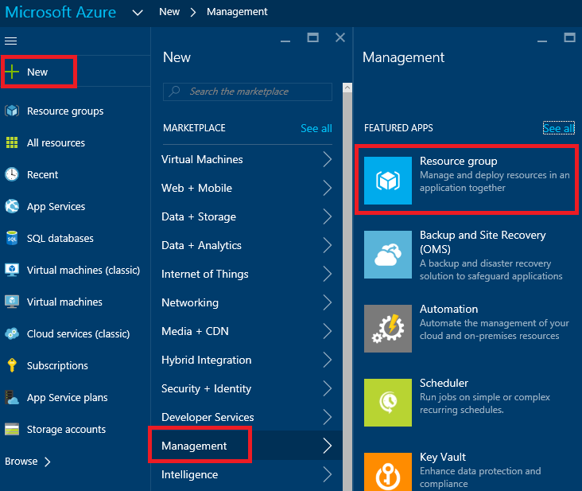
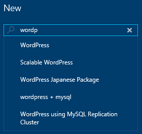
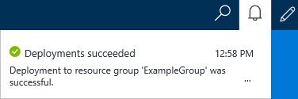
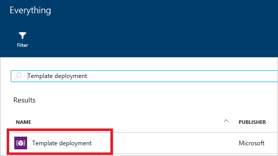
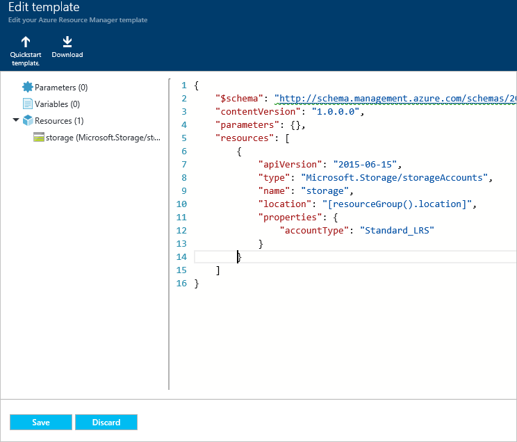
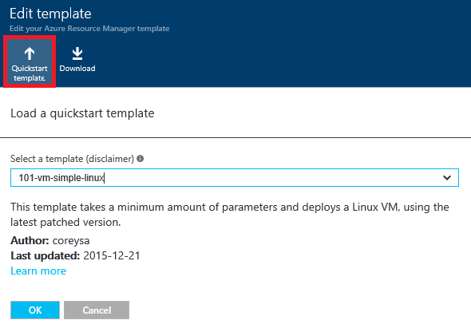
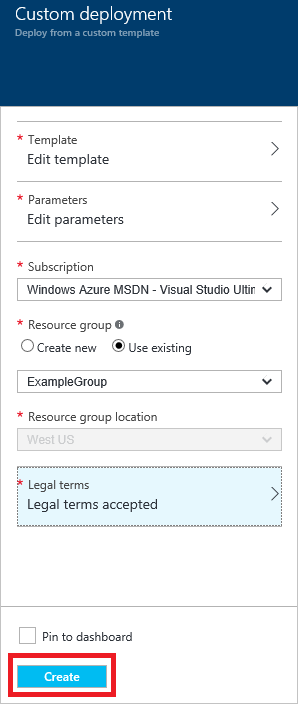

<properties 
	pageTitle="Use Azure portal to deploy Azure resources | Microsoft Azure" 
	description="Use Azure portal and Azure Resource Manage to deploy your resources." 
	services="azure-resource-manager,azure-portal" 
	documentationCenter="" 
	authors="tfitzmac" 
	manager="timlt" 
	editor="tysonn"/>

<tags 
	ms.service="azure-resource-manager" 
	ms.workload="multiple" 
	ms.tgt_pltfrm="na" 
	ms.devlang="na" 
	ms.topic="article" 
	ms.date="06/30/2016" 
	ms.author="tomfitz"/>

# Deploy resources with Resource Manager templates and Azure portal

> [AZURE.SELECTOR]
- [PowerShell](resource-group-template-deploy.md)
- [Azure CLI](resource-group-template-deploy-cli.md)
- [Portal](resource-group-template-deploy-portal.md)
- [REST API](resource-group-template-deploy-rest.md)
- [.NET](https://azure.microsoft.com/documentation/samples/resource-manager-dotnet-template-deployment/)
- [Java](https://azure.microsoft.com/documentation/samples/resources-java-deploy-using-arm-template/)
- [Node](https://azure.microsoft.com/documentation/samples/resource-manager-node-template-deployment/)
- [Python](https://azure.microsoft.com/documentation/samples/resource-manager-python-template-deployment/)
- [Ruby](https://azure.microsoft.com/documentation/samples/resource-manager-ruby-template-deployment/)

This topic shows how to use the [Azure portal](https://portal.azure.com) with [Azure Resource Manager](resource-group-overview.md) to deploy your Azure resources. To learn about managing your resources, see [Manage Azure resources through portal](./azure-portal/resource-group-portal.md).

Currently, not every service supports the portal or Resource Manager. For those services, you will need to use
the [classic portal](https://manage.windowsazure.com). For the status of each service, see [Azure portal availability chart](https://azure.microsoft.com/features/azure-portal/availability/).

## Create resource group

1. To create an empty resource group, select **New** > **Management** > **Resource Group**.

    

2. Give it a name and location, and, if necessary, select a subscription.

    

## Deploy resources from Marketplace

After you create a resource group, you can deploy resources to it from the Marketplace. The Marketplace provides pre-defined solutions for common scenatios.

1. To start a deployment, select **New** and the type of resource you would like to deploy. Then, look for the particular version of the resource you would like to deploy.

    

2. If you do not see the particular solution you would like to deploy, you can search the Marketplace for it.

    

3. Depending on the type of resource you have selected, you will have a collection of relevant properties to set before deployment. Those options are not shown here, as they vary based on resource type. For all types, you must select a destination resource group. The following image shows how to create a new web app and deploy it to the resource group you just created.

    

    Alternatively, you can decide to create a new resource group when deploying your resources. Select **Create new** and give the resource group a name.

    

4. Your deployment will begin. This could take a few minutes. When the deployment has finished, you will see a notification.

    

5. After deploying your resources, you can add more resources to the resource group by using the **Add** command on the resource group blade.

    

## Deploy resources from custom template

If you want to execute a deployment but not use any of the templates in the Marketplace, you can create a customized template that defines the infrastructure for your solution. To learn about creating templates, see [Authoring Azure Resource Manager templates](resource-group-authoring-templates.md).

1. To deploy a customized template through the portal, select **New**, and start searching for **Template Deployment** until you can select it from the options.

    

2. Select **Template Deployment** from the available resources.

    

3. After launching the template deployment, open the blank template that is available for customizing.

    

    In the editor, add the JSON syntax that defines the resources you want to deploy. Select **Save** when done. For guidance on writing the JSON syntax, see [Resource Manager template walkthrough](resource-manager-template-walkthrough.md).

    

4. Or, you can select a pre-existing template from the [Azure quickstart templates](https://azure.microsoft.com/documentation/templates/). These templates are contributed by the community. They cover many common scenarios, and someone may have added a template that is similar to what you are trying to deploy. You can search the templates to find something that matches your scenario.

    

    You can view the selected template in the editor.

5. After providing all of the other values, select **Create** to deploy the template. 

    

## Deploy resources from a template saved to your account

The portal enables you to save a template to your Azure account, and re-deploy it later. For more information about working with these saved templates, [Get started with private Templates on the Azure Portal](./marketplace-consumer/mytemplates-getstarted.md).

1. To find your saved templates, select **Browse** > **Templates**.

    

2. From the list of templates saved to your account, select the one you wish to work on.

    

3. Select **Deploy** to re-deploy this saved template.

    

## Next Steps

- To view audit logs, see [Audit operations with Resource Manager](resource-group-audit.md).
- To troubleshoot deployment errors, see [Troubleshooting resource group deployments with Azure Portal](resource-manager-troubleshoot-deployments-portal.md).
- To retrieve a template from a deployment or resource group, see [Export Azure Resource Manager template from existing resources](resource-manager-export-template.md).

