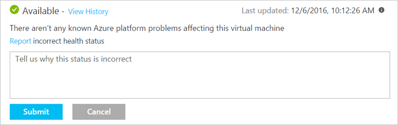
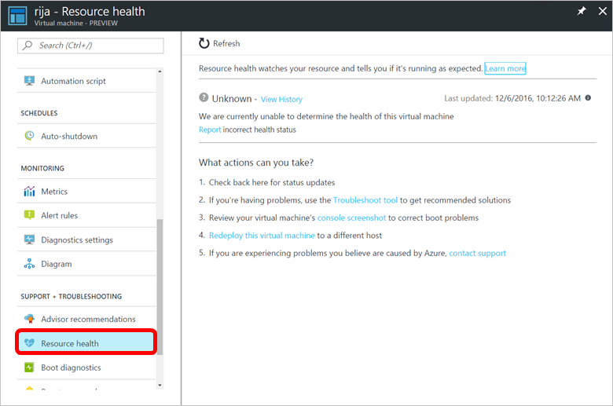
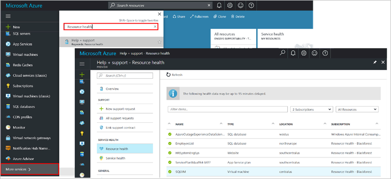

# Azure resource health overview
 
Resource health helps you diagnose and get support when an Azure issue impacts your resources. It informs you about the current and past health of your resources and helps you mitigate issues. Resource health provides technical support when you need help with Azure service issues.

Whereas [Azure Status](https://status.azure.com) informs you about service issues that affect a broad set of Azure customers, resource health provides you with a personalized dashboard of the health of your resources. Resource health shows you all the times your resources were unavailable in the past due to Azure service issues. This makes it simple for you to understand if an SLA was violated. 

## What is considered a resource and how does resource health decides if a resource is healthy or not?
A resource is an instance of a resource type offered by an Azure service through Azure Resource Manager, for example: a virtual machine, a web app, or a SQL database.

Resource health relies on signals emitted by the different Azure services to assess if a resource is healthy or not. If a resource is unhealthy, resource health analyzes additional information to determine the source of the problem. It also identifies actions Microsoft is taking to fix the issue or what actions you can take to address the cause of the problem. 

Review the full list of resource types and health checks in [Azure resource health](resource-health-checks-resource-types.md) for additional details on how health is assessed.

## Health status provided by resource health
The health of a resource is one of the following statuses:

### Available
The service has not detected any events impacting the health of the resource. In cases where the resource has recovered from unplanned downtime during the last 24 hours you will see the **recently recovered** notification.

### Unavailable
The service has detected an ongoing platform or non-platform event impacting the health of the resource.

#### Platform events
These events are triggered by multiple components of the Azure infrastructure and include both scheduled actions like planned maintenance and unexpected incidents like an unplanned host reboot.

Resource health provides additional details on the event, the recovery process and enables you to contact support even if you don't have an active Microsoft support agreement.

#### Non-Platform events
These events are triggered by actions taken by users, for example stopping a virtual machine or reaching the maximum number of connections to a Redis Cache.

### Unknown
This health status indicates that resource health has not received information about this resource for more than 10 minutes. While this status is not a definitive indication of the state of the resource, it is an important data point in the troubleshooting process:
* If the resource is running as expected the status of the resource will update to Available after a few minutes.
* If you are experiencing problems with the resource, the Unknown health status may suggest the resource is impacted by an event in the platform.

## Report an incorrect status
If at any point you believe the current health status is incorrect, you can let us know by clicking **Report incorrect health status**. In cases where you are impacted by an Azure problem, we encourage you to contact support from the resource health blade. 

## Historical Information
You can access up to 14 days of historical health data by clicking **View History** in the Resource health blade. 

## Getting started
To open Resource health for one resource
1.	Sign in into the Azure portal.
2.	Navigate to your resource.
3.	In the resource menu located in the left-hand side, click **Resource health**.

You can also access resource health by clicking **More services**, and typing **resource health** in filter text box to open the **Help + Support** blade. Finally click [**Resource health**](https://ms.portal.azure.com/#blade/Microsoft_Azure_Monitoring/AzureMonitoringBrowseBlade/resourceHealth).

## Next steps

Check out these resources to learn more about resource health:
-  [Resource types and health checks in Azure resource health](resource-health-checks-resource-types.md)
-  [Frequently asked questions about Azure resource health](resource-health-faq.md)

