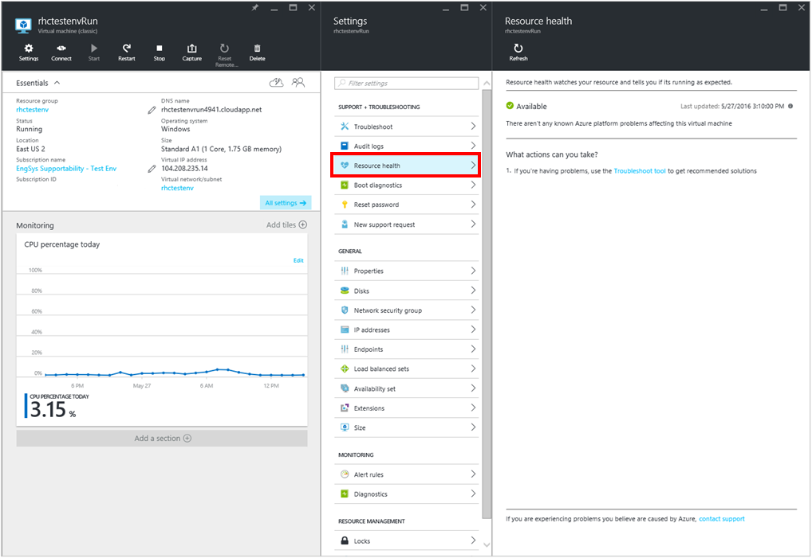
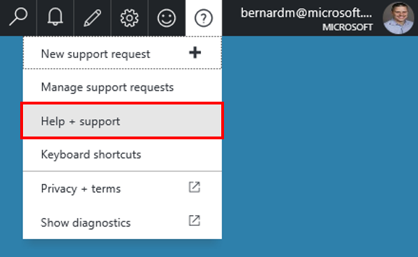
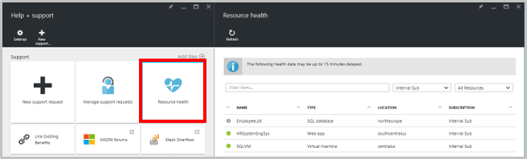
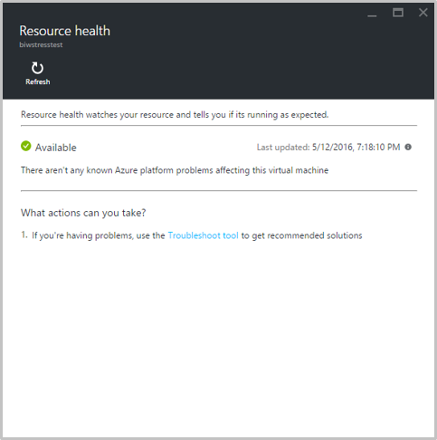
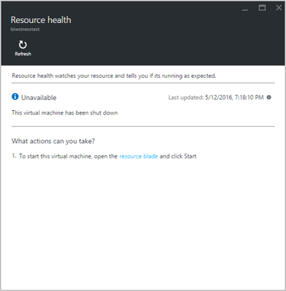
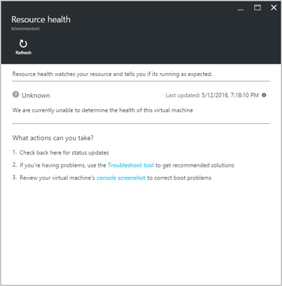
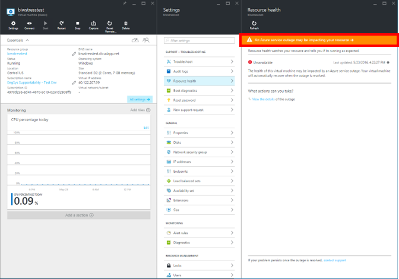

<properties
   pageTitle="Azure Resource health overview | Microsoft Azure"
   description="Overview of Azure Resource health"
   services="Resource health"
   documentationCenter="dev-center-name"
   authors="BernardoAMunoz"
   manager=""
   editor=""/>

<tags
   ms.service="resource-health"
   ms.devlang="na"
   ms.topic="article"
   ms.tgt_pltfrm="na"
   ms.workload="Supportability"
   ms.date="06/01/2016"
   ms.author="BernardoAMunoz"/>

# Azure Resource health overview

Azure Resource health is a service that exposes the health of individual Azure resources and provides actionable guidance to troubleshoot problems. In a cloud environment where it isn’t possible to directly access servers or infrastructure elements, the goal for Resource health is to reduce the time customers spend on troubleshooting, in particular reducing the time spent determining if the root of the problem lays inside the application or if it is caused by an event inside the Azure platform.

## What is considered a Resource and how does resource health decides if the resource is healthy or not? 
A resource is a user created instance of a resource type provided by a service, for example: a virtual machine, a Web app or a SQL database. 

Resource health relies on signals emitted by the resource and/or the service to determine if a resource is healthy or not. It is important to notice that currently Resource health only accounts for the health of one specific resource type and does not consider other elements that may contribute to the overall health. For example, when reporting the status of a virtual machine, only the compute portion of the infrastructure is considered, i.e. issues in the network will not be shown in Resource health, unless there is a declared service outage, in which case, it will be surfaced through the banner at the top of the blade. More information about service outage is offered later in this article. 

## How is Resource health different from Service Health Dashboard?

The information provided by Resource health is more granular than what is provided by the Service Health Dashboard. While SHD communicates events that impact the availability of a service in a region, Resource health exposes information relevant to a specific resource, e.g. it will expose events that impact the availability of a virtual machine, a web app, or a SQL database. For example, if a node unexpectedly reboots, customers whose virtual machines were running on that node will be able to obtain the reason why their VM was unavailable for a period of time.   

## How to access Resource health
For the services available through Resource health, there are 2 ways to access Resource health.

### Azure Portal
The Resource health blade in the Azure Portal, provides detailed information about the health of the resource as well as recommended actions that vary depending on the current health of the resource. This blade provides the best experience when querying Resource health, as it facilitates access to other resources inside the portal. 
As mentioned before, the set of recommended actions in the Resource health blade will vary based on the current health:

* Healthy resources: Since no issue that could impact the health of the resource has been detected, the actions are focused on helping the troubleshooting process. For example, it provides direct access to the Troubleshooting blade, which offers guidance on how to solve the most common problems customers face.
* Unhealthy resource: For problems caused by Azure, the blade will display actions Microsoft is taking (or has taken) to recover the resource. For problems caused by user initiated actions, the blade will a list of actions customers can take so address the problem and recover the resource.  

Once you have logged into the Azure Portal, there are two ways to access the Resource health blade: 

####Open the Resource blade
Open the Resource blade for a given resource. On the Settings blade that opens next to the Resource blade, click on Resource Health to open the Resource health blade. 

### Help and Support blade
Open the Help and Support blade by clicking on the question mark in the upper right corner then selecting Help + Support. 

**From the top navigation bar**

Clicking the tile opens the Resource health subscription blade which will list all of the resources in your subscription. Beside each resource, there is an icon indicating its health. Clicking on each resource will open the Resource health blade.

**Resource health tile**

### Resource health API
Along with the Azure portal experience, there is a set of APIs that can be used to query Resource health. The available APIs allow users to request the current health of all resources in a subscription, all resources in a resource group or the health of a single resource. 

Another API allows users to request the historical health of a single resource. The response is a collection of Resource health states for the last 14 days. If the resource may have been impacted by a declared outage, the health state will include an annotation called serviceImpactingEvents, with more details on the outage. 

Before using the API to query Resource health, the subscription needs to be registered with the service by submitting a POST request to the following URL:  volume 
 
        //Register the subscription with the Resource health resource provider
        https://management.azure.com/subscriptions/{subscription-id}/providers/Microsoft.ResourceHealth/register?api-version=2015-01-01
        
Below are examples on how to call the Resource health API

        // GET health of all resources in a subscription:
        https://management.azure.com/subscriptions/{subscription-id}/providers/Microsoft.ResourceHealth/availabilityStatuses?api-version=2015-01-01
        
        //GET health of all resources in a resource group:
        https://management.azure.com/subscriptions/{subscription-id}/resourceGroups/{resource-group-name}/providers/Microsoft.ResourceHealth/availabilityStatuses?api-version=2015-01-01
        
        //GET the health of a single resource:
        https://management.azure.com/subscriptions/{subscription-id}/resourceGroups/{resource-group-name}/providers/{resource-provider}/{resource-type}/{resource-name}/providers/Microsoft.ResourceHealth/availabilityStatuses/current?api-version=2015-01-01
        
        //GET the historical health of a single resource:
        https://management.azure.com/subscriptions/{subscription-id}/resourceGroups/{resource-group-name}/providers/{resource-provider}/{resource-type}/{resource-name}/providers/Microsoft.ResourceHealth/availabilityStatuses?api-version=2015-01-01

## What does my Resource health status mean?
There are 4 different health statuses that you might see for your resource.

### Available
The service has not detected any problems in the platform that could be impacting the availability of the resource. This is indicated by a green check mark icon. 

### Unavailable

In this case the service has detected an ongoing problem in the platform that is impacting the availability of this resource, for example, the node where the VM was running unexpectedly rebooted. This is indicated by a red warning icon. 
Additional information about the problem is provided in the middle section of the blade, including: 

1.	What actions Microsoft is taking to recover the resource 
2.	A detailed timeline of the problem, including the expected resolution time
3.	A list recommended actions for users 

### Unavailable – customer initiated
The resource is unavailable due to a customer request such as stopping a resource or requesting a restart. This is indicated by a blue informational icon. 

### Unknown
The service has not received information about this resource for more than 5 minutes. This is indicated by a grey question mark icon. 

It is important to note that this is not a definitive indication that there is something wrong with a resource, so customers should follow these recommendations:

* If the resource is running as expected but its health is set to Unknown in Resource health, there are no problems and you can expect the status of the resource to update to healthy after a few minutes.
* If there are problems accessing the resource and its health is set to Unknown in Resource health, this could be an early indication there could be an issue and additional investigations should be done until the health is updated to either healthy or unhealthy

## Service Impacting Events
If the resource may be impacted by an ongoing Service Impacting Event, a banner will be displayed at the top of the Resource health blade. Clicking on the banner will open the Audit Events blade, which will display additional information about the outage.

## What else do I need to know about Resource health?

### Signal latency
The signals that feed Resource health, may be up to 15 min delayed, which can cause discrepancies between the current health status of the resource and its actual availability. It is important to keep this in mind as it will help eliminate unnecessary time spent investigating possible issues. 

### Special case for SQL 
Resource health reports the status of the SQL database, not the SQL server. While going this route provides a more realistic health picture, it requires that multiple components and services be taken into consideration to determine the health of the database. The current signal relies on logins to the database, which means that for databases that receive regular logins (which includes among other things, receiving query execution requests) the health status will be regularly displayed. If the database has not been accessed for a period of 10 minutes or more, it will be moved to the unknown state. This does not mean that the database is unavailable, just that no signal has been emitted because no logins have been performed. Connecting to the database and running a query will emit the signals needed to determine and update the health status of the database.

## Feedback
We are always open to feedback and suggestions! Please send us your [suggestions](https://feedback.azure.com/forums/266794-support-feedback). Additionally, you can engage with us via [Twitter](https://twitter.com/azuresupport) or the [MSDN forums](https://social.msdn.microsoft.com/Forums/azure).
