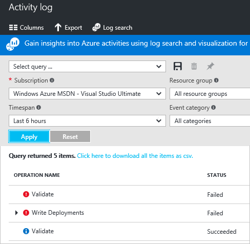
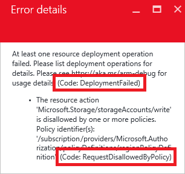

<properties
   pageTitle="Troubleshoot common Azure deployment errors | Microsoft Azure"
   description="Describes how to resolve common errors when you deploy resources to Azure using Azure Resource Manager."
   services="azure-resource-manager"
   documentationCenter=""
   tags="top-support-issue"
   authors="tfitzmac"
   manager="timlt"
   editor="tysonn"
   keywords="deployment error, azure deployment, deploy to azure"/>

<tags
   ms.service="azure-resource-manager"
   ms.devlang="na"
   ms.topic="article"
   ms.tgt_pltfrm="na"
   ms.workload="na"
   ms.date="10/31/2016"
   ms.author="tomfitz"/>

# Troubleshoot common Azure deployment errors with Azure Resource Manager

This topic describes how you can resolve some common Azure deployment errors you may encounter. 

## Two types of errors

There are two types of errors you can receive: 

- validation errors
- deployment errors

The following image shows the activity log for a subscription. There are three operations that occurred in two deployments. In the first deployment, the template passed validation but failed when creating the resources (**Write Deployments**). In the second deployment, the template failed validation and did not proceed to the **Write Deployments**. 

Validation errors arise from scenarios that can be pre-determined to cause a problem; such as, syntax errors in your template, or trying to deploy resources that would exceed your subscription quotas. Deployment errors arise from conditions that occur during the deployment process; such as, trying to access a resource that is being deployed in parallel.

Both types of errors return an error code that you use to troubleshoot the deployment. Both types of errors appear in the activity log. However, validation errors do not appear in your deployment history because the deployment never actually started. 

## Enable debug logging

You can discover valuable information about how your deployment is processed by logging the request, response, or both.

**PowerShell**

In PowerShell, set the **DeploymentDebugLogLevel** parameter to All, ResponseContent, or RequestContent.

    New-AzureRmResourceGroupDeployment -ResourceGroupName examplegroup -TemplateFile c:\Azure\Templates\storage.json -DeploymentDebugLogLevel All

Examine the request content with the following:

    (Get-AzureRmResourceGroupDeploymentOperation -DeploymentName storageonly -ResourceGroupName startgroup).Properties.request | ConvertTo-Json

Or, the response content with:

    (Get-AzureRmResourceGroupDeploymentOperation -DeploymentName storageonly -ResourceGroupName startgroup).Properties.response | ConvertTo-Json

This information can help you determine whether a value in the template is being incorrectly set.

**Azure CLI**

In Azure CLI, set the **--debug-setting** parameter to All, ResponseContent, or RequestContent.

    azure group deployment create --debug-setting All -f c:\Azure\Templates\storage.json -g examplegroup -n ExampleDeployment

Examine the logged request and response content with the following:

    azure group deployment operation list --resource-group examplegroup --name ExampleDeployment --json

This information can help you determine whether a value in the template is being incorrectly set.

**Nested template**

To log debug information for a nested template, use the **debugSetting** element.

    {
        "apiVersion": "2016-09-01",
        "name": "nestedTemplate",
        "type": "Microsoft.Resources/deployments",
        "properties": {
            "mode": "Incremental",
            "templateLink": {
                "uri": "{template-uri}",
                "contentVersion": "1.0.0.0"
            },
            "debugSetting": {
               "detailLevel": "requestContent, responseContent"
            }
        }
    }

## Error codes

Deployment errors return the code **DeploymentFailed**. However, this error code is a general deployment error. The error code that actually helps you resolve the issue is usually one level below that error. The following image shows the **RequestDisallowedByPolicy** error code that is under the deployment error.

The following error codes are described in this topic:

- [InvalidTemplate](#invalidtemplate)
- [NotFound and ResourceNotFound](#notfound-and-resourcenotfound)
- [StorageAccountAlreadyExists and StorageAccountAlreadyTaken](#storageaccountalreadyexists-and-storageaccountalreadytaken)
- [AccountNameInvalid](#accountnameinvalid)
- [NoRegisteredProviderFound](#noregisteredproviderfound)
- [OperationNotAllowed](#operationnotallowed)
- [InvalidContentLink](#invalidcontentlink)
- [RequestDisallowedByPolicy](#requestdisallowedbypolicy)
- [Authorization failed](#authorization-failed)

### InvalidTemplate

This error can result from several different types of errors. 

**Syntax error**

If you receive an error message that indicates the template failed validation, you may have a syntax problem in your template. 

    Code=InvalidTemplate 
    Message=Deployment template validation failed

This error is easy to make because template expressions can be intricate. For example, the following name assignment for a storage account contains one set of brackets, three functions, three sets of parentheses, one set of single quotes, and one property:

    "name": "[concat('storage', uniqueString(resourceGroup().id))]",

If you do not provide the matching syntax, the template produces a value that is different than your intention.

When you receive this type of error, carefully review the expression syntax. Consider using a JSON editor like [Visual Studio](vs-azure-tools-resource-groups-deployment-projects-create-deploy.md) or [Visual Studio Code](resource-manager-vs-code.md), which can warn you about syntax errors. 

**Incorrect segment lengths**

Another invalid template error occurs when the resource name is not in the correct format.

    Code=InvalidTemplate
    Message=Deployment template validation failed: 'The template resource {resource-name}' 
    for type {resource-type} has incorrect segment lengths.

A root level resource must have one less segment in the name than in the resource type. Each segment is differentiated by a slash. In the following example, the type has two segments and the name has one segment, so it is a **valid name**.

    {
      "type": "Microsoft.Web/serverfarms",
      "name": "myHostingPlanName",
      ...
    }

But the next example is **not a valid name** because it has the same number of segments as the type.

    {
      "type": "Microsoft.Web/serverfarms",
      "name": "appPlan/myHostingPlanName",
      ...
    }

For child resources, the type and name have the same number of segments. This number of segments makes sense because the full name and type for the child includes the parent name and type. Therefore, the full name still has one less segment than the full type. 

    "resources": [
        {
            "type": "Microsoft.KeyVault/vaults",
            "name": "contosokeyvault",
            ...
            "resources": [
                {
                    "type": "secrets",
                    "name": "appPassword",
                    ...
                }
            ]
        }
    ]

Getting the segments right can be tricky with Resource Manager types that are applied across resource providers. For example, applying a resource lock to a web site requires a type with four segments. Therefore, the name is three segments:

    {
        "type": "Microsoft.Web/sites/providers/locks",
        "name": "[concat(variables('siteName'),'/Microsoft.Authorization/MySiteLock')]",
        ...
    }

**Copy index is not expected**

You encounter this **InvalidTemplate** error when you have applied the **copy** element to a part of the template that does not support this element. You can only apply the copy element to a resource type. You cannot apply copy to a property within a resource type. For example, you apply copy to a virtual machine, but you cannot apply it to the OS disks for a virtual machine. In some cases, you can convert a child resource to a parent resource to create a copy loop. For more information about using copy, see [Create multiple instances of resources in Azure Resource Manager](resource-group-create-multiple.md).

**Parameter is not valid**

If the template specifies permitted values for a parameter, and you provide a value that is not one of those values, you receive a message similar to the following error:

    Code=InvalidTemplate; 
    Message=Deployment template validation failed: 'The provided value {parameter vaule} 
    for the template parameter {parameter name} is not valid. The parameter value is not 
    part of the allowed value(s)

Double check the allowed values in the template, and provide one during deployment.

### NotFound and ResourceNotFound

When your template includes the name of a resource that cannot be resolved, you receive an error similar to:

    Code=NotFound;
    Message=Cannot find ServerFarm with name exampleplan.

If you are attempting to deploy the missing resource in the template, check whether you need to add a dependency. Resource Manager optimizes deployment by creating resources in parallel, when possible. If one resource must be deployed after another resource, you need to use the **dependsOn** element in your template to create a dependency on the other resource. For example, when deploying a web app, the App Service plan must exist. If you have not specified that the web app depends on the App Service plan, Resource Manager creates both resources at the same time. You receive an error stating that the App Service plan resource cannot be found, because it does not exist yet when attempting to set a property on the web app. You prevent this error by setting the dependency in the web app.

    {
      "apiVersion": "2015-08-01",
      "type": "Microsoft.Web/sites",
      ...
      "dependsOn": [
        "[variables('hostingPlanName')]"
      ],
      ...
    }
 
You also see this error when the resource exists in a different resource group than the one being deployed to. In that case, use the [resourceId function](resource-group-template-functions.md#resourceid) to get the fully qualified name of the resource.

    "properties": {
        "name": "[parameters('siteName')]",
        "serverFarmId": "[resourceId('plangroup', 'Microsoft.Web/serverfarms', parameters('hostingPlanName'))]"
    } 

If you attempt to use the [reference](resource-group-template-functions.md#referenc) or [listKeys](resource-group-template-functions.md#listkeys) functions with a resource that cannot be resolved, you receive the following error:

    Code=ResourceNotFound;
    Message=The Resource 'Microsoft.Storage/storageAccounts/{storage name}' under resource 
    group {resource group name} was not found.

Look for an expression that includes the **reference** function. Double check that the parameter values are correct.

### StorageAccountAlreadyExists and StorageAccountAlreadyTaken

For storage accounts, you must provide a name for the resource that is unique across Azure. If you do not provide a unique name, you receive an error like:

    Code=StorageAccountAlreadyTaken 
    Message=The storage account named mystorage is already taken.

You can create a unique name by concatenating your naming convention with the result of the [uniqueString](resource-group-template-functions.md#uniquestring) function.

    "name": "[concat('contosostorage', uniqueString(resourceGroup().id))]",
    "type": "Microsoft.Storage/storageAccounts",

If you deploy a storage account with the same name as an existing storage account in your subscription, but provide a different location, you receive an error indicating the storage account already exists in a different location. Either delete the existing storage account, or provide the same location as the existing storage account.

### AccountNameInvalid

You see the **AccountNameInvalid** error when attempting to give a storage account a name that includes prohibited characters. Storage account names must be between 3 and 24 characters in length and use numbers and lower-case letters only.

### NoRegisteredProviderFound

When deploying resource, you may receive the following error code and message:

    Code: NoRegisteredProviderFound
    Message: No registered resource provider found for location {ocation} 
    and API version {api-version} for type {resource-type}.

You receive this error for one of three reasons:

1. Location not supported for the resource type
2. API version not supported for the resource type
3. The resource provider has not been registered for your subscription

The error message should give you suggestions for the supported locations and API versions. You can change your template to one of the suggested values. Most providers are registered automatically by the Azure portal or the command-line interface you are using, but not all. If you have not used a particular resource provider before, you may need to register that provider. You can discover more about resource providers through PowerShell or Azure CLI.

**PowerShell**

To see your registration status, use **Get-AzureRmResourceProvider**.

    Get-AzureRmResourceProvider -ListAvailable

To register a provider, use **Register-AzureRmResourceProvider** and provide the name of the resource provider you wish to register.

    Register-AzureRmResourceProvider -ProviderNamespace Microsoft.Cdn

To get the supported locations for a particular type of resource, use:

    ((Get-AzureRmResourceProvider -ProviderNamespace Microsoft.Web).ResourceTypes | Where-Object ResourceTypeName -eq sites).Locations

To get the supported API versions for a particular type of resource, use:

    ((Get-AzureRmResourceProvider -ProviderNamespace Microsoft.Web).ResourceTypes | Where-Object ResourceTypeName -eq sites).ApiVersions

**Azure CLI**

To see whether the provider is registered, use the `azure provider list` command.

    azure provider list

To register a resource provider, use the `azure provider register` command, and specify the *namespace* to register.

    azure provider register Microsoft.Cdn

To see the supported locations and API versions for a resource provider, use:

    azure provider show -n Microsoft.Compute --json > compute.json

### OperationNotAllowed

You might have issues when deployment exceeds a quota, which could be per resource group, subscriptions, accounts, and other scopes. For example, your subscription may be configured to limit the number of cores for a region. If you attempt to deploy a virtual machine with more cores than the permitted amount, you receive an error stating the quota has been exceeded.
For complete quota information, see [Azure subscription and service limits, quotas, and constraints](azure-subscription-service-limits.md).

To examine your subscription's quotas for cores, you can use the `azure vm list-usage` command in the Azure CLI. The following example illustrates that the core quota for a
free trial account is 4:

    azure vm list-usage

Which returns:

    info:    Executing command vm list-usage
    Location: westus
    data:    Name   Unit   CurrentValue  Limit
    data:    -----  -----  ------------  -----
    data:    Cores  Count  0             4
    info:    vm list-usage command OK

If you deploy a template that creates more than four cores in the West US region, you get a deployment error that looks like:

    Code=OperationNotAllowed
    Message=Operation results in exceeding quota limits of Core. 
    Maximum allowed: 4, Current in use: 4, Additional requested: 2.

Or in PowerShell, you can use the **Get-AzureRmVMUsage** cmdlet.

    Get-AzureRmVMUsage

Which returns:

    ...
    CurrentValue : 0
    Limit        : 4
    Name         : {
                     "value": "cores",
                     "localizedValue": "Total Regional Cores"
                   }
    Unit         : null
    ...

In these cases, you should go to the portal and file a support issue to raise your quota for the region into which you want to deploy.

> [AZURE.NOTE] Remember that for resource groups, the quota is for each individual region, not for the entire subscription. If you need to deploy 30 cores in West US, you have to ask for 30 Resource Manager cores in West US. If you need to deploy 30 cores in any of the regions to which you have access, you should ask for 30 Resource Manager cores in all regions.

### InvalidContentLink

When you receive the error message:

    Code=InvalidContentLink
    Message=Unable to download deployment content from ...

You have most likely attempted to link to a nested template that is not available. Double check the URI you provided for the nested template. If the template exists in a storage account, make sure the URI is accessible. You may need to pass a SAS token. For more information, see [Using linked templates with Azure Resource Manager](resource-group-linked-templates.md).

### RequestDisallowedByPolicy

You receive this error when your subscription includes a resource policy that prevents an action you are trying to perform during deployment. In the error message, look for the policy identifier.

    Policy identifier(s): '/subscriptions/{guid}/providers/Microsoft.Authorization/policyDefinitions/regionPolicyDefinition'

In **PowerShell**, provide that policy identifier as the **Id** parameter to retrieve details about the policy that blocked your deployment.

    (Get-AzureRmPolicyAssignment -Id "/subscriptions/{guid}/providers/Microsoft.Authorization/policyDefinitions/regionPolicyDefinition").Properties.policyRule | ConvertTo-Json

In **Azure CLI**, provide the name of the policy definition:

    azure policy definition show regionPolicyDefinition --json

For more information about policies, see [Use Policy to manage resources and control access](resource-manager-policy.md).

### Authorization failed

You may receive an error during deployment because the account or service principal attempting to deploy the resources does not have access to perform those actions. Azure Active Directory enables you or your administrator to control which identities can access what resources with a great degree of precision. For example, if your account is assigned to the Reader role, you are not able to create resources. In that case, you see an error message indicating that authorization failed.

For more information about role-based access control, see [Azure Role-Based Access Control](./active-directory/role-based-access-control-configure.md).

In addition to role-based access control, your deployment actions may be limited by policies on the subscription. Through policies, the administrator can enforce conventions on all resources deployed in the subscription. For example, an administrator can require that a particular tag value is provided for a resource type. If you do not fulfill the policy requirements, you receive an error during deployment. For more information about policies, see [Use Policy to manage resources and control access](resource-manager-policy.md).

## Create a troubleshooting template

In some cases, the easiest way to troubleshoot your template is to test parts of it. You can create a simplified template that enables you to focus on the part that you believe is causing the error. For example, suppose you are receiving an error when referencing a resource. Rather than dealing with an entire template, simply return the part that may be causing your problem. It can help you determine whether you are passing in the right parameters, using template functions correctly, and getting the resource you expect.

    {
	  "$schema": "https://schema.management.azure.com/schemas/2015-01-01/deploymentTemplate.json#",
	  "contentVersion": "1.0.0.0",
	  "parameters": {
		"storageName": {
			"type": "string"
		},
		"storageResourceGroup": {
			"type": "string"
		}
	  },
	  "variables": {},
	  "resources": [],
	  "outputs": {
		"exampleOutput": {
			"value": "[reference(resourceId(parameters('storageResourceGroup'), 'Microsoft.Storage/storageAccounts', parameters('storageName')), '2016-05-01')]",
			"type" : "object"
		}
	  }
    }

Obviously, your troubleshooting template can vary based on your scenario.

## Troubleshooting virtual machines

| Error | Articles |
| -------- | ----------- |
| Custom script extension errors | [Windows VM extension failures](./virtual-machines/virtual-machines-windows-extensions-troubleshoot.md) or [Linux VM extension failures](./virtual-machines/virtual-machines-linux-extensions-troubleshoot.md) |
| OS image provisioning errors | [New Windows VM errors](./virtual-machines/virtual-machines-windows-troubleshoot-deployment-new-vm.md) or [New Linux VM errors](./virtual-machines/virtual-machines-linux-troubleshoot-deployment-new-vm.md ) |
| Allocation failures | [Windows VM allocation failures](./virtual-machines/virtual-machines-windows-allocation-failure.md) or [Linux VM allocation failures](./virtual-machines/virtual-machines-linux-allocation-failure.md) |
| Secure Shell (SSH) errors when attempting to connect | [Secure Shell connections to Linux VM](./virtual-machines/virtual-machines-linux-troubleshoot-ssh-connection.md) |
| Errors connecting to application running on VM | [Application running on Windows VM](./virtual-machines/virtual-machines-windows-troubleshoot-app-connection.md) or [Application running on a Linux VM](./virtual-machines/virtual-machines-linux-troubleshoot-app-connection.md) |
| Remote Desktop connection errors | [Remote Desktop connections to Windows VM](./virtual-machines/virtual-machines-windows-troubleshoot-rdp-connection.md) |
| Connection errors resolved by redeploying | [Redeploy Virtual Machine to new Azure node](./virtual-machines/virtual-machines-windows-redeploy-to-new-node.md) |
| Cloud service errors | [Cloud service deployment problems](./cloud-services/cloud-services-troubleshoot-deployment-problems.md) |

## Troubleshooting other services

The following table is not a complete list of troubleshooting topics for Azure. Instead, it focuses on issues related to deploying or configuring resources. If you need help troubleshooting run-time issues with a resource, see the documentation for that Azure service.

| Service | Article |
| -------- | -------- |
| Automation | [Troubleshooting tips for common errors in Azure Automation](./automation/automation-troubleshooting-automation-errors.md) |
| Azure Stack | [Microsoft Azure Stack troubleshooting](./azure-stack/azure-stack-troubleshooting.md) |
| Azure Stack | [Web Apps and Azure Stack](./azure-stack/azure-stack-webapps-troubleshoot-known-issues.md ) |
| Data Factory | [Troubleshoot Data Factory issues](./data-factory/data-factory-troubleshoot.md) |
| Service Fabric | [Troubleshoot common issues when you deploy services on Azure Service Fabric](./service-fabric/service-fabric-diagnostics-troubleshoot-common-scenarios.md) |
| Site Recovery | [Monitor and troubleshoot protection for virtual machines and physical servers](./site-recovery/site-recovery-monitoring-and-troubleshooting.md) |
| Storage | [Monitor, diagnose, and troubleshoot Microsoft Azure Storage](./storage/storage-monitoring-diagnosing-troubleshooting.md) |
| StorSimple | [Troubleshoot StorSimple device deployment issues](./storsimple/storsimple-troubleshoot-deployment.md) |
| SQL Database | [Troubleshoot connection issues to Azure SQL Database](./sql-database/sql-database-troubleshoot-common-connection-issues.md) |
| SQL Data Warehouse | [Troubleshooting Azure SQL Data Warehouse](./sql-data-warehouse/sql-data-warehouse-troubleshoot.md) |

## Understand when a deployment is ready

Azure Resource Manager reports success on a deployment when all providers return from deployment successfully. However, this message does not necessarily mean that your resource group is "active and ready for your users." For example, a deployment may need to download upgrades, wait on non-template resources, or install complex scripts. Resource Manager does not know when these tasks complete because they are not activities that a provider tracks. In these cases, it can be some time before your resources are ready for real-world use. As a result, you should expect that the deployment status succeeds some time before your deployment can be used.

You can prevent Azure from reporting deployment success, however, by creating a custom script for your custom template. The script knows how to monitor the entire deployment for system-wide readiness and returns successfully only when users can interact with the entire deployment. If you want to ensure that your extension is the last to run, use the **dependsOn** property in your template.

## Next steps

- To learn about auditing actions, see [Audit operations with Resource Manager](resource-group-audit.md).
- To learn about actions to determine the errors during deployment, see [View deployment operations](resource-manager-troubleshoot-deployments-portal.md).
