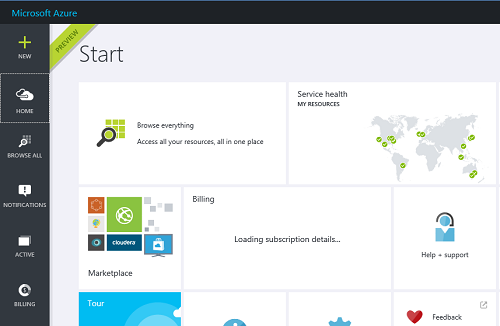
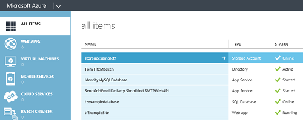

<properties
   pageTitle="Resource Manager and classic deployment | Microsoft Azure"
   description="Describes the differences between the Resource Manager deployment model and the classic (or Service Management) deployment model."
   services="azure-resource-manager"
   documentationCenter="na"
   authors="tfitzmac"
   manager="timlt"
   editor="tysonn"/>

<tags
   ms.service="azure-resource-manager"
   ms.devlang="na"
   ms.topic="article"
   ms.tgt_pltfrm="na"
   ms.workload="na"
   ms.date="07/19/2016"
   ms.author="tomfitz"/>

# Azure Resource Manager vs. classic deployment: Understand deployment models and the state of your resources

In this topic, you will learn about Azure Resource Manager and classic deployment models, the state of your resources, and why your resources were deployed with one or the other. The Resource Manager deployment model contains important differences from the classic deployment model, and the two models are not completely compatible with each other. To simplify the deployment and management of resources, Microsoft recommends that you use Resource Manager for new resources, and, if possible, re-deploy existing resources through Resource Manager.

For most resources, you can transition to Resource Manager without any issues. However, a few resource providers offer two versions of the resource (one for classic, and one for Resource Manager) because of the architectural differences between the models. The resource providers that differentiate between the two models are:

- **Compute** - Supports instances of virtual machines and optional availability sets.
- **Storage** - Supports required storage accounts that store the VHDs for virtual machines, including their operating system and additional data disks.
- **Network** - Supports required NICs, virtual machine IP addresses, and subnets within virtual networks and optional load balancers, load balancer IP addresses, and Network Security Groups.

For these resource types, you must be aware of which version you are using because the supported operations will differ. If you are ready to migrate your resources from classic deployment to Resource Manager deployment, see [Platform supported migration of IaaS resources from Classic to Azure Resource Manager](./virtual-machines/virtual-machines-windows-migration-classic-resource-manager.md).

To understand which model was used to deploy your resources, let's review the two models.

## Resource Manager characteristics

Resources created through Resource Manager share the following characteristics:

- Created through one of the following methods:

  - The [Azure portal](https://portal.azure.com/).

        

        For Compute, Storage, and Networking resources, you have the option of using either Resource Manager or Classic deployment. Select **Resource Manager**.

        

  - For Azure PowerShell, use the Resource Manager version of commands. These commands have the format *Verb-AzureRmNoun*, as shown below.

            Get-AzureRmResourceGroupDeployment

  - [Azure Resource Manager REST API](https://msdn.microsoft.com/library/azure/dn790568.aspx) for REST operations.
  - Azure CLI commands run in the **arm** mode.

            azure config mode arm

- The resource type does not include **(classic)** in the name. The image below shows the type as **Storage account**.

    

The application shown in the following diagram shows how resources deployed through Resource Manager are contained in a single resource group.

  

Additionally, there are relationships between the resources within the resource providers:

- A virtual machine depends on a specific storage account defined in the SRP to store its disks in blob storage (required).
- A virtual machine references a specific NIC defined in the NRP (required) and an availability set defined in the CRP (optional).
- A NIC references the virtual machine's assigned IP address (required), the subnet of the virtual network for the virtual machine (required), and to a Network Security Group (optional).
- A subnet within a virtual network references a Network Security Group (optional).
- A load balancer instance references the backend pool of IP addresses that include the NIC of a virtual machine (optional) and references a load balancer public or private IP address (optional).

## Classic deployment characteristics

You may also know the classic deployment model as the Service Management model.

In Azure Service Management, the compute, storage, or network resources for hosting virtual machines are provided by:

- A required cloud service that acts as a container for hosting virtual machines (compute). Virtual machines are automatically provided with a network interface card (NIC) and an IP address assigned by Azure. Additionally, the cloud service contains an external load balancer instance, a public IP address, and default endpoints to allow remote desktop and remote PowerShell traffic for Windows-based virtual machines and Secure Shell (SSH) traffic for Linux-based virtual machines.
- A required storage account that stores the VHDs for a virtual machine, including the operating system, temporary, and additional data disks (storage).
- An optional virtual network that acts as an additional container, in which you can create a subnetted structure and designate the subnet on which the virtual machine is located (network).

Resources created in the classic deployment model share the following characteristics:

- Created through one of the following methods:

  - [Classic portal](https://manage.windowsazure.com)

        

        Or, the Azure portal and you specify **Classic** deployment (for Compute, Storage, and Networking).

        

  - For Azure PowerShell, use the Service Management version of commands. These command names have the format *Verb-AzureNoun*, as shown below.

            Get-AzureDeployment

  - [Service Management REST API](https://msdn.microsoft.com/library/azure/ee460799.aspx) for REST operations.
  - Azure CLI commands run in **asm** or default mode.
- The resource type includes **(classic)** in the name. The image below shows the type as **Storage account (classic)**.

    

You can still use the Azure portal to manage resources that were created through classic deployment.

Here are the components and their relationships for Azure Service Management.

  

## Benefits of using Resource Manager and resource groups

Resource Manager added the concept of the resource group. Every resource you create through Resource Manager exists within a resource group. The Resource Manager deployment model provides several benefits:

- You can deploy, manage, and monitor all of the services for your solution as a group, rather than handling these services individually.
- You can repeatedly deploy your application throughout the app lifecycle and have confidence your resources are deployed in a consistent state.
- You can use declarative templates to define your deployment.
- You can define the dependencies between resources so they are deployed in the correct order.
- You can apply access control to all resources in your resource group because Role-Based Access Control (RBAC) is natively integrated into the management platform.
- You can apply tags to resources to logically organize all of the resources in your subscription.

Prior to Resource Manager, every resource you created through classic deployment did not exist within a resource group. When Resource Manager was added, all resources were retroactively added to default resource groups. If you create a resource through classic deployment now, the resource is automatically created within a default resource group for that service, even though you did not specify that resource group at deployment. However, just existing within a resource group does not mean that the resource has been converted to the Resource Manager model. For Virtual Machines, Storage, and Virtual Networks, if the resource was created through classic deployment, you must continue to operate on it through classic operations.

You can move resources to a different resource group, and add new resources to an existing resource group. So, your resource group can contain a mix of resources created through Resource Manager and classic deployment. This combination of resources can create unexpected results because the resources do not support the same operations.

By using declarative templates, you might be able to simplify your scripts for deployment. Instead of attempting to convert existing scripts from Service Management to Resource Manager, consider re-working your deployment strategy to take advantage of defining your infrastructure and configuration in the template.

## Using tags

Tags enable you to logically organize your resources. Only resources created through Resource Manager support tags. You cannot apply tags to classic resources.

For more information about using tags in Resource Manager, see [Using tags to organize your Azure resources](resource-group-using-tags.md).

## Supported operations for the deployment models

The resources you created in the classic deployment model do not support Resource Manager operations. In some cases, a Resource Manager command can retrieve information about a resource created through classic deployment, or can perform an administrative tasks such as moving a classic resource to another resource group, but these cases should not give the impression that the type supports Resource Manager operations. For example, suppose you have a resource group that contains a Virtual Machine that was created with classic deployment. If you run the following PowerShell command:

    Get-AzureRmResource -ResourceGroupName ExampleGroup -ResourceType Microsoft.ClassicCompute/virtualMachines

It will return the Virtual Machine:
    
    Name              : ExampleClassicVM
    ResourceId        : /subscriptions/{guid}/resourceGroups/ExampleGroup/providers/Microsoft.ClassicCompute/virtualMachines/ExampleClassicVM
    ResourceName      : ExampleClassicVM
    ResourceType      : Microsoft.ClassicCompute/virtualMachines
    ResourceGroupName : ExampleGroup
    Location          : westus
    SubscriptionId    : {guid}

However, the **Get-AzureRmVM** cmdlet only returns Virtual Machines deployed through Resource Manager. The following command does not return the Virtual Machine created through classic deployment.

    Get-AzureRmVM -ResourceGroupName ExampleGroup

In general, you should not expect resources created through classic deployment to work with Resource Manager commands.

When working with resources created through Resource Manager, you should use Resource Manager operations and not switch back to Service Management operations.

## Considerations for Virtual Machines

There are some important considerations when working with Virtual Machines.

- Virtual machines deployed with the classic deployment model cannot be included in a virtual network deployed with Resource Manager.
- Virtual machines deployed with the Resource Manager deployment model must be included in a virtual network.
- Virtual machines deployed with the classic deployment model don't have to be included in a virtual network.

If you are ready to migrate your resources from classic deployment to Resource Manager deployment, see [Platform supported migration of IaaS resources from Classic to Azure Resource Manager](./virtual-machines/virtual-machines-windows-migration-classic-resource-manager.md).

For more details about transitioning Compute, Storage, and Networking resources, see [Azure Compute, Network & Storage Providers under the Azure Resource Manager](./virtual-machines/virtual-machines-windows-compare-deployment-models.md).

To learn about connecting virtual networks from different deployment models, see [Connecting classic VNets to new VNets](./virtual-network/virtual-networks-arm-asm-s2s.md).

## Next steps

- To walkthrough the creation of template that defines a virtual machine, storage account, and virtual network, see [Resource Manager template walkthrough](resource-manager-template-walkthrough.md).
- To learn about the structure of Resource Manager templates, see [Authoring Azure Resource Manager templates](resource-group-authoring-templates.md).
- To see the commands for deploying a template, see [Deploy an application with Azure Resource Manager template](resource-group-template-deploy.md).
