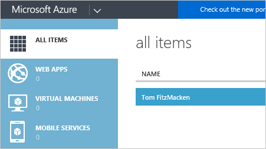

<properties
   pageTitle="Resource Manager and classic deployment | Microsoft Azure"
   description="Describes the differences between the Resource Manager deployment model and the classic (or Service Management) deployment model."
   services="azure-resource-manager"
   documentationCenter="na"
   authors="tfitzmac"
   manager="timlt"
   editor="tysonn"/>

<tags
   ms.service="azure-resource-manager"
   ms.devlang="na"
   ms.topic="article"
   ms.tgt_pltfrm="na"
   ms.workload="na"
   ms.date="07/29/2016"
   ms.author="tomfitz"/>

# Azure Resource Manager vs. classic deployment: Understand deployment models and the state of your resources

In this topic, you will learn about Azure Resource Manager and classic deployment models, the state of your resources, and why your resources were deployed with one or the other. The Resource Manager deployment model contains important differences from the classic deployment model, and the two models are not completely compatible with each other. To simplify the deployment and management of resources, Microsoft recommends that you use Resource Manager for new resources, and, if possible, re-deploy existing resources through Resource Manager.

If you are completely new to Resource Manager, you may want to first review the terminology defined in the [Azure Resource Manager overview](resource-group-overview.md).

## History of the deployment models

Azure originally provided only the classic deployment model. In this model, each resource existed independently; there was no way to group related resources together. Instead, you had to manually track which resources made up your solution or application, and remember to manage them in a coordinated approach. To deploy a solution, you had to either create each resource individually through the classic portal or create a script that deployed all of the resources in the correct order. To delete a solution, you had to delete each resource individually. You could not easily apply and update access control policies for related resources. Finally, you could not apply tags to resources to label them with terms that help you monitor your resources and manage billing.

In 2014, Azure introduced Resource Manager which added the concept of a resource group. A resource group is a container for resources that share a common lifecycle. The Resource Manager deployment model provides several benefits:

- You can deploy, manage, and monitor all of the services for your solution as a group, rather than handling these services individually.
- You can repeatedly deploy your solution throughout its lifecycle and have confidence your resources are deployed in a consistent state.
- You can apply access control to all resources in your resource group, and those policies are automatically applied when new resources are added to the resource group.
- You can apply tags to resources to logically organize all of the resources in your subscription.
- You can use JavaScript Object Notation (JSON) to define the infrastructure for your solution. The JSON file is known as a Resource Manager template.
- You can define the dependencies between resources so they are deployed in the correct order.

When Resource Manager was added, all resources were retroactively added to default resource groups. If you create a resource through classic deployment now, the resource is automatically created within a default resource group for that service, even though you did not specify that resource group at deployment. However, just existing within a resource group does not mean that the resource has been converted to the Resource Manager model. We'll look at how each service handles the two deployment models in the next section. 

## Understanding support for the models 

When considering how the two deployment models affect your resources, there are three scenarios to be aware of:

1. The service supports Resource Manager and provides only a single type (for Resource Manager).
2. The service supports Resource Manager but provides two types - one for Resource Manager and one for classic. This applies only to virtual machines, storage accounts, and virtual networks.
3. The service does not support Resource Manager.

To discover whether or not a service supports Resource Manager, see [Resource Manager supported providers](resource-manager-supported-services.md).

If the service you wish to use does not support Resource Manager, you must continue using classic deployment.

If the service supports Resource Manager and is not a virtual machine, storage account or virtual network, you can use Resource Manager without any complications.

For virtual machines, storage accounts, and virtual networks, if the resource was created through classic deployment, you must continue to operate on it through classic operations. If the resource was created through Resource Manager deployment, you must continue using Resource Manager operations. This distinction can get particularly confusing when your subscription contains a mix of resources created through Resource Manager and classic deployment. This combination of resources can create unexpected results because the resources do not support the same operations.

In some cases, a Resource Manager command can retrieve information about a resource created through classic deployment, or can perform an administrative tasks such as moving a classic resource to another resource group, but these cases should not give the impression that the type supports Resource Manager operations. For example, suppose you have a resource group that contains a virtual machine that was created with classic deployment. If you run the following Resource Manager PowerShell command:

    Get-AzureRmResource -ResourceGroupName ExampleGroup -ResourceType Microsoft.ClassicCompute/virtualMachines

It will return the virtual machine:
    
    Name              : ExampleClassicVM
    ResourceId        : /subscriptions/{guid}/resourceGroups/ExampleGroup/providers/Microsoft.ClassicCompute/virtualMachines/ExampleClassicVM
    ResourceName      : ExampleClassicVM
    ResourceType      : Microsoft.ClassicCompute/virtualMachines
    ResourceGroupName : ExampleGroup
    Location          : westus
    SubscriptionId    : {guid}

However, the Resource Managar cmdlet **Get-AzureRmVM** only returns virtual machines deployed through Resource Manager. The following command does not return the virtual machine created through classic deployment.

    Get-AzureRmVM -ResourceGroupName ExampleGroup

There are some other important considerations when working with virtual machines.

- Virtual machines deployed with the classic deployment model cannot be included in a virtual network deployed with Resource Manager.
- Virtual machines deployed with the Resource Manager deployment model must be included in a virtual network.
- Virtual machines deployed with the classic deployment model don't have to be included in a virtual network.

To learn about connecting virtual networks from different deployment models, see [Connecting classic VNets to new VNets](./virtual-network/virtual-networks-arm-asm-s2s.md).

Only resources created through Resource Manager support tags. You cannot apply tags to classic resources. For more information about using tags in Resource Manager, see [Using tags to organize your Azure resources](resource-group-using-tags.md).

## Resource Manager characteristics

To help you understand the two models, let's review the characteristics of Resource Manager types:

- Created through the [Azure portal](https://portal.azure.com/).

     

     For Compute, Storage, and Networking resources, you have the option of using either Resource Manager or Classic deployment. Select **Resource Manager**.

     

- Created with the Resource Manager version of the Azure PowerShell cmdlets. These commands have the format *Verb-AzureRmNoun*, as shown below.

        New-AzureRmResourceGroupDeployment

- Created through the [Azure Resource Manager REST API](https://msdn.microsoft.com/library/azure/dn790568.aspx) for REST operations.

- Created through Azure CLI commands run in the **arm** mode.

        azure config mode arm
        azure group deployment create 

- The resource type does not include **(classic)** in the name. The image below shows the type as **Storage account**.

    

The application shown in the following diagram shows how resources deployed through Resource Manager are contained in a single resource group.

  

Additionally, there are relationships between the resources within the resource providers:

- A virtual machine depends on a specific storage account defined in the SRP to store its disks in blob storage (required).
- A virtual machine references a specific NIC defined in the NRP (required) and an availability set defined in the CRP (optional).
- A NIC references the virtual machine's assigned IP address (required), the subnet of the virtual network for the virtual machine (required), and to a Network Security Group (optional).
- A subnet within a virtual network references a Network Security Group (optional).
- A load balancer instance references the backend pool of IP addresses that include the NIC of a virtual machine (optional) and references a load balancer public or private IP address (optional).

## Classic deployment characteristics

You may also know the classic deployment model as the Service Management model.

Resources created in the classic deployment model share the following characteristics:

- Created through the [classic portal](https://manage.windowsazure.com)

     

     Or, the Azure portal and you specify **Classic** deployment (for Compute, Storage, and Networking).

     

- Created through the Service Management version of the Azure PowerShell cmdlets. These command names have the format *Verb-AzureNoun*, as shown below.

        New-AzureVM 

- Created through the [Service Management REST API](https://msdn.microsoft.com/library/azure/ee460799.aspx) for REST operations.
- Created through Azure CLI commands run in **asm** mode.

        azure config mode asm
        azure vm create 

- The resource type includes **(classic)** in the name. The image below shows the type as **Storage account (classic)**.

    

You can still use the Azure portal to manage resources that were created through classic deployment.

In Azure Service Management, the compute, storage, or network resources for hosting virtual machines are provided by:

- A required cloud service that acts as a container for hosting virtual machines (compute). Virtual machines are automatically provided with a network interface card (NIC) and an IP address assigned by Azure. Additionally, the cloud service contains an external load balancer instance, a public IP address, and default endpoints to allow remote desktop and remote PowerShell traffic for Windows-based virtual machines and Secure Shell (SSH) traffic for Linux-based virtual machines.
- A required storage account that stores the VHDs for a virtual machine, including the operating system, temporary, and additional data disks (storage).
- An optional virtual network that acts as an additional container, in which you can create a subnetted structure and designate the subnet on which the virtual machine is located (network).

Here are the components and their relationships for Azure Service Management.

  

## Migrating from classic to Resource Manger

If you are ready to migrate your resources from classic deployment to Resource Manager deployment, see:

1. [Technical deep dive on platform-supported migration from classic to Azure Resource Manager](./virtual-machines/virtual-machines-windows-migration-classic-resource-manager-deep-dive.md)
2. [Platform supported migration of IaaS resources from Classic to Azure Resource Manager](./virtual-machines/virtual-machines-windows-migration-classic-resource-manager.md)
3. [Migrate IaaS resources from classic to Azure Resource Manager by using Azure PowerShell](./virtual-machines/virtual-machines-windows-ps-migration-classic-resource-manager.md)
4. [Migrate IaaS resources from classic to Azure Resource Manager by using Azure CLI](./virtual-machines/virtual-machines-linux-cli-migration-classic-resource-manager.md)

## Next steps

- To walkthrough the creation of template that defines a virtual machine, storage account, and virtual network, see [Resource Manager template walkthrough](resource-manager-template-walkthrough.md).
- To learn about the structure of Resource Manager templates, see [Authoring Azure Resource Manager templates](resource-group-authoring-templates.md).
- To see the commands for deploying a template, see [Deploy an application with Azure Resource Manager template](resource-group-template-deploy.md).
