<properties
	pageTitle="Export Azure Resource Manager template | Microsoft Azure"
	description="Use Azure Resource Manage to export a template from an existing resource group."
	services="azure-resource-manager"
	documentationCenter=""
	authors="tfitzmac"
	manager="timlt"
	editor="tysonn"/>

<tags
	ms.service="azure-resource-manager"
	ms.workload="multiple"
	ms.tgt_pltfrm="na"
	ms.devlang="na"
	ms.topic="get-started-article"
	ms.date="06/28/2016"
	ms.author="tomfitz"/>

# Export an Azure Resource Manager template from existing resources

Resource Manager enables you to export a Resource Manager template from existing resources in your subscription. You can use that generated template to learn about the template syntax or to automate the redeployment of your solution as needed.

It is important to note that there are two different ways to export a template:

- You can export the actual template that was used for a deployment. The exported template includes all of the parameters and variables exactly as they were defined in the original template. This approach is particularly helpful when you have deployed resources through the portal, and now want to see how to construct the template to create those resources.
- You can export a template that represents the current state of the resource group. The exported template is not based on any template that was used for deployment. Instead, it creates a template that is a snapshot of the resource group. The exported template will have many hard-coded values and probably not as many parameters as you would typically define. This approach is useful when you have modified the resource group through the portal or scripts, and now need to capture the resource group as a template.

Both approaches are shown in this topic. In the [Customize an exported Azure Resource Manager template](resource-manager-customize-template.md) article, you will see how to take a template that was generated from the current state of the resource group and make it more useful for re-deploying your solution.

In this tutorial, you will sign in to the Azure portal, create a storage account, and export the template for that storage account. You will add a virtual network to modify the resource group. Finally, you will export a new template that represents its current state. Although this article focuses on a simplified infrastructure, you could use these same steps to export a template for a more complicated solution.

## Create a storage account

1. In the [Azure portal](https://portal.azure.com), select **New** > **Data + Storage** > **Storage account**.

      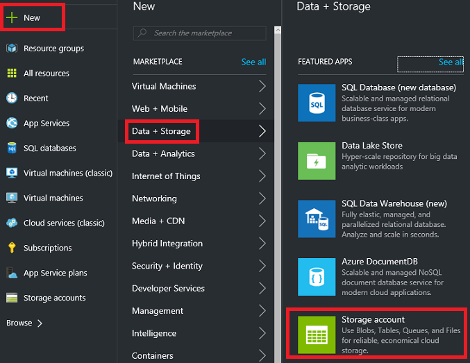

2. Create a storage account with the name **storage**, your initials, and the date. The storage account name must be unique across Azure. If you initially try a name that's already in use, try a variation. For resource group, use **ExportGroup**. You can use the default values for the other properties. Select **Create**.

      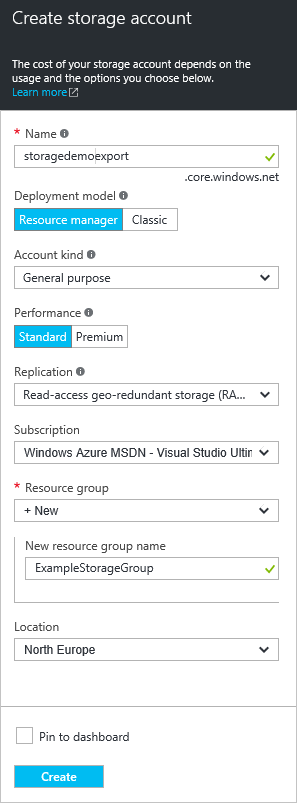

After the deployment finishes, your subscription contains the storage account.

## Export the template from deployment history

1. Go to the resource group blade for your new resource group. You will notice that the result of the last deployment is listed. Select this link.

      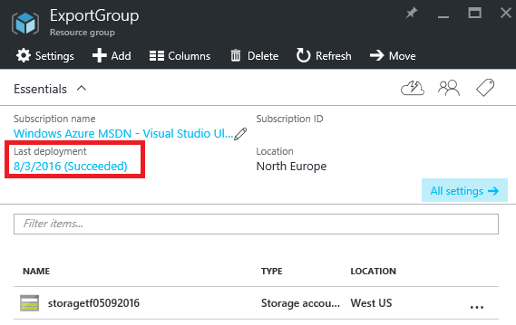

2. You will see a history of deployments for the group. In your case, only one deployment is probably listed. Select this deployment.

     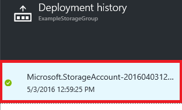

3. A summary of the deployment is displayed. The summary includes the status of the deployment and its operations and the values that you provided for parameters. To see the template that was used for the deployment, select **View template**.

     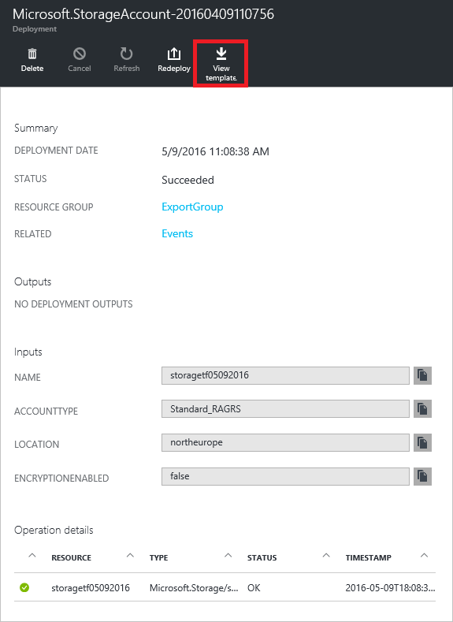

4. Resource Manager retrieves the following five files for you:

   1. **Template** - The template that defines the infrastructure for your solution. When you created the storage account through the portal, Resource Manager used a template to deploy it and saved that template for future reference.
   2. **Parameters** - A parameter file that you can use to pass in values during deployment. It contains the values that you provided during the first deployment, but you can change any of these values when you redeploy the template.
   3. **CLI** - An Azure command-line-interface (CLI) script file that you can use to deploy the template.
   4. **PowerShell** - An Azure PowerShell script file that you can use to deploy the template.
   5. **.NET** - A .NET class that you can use to deploy the template.

     The files are available through links across the blade. By default, the template is selected.

       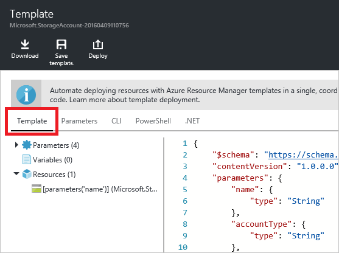

     Let's pay particular attention to the template. Your template should look similar to:

        {
          "$schema": "https://schema.management.azure.com/schemas/2015-01-01/deploymentTemplate.json#",
          "contentVersion": "1.0.0.0",
          "parameters": {
            "name": {
              "type": "String"
            },
            "accountType": {
              "type": "String"
            },
            "location": {
              "type": "String"
            },
            "encryptionEnabled": {
              "defaultValue": false,
              "type": "Bool"
            }
          },
          "resources": [
            {
              "type": "Microsoft.Storage/storageAccounts",
              "sku": {
                "name": "[parameters('accountType')]"
              },
              "kind": "Storage",
              "name": "[parameters('name')]",
              "apiVersion": "2016-01-01",
              "location": "[parameters('location')]",
              "properties": {
                "encryption": {
                  "services": {
                    "blob": {
                      "enabled": "[parameters('encryptionEnabled')]"
                    }
                  },
                  "keySource": "Microsoft.Storage"
                }
              }
            }
          ]
        }
 
This is the actual template used to create your storage account. Notice it contains parameters that enable you to deploy different types of storage accounts. To learn more about the structure of a template, see [Authoring Azure Resource Manager templates](resource-group-authoring-templates.md). For the complete list of the functions you can use in a template, see [Azure Resource Manager template functions](resource-group-template-functions.md).


## Add a virtual network

The template that you downloaded in the previous section represented the infrastructure for that original deployment, but it will not account for any changes you make after the deployment.
To illustrate this issue, let's modify the resource group by adding a virtual network through the portal.

1. In the resource group blade, select **Add**.

      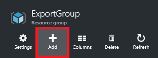

2. Select **Virtual network** from the available resources.

      

2. Name your virtual network **VNET**, and use the default values for the other properties. Select **Create**.

      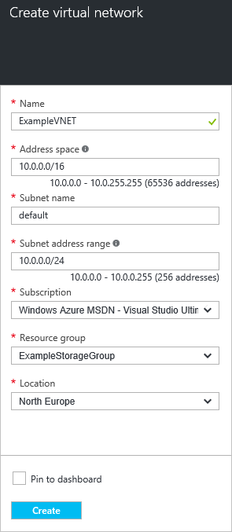

3. After the virtual network has successfully deployed to your resource group, look again at the deployment history. You will now see two deployments. If you do not see the second deployment, you may need to close your resource group blade and re-open it. Select the more recent deployment.

      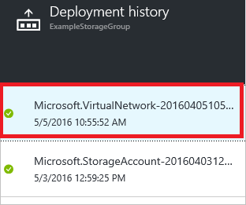

4. Look at the template for that deployment. Notice that it defines only the changes that you have made to add the virtual network.

It is generally a best practice to work with a template that deploys all the infrastructure for your solution in a single operation rather than remembering many different templates to deploy.


## Export the template from resource group

Although each deployment shows only the changes that you have made to your resource group, at any time you can export a template to show the attributes of your entire resource group.  

1. To view the template for a resource group, select **Export template**.

      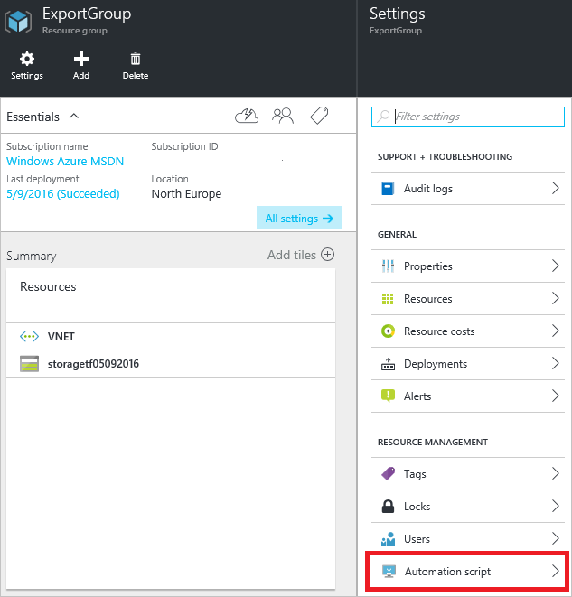

     Not all resource types support the export template function. If your resource group only contains the storage account and virtual network shown in this article, you will not see an error. However, if you have created other resource types, you may see an error stating that there is a problem with the export. You will learn how to handle those issues in the [Fix export issues](#fix-export-issues) section.

      

2. You will again see the five files that you can use to redeploy the solution, but this time the template is a little different. This template has only two parameters: one for the storage account name, and one for the virtual network name.

        "parameters": {
          "virtualNetworks_VNET_name": {
            "defaultValue": "VNET",
            "type": "String"
          },
          "storageAccounts_storagetf05092016_name": {
            "defaultValue": "storagetf05092016",
            "type": "String"
          }
        },

     Resource Manager did not retrieve the templates that were used during deployment. Instead, it generated a new template that's based on the current configuration of the resources. For example, the storage account location and replication value are set to:

        "location": "northeurope",
        "tags": {},
        "properties": {
            "accountType": "Standard_RAGRS"
        },

3. Download the template so that you can work on it locally.

      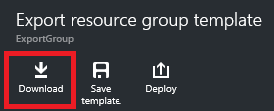

4. Find the .zip file that you downloaded and extract the contents. You can use this downloaded template to redeploy your infrastructure.

## Fix export issues

Not all resource types support the export template function. Some resource types are specifically not exported to prevent exposing sensitive data. For example, if you have a connection string in your site config, you probably do not want it explicitly displayed in an exported template. You can get around this issue by manually adding the missing resources back into your template.

> [AZURE.NOTE] You will only encounter export issues when exporting from a resource group rather than from your deployment history. If your last deployment accurately represents the current state of the resource group, you should export the template from the deployment history rather than from the resource group. Only export from a resource group when you have made changes to the resource group that are not defined in a single template.

For example, if you export a template for a resource group that contains a web app, SQL Database, and a connection string in the site config, you will see the following message.

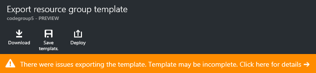

Selecting the message will show you exactly which resource types were not exported. 
     


Some common fixes are shown below. To implement these resources, you will need to add parameters to template. For more information, see [Customize and re-deploy exported template](resource-manager-customize-template.md).

### Connection string

In the web sites resource, add a definition for the connection string to the database:

```
{
  "type": "Microsoft.Web/sites",
  ...
  "resources": [
    {
      "apiVersion": "2015-08-01",
      "type": "config",
      "name": "connectionstrings",
      "dependsOn": [
          "[concat('Microsoft.Web/Sites/', parameters('<site-name>'))]"
      ],
      "properties": {
          "DefaultConnection": {
            "value": "[concat('Data Source=tcp:', reference(concat('Microsoft.Sql/servers/', parameters('<database-server-name>'))).fullyQualifiedDomainName, ',1433;Initial Catalog=', parameters('<database-name>'), ';User Id=', parameters('<admin-login>'), '@', parameters('<database-server-name>'), ';Password=', parameters('<admin-password>'), ';')]",
              "type": "SQLServer"
          }
      }
    }
  ]
}
```    

### Web site extension

In the web site resource, add a definition for the code to install:

```
{
  "type": "Microsoft.Web/sites",
  ...
  "resources": [
    {
      "name": "MSDeploy",
      "type": "extensions",
      "location": "[resourceGroup().location]",
      "apiVersion": "2015-08-01",
      "dependsOn": [
        "[concat('Microsoft.Web/sites/', parameters('<site-name>'))]"
      ],
      "properties": {
        "packageUri": "[concat(parameters('<artifacts-location>'), '/', parameters('<package-folder>'), '/', parameters('<package-file-name>'), parameters('<sas-token>'))]",
        "dbType": "None",
        "connectionString": "",
        "setParameters": {
          "IIS Web Application Name": "[parameters('<site-name>')]"
        }
      }
    }
  ]
}
```

### Virtual machine extension

For examples of virtual machine extensions, see [Azure Windows VM Extension Configuration Samples](./virtual-machines/virtual-machines-windows-extensions-configuration-samples.md).

### Virtual network gateway

Add a virtual network gateway resource type.

```
{
  "type": "Microsoft.Network/virtualNetworkGateways",
  "name": "[parameters('<gateway-name>')]",
  "apiVersion": "2015-06-15",
  "location": "[resourceGroup().location]",
  "properties": {
    "gatewayType": "[parameters('<gateway-type>')]",
    "ipConfigurations": [
      {
        "name": "default",
        "properties": {
          "privateIPAllocationMethod": "Dynamic",
          "subnet": {
            "id": "[resourceId('Microsoft.Network/virtualNetworks/subnets', parameters('<vnet-name>'), parameters('<new-subnet-name>'))]"
          },
          "publicIpAddress": {
            "id": "[resourceId('Microsoft.Network/publicIPAddresses', parameters('<new-public-ip-address-Name>'))]"
          }
        }
      }
    ],
    "enableBgp": false,
    "vpnType": "[parameters('<vpn-type>')]"
  },
  "dependsOn": [
    "Microsoft.Network/virtualNetworks/codegroup4/subnets/GatewaySubnet",
    "[concat('Microsoft.Network/publicIPAddresses/', parameters('<new-public-ip-address-Name>'))]"
  ]
},
```

### Local network gateway

Add a local network gateway resource type.

```
{
    "type": "Microsoft.Network/localNetworkGateways",
    "name": "[parameters('<local-network-gateway-name>')]",
    "apiVersion": "2015-06-15",
    "location": "[resourceGroup().location]",
    "properties": {
      "localNetworkAddressSpace": {
        "addressPrefixes": "[parameters('<address-prefixes>')]"
      }
    }
}
```

### Connection

Add a connection resource type.

```
{
    "apiVersion": "2015-06-15",
    "name": "[parameters('<connection-name>')]",
    "type": "Microsoft.Network/connections",
    "location": "[resourceGroup().location]",
    "properties": {
        "virtualNetworkGateway1": {
        "id": "[resourceId('Microsoft.Network/virtualNetworkGateways', parameters('<gateway-name>'))]"
      },
      "localNetworkGateway2": {
        "id": "[resourceId('Microsoft.Network/localNetworkGateways', parameters('<local-gateway-name>'))]"
      },
      "connectionType": "IPsec",
      "routingWeight": 10,
      "sharedKey": "[parameters('<shared-key>')]"
    }
},
```


## Next steps

Congratulations! You have learned how to export a template from resources that you created in the portal.

- In the second part of this tutorial, you will customize the template that you just downloaded by adding more parameters and redeploy it through a script. See [Customize and re-deploy exported template](resource-manager-customize-template.md).
- To see how to export a template through PowerShell, see [Using Azure PowerShell with Azure Resource Manager](powershell-azure-resource-manager.md).
- To see how to export a template through Azure CLI, see [Use the Azure CLI for Mac, Linux, and Windows with Azure Resource Manager](xplat-cli-azure-resource-manager.md).
