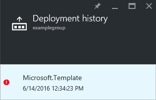
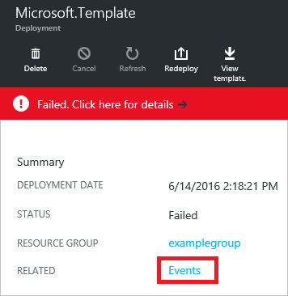
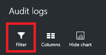
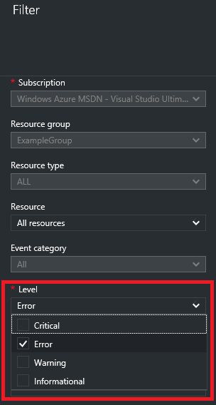
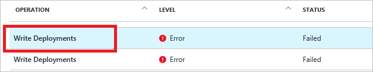
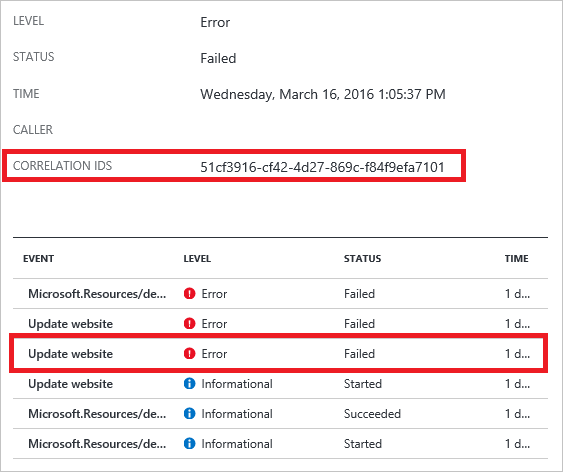
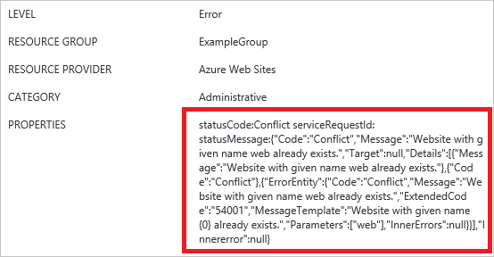

<properties
   pageTitle="View deployment operations with portal | Microsoft Azure"
   description="Describes how to use the Azure portal to detect errors from Resource Manager deployment."
   services="azure-resource-manager,virtual-machines"
   documentationCenter=""
   tags="top-support-issue"
   authors="tfitzmac"
   manager="timlt"
   editor="tysonn"/>

<tags
   ms.service="azure-resource-manager"
   ms.devlang="na"
   ms.topic="article"
   ms.tgt_pltfrm="vm-multiple"
   ms.workload="infrastructure"
   ms.date="06/15/2016"
   ms.author="tomfitz"/>

# View deployment operations with Azure Portal

> [AZURE.SELECTOR]
- [Portal](resource-manager-troubleshoot-deployments-portal.md)
- [PowerShell](resource-manager-troubleshoot-deployments-powershell.md)
- [Azure CLI](resource-manager-troubleshoot-deployments-cli.md)
- [REST API](resource-manager-troubleshoot-deployments-rest.md)

You can view the operations for a deployment through the Azure portal. You may be most interested in viewing the operations when you have received an error during deployment so this article focuses on viewing operations that have failed. The portal provides an interface that enables you to easily find the errors and determine potential fixes.

[AZURE.INCLUDE [resource-manager-troubleshoot-introduction](../includes/resource-manager-troubleshoot-introduction.md)]

## Use deployment operations to troubleshoot

To see the deployment operations, use the following steps:

1. For the resource group involved in the deployment, notice the status of the last deployment. You can select this status to get more details.

    

2. You will see the recent deployment history. Select the deployment that failed.

    

3. Select **Failed. Click here for details** to see a description of why the deployment failed. In the image below, the DNS record is not unique.  

    

    This error message should be enough for you to begin troubleshooting. However, if you need more details about which tasks were completed, you can view the operations as shown in the following steps.

4. You can view all of the deployment operations in the **Deployment** blade. Select any operation to see more details.

    

    In this case, you see that the storage account, virtual network, and availability set were successfully created. The public IP address failed, and other resources were not attempted.

5. You can view events for the deployment by selecting **Events**.

    

6. You see all of the events for the deployment and select any one for more details.

    

## Use audit logs to troubleshoot

[AZURE.INCLUDE [resource-manager-audit-limitations](../includes/resource-manager-audit-limitations.md)]

To see errors for a deployment, use the following steps:

1. View the audit logs for a resource group by selecting **Audit Logs**.

    

2. In the **Audit Logs** blade, you will see a summary of recent operations for all of the resource groups in your subscription. It includes a graphical representation of the time and status of the operations, as well as a list of the operations.

    

3. You can filter your view of the audit logs to focus on particular conditions. Select **Filter** at the top of the **Audit logs** blade.

    

4. From the **Filter** blade, select conditions to restrict your view of the audit logs to only those operations you want to see. For example, you can filter operations to only display errors for the resource group.

    

5. You can further filter operations by setting a time span. The following image filters the view to a particular 20-minute timespan.

    

6. You can select any of the operations in the list. Pick the operation that contains the error you wish to research.

    
  
7. You will see all of the events for that operation. Notice the **Correlation IDS** in the summary. This ID is used to track related events. It can be helpful when working with technical support to troubleshoot an issue. You can select any of event to see details about the event.

    

8. You will see details about the event. In particular, pay attention to the **Properties** for information about the error.

    

The filter you applied to the audit log is retained the next time you view it, so you may need to change those values to broaden your view of the operations.

## Next steps

- For help with resolving particular deployment errors, see [Resolve common errors when deploying resources to Azure with Azure Resource Manager](resource-manager-common-deployment-errors.md).
- To learn about using the audit logs to monitor other types of actions, see [Audit operations with Resource Manager](resource-group-audit.md).
- To validate your deployment prior to executing it, see [Deploy a resource group with Azure Resource Manager template](resource-group-template-deploy.md).
