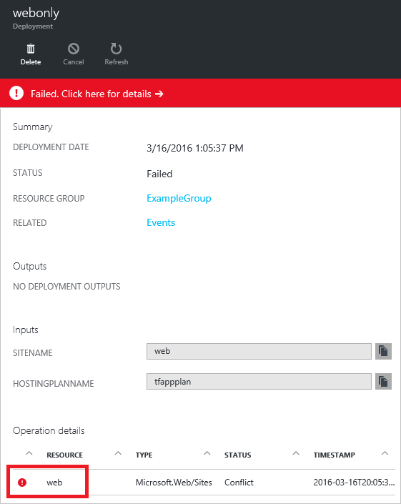
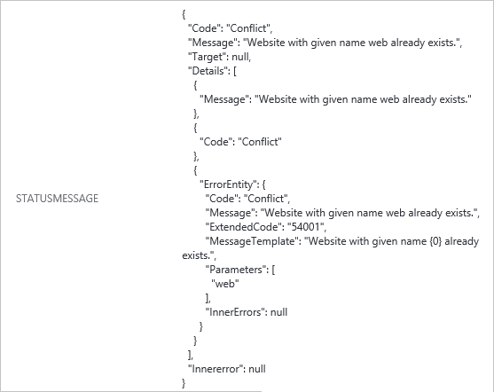

<properties
   pageTitle="Troubleshooting deployments with Portal | Microsoft Azure"
   description="Describes how to use the Azure Portal to detect and fix issues from Resource Manager deployment."
   services="azure-resource-manager,virtual-machines"
   documentationCenter=""
   tags="top-support-issue"
   authors="tfitzmac"
   manager="timlt"
   editor=""/>

<tags
   ms.service="azure-resource-manager"
   ms.devlang="na"
   ms.topic="article"
   ms.tgt_pltfrm="vm-multiple"
   ms.workload="infrastructure"
   ms.date="03/21/2016"
   ms.author="tomfitz"/>

# Troubleshooting resource group deployments with Azure Portal

> [AZURE.SELECTOR]
- [Portal](resource-manager-troubleshoot-deployments-portal.md)
- [PowerShell](resource-manager-troubleshoot-deployments-powershell.md)
- [Azure CLI](resource-manager-troubleshoot-deployments-cli.md)
- [REST API](resource-manager-troubleshoot-deployments-rest.md)

If you've received an error when deploying resources to Azure, you need to troubleshoot what went wrong. The Azure Portal provides an interface that enables you to easily find the errors and determine potential fixes.

You can troubleshoot your deployment by looking at either the audit logs, or the deployment operations. This topic shows both methods.

You can avoid some errors by validating your template and infrastructure prior to deployment. For more information, see [Deploy a resource group with Azure Resource Manager template](resource-group-template-deploy.md).

## Use audit logs to troubleshoot

[AZURE.INCLUDE [resource-manager-audit-limitations](../includes/resource-manager-audit-limitations.md)]

To see errors for a deployment, use the following steps:

1. View the audit logs through the portal by selecting **Browse** and **Audit Logs**.

    

2. In the **Audit Logs** blade, you will see a summary of recent operations for all of the resource groups in your subscription. It includes a graphical representation of the time and status of the operations, as well as a list of the operations.

    

3. You can select any of the operations in the list. Pick the operation that contains the error you wish to research.

    
  
4. You will see all of the events for that operation. Notice the **Correlation IDS** in the summary. This ID is used to track related events. It can be helpful when working with technical support to troubleshoot an issue. You can select any of event to see details about the event.

    

5. You will see details about the event. In particular, pay attention to the **Properties** for information about the error.

    

You can filter your view of the audit logs to focus on particular conditions. To customize your view of the audit log:

1. Select **Filter** at the top of the **Audit logs** blade.

    

2. From the **Filter** blade, select conditions to restrict your view of the audit logs to only those operations you want to see. For example, you can filter operations to only display errors for a particular resource group.

    

3. You can further filter operations by setting a time span. The following image filters the view to a particular 20 minute timespan.

    

After updating the view of the audit logs, you will only see the operations that meet the specified condition. Those settings are retained the next time you view the audit logs, so you may need to change those values to broaden your view of the operations.

Hopefully, you have been able to find out why your deployment failed. You can also look at the deployment operations for information about the status, as shown in the next section.

## Use deployment operations to troubleshoot

To see the deployment operations, use the following steps:

1. For the resource group involved in the deployment, notice the status of the last deployment. You can select this status to get more details.

    

2. You will see the recent deployment history. Select the deployment that failed.

    

3. View the information about the deployment, and select the failed operation to see details about the error.

    

4. In the **Operations details** blade, you will see information about the failed operation. In particular, pay attention to the status message.

    

## Next steps

- To learn about using the audit logs to monitor other types of actions, see [Audit operations with Resource Manager](resource-group-audit.md).
- To validate your deployment prior to executing it, see [Deploy a resource group with Azure Resource Manager template](resource-group-template-deploy.md).