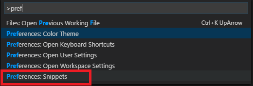
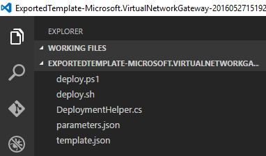
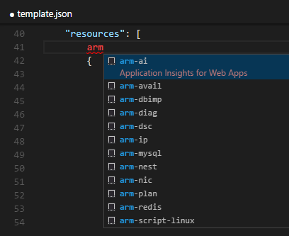
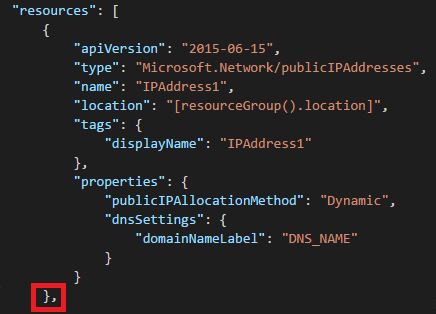
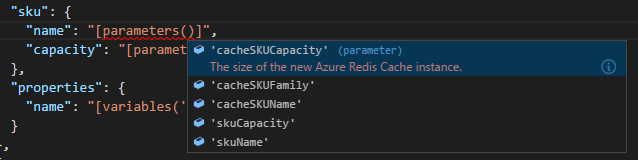
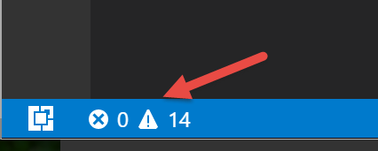

<properties
   pageTitle="Use VS Code with Resource Manager templates | Microsoft Azure"
   description="Shows how to set up Visual Studio Code to create Azure Resource Manager templates."
   services="azure-resource-manager"
   documentationCenter="na"
   authors="cmatskas"
   manager="timlt"
   editor="tysonn"/>

<tags
   ms.service="azure-resource-manager"
   ms.devlang="na"
   ms.topic="article"
   ms.tgt_pltfrm="na"
   ms.workload="na"
   ms.date="06/29/2016"
   ms.author="chmatsk;tomfitz"/>

# Working with Azure Resource Manager Templates in Visual Studio Code

Azure Resource Manager templates are JSON files that describe a resource and related dependencies. These files can sometimes be large and complicated so tooling support is important. Visual Studio Code is a new, lightweight, open-source, cross-platform code editor from Microsoft that supports creating and editing Resource Manager templates through a [new extension](https://marketplace.visualstudio.com/items?itemName=msazurermtools.azurerm-vscode-tools).

If you do not already have VS Code, you can install it at [https://code.visualstudio.com/](https://code.visualstudio.com/).

## Install the VS Code extension for Resource Manager

To be able to work with the JSON templates, you need to first install the extension by following these steps:

1. Launch VS Code 
2. Open Quick Open (Ctrl+P) 
3. Paste the following command, and type enter 

        ext install azurerm-vscode-tools

4. Restart VS Code when prompted to enable the extension. 

This will download and install the language support for Resource Manager JSON templates. Job done!

## Set up snippets for resources

The previous steps installed the tooling support, but now we need to configure VS Code to use JSON template snippets.

1. Copy the contents of the file from the [azure-xplat-arm-tooling](https://github.com/Azure/azure-xplat-arm-tooling/blob/master/VSCode/armsnippets.json) repository to your clipboard from 
[https://raw.githubusercontent.com/Azure/azure-xplat-arm-tooling/master/VSCode/armsnippets.json](https://raw.githubusercontent.com/Azure/azure-xplat-arm-tooling/master/VSCode/armsnippets.json).
2. Launch VS Code 
3. In VS Code, open the JSON snippets file with one of the following methods:
   - navigate to **File** -> **Preferences** -> **User Snippets** -> **JSON** or
   - select **F1** and start typing **preferences** until you can select **Preferences: Snippets**.

       

       From the options, select **JSON**.

       

4. Paste the contents of the file on step 1 into your user snippets file before the final "}" 
5. Make sure the JSON looks OK and there are no squiggles anywhere 
6. Save and close the user snippets file

That's all that's needed to start using the Resource Manager specific snippets. Next, we'll put this setup to the test.

## Work with template in VS Code

The easiest way to start working with a template is to either grab one of the Quick Start Templates available on [Github](https://github.com/Azure/azure-quickstart-templates) or use one of your own. You can easily [export a template](resource-manager-export-template.md) for any of your resource groups through the portal. 

1. If you exported a template from a resource group, open the extracted files in VS Code.

    

2. Open the template.json file so that you can edit it and add some additional resources. After the **"resources": [** press enter to start a new line. If you type **arm** you'll be presented with a list of options. These options are the template snippets you installed. It should look like this: 

    

3. Choose the snippet you wish. For this article, I chose **arm-ip** to create a new public IP address. Put a comma after the closing bracket "}" of the newly created resource to make sure your template syntax is valid.

     

4. VS Code has built-in IntelliSense. As you edit your templates, VS Code suggests available values. To add a variables section to your template, add **""** (two double-quotes) and select **Ctrl+Space** between those quotes. You will be presented with options including **variables**.

    

5. Intellisense can also suggest available parameter or variables values and template functions. To set a property to a parameter value, create an expression with **"[]"** and **Ctrl+Space**. You can start typing the name of a function. Select **Tab** when you have found the function you want.

    

6. Select **Ctrl+Space** again within the function to see a list of the available parameters within your template.

    

7. If you have any schema validation issues in your template, you'll see the familiar squiggles in the editor. You can view the list of errors and warnings by typing **Ctrl+Shift+M** or selecting the glyphs in the lower left status bar.

    

   Validation of your template can help you detect syntax problems; however, you may also see errors that you can ignore. In some cases, the editor is comparing your template against a schema that is not up-to-date and therefore reports an error even though you know it is correct. For example, suppose a function has recently been added to Resource Manager but the schema has not been updated. The editor reports an error despite the fact the function works correctly during deployment.

    

## Deploy your new resources

Once you fix all the errors, you can deploy the new resources following the instructions below: 

### Windows

1. Open a PowerShell command prompt 
2. To login type: 

        Login-AzureRmAccount 

3. If you have multiple subscriptions, get a list of the subscriptions with:

         Get-AzureRmSubscription

   And select the subscriptio to use with
   
         Select-AzureRmSubscription -SubscriptionId <Subscription Id>

4. Update the parameters in your parameters.json file
5. Run the Deploy.ps1 to deploy your template on Azure

### OSX/Linux

1. Open a terminal window 
2. To login type:

        azure login 

3. If you have multiple subscriptions, select the right subscription with:

        azure account set <subscriptionNameOrId> 

4. Update the parameters in the parameters.json file.
5. To deploy the template, run:

        azure group deployment create -f <PathToTemplate> 

## Next steps

- To learn more about templates, see [Authoring Azure Resource Manager templates](resource-group-authoring-templates.md).
- To learn about template functions, see [Azure Resource Manager template functions](resource-group-template-functions.md).
