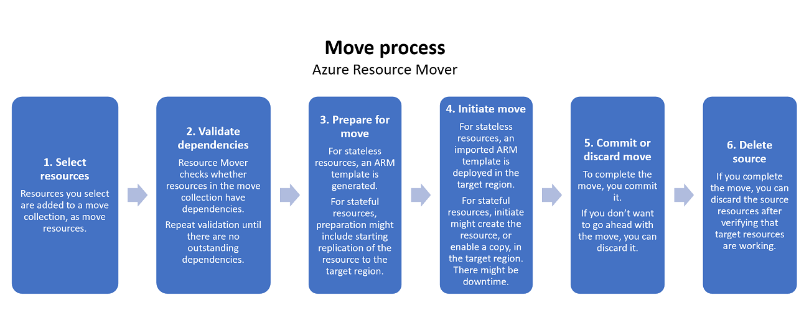

# About the move process

[Azure Resource Mover](overview.md) helps you to move Azure resources across Azure regions. 

This article summarizes the components used by Resource Mover and describes the move process. 

## Components

These components are used during region move.

| **Component** | **Details** |
| --- | --- |
| **Resource Mover** |  Resource Mover coordinates with [Azure resource providers](../azure-resource-manager/management/resource-providers-and-types.md) to orchestrate the move of resources between regions. Resource Mover analyzes resource dependencies, and maintains and manages the state of resources during the move process. |
| **Move collection** |  A move collection is an [Azure Resource Manager](../azure-resource-manager/management/overview.md) object.   The move collection is created during the region move process, for each paired combination of source and target regions in a subscription. The collection contains metadata and configuration information about the resources you want to move.  Resources added to a move collection must be in the same subscription, but can be in different resource groups. |
| **Move resource** | When you add a resource to a move collection, it's tracked by Resource Mover as a move resource.   Resource Mover maintains information for all of the move resources in the move collection, and maintains a one-to-one relationship between the source and target resource. | 
| **Dependencies** | Resource Mover validates resources that you add to a collection, and checks whether resources have any dependencies that aren't in the move collection.   After identifying dependencies for a resource, you can either add them dependencies to the move collection and move them too, or you can select alternate existing resources in the target region. All dependencies must be resolved before you start the move. |

## Move region process 

Each move resource goes through the summarized steps.

| **Step** | **Details** | **State/Issues** |
| --- | --- | --- |
| **Step 1: Select resources** | Select a resource. The resource is added to the move collection. | Resource state moves to *Prepare pending*. |
| **Step 2: Validate dependencies** | Validation of the dependencies is carried out along with addition of resources in the background.    You must add dependent resources if validation shows that dependent resources are pending.    Add them to the move collection.    Add all dependent resources, even if you don't want to move them. You can later specify that the resources you're moving should use different resources in the target region instead of using the **Configuration** option.   You may need to manually validate if there are outstanding dependencies in the **Validate dependencies** tab. ||
| **Step 3: Prepare** | Kick off the prepare process. Preparation steps depend on the resources you're moving:   - **Stateless resources**: Stateless resources have configuration information only. These resources don't need continuous replication of data in order to move them. Examples include Azure virtual networks (VNets), network adapters, load balancers, and network security groups. For this type of resource, the Prepare process generates an Azure Resource Manager template.   - **Stateful resources**: Stateful resources have both configuration information, and data that needs to be moved. Examples include Azure VMs, and Azure SQL databases. The Prepare process differs for each resource. It might include replicating the source resource to the target region. | Kicking off moves resource state to *Prepare in progress*.   After prepare finishes, resource state moves to *Initiate move pending*, with no issues.   An unsuccessful process moves state to *Prepare failed*. |
| **Step 4: Initiate move** | Kick off the move process. The move method depends on the resource type:   - **Stateless**: Typically, for stateless resources, the move process deploys an imported template in the target region. The template is based on the source resource settings, and any manual edits you make to target settings.   - **Stateful**: For stateful resources, the move process might involve creating the resource, or enabling a copy, in the target region.    For stateful resources only, initiating a move might result in downtime of source resources. For example, VMs and SQL. | Kicking off move shifts the state to *Initiate move in progress*.   A successful initiate move moves resource state to *Commit move pending*, with no issues.    An unsuccessful move process moves state to *Initiate move failed*. |
| **Step 5 Option 1: Discard move** | After the initial move, you can decide whether you want to go ahead with a full move. If you don't, you can discard the move, and Resource Mover deletes the resources created in the target. The replication process for stateful resources continues after the Discard process. This option is useful for testing. | Discarding resources moves state to *Discard in progress*.   Successful discard moves state to *Initiate move pending*, with no issues.   A failed discard moves state to *Discard move failed*. |
| **Step 5 Option 2: Commit move** | After the initial move, if you want to go ahead with a full move, you verify resources in the target region, and when you're ready, you commit the move.   For stateful resources only, commit can result in source resources like VMs or SQL becoming inaccessible. | If you commit the move, resource state moves to *Commit move in progress**.   After a successful commit, the resource state shows *Commit move completed*, with no issues.   A failed commit moves state to *Commit move failed*. |
| **Step 6: Delete source** | After committing the move, and verifying resources in the target region, you can delete the source resource. | After committing, a resource state moves to *Delete source pending*. You can then select the source resource and delete it.   Only resources in the *Delete source pending* state can be deleted.   Deleting a resource group or SQL Server in the Resource Mover portal isn't supported. These resources can only be deleted from the resource properties page. |

## Move region states

The move process has a number of states, and issues that can arise during each state. These are summarized in the flowchart.

### Dependency analysis

As you progress through the move process, dependencies are *auto-validated* if:
- A resource uses dependent resources that aren't in the move collection.
- A dependent resource in the move collection has its own dependencies that aren't in the move collection.
- You modified target settings for the resource, and you need to revalidate dependencies.

### Remove resources

If you don’t want to move a resource, you can remove it from the move collection. In general, the resource is then deleted from the collection, along with any associated actions or objects, such as replication, or stored templates. Exactly what happens when you remove a resource depends on the type of resource, and the state of the resource when you delete it. [Learn more](remove-move-resources.md).

## Move impact

The table summarizes what's impacted when you're moving across regions.

| **Behavior** | **Across regions** |
| --- | --- | --- |
| **Data** | Resource data and metadata are moved.   Metadata is stored temporarily to track status of resource dependencies and operations. |
| **Resource** | The source resource stays intact to ensure that apps continue to work, and can optionally be removed after the move.   A resource is created in the target region. |
| **Move process** | Multi-step process requiring manual intervention and monitoring. |
| **Testing** | Testing the move is important, since the apps should continue to work as expected in the target region, after the move. |
| **Downtime** |  No data loss expected, but some downtime to move resources. |

## Next steps

- [Move](tutorial-move-region-virtual-machines.md) Azure VMs to another region.
- [Move](tutorial-move-region-sql.md) Azure SQL resources to another region.

