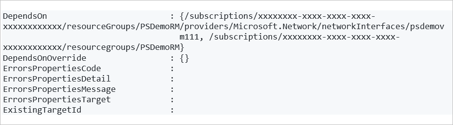

# Modify destination settings

This article describes how to modify destination settings, when moving resources between Azure regions with [Azure Resource Mover](overview.md).


## Modify VM settings

You can modify destination settings when moving Azure VMs and associated resources. We recommend:

- That you only change destination settings after the move collection is validated. However:
    - If you're moving the source resource, you can usually modify these settings until you start the initiate move process.
    - If you assign an existing resource in the source region, you can modify destination settings until the move commit is complete.
- That you modify settings before preparing the resources, because some destination properties might be unavailable for edit after prepare is complete.

### Settings you can modify

Configuration settings you can modify are summarized in the table.

**Resource** | **Options** 
--- | --- 
**VM name** | Destination options:<br/><br/> - Create a new VM with the same name in the destination region.<br/><br/> - Create a new VM with a different name in the destination region.<br/><br/> - Use an existing VM in the destination region.<br/><br/> If you create a new VM, with the exception of the settings you modify, the new destination VM is assigned the same settings as the source.
**VM availability zone** | The availability zone in which the destination VM will be placed. Select **Not applicable** if you don’t want to change the source settings, or if you don’t want to place the VM in an availability zone.
**VM SKU** | The [VM type](https://azure.microsoft.com/pricing/details/virtual-machines/series/) (available in the destination region) that will be used for the destination VM.<br/><br/> The selected destination VM shouldn't be smaller than the source VM.
**VM availability set** | The availability set in which the destination VM will be placed. Select **Not applicable**  you don’t want to change the source settings, or if you don’t want to place the VM in an availability set.
**VM key vault** | The associated key vault when you enable Azure disk encryption on a VM.
**Disk encryption set** | The associated disk encryption set if the VM uses a customer-managed key for server-side encryption.
**Resource group** | The resource group in which the destination VM will be placed.
**Networking resources** | Options for network interfaces, virtual networks (VNets/), and network security groups/network interfaces:<br/><br/> - Create a new resource with the same name in the destination region.<br/><br/> - Create a new resource with a different name in the destination region.<br/><br/> - Use an existing networking resource in the destination region.<br/><br/> If you create a new destination resource, with the exception of the settings you modify, it's assigned the same settings as the source resource.
**Public IP address name, SKU, and zone** | Specifies the name, [SKU](../virtual-network/ip-services/public-ip-addresses.md#sku), and [zone](../virtual-network/ip-services/public-ip-addresses.md#sku) for standard public IP addresses.<br/><br/> If you want it to be zone redundant, enter as **Zone redundant**.
**Load balancer name, SKU, and zone** | Specifies the name, SKU (Basic or Standard), and zone for the load balancer.<br/><br/> We recommend using Standard SKU.<br/><br/> If you want it to be zone redundant, specify as **Zone redundant**.
**Resource dependencies** | Options for each dependency:<br/><br/>- The resource uses source dependent resources that will move to the destination region.<br/><br/> - The resource uses different dependent resources located in the destination region. In this case, you can choose from any similar resources in the destination region.

### Edit VM destination settings

If you don't want to move dependent resources from the source region to the destination, you have a couple of other options:

- Create a new resource in the destination region. Unless you specify different settings, the new resource will have the same settings as the source resource.
- Use an existing resource in the destination region.

Exact behavior depends on the resource type. [Learn more](modify-target-settings.md) about modifying destination settings.

You modify the destination settings for a resource using the **Destination configuration** entry in the resource move collection. 

To modify a setting: 

1. In the **Across regions** page > **Destination configuration** column, click the link for the resource entry.
2. In **Configuration settings**, you can create a new VM in the destination region.
3. Assign a new availability zone, availability set, or SKU to the destination VM. **Availability zone** and **SKU**.
4. Modify or add new tag name or value of the destination VM.

     

5. Choose to **Retain** or **Do not retain** the user-assigned managed identity.

     

> [!NOTE] 
> Retain would assign the user-assigned managed identity to the newly created destination resource. Do not retain would not assign the user-assigned managed identity to the destination resource. The user-assigned managed identity as a resource itself is not been moved to the destination region.

Changes are only made for the resource you're editing. You need to update any dependent resource separately.

## Modify SQL settings

When moving Azure SQL Database resources, you can modify the destination settings for the move. 

- For SQL database:
    - We recommend that you modify destination configuration settings before you prepare them for move.
    - You can modify the settings for the destination database, and zone redundancy for the database.
- For elastic pools:
    -  You can modify the destination configuration anytime before initiating the move.
    - You can modify the destination elastic pool, and zone redundancy for the pool. 

### SQL settings you can modify

**Setting** | **SQL database** | **Elastic pool**
--- | --- | ---
**Name** | Create a new database with the same name in the destination region.<br/><br/> Create a new database with a different name in the destination region.<br/><br/> Use an existing database in the destination region. | Create a new elastic pool with the same name in the destination region.<br/><br/> Create a new elastic pool with a different name in the destination region.<br/><br/> Use an existing elastic pool in the destination region.
**Zone redundancy** | To move from a region that supports zone redundancy to a region that doesn't, type **Disable** in the zone setting.<br/><br/> To move from a region that doesn't support zone redundancy to a region that does, type **Enable** in the zone setting. | To move from a region that supports zone redundancy to a region that doesn't, type **Disable** in the zone setting.<br/><br/> To move from a region that doesn't support zone redundancy to a region that does, type **Enable** in the zone setting.

### Edit SQL destination settings

You modify the destination settings for a Azure SQL Database resource as follows: 

1. In **Across regions**, for the resource you want to modify, click the **Destination configuration** entry.
2. In **Configuration settings**, specify the destination settings summarized in the table above.


## Modify settings in PowerShell

You can modify settings in PowerShell.

1)	Retrieve the move resource for which you want to edit properties. For example, to retrieve a VM run:

    ```azurepowershell
    $moveResourceObj = Get-AzResourceMoverMoveResource -MoveCollectionName "PS-centralus-westcentralus-demoRMS1" -ResourceGroupName "RG-MoveCollection-demoRMS" -Name "PSDemoVM"
    ```
2)	Copy the resource setting to a target resource setting object.

    ```azurepowershell
    $TargetResourceSettingObj = $moveResourceObj.ResourceSetting
    ```

3)	Set the parameter in the target resource setting object. For example, to change the name of the destination VM:

    ```azurepowershell
    $TargetResourceSettingObj.TargetResourceName="PSDemoVM-target"
    ```

4)	Update the move resource destination settings. In this example, we change the name of the VM from *PSDemoVM* to *PSDemoVMTarget*.

    ```azurepowershell
    Update-AzResourceMoverMoveResource -ResourceGroupName "RG-MoveCollection-demoRMS" -MoveCollectionName "PS-centralus-westcentralus-demoRMS" -SourceId "/subscriptions/xxxxxxxx-xxxx-xxxx-xxxx-xxxxxxxxxxxx/resourceGroups/PSDemoRM/providers/Microsoft.Compute/virtualMachines/PSDemoVM" -Name "PSDemoVM" -ResourceSetting $TargetResourceSettingObj
    ```
    **Output**
    


## Next steps

[Move an Azure VM](tutorial-move-region-virtual-machines.md) to another region.
