# Move resources across regions in PowerShell

Learn how to move Azure resources to a different region using PowerShell in Azure Resource Mover. 

> [!NOTE]
> Azure Resource Mover is currently in preview.


## Before you start

- Your Azure subscription should have access to Resource Mover, and you should have [Owner](https://docs.microsoft.com/azure/role-based-access-control/built-in-roles#owner) or [User Access Administrator](https://docs.microsoft.com/azure/role-based-access-control/built-in-roles#user-access-administrator) permissions for the subscription.
- Resource Mover doesn't track changes and upgrades, so make any required changes on resources, before you start moving them.
- When you move resources with PowerShell,  you can't currently edit any target region settings. Modify these settings directly in the portal.
- When you add resources to a move collection, in preparation for moving them to another region, metadata about the move is stored in a resource group that's created for the purpose. Currently this resource group can reside in the East US 2 or North Europe regions. Azure resources can be moved between any public regions using metadata present in either of these regions.

## Sample values

We're using these values in our script examples:

**Setting** | **Value** 
--- | ---
Subscription ID | subscription-id
Resource Mover service location | East US 2
Metadata resource group | RegionMoveRG-centralus-westcentralus
Metadata resource group location | East US 2
Move collection name | MoveCollection-centralus-westcentralus
Source region |  centralus
Source resource group | PSDemoRM
Target region | westcentralus
Target resource group | PSDemoRMtgt
VM to move | PSDemoVM

## Sign in to Azure

Sign in to your Azure subscription.

```azurepowershell-interactive
# Sign in to an Azure subscription
Connect-AzAccount – Subscription "<subscription-id>"
```

## Create the resource group for metadata

Create a resource group to hold the move collection metadata and configuration information.

```azurepowershell-interactive
# Sign in to an Azure subscription
New-AzResourceGroup -Name MoveCollection-centralus-westcentralus -Location "East US 2"
```

**Expected output**:


## Register the resource provider

Register the resource provider Microsoft.Migrate, so that the MoveCollection resource can be created.

```azurepowershell-interactive
# Register the provider
Register-AzResourceProvider -ProviderNamespace Microsoft.Migrate 

# Wait for registration
While(((Get-AzResourceProvider -ProviderNamespace Microsoft.Migrate)| where {$_.RegistrationState -eq "Registered" -and $_.ResourceTypes.ResourceTypeName -eq "moveCollections"}|measure).Count -eq 0)
  {
      Start-Sleep -Seconds 5
      Write-Output "Waiting for registration to complete."
  }
```

## Create the move collection

The MoveCollection object stores metadata and configuration information about resources you want to move.

- For the MoveCollection object to access the subscription in which the Azure Resource Mover service is located, it needs a [system-assigned managed identity](../active-directory/managed-identities-azure-resources/overview.md#managed-identity-types) (formerly known as Managed Service Identify (MSI)) that's trusted by the subscription.
- The identity is assigned the Contributor or the User Access Administrator role for the source subscription.
- To assign a role to the identity, you need a role in the subscription (such as Owner or User Access Administrator), with these permissions:
    -  Microsoft.Authorization/roleAssignments/write
    - Microsoft.Authorization/roleAssignments/delete


```azurepowershell-interactive
# Create a MoveCollection object
New-AzResourceMoverMoveCollection -Name "MoveCollection-centralus-westcentralus " -ResourceGroupName "RegionMoveRG-centralus-westcentralus " -SubscriptionId "<subscription-id>" -SourceRegion "centralus" -TargetRegion "westcentralus" -Location  "East US 2" -IdentityType SystemAssigned
```
**Expected output**:

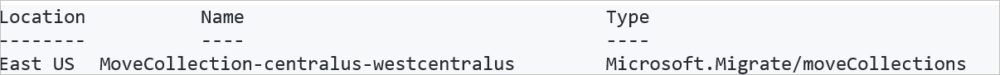


## Assign a managed identity 

Set the subscription ID, retrieve the identity principal of the MoveCollection object, and assign the Azure roles to it.


```azurepowershell-interactive
# Set the subscriptionId
$subscriptionId = "<subscription-id>"

# Retrieve the principal managed identity of the MoveCollection
$moveCollection = Get-AzResourceMoverMoveCollection -SubscriptionId $subscriptionId -ResourceGroupName "RegionMoveRG-centralus-westcentralus " -Name "MoveCollection-centralus-westcentralus "

# Set the IdentityPrincipalID
$identityPrincipalId = $moveCollection.IdentityPrincipalId

# Assign the role to the IdentityPrincipalID
New-AzRoleAssignment -ObjectId $identityPrincipalId -RoleDefinitionName Contributor -Scope "/subscriptions/$subscriptionId"

New-AzRoleAssignment -ObjectId $identityPrincipalId -RoleDefinitionName "User Access Administrator" -Scope "/subscriptions/$subscriptionId"

```

## Add resources to the move collection

Retrieve the ID of the source resource you want to move. Then, add it to the move collection.

```azurepowershell-interactive
# Retrieve the resource ID
Get-AzResource -Name PSDemoVM -ResourceGroupName PSDemoRM
```

**Expected output**

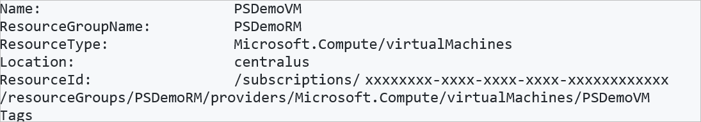


```azurepowershell-interactive
# Add the resource to the move collection
New-AzResourceMoverMoveResource -SubscriptionId “<subscription-id>” -ResourceGroupName “RegionMoveRG-centralus-westcentralus ” -MoveCollectionName “MoveCollection-centralus-westcentralus ” -SourceId “/subscriptions/e80eb9fa-c996-4435-aa32-5af6f3d3077c/resourceGroups/PSDemoRM/providers/Microsoft.Compute/virtualMachines/PSDemoVM” -Name “PSDemoVM” -ResourceSettingResourceType “ Microsoft.Compute/virtualMachines” -ResourceSettingTargetResourceName “PSDemoVM”
```

**Expected output**
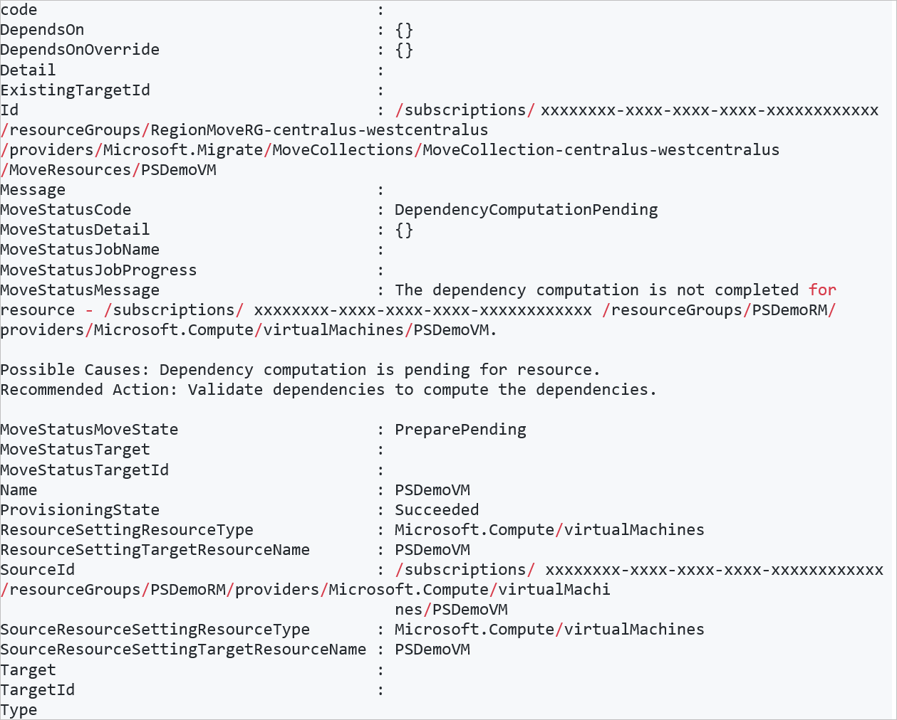

## Resolve dependencies

Validate the resources you added, and resolve any dependencies on other resources.

```azurepowershell-interactive
# Resolve dependencies
Resolve-AzResourceMoverMoveCollectionDependency -SubscriptionId “<subscription-id>” -ResourceGroupName “RegionMoveRG-centralus-westcentralus” -MoveCollectionName “MoveCollection-centralus-westcentralus”
```
**Output if dependencies exist**

If the resource in the move collection has dependencies on other resources, a failed message is issued.

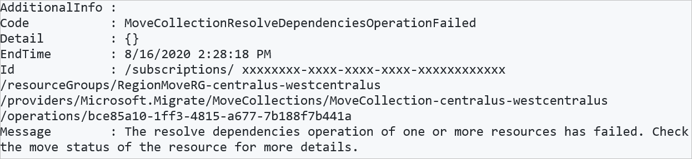

### Retrieve dependencies

If the resource you want to move has dependencies on other resources, you can retrieve information about the missing dependencies.

```azurepowershell-interactive
# Identify dependencies
Get-AzResourceMoverUnresolvedDependency -MoveCollectionName “MoveCollection-centralus-westcentralus ” -ResourceGroupName “RegionMoveRG-centralus-westcentralus ” -SubscriptionId  “<subscription-id>”
```

**Expected output**

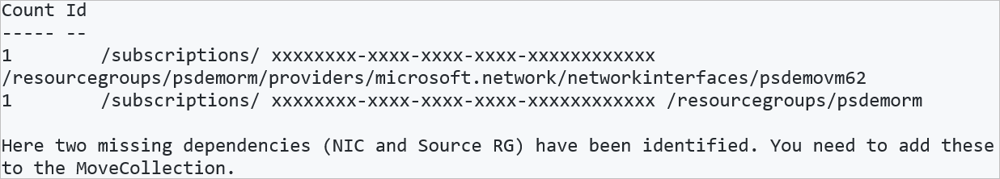

In this example, two dependencies are identified as missing:

- Source resource group: PSDemoRM
- NIC on VM: PSDemoVM62

## Add dependencies to collection


Using the resource IDs you retrieved, identify the names of the missing resources, and add them to the move collection.

### Add the NIC

Retrieve the NIC name and type, and add it to the collection.

```azurepowershell-interactive
# Get the NIC name and resource type
Get-AzResource -ResourceId “/subscriptions/ <subscription-id> /resourcegroups/psdemorm/providers/microsoft.network/networkinterfaces/psdemovm62”

```

**Expected output**

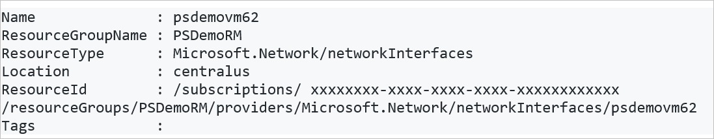

Now add the NIC to the move collection. This example gives the same name to the target NIC. Keep settings and case consistent.

```azurepowershell-interactive
# Add the NIC to the collection. 
New-AzResourceMoverMoveResource -SubscriptionId “<subscription-id>” -ResourceGroupName “RegionMoveRG-centralus-westcentralus” -MoveCollectionName “MoveCollection-centralus-westcentralus ” -SourceId “/subscriptions/<subscription-id>/resourceGroups/PSDemoRM/providers/Microsoft.Network/networkInterfaces/psdemovm62” -Name “psdemovm62” -ResourceSettingResourceType “Microsoft.Network/networkInterfaces” -ResourceSettingTargetResourceName “psdemovm62”
```

**Expected output**

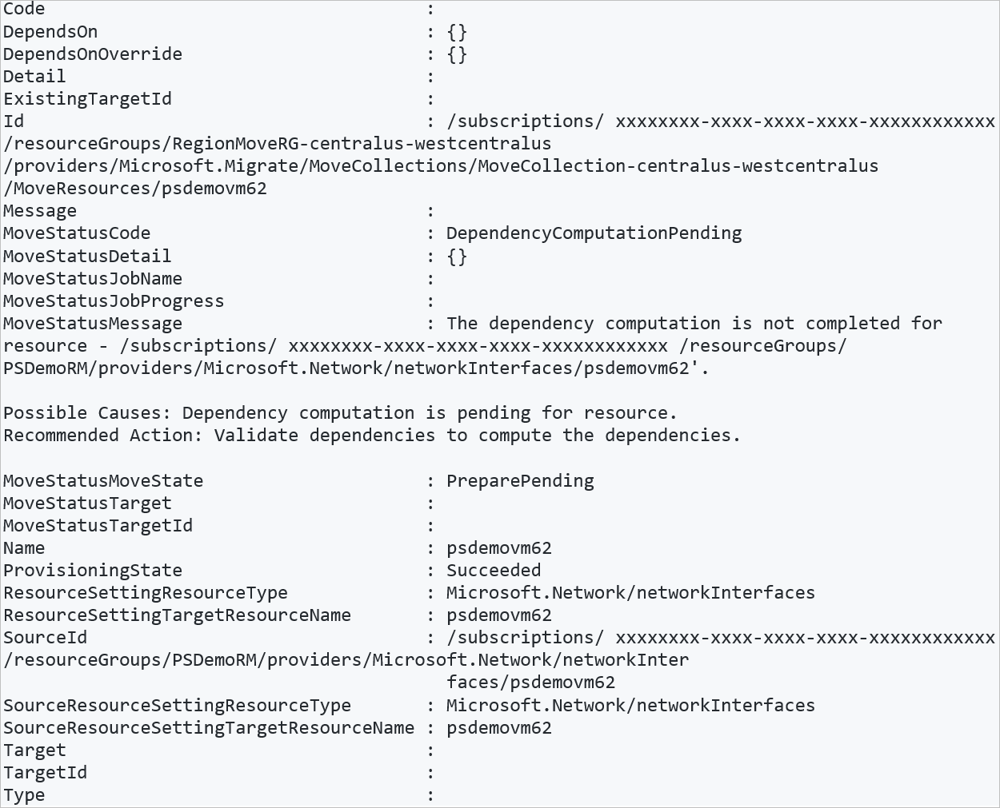

## Add the source resource group

```azurepowershell-interactive
# Get the resource group name and resource type
Get-AzResource -ResourceId “/subscriptions/<subscription-id>/resourcegroups/psdemorm”

# Add the resource group to the collection. 
New-AzResourceMoverMoveResource -SubscriptionId “<subscription-id>” -ResourceGroupName “RegionMoveRG-centralus-westcentralus” -MoveCollectionName “MoveCollection-centralus-westcentralus” -SourceId “/subscriptions/<subscription-id>/resourcegroups/psdemorm” -Name “psdemorm” -ResourceSettingResourceType “resourcegroups” -ResourceSettingTargetResourceName “psdemorm”
```

**Expected output**

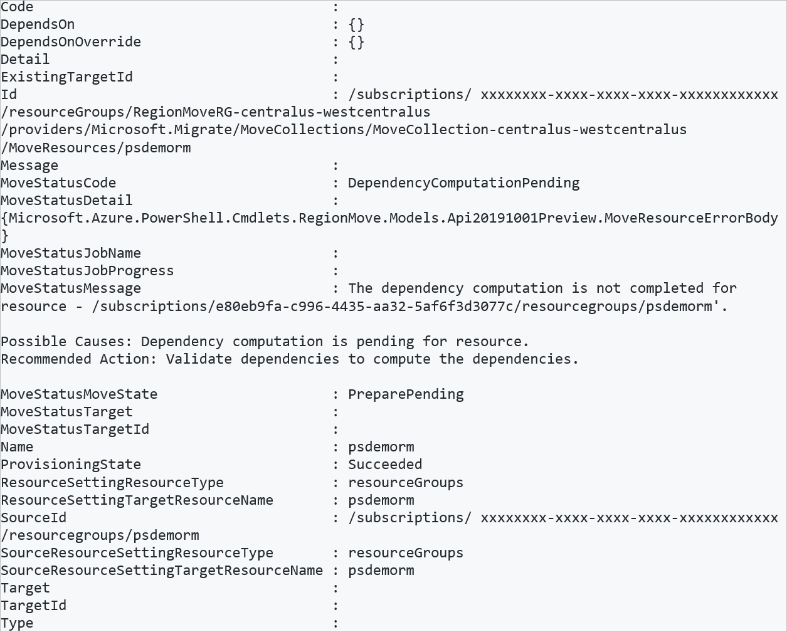

## Recheck dependencies

Check again for missing dependencies.

```azurepowershell-interactive
Get-AzResourceMoverUnresolvedDependency -MoveCollectionName “MoveCollection-centralus-westcentralus ” -ResourceGroupName “RegionMoveRG-centralus-westcentralus ” -SubscriptionId  “<subscription-id>”
```

**Output**

We have additional missing dependencies.

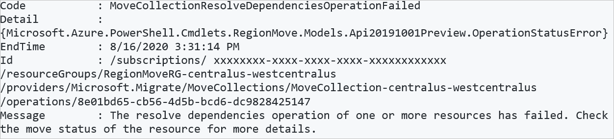

## Retrieve additional dependencies

```azurepowershell-interactive
# Identify dependencies
Get-AzResourceMoverUnresolvedDependency -MoveCollectionName “MoveCollection-centralus-westcentralus ” -ResourceGroupName “RegionMoveRG-centralus-westcentralus” -SubscriptionId  “<subscription-id>”
```

**Expected output**


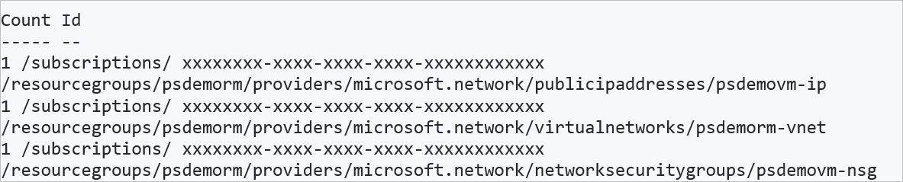

In this example, three more dependencies are identified as missing:

- Public IP address: psdemovm-ip
- Azure virtual network: psdemorm-vnet
- Network security group (NSG): psdemovm-nsg

## Add additional dependencies

1. [Follow the instructions](#add-dependencies-to-collection) to add these resources to the move collection.
2. After adding resources, validate again until all dependencies are added.


## Prepare and move the source resource group

In the source region, you prepare resources before you move them. The prepare process depends on the resources you're moving. For example, for stateless resources prepare might prepare and export an Azure Resource Manager (ARM) template. Or, for stateful resources, replication might kick off. 

Before you can prepare the source resources, you need to prepare and move the source resource group.

### Prepare

```azurepowershell-interactive
# Prepare the source resource group
Invoke-AzResourceMoverPrepare -SubscriptionId “<subscription-id>” -ResourceGroupName “RegionMoveRG-centralus-westcentralus ” -MoveCollectionName “MoveCollection-centralus-westcentralus ” -MoveResource “PSDemoRM”
```

**Expected output**

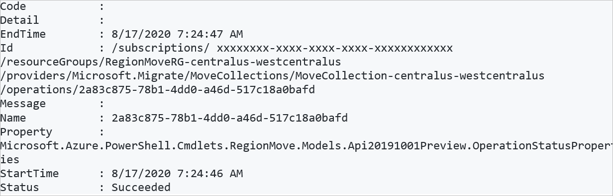

### Initiate move

```azurepowershell-interactive
# Initiate move
Invoke-AzResourceMoverInitiateMove -SubscriptionId “<subscription-id>” -ResourceGroupName “RegionMoveRG-centralus-westcentralus ” -MoveCollectionName “MoveCollection-centralus-westcentralus ” -MoveResource “PSDemoRM”

**Expected output**


```azurepowershell-interactive
# Commit move
Invoke-AzResourceMoverCommit -SubscriptionId “<subscription-id” -ResourceGroupName “RegionMoveRG-centralus-westcentralus ” -MoveCollectionName “PS-centralus-
westcentralus-demoRM” -MoveResource “PSDemoRM”
```

**Expected output**

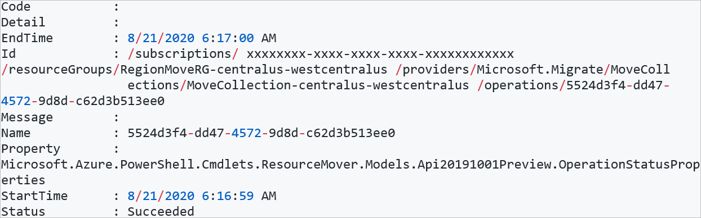


## Prepare resources

After the source resource group is moved to the target region, retrieve a list of the resources in the move collection, and prepare to move them.

```azurepowershell-interactive
# Retrieve resources in the collection
Get-AzResourceMoverMoveResource  -SubscriptionId “ <subscription-id> “ -ResourceGroupName “RegionMoveRG-centralus-westcentralus ” -MoveCollectionName “MoveCollection-centralus-westcentralus ”   | Where-Object {  $_.MoveStatusMoveState -eq “PreparePending” } | Select Name
```
**Expected output**

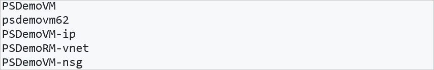

Now, prepare the resources.

```azurepowershell-interactive
# Prepare the resources, using the resource name
Invoke-AzResourceMoverPrepare -SubscriptionId  <subscription-id> -ResourceGroupName RegionMoveRG-centralus-westcentralus  -MoveCollectionName MoveCollection-centralus-westcentralus   -MoveResource $('psdemovm62', 'PSDemoVM-ip', 'PSDemoRM-vnet','PSDemoVM-nsg', ‘PSDemoVM’)
```
Alternatively, you can prepare and move resources using the resource ID, instead of the name:

```azurepowershell-interactive
# Prepare the resources using the resource ID
Invoke-AzResourceMoverPrepare -SubscriptionId  <subscription-id> -ResourceGroupName RegionMoveRG-centralus-westcentralus  -MoveCollectionName MoveCollection-centralus-westcentralus  -MoveResourceInputType MoveResourceSourceId  -MoveResource $('/subscriptions/<subscription-id>/resourceGroups/PSDemoRM/providers/Microsoft.Network/networkSecurityGroups/PSDemoVM-nsg')
```

**Expected output**

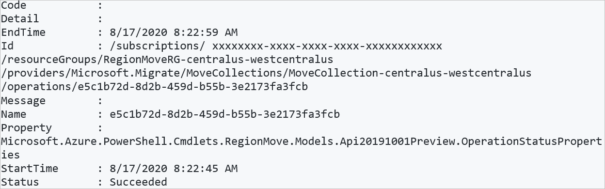

## Initiate resource move

After preparing the resources, initiate the move.

```azurepowershell-interactive
# Initiate the move 
Invoke-AzResourceMoverInitiateMove -SubscriptionId <subscription-id> -ResourceGroupName RegionMoveRG-centralus-westcentralus  -MoveCollectionName MoveCollection-centralus-westcentralus   -MoveResource $('psdemovm62', 'PSDemoVM-ip', 'PSDemoRM-vnet','PSDemoVM-nsg', ‘PSDemoVM’)
```
**Expected output**
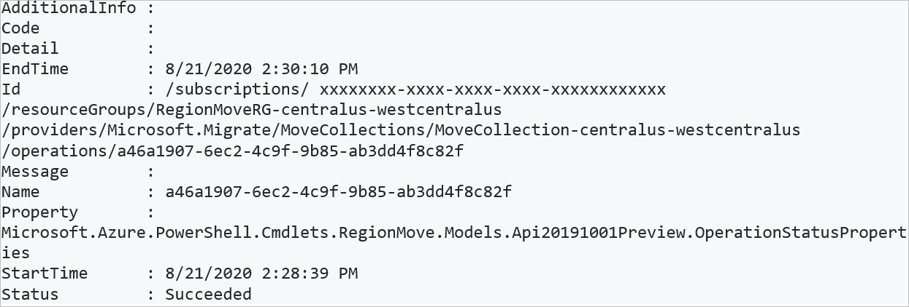

## Discard or commit the move

After the initial move, you can decide whether you want to commit the move, or to discard it. 

- **Discard**: You might discard a move if you're testing, and you don't want to actually move the source resource. Discarding the move returns the resource to a state of *Initiate move pending*. You can then initiate the move again if needed.
- **Commit**: Commit completes the move to the target region. After committing, a source resource will be in a state of *Delete source pending*, and you can decide if you want to delete it.

### Discard

To discard the move:

```azurepowershell-interactive
# Discard the move 
Invoke-AzResourceMoverDiscard -SubscriptionId  <subscription-id> `-ResourceGroupName RegionMoveRG-centralus-westcentralus  -MoveCollectionName MoveCollection-centralus-westcentralus   -MoveResource $('psdemovm62', 'PSDemoVM-ip', 'PSDemoRM-vnet','PSDemoVM-nsg', ‘PSDemoVM’)
```
**Expected output**
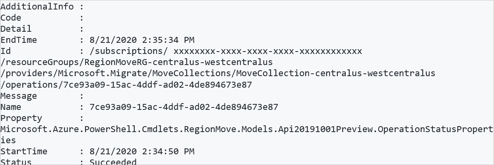


### Commit

To commit the move:

```azurepowershell-interactive
# Commit the move 
Invoke-AzResourceMoverCommit -SubscriptionId  <subscription-id> -ResourceGroupName RegionMoveRG-centralus-westcentralus  -MoveCollectionName MoveCollection-centralus-westcentralus   -MoveResource $('psdemovm62', 'PSDemoVM-ip', 'PSDemoRM-vnet','PSDemoVM-nsg', ‘PSDemoVM’)
```
**Expected output**

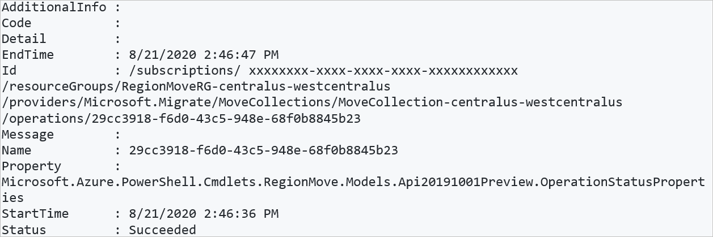

## Delete source resources

After committing the move, and verifying that resources work as expected in the target region, you can delete the source resources in the [Azure portal](../azure-resource-manager/management/manage-resources-portal.md#delete-resources), [using PowerShell](../azure-resource-manager/management/manage-resources-powershell.md#delete-resources), or [Azure CLI](../azure-resource-manager/management/manage-resources-cli.md#delete-resources).

## Next steps

[Learn how to](remove-move-resources.md) remove resources from a move collection.