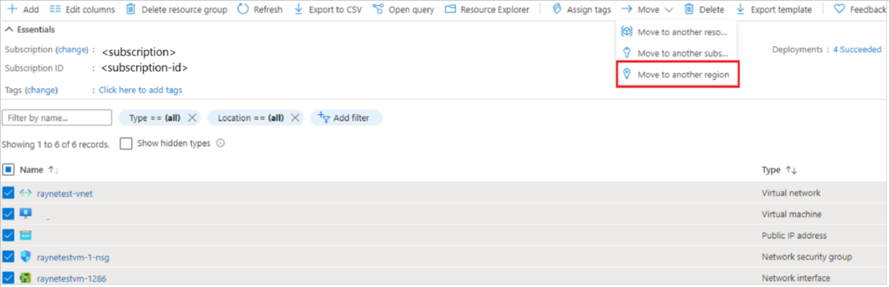
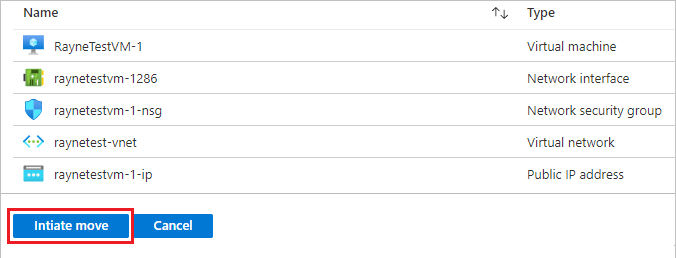

# Move resources across regions (from resource group)

In this article, learn how to move resources in a specific resource group to a different Azure region. In the resource group, you select the resources you want to move. Then, you move them using [Azure Resource Mover](overview.md).

## Prerequisites

- You need *Owner* access on the subscription in which resources you want to move are located.
    - The first time you add a resource for a  specific source and destination mapping in an Azure subscription, Resource Mover creates a [system-assigned managed identity](../active-directory/managed-identities-azure-resources/overview.md#managed-identity-types) (formerly known as Managed Service Identify (MSI)) that's trusted by the subscription.
    - To create the identity, and to assign it the required role (Contributor or User Access administrator in the source subscription), the account you use to add resources needs *Owner* permissions on the subscription. [Learn more](../role-based-access-control/rbac-and-directory-admin-roles.md#azure-roles) about Azure roles.
- The subscription needs enough quota to create the source resources in the target region. If it doesn't, request additional limits. [Learn more](../azure-resource-manager/management/azure-subscription-service-limits.md).
- Verify pricing and charges associated with the target region to which you're moving VMs. Use the [pricing calculator](https://azure.microsoft.com/pricing/calculator/) to help you.
- Check that the resources you want to move are supported by Resource Mover:
    - Azure VMs and associated disks
    - NICs
    - Availability sets
    - Azure virtual networks
    - Public IP addresses
    - Network security groups (NSGs)
    - Internal and public load balancers
    - Azure SQL databases and elastic pools


## Check VM requirements

1. Check that the VMs you want to move are supported.

    - [Verify](support-matrix-move-region-azure-vm.md#windows-vm-support) supported Windows VMs.
    - [Verify](support-matrix-move-region-azure-vm.md#linux-vm-support) supported Linux VMs and kernel versions.
    - Check supported [compute](support-matrix-move-region-azure-vm.md#supported-vm-compute-settings), [storage](support-matrix-move-region-azure-vm.md#supported-vm-storage-settings), and [networking](support-matrix-move-region-azure-vm.md#supported-vm-networking-settings) settings.
2. Make sure VMs have the latest trusted root certificates and an updated certificate revocation list (CRL). 
    - On Azure VMs running Windows, install the latest Windows updates.
    - On VMs running Linux, follow the Linux distributor guidance to ensure the machine has the latest certificates and CRL. 
3. Allow outbound connectivity from VMs:
    - If you're using a URL-based firewall proxy to control outbound connectivity, allow access to these [URLs](support-matrix-move-region-azure-vm.md#url-access)
    - If you're using network security group (NSG) rules to control outbound connectivity, create these [service tag rules](support-matrix-move-region-azure-vm.md#nsg-rules).

## Select resources to move

Select resources you want to move. You move resources to a target region in the source region subscription. If you want to change the subscription, you can do that after the resources are moved.

> [!NOTE]
>  Don't select associated disks or the operation will fail. Associated disks are automatically included in a VM move.

1. In the Azure portal, open the relevant resource group.
2. In the resource group page, select the resources that you want to move.
3. Select **Move** > **Move to another region**.

    
    
4. In **Source + destination**, select the target region to which you want to move the resources. Then select **Next**.


    


7. In **Resources to move**, select **Next**.  
8. In **Select resources**, select resource you want to move. You can only add resources supported for move. Then select **Done**.
9. In **Move resources**, select **Next**. 
10. In **Review + Add**, check the source and target details.
11. Confirm that you understand that metadata about the resources being moved will be stored in a resource group created for this purpose, and that you allow Resource Mover to create a system-managed identity to access the subscription resources.
1. Select **Proceed** to begin adding the resources.

        

11. The add resource operation starts. When the operation completes, the notifications show that resources were added, and deployment succeeded.
13. In the notifications, select **Adding resources for move**.

        


14. After selecting the notification, the resources you selected are added to a move collection in the Azure Resource Mover hub.  Resource Mover helps you to check dependencies, and then start moving resources to the target region.

## Resolve dependencies

Resources you're moving appear in the **Across regions** page, in a *Prepare pending* state. Start validation as follows:

1. Dependencies are validated in the background after you add them. If you see a **Validate dependencies** button, select it to trigger the manual validation.

    

2. If dependencies are found, select **Add dependencies**. 
3. In **Add dependencies**, select the dependent resources > **Add dependencies**. Monitor progress in the notifications.

    

3. Add additional dependencies if needed, and validate dependencies as needed. Dependency validation happens automatically in the background.

4. On the **Across regions** page, verify that resources are now in a *Prepare pending* state, with no issues.

    

## Move the source resource group 

Before you can prepare and move resources, the source resource group must be present in the target region. 

### Prepare to move the source resource group

Prepare as follows:

1. In **Across regions**, select the source resource group > **Prepare**.
2. In **Prepare resources**, select **Prepare**.

    

    During the Prepare process, Resource Mover generates Azure Resource Manager (ARM) templates using the resource group settings. Resources inside the resource group aren't affected.
    
> [!NOTE]
>  After preparing the resource group, it's in the *Initiate move pending* state. Refresh to show the latest state.


### Move the source resource group

Initiate the move as follows:

1. In **Across regions**, select the resource group > **Initiate Move**
2. ln **Move Resources**, select **Initiate move**. The resource group moves into an *Initiate move in progress* state.
3. After initiating the move, the target resource group is created, based on the generated ARM template. The source resource group moves into a *Commit move pending* state.

    

To commit and finish the move process:

1. In **Across regions**, select the resource group > **Commit move**
2. ln **Move Resources**, select **Commit**.

> [!NOTE]
> After committing the move, the source resource group is in a *Delete source pending* state.

## Modify target settings

If you don't want to move a source resource, you can do either of the following:

- Create a resource in the target region with the same name and settings as the resource in the source region.
- Create a new equivalent resource in the target region. Except for the settings you specify, the target resource is created with the same settings as the source.
- Use an existing resource in the target region.

Modify a setting as follows:

1. To modify a setting, select the entry in the **Destination configuration** column for the resource.
2. In the **Destination configuration** page, specify the target settings you want to use.
    Changes are only made for the resource you're editing. You need to  update any dependent resources separately.   
    
The exact settings you modify depend on the resource type. [Learn more](modify-target-settings.md) about editing target settings.

## Prepare resources to move

Now that the source resource group is moved, you can prepare to move the other resources.

1. In **Across regions**, select the resources you want to prepare. 

    

2. Select **Prepare**.

> [!NOTE]
> - During the prepare process, the Azure Site Recovery Mobility agent is installed on VMs, for replication.
> - VM data is replicated periodically to the target region. This doesn't affect the source VM.
> - Resource Move generates ARM templates for the other source resources.
> - After preparing resources, they're in an *Initiate move pending* state.


## Initiate the move

With resources prepared, you can now initiate the move.

1. In **Across regions**, select resources with state *Initiate move pending*. Then select **Initiate move**.
2. In **Move resources**, select **Initiate move**.

    

3. Track move progress in the notifications bar.


> [!NOTE]
> - For VMs, replica VMs are created in the target region. The source VM is shut down, and some downtime occurs (usually minutes).<br/>
> - Resource Mover recreates other resources using the ARM templates that were prepared. There's usually no downtime.<br/> 
> - For load balancers, NAT rules aren't copied. Create them in the target region after you commit the move.
> - For public IP addresses, the DNS name label isn't copied. Recreate the label after you commit the move.
> - After preparing resources, they're in an *Commit move pending* state.


## Discard or commit?

After the initial move, you can decide whether you want to commit the move, or to discard it. 

- **Discard**: You might discard a move if you're testing, and you don't want to actually move the source resource. Discarding the move returns the resource to a state of *Initiate move pending*.
- **Commit**: Commit completes the move to the target region. After committing, a source resource will be in a state of *Delete source pending*, and you can decide if you want to delete it.


## Discard the move 

You can discard the move as follows:

1. In **Across regions**, select resources with state *Commit move pending*, and select **Discard move**.
2. In **Discard move**, select **Discard**.
3. Track move progress in the notifications bar.
4. When the notifications show that the move was successful, select **Refresh**. 

> [!NOTE]
> For VMs, After discarding resources, they're in an *Initiate move pending* state.

## Commit the move

If you want to complete the move process, commit the move. 


1. In **Across regions**, select resources with state *Commit move pending*, and select **Commit move**.
2. In **Commit resources**, select **Commit**.

    

3. Track the commit progress in the notifications bar.

> [!NOTE]
> - After committing the move, VMs stop replicating. The source VM isn't impacted by the commit.
> - Commit doesn't impact source networking resources.
> - After committing the move, resources are in a *Delete source pending* state.

## Configure settings after the move

1. Since DNS name labels aren't copied over for public IP addresses, after the move is done, navigate to the target resources and update the label. 
2. For internal load balancers, since NAT rules aren't copied over, navigate to the resources created in the target region, and update the NAT rules.
3. The Mobility service isn't uninstalled automatically from VMs. Uninstall it manually, or leave it if you plan to move the server again.
## Delete source resources after commit

After the move, you can optionally delete resources in the source region. 

1. In **Across Regions**, select the name of each source resource that you want to delete.
2. In the properties page for each resource, select **Delete**.

## Delete additional resources created for move

After the move, you can manually delete the move collection, and Site Recovery resources that were created.

- The move collection is hidden by default. To see it you need to turn on hidden resources.
- The cache storage has a lock that must be deleted, before it can be deleted.

Delete as follows: 

1. Locate the resources in resource group ```RegionMoveRG-<sourceregion>-<target-region>```, in the source region.
2. Check that all the VM and other source resources in the move collection have been moved/deleted. This ensures that there are no pending resources using them.
2. Delete the resources:

    - The move collection name is ```movecollection-<sourceregion>-<target-region>```.
    - The cache storage account name is ```resmovecache<guid>```
    - The vault name is ```ResourceMove-<sourceregion>-<target-region>-GUID```.

## Next steps


[Learn about](about-move-process.md) the move process.