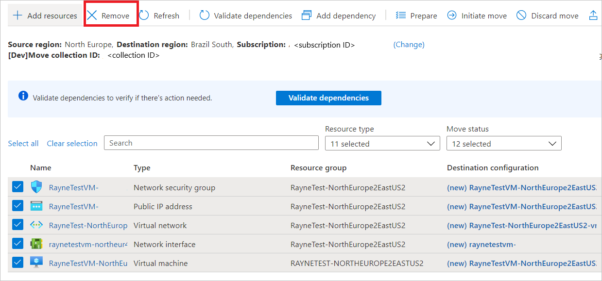
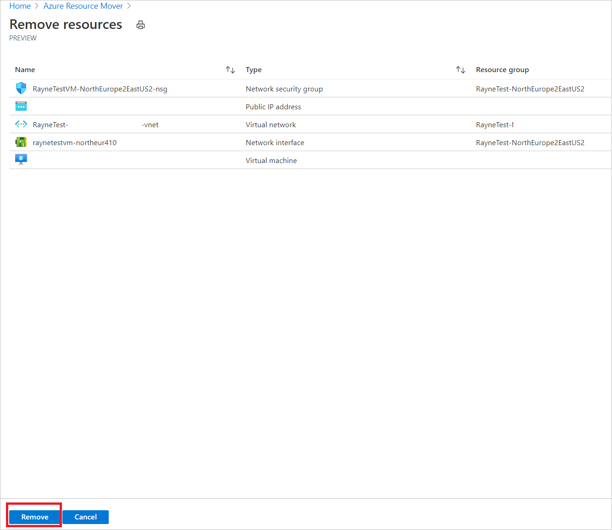
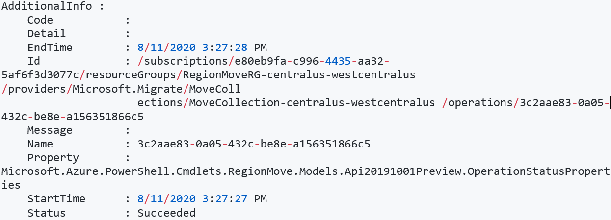
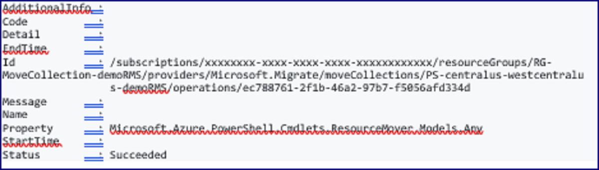

# Manage move collections and resource groups

This article describes how to remove resources from a move collection, or remove a move collection/resource group, in [Azure Resource Mover](overview.md). Move collections are used when moving Azure resources between Azure regions.

## Remove a resource (portal)

You can remove resources in a move collection, in the Resource Mover portal as follows:

1. In **Across regions**, select all the resources you want to remove from the collection, and select **Remove**. 

    

2. In **Remove resources**, click **Remove**.

    

## Remove a move collection/resource group (portal)

You can remove a move collection/resource group in the portal.

1. Follow the instructions in the procedure above to remove resources from the collection. If you're removing a resource group, make sure it doesn't contain any resources.
2. Delete the move collection or resource group.  

## Remove a resource (PowerShell)

Remove a resource (in our example the PSDemoVM machines) from a collection using PowerShell, as follows:

```azurepowershell-interactive
# Remove a resource using the resource ID
Remove-AzResourceMoverMoveResource -SubscriptionId  <subscription-id> -ResourceGroupName RegionMoveRG-centralus-westcentralus  -MoveCollectionName MoveCollection-centralus-westcentralus - Name PSDemoVM
```
**Expected output**



## Remove a collection (PowerShell)

Remove an entire move collection using PowerShell, as follows:

1. Follow the instructions above to remove resources in the collection using PowerShell.
2. Run:

    ```azurepowershell-interactive
    # Remove a resource using the resource ID
    Remove-AzResourceMoverMoveResource -SubscriptionId  <subscription-id> -ResourceGroupName RegionMoveRG-centralus-westcentralus  -MoveCollectionName MoveCollection-centralus-westcentralus 
    ```
    **Expected output**
    

## VM resource state after removing

What happens when you remove a VM resource from a move collection depends on the resource state, as summarized in the table.

###  Remove VM state
**Resource state** | **VM** | **Networking**
--- | --- | --- 
**Added to move collection** | Delete from move collection. | Delete from move collection. 
**Dependencies resolved/prepare pending** | Delete from move collection  | Delete from move collection. 
**Prepare in progress**<br/> (or any other state in progress) | Delete operation fails with error.  | Delete operation fails with error.
**Prepare failed** | Delete from the move collection.<br/>Delete anything created in the target region, including replica disks. <br/><br/> Infrastructure resources created during the move need to be deleted manually. | Delete from the move collection.  
**Initiate move pending** | Delete from move collection.<br/><br/> Delete anything created in the target region, including VM, replica disks etc.  <br/><br/> Infrastructure resources created during the move need to be deleted manually. | Delete from move collection.
**Initiate move failed** | Delete from move collection.<br/><br/> Delete anything created in the target region, including VM, replica disks etc.  <br/><br/> Infrastructure resources created during the move need to be deleted manually. | Delete from move collection.
**Commit pending** | We recommend that you discard the move so that the target resources are deleted first.<br/><br/> The resource goes back to the **Initiate move pending** state, and you can continue from there. | We recommend that you discard the move so that the target resources are deleted first.<br/><br/> The resource goes back to the **Initiate move pending** state, and you can continue from there. 
**Commit failed** | We recommend that you discard the  so that the target resources are deleted first.<br/><br/> The resource goes back to the **Initiate move pending** state, and you can continue from there. | We recommend that you discard the move so that the target resources are deleted first.<br/><br/> The resource goes back to the **Initiate move pending** state, and you can continue from there.
**Discard completed** | The resource goes back to the **Initiate move pending** state.<br/><br/> It's deleted from the move collection, along with anything created at target - VM, replica disks, vault etc.  <br/><br/> Infrastructure resources created during the move need to be deleted manually. <br/><br/> Infrastructure resources created during the move need to be deleted manually. |  The resource goes back to the **Initiate move pending** state.<br/><br/> It's deleted from the move collection.
**Discard failed** | We recommend that you discard the moves so that the target resources are deleted first.<br/><br/> After that, the resource goes back to the **Initiate move pending** state, and you can continue from there. | We recommend that you discard the moves so that the target resources are deleted first.<br/><br/> After that, the resource goes back to the **Initiate move pending** state, and you can continue from there.
**Delete source pending** | Deleted from the move collection.<br/><br/> It doesn't delete anything created in the target region.  | Deleted from the move collection.<br/><br/> It doesn't delete anything created in the target region.
**Delete source failed** | Deleted from the move collection.<br/><br/> It doesn't delete anything created in the target region. | Deleted from the move collection.<br/><br/> It doesn't delete anything created in the target region.

## SQL resource state after removing

What happens when you remove an Azure SQL resource from a move collection depends on the resource state, as summarized in the table.

**Resource state** | **SQL** 
--- | --- 
**Added to move collection** | Delete from move collection. 
**Dependencies resolved/prepare pending** | Delete from move collection 
**Prepare in progress**<br/> (or any other state in progress)  | Delete operation fails with error. 
**Prepare failed** | Delete from move collection<br/><br/>Delete anything created in the target region. 
**Initiate move pending** |  Delete from move collection<br/><br/>Delete anything created in the target region. The SQL database exists at this point and will be deleted. 
**Initiate move failed** | Delete from move collection<br/><br/>Delete anything created in the target region. The SQL database exists at this point and must be deleted. 
**Commit pending** | We recommend that you discard the move so that the target resources are deleted first.<br/><br/> The resource goes back to the **Initiate move pending** state, and you can continue from there.
**Commit failed** | We recommend that you discard the move so that the target resources are deleted first.<br/><br/> The resource goes back to the **Initiate move pending** state, and you can continue from there. 
**Discard completed** |  The resource goes back to the **Initiate move pending** state.<br/><br/> It's deleted from the move collection, along with anything created at target, including SQL databases. 
**Discard failed** | We recommend that you discard the moves so that the target resources are deleted first.<br/><br/> After that, the resource goes back to the **Initiate move pending** state, and you can continue from there. 
**Delete source pending** | Deleted from the move collection.<br/><br/> It doesn't delete anything created in the target region. 
**Delete source failed** | Deleted from the move collection.<br/><br/> It doesn't delete anything created in the target region. 

## Next steps

Try [moving a VM](tutorial-move-region-virtual-machines.md) to another region with Resource Mover.