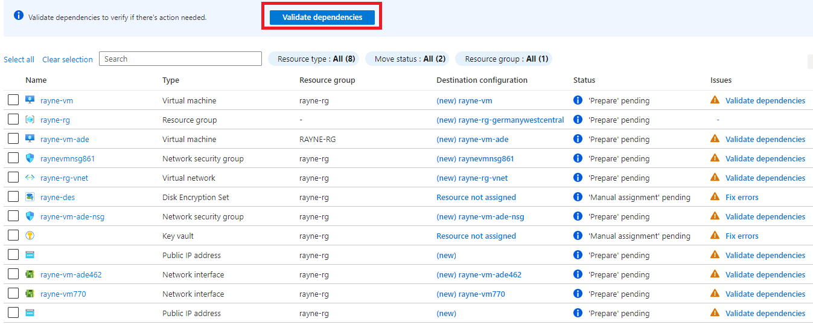
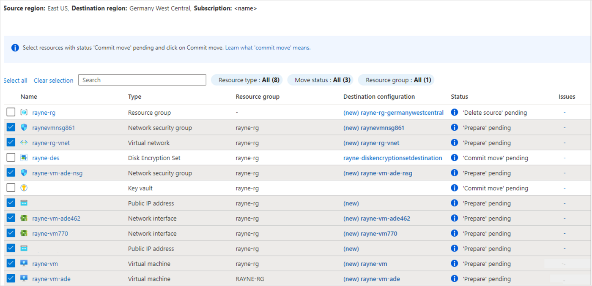
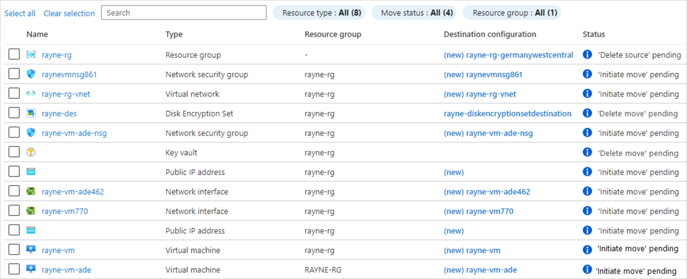
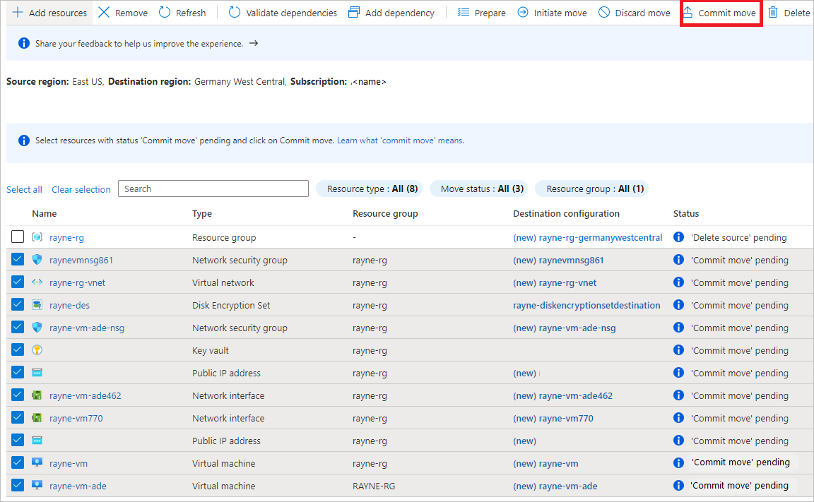

# Tutorial: Move Azure VMs across regions

In this article, learn how to move Azure VMs with disks with Azure disk encryption enabled, or that use customer-managed keys (CMKs) for encryption-at-rest (server-side encryption), using [Azure Resource Mover](overview.md). This occurs in a couple of scenarios:


In this tutorial, you learn how to:

> [!div class="checklist"]
> * Check prerequisites and requirements.
> * Select the resources you want to move.
> * Resolve resource dependencies.
> * Prepare and move the source resource group. 
> * Prepare and move the other resources.
> * Decide whether you want to discard or commit the move. 
> * Optionally remove resources in the source region after the move.

> [!NOTE]
> Tutorials show the quickest path for trying out a scenario, and use default options. 

If you don't have an Azure subscription, create a [free account](https://azure.microsoft.com/pricing/free-trial/) before you begin. Then sign in to the [Azure portal](https://portal.azure.com).

## Prerequisites

**Requirement** |**Details**
--- | ---
**Subscription permissions** | Check you have *Owner* access on the subscription containing the resources that you want to move.<br/><br/> The first time you add a resource for a  specific source and destination pair in an Azure subscription, Resource Mover creates a [system-assigned managed identity](../active-directory/managed-identities-azure-resources/overview.md#managed-identity-types) (formerly known as Managed Service Identify (MSI)) that's trusted by the subscription.<br/><br/> To create the identity, and to assign it the required role (Contributor or User Access administrator in the source subscription), the account you use to add resources needs *Owner* permissions on the subscription. [Learn more](../role-based-access-control/rbac-and-directory-admin-roles.md#azure-roles) about Azure roles.
**Key vault permissions** | In the source and target region, to enable replication for VMs you need these permissions:<br/><br/> - Key permissions: Key Management Operations (Get, List); Cryptographic Operations (Decrypt and Encrypt).<br/><br/> Secret permissions: Secret Management Operations (Get, List and Set)<br/><br/>Certificate (List and Get).
**Target region quota** | The subscription needs enough quota to create the resources you're moving in the target region. If it doesn't have quota, [request additional limits](../azure-resource-manager/management/azure-subscription-service-limits.md).
**Target region charges** | Verify pricing and charges associated with the target region to which you're moving VMs. Use the [pricing calculator](https://azure.microsoft.com/pricing/calculator/) to help you.


## Before you start

Before you start, verify Key Vault permissions to ensure that moving encrypted VMs will work as expected. In additiona, run a script to copy encryption secrets and keys to the target region.

### Verify Key Vault permissions

Verify and set permissions in both the source and target key vaults

1. In the Azure portal, open the Key Vault in the source and then target regions.
2. Under **Settings**, select **Access policies**.

    

3. If there are no user permissions, select **Add Access Policy**, and specify the permissions. If the user account already has a policy, under **User**, set the permissions.

    - If VMs you want to move are enabled with Azure disk encryption (ADE), In **Key Permissions** > **Key Management Operations**, select **Get** and **List** if they're not selected.
    - If you're using customer-managed keys (CMKs) to encrypt disk encryption keys used for encryption-at-rest (server-side encryption), in **Key Permissions** > **Key Management Operations**, select **Get** and **List**. Additionally, in **Cryptographic Operations**, select **Decrypt** and **Encrypt**
 
    

4. In **Secret permissions**,  **Secret Management Operations**, select **Get**, **List**, and **Set**. 
5. If you're assigning permissions to a new user account, in **Select principal**, select the user to whom you're assigning permissions.


### Copy the keys to the target key vault

You need to copy the encryption secrets and keys from the source key vault to the target key vault, using a script we provide.

1. Navigate to the [script](https://raw.githubusercontent.com/AsrOneSdk/published-scripts/master/CopyKeys/CopyKeys.ps1) in github.
2. Copy the contents of the script to a local file, and name it *Copy-keys.ps1*.
3. Run the script.
4. Sign into Azure.
5. In the **User Input** pop-up, select the source subscription, resource group, and source VM. Then select the target location, and the target vaults for disk and key encryption.

    


    
 
## Check VM requirements

1. Check that the VMs you want to move are supported.

    - [Verify](support-matrix-move-region-azure-vm.md#windows-vm-support) supported Windows VMs.
    - [Verify](support-matrix-move-region-azure-vm.md#linux-vm-support) supported Linux VMs and kernel versions.
    - Check supported [compute](support-matrix-move-region-azure-vm.md#supported-vm-compute-settings), [storage](support-matrix-move-region-azure-vm.md#supported-vm-storage-settings), and [networking](support-matrix-move-region-azure-vm.md#supported-vm-networking-settings) settings.
2. Check that VMs you want to move are turned on.
3. Make sure VMs have the latest trusted root certificates, and an updated certificate revocation list (CRL). To do this:
    - On Windows VMs, install the latest Windows updates.
    - On Linux VMs, follow distributor guidance so that machines have the latest certificates and CRL. 
4. Allow outbound connectivity from VMs:
    - If you're using a URL-based firewall proxy to control outbound connectivity, allow access to these [URLs](support-matrix-move-region-azure-vm.md#url-access)
    - If you're using network security group (NSG) rules to control outbound connectivity, create these [service tag rules](support-matrix-move-region-azure-vm.md#nsg-rules).

## Select resources to move

Select the resources you want to move.

- You can select any supported resource type in any of the resource groups in the source region you select.  
- You move resources to a target region that's in the same subscription as the source region. If you want to change the subscription, you can do that after the resources are moved.

1. In the Azure portal, search for *resource mover*. Then, under **Services**, select **Azure Resource Mover**.

    

2. In **Overview**, click **Move across regions**.

    

3. In **Move resources** > **Source + destination**, select the source subscription and region.
4. In **Destination**, select the region to which you want to move the VMs. Then click **Next**.

    

6. In **Resources to move**, click **Select resources**.

     

1. In **Select resources**, select the VMs. You can only add resources that are [supported for move](#check-vm-requirements). Then click **Done**.

    

    > [!NOTE]
    >  In this tutorial we're selecting a VM that uses server-side encryption (rayne-vm) with a customer-managed key, and a VM with disk encryption enabled (rayne-vm-ade).

8.  In **Resources to move**, click **Next**.
9. In **Review**, check the source and destination settings. 

    
10. Click **Proceed**, to begin adding the resources.
11. Select the notifications icons to track progress. After the add process finishes successfully, select **Added resources for move** in the notifications.
     
    
    
2. After clicking the notification, review the resources on the **Across regions** page.

    

> [!NOTE]
> - Resources you add are placed into a *Prepare pending* state.
> - The resource group for the VMs is added automatically.
> - If you modify the **Destination configuration** entries to use a resource that already exists in the destination region, the resource state is set to *Commit pending*, since you don't need to initiate a move for it.
> - If you want to remove an resource that's been added, the method for doing that depends on where you are in the move process. [Learn more](remove-move-resources.md).
> - 

## Resolve dependencies

1. If any resources show a *Validate dependencies* message in the **Issues** column, click the **Validate dependencies** in the **Issues** colum for the resource

    

    The validation process begins.
2. If dependencies are found, click **Add dependencies**  

    


3. In **Add dependencies**, leave the default **Show all dependencies** option.

    - **Show all dependencies** iterates through all of the direct and indirect dependencies for a resource. For example, for a VM it shows the NIC, virtual network, network security groups (NSGs) etc.
    - **Show first level dependencies only** shows only direct dependencies. For example, for a VM it shows the NIC, but not the virtual network.
 
4. Select the dependent resources you want to add > **Add dependencies**.

    

5. Validate dependencies again. 

    

## Assign destination resources

Destination resources associated with encryption need manual assignment.

- If you're moving a VM that's has Azure disk encryption (ADE), the key vault in your destination region will appear as a dependency.
- If you're moving a VM that has server-side encryption that uses custom-managed keys (CMKs), then the disk encryption set in the destination region appears as a dependency. 
- Since this tutorial is moving a VM with ADE enabled, and a VM using a CMK, both the destination key vault and disk encryption set show up as dependencies.

1. In the disk encryption set entry, select **Resource not assigned** in the **Destination configuration** column.
2. In **Configuration settings**, select the destination disk encryption set. Then select **Save changes**.
3. You can select to save and validate dependencies for the resource you're modifying, or you can just save the changes, and validate everything you modify in one go.

    

    After adding the destination resource, the status of the disk encryption set turns to *Commit move pending*.
3. In the key vault entry, select **Resource not assigned** in the **Destination configuration** column. **Configuration settings**, select the destination key vault. Save the changes. The destination key vault resource status turns to *Commit move pending*.
4. In **Across regions**, validate again and resolve any issues.

> [!NOTE]
> If you want to edit target settings before beginning the move, select the link in the **Destination configuration** column for the resource, and edit the settings. If you edit the target VM settings, the target VM size shouldn't be smaller than the source VM size.  

## Move the source resource group 

Before you can prepare and move VMs, the VM resource group must be present in the target region. 

### Prepare to move the source resource group

During the Prepare process, Resource Mover generates Azure Resource Manager (ARM) templates using the resource group settings. Resources inside the resource group aren't affected.

Prepare as follows:

1. In **Across regions**, select the source resource group > **Prepare**.

    

1. In **Prepare resources**, click **Prepare**.

> [!NOTE]
> After preparing the resource group, it's in the *Initiate move pending* state. 

 
### Move the source resource group

Initiate the move as follows:

1. In **Across regions**, select the resource group > **Initiate Move**


    
2. ln **Move Resources**, click **Initiate move**. The resource group moves into an *Initiate move in progress* state.   
3. After initiating the move, the target resource group is created, based on the generated ARM template. The source resource group moves into a *Commit move pending* state.

    

To commit and finish the move process:

1. In **Across regions**, select the resource group > **Commit move**.
2. ln **Move Resources**, click **Commit**.

> [!NOTE]
> After committing the move, the source resource group is in a *Delete source pending* state.


## Prepare resources to move

Now that the source resource group is moved, you can prepare to move other resources that are in the *Prepare pending* state.

1. In **Across regions**, select the resources you want to prepare. 

    

2. Select **Prepare**. 
3. In **Prepare resources**, select **Prepare**

    - During the prepare process, the Azure Site Recovery Mobility agent is installed on VMs, to replicate them.
    - VM data is replicated periodically to the target region. This doesn't affect the source VM.
    - Resource Move generates ARM templates for the other source resources.

After preparing resources, they're in an *Initiate move pending* state.




## Initiate the move

With resources prepared, you can now initiate the move. 

1. In **Across regions**, select resources with state *Initiate move pending*. Then click **Initiate move**.
2. In **Move resources**, click **Initiate move**.

    

3. Track move progress in the notifications bar.

    - For VMs, replica VMs are created in the target region. The source VM is shut down, and some downtime occurs (usually minutes).
    - Resource Mover recreates other resources using the ARM templates that were prepared. There's usually no downtime.
    - After moving resources, they're in an *Commit move pending* state.


## Discard or commit?

After the initial move, you can decide whether you want to commit the move, or to discard it. 

- **Discard**: You might discard a move if you're testing, and you don't want to actually move the source resource. Discarding the move returns the resource to a state of *Initiate move pending*.
- **Commit**: Commit completes the move to the target region. After committing, a source resource will be in a state of *Delete source pending*, and you can decide if you want to delete it.


## Discard the move 

You can discard the move as follows:

1. In **Across regions**, select resources with state *Commit move pending*, and click **Discard move**.
2. In **Discard move**, click **Discard**.
3. Track move progress in the notifications bar.


> [!NOTE]
> After discarding resources, VMs are in an *Initiate move pending* state.

## Commit the move

If you want to complete the move process, commit the move. 

1. In **Across regions**, select resources with state *Commit move pending*, and click **Commit move**.
2. In **Commit resources**, click **Commit**.

    

3. Track the commit progress in the notifications bar.

> [!NOTE]
> - After committing the move, VMs stop replicating. The source VM isn't impacted by the commit.
> - Commit doesn't impact source networking resources.
> - After committing the move, resources are in a *Delete source pending* state.


## Configure settings after the move

- The Mobility service isn't uninstalled automatically from VMs. Uninstall it manually, or leave it if you plan to move the server again.
- Modify Azure role-based access control (Azure RBAC) rules after the move.

## Delete source resources after commit

After the move, you can optionally delete resources in the source region. 

1. In **Across Regions**, select each source resource that you want to delete. then select **Delete source**.
2. In **Delete source**, review what you're intending to delete, and in **Confirm delete**, type **yes**. The action is irreversible, so check carefully!
3. After typing **yes**, select **Delete source**.

> [!NOTE]
    >  In the Resource Move portal, you can't delete resource groups, key vaults, or SQL Server servers. You need to delete these individually from the properties page for each resource.


## Delete additional resources created for move

After the move, you can manually delete the move collection, and Site Recovery resources that were created.

- The move collection is hidden by default. To see it you need to turn on hidden resources.
- The cache storage has a lock that must be deleted, before it can be deleted.

Delete as follows: 
1. Locate the resources in resource group ```RegionMoveRG-<sourceregion>-<target-region>```.
2. Check that all the VM and other source resources in the source region have been moved or deleted. This ensures that there are no pending resources using them.
2. Delete the resources:

    - The move collection name is ```movecollection-<sourceregion>-<target-region>```.
    - The cache storage account name is ```resmovecache<guid>```
    - The vault name is ```ResourceMove-<sourceregion>-<target-region>-GUID```.
## Next steps

In this tutorial, you:

> [!div class="checklist"]
> * Moved encrypted Azure VMs and their dependent resources to another Azure region.


Now, trying moving Azure SQL databases and elastic pools to another region.

> [!div class="nextstepaction"]
> [Move Azure SQL resources](./tutorial-move-region-sql.md)