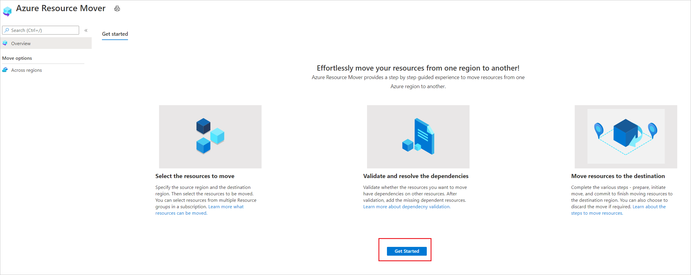
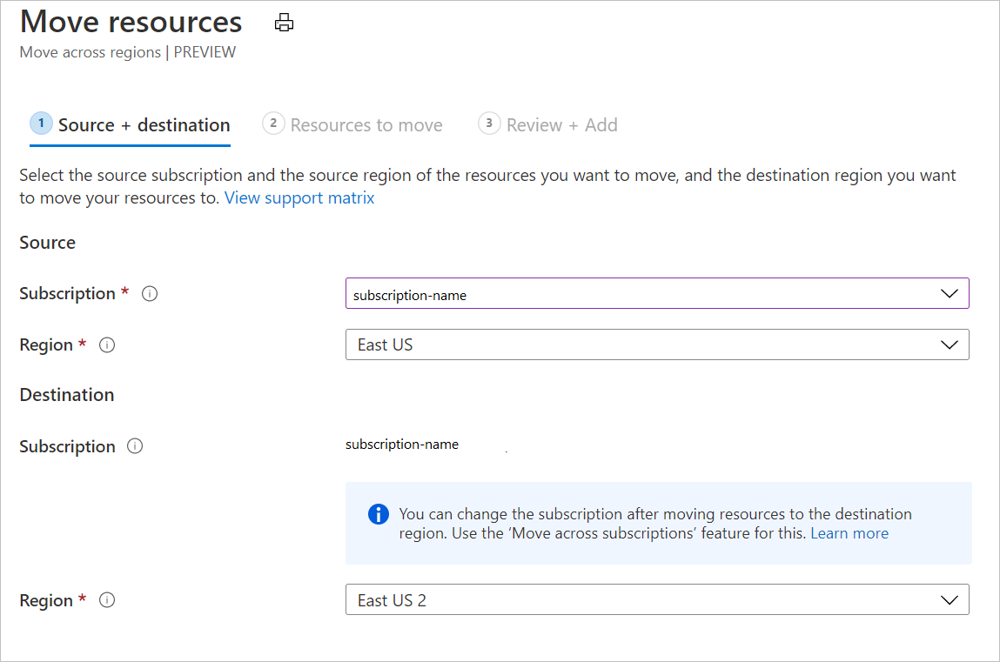
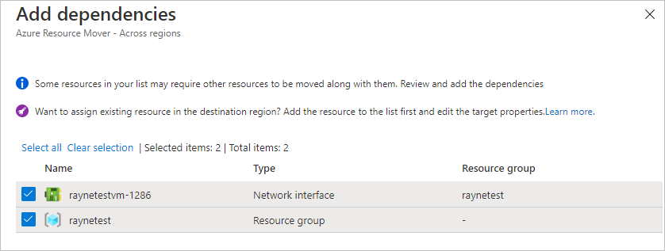
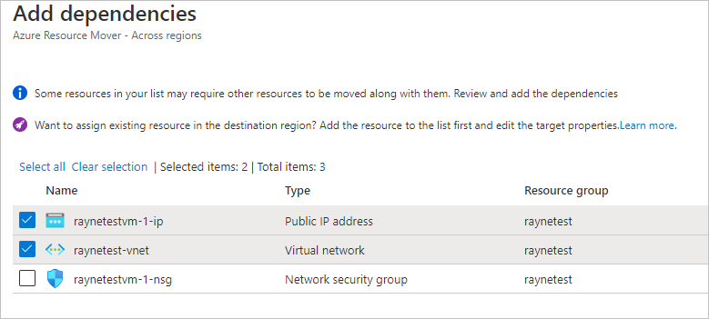
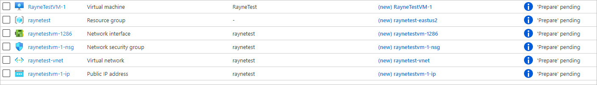
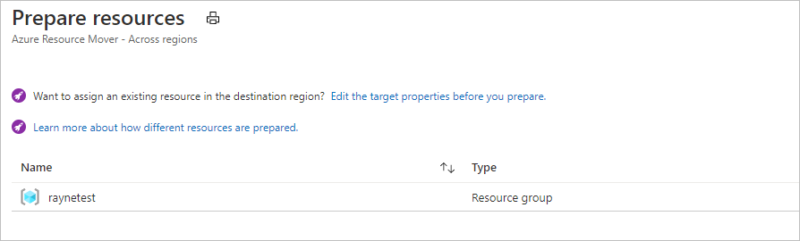
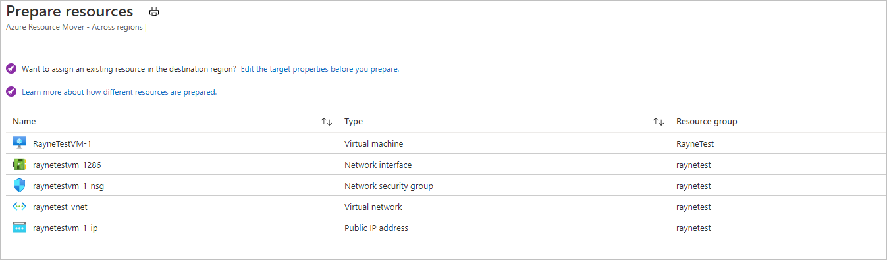
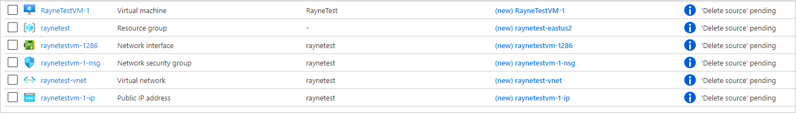
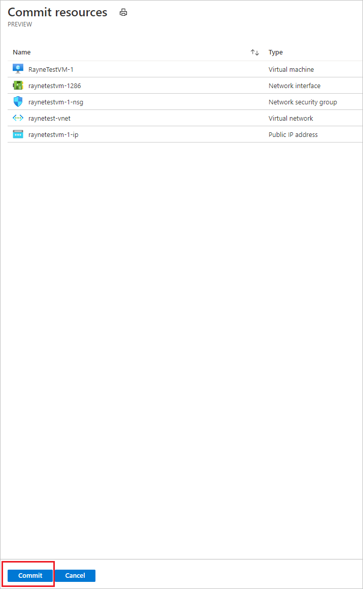

# Tutorial: Move Azure VMs across regions

In this article, learn how to move Azure VMs, and related network/storage resources, to a different Azure region, using [Azure Resource Mover](overview.md).

> [!NOTE]
> Azure Resource Mover is currently in public preview.


In this tutorial, you learn how to:

> [!div class="checklist"]
> * Check prerequisites and requirements.
> * Select the resources you want to move.
> * Resolve resource dependencies.
> * Prepare and move the source resource group. 
> * Prepare and move the other resources.
> * Decide whether you want to discard or commit the move. 
> * Optionally remove resources in the source region after the move.

> [!NOTE]
> Tutorials show the quickest path for trying out a scenario, and use default options. 

If you don't have an Azure subscription, create a [free account](https://azure.microsoft.com/pricing/free-trial/) before you begin. Then sign in to the [Azure portal](https://portal.azure.com).

## Prerequisites

-  Check you have *Owner* access on the subscription containing the resources that you want to move.
    - The first time you add a resource for a  specific source and destination pair in an Azure subscription, Resource Mover creates a [system-assigned managed identity](../active-directory/managed-identities-azure-resources/overview.md#managed-identity-types) (formerly known as Managed Service Identify (MSI)) that's trusted by the subscription.
    - To create the identity, and to assign it the required role (Contributor or User Access administrator in the source subscription), the account you use to add resources needs *Owner* permissions on the subscription. [Learn more](../role-based-access-control/rbac-and-directory-admin-roles.md#azure-roles) about Azure roles.
- The subscription needs enough quota to create the resources you're moving in the target region. If it doesn't have quota, [request additional limits](/azure/azure-resource-manager/management/azure-subscription-service-limits).
- Verify pricing and charges associated with the target region to which you're moving VMs. Use the [pricing calculator](https://azure.microsoft.com/pricing/calculator/) to help you.
    

## Check VM requirements

1. Check that the VMs you want to move are supported.

    - [Verify](support-matrix-move-region-azure-vm.md#windows-vm-support) supported Windows VMs.
    - [Verify](support-matrix-move-region-azure-vm.md#linux-vm-support) supported Linux VMs and kernel versions.
    - Check supported [compute](support-matrix-move-region-azure-vm.md#supported-vm-compute-settings), [storage](support-matrix-move-region-azure-vm.md#supported-vm-storage-settings), and [networking](support-matrix-move-region-azure-vm.md#supported-vm-networking-settings) settings.
2. Check that VMs you want to move are turned on.
3. Make sure VMs have the latest trusted root certificates, and an updated certificate revocation list (CRL). To do this:
    - On Windows VMs, install the latest Windows updates.
    - On Linux VMs, follow distributor guidance so that machines have the latest certificates and CRL. 
4. Allow outbound connectivity from VMs:
    - If you're using a URL-based firewall proxy to control outbound connectivity, allow access to these [URLs](support-matrix-move-region-azure-vm.md#url-access)
    - If you're using network security group (NSG) rules to control outbound connectivity, create these [service tag rules](support-matrix-move-region-azure-vm.md#nsg-rules).

## Select resources 

Select resources you want to move.

- All supported resource types in resource groups within the selected source region are displayed.
- Resources that have already been added for moving across regions aren't shown.
- You move resources to a target region in the same subscription as the source region. If you want to change the subscription, you can do that after the resources are moved.

1. In the Azure portal, search for *resource mover*. Then, under **Services**, select **Azure Resource Mover**.

    

2. In **Overview**, click **Get started**.

    

3. In **Move resources** > **Source + destination**, select the source subscription and region.
4. In **Destination**, select the region to which you want to move the VMs. Then click **Next**.

    

6. In **Resources to move**, click **Select resources**.
7. In **Select resources**, select the VM. You can only add [resources supported for move](#check-vm-requirements). Then click **Done**.

    

8.  In **Resources to move**, click **Next**.
9. In **Review + Add**, check the source and destination settings. 

    
10. Click **Proceed**, to begin adding the resources.
11. After the add process finishes successfully, click **Adding resources for move** in the notification icon.
12. After clicking the notification, review the resources on the **Across regions** page.

> [!NOTE]
> - Added resources are in a *Prepare pending* state.
> - If you want to remove an resource from a move collection, the method for doing that depends on where you are in the move process. [Learn more](remove-move-resources.md).

## Resolve dependencies

1. If resources show a *Validate dependencies* message in the **Issues** column, click the **Validate dependencies** button. The validation process begins.
2. If dependencies are found, click **Add dependencies**. 
3. In **Add dependencies**, select the dependent resources > **Add dependencies**. Monitor progress in the notifications.

    

4. Add additional dependencies if needed, and validate dependencies again. 
    

4. On the **Across regions** page, verify that resources are now in a *Prepare pending* state, with no issues.

    

> [!NOTE]
> If you want to edit target settings before beginning the move, select the link in the **Destination configuration** column for the resource, and edit the settings. If you edit the target VM settings, the target VM size shouldn't be smaller than the source VM size.  

## Move the source resource group 

Before you can prepare and move VMs, the VM resource group must be present in the target region. 

### Prepare to move the source resource group

During the Prepare process, Resource Mover generates Azure Resource Manager (ARM) templates using the resource group settings. Resources inside the resource group aren't affected.

Prepare as follows:

1. In **Across regions**, select the source resource group > **Prepare**.
2. In **Prepare resources**, click **Prepare**.

    

> [!NOTE]
> After preparing the resource group, it's in the *Initiate move pending* state. 

 
### Move the source resource group

Initiate the move as follows:

1. In **Across regions**, select the resource group > **Initiate Move**
2. ln **Move Resources**, click **Initiate move**. The resource group moves into an *Initiate move in progress* state.
3. After initiating the move, the target resource group is created, based on the generated ARM template. The source resource group moves into a *Commit move pending* state.

    

To commit and finish the move process:

1. In **Across regions**, select the resource group > **Commit move**.
2. ln **Move Resources**, click **Commit**.

> [!NOTE]
> After committing the move, the source resource group is in a *Delete source pending* state.

## Prepare resources to move

Now that the source resource group is moved, you can prepare to move the other resources.

1. In **Across regions**, select the resources you want to prepare. 

    

2. Select **Prepare**. 

> [!NOTE]
> - During the prepare process, the Azure Site Recovery Mobility agent is installed on VMs, to replicate them.
> - VM data is replicated periodically to the target region. This doesn't affect the source VM.
> - Resource Move generates ARM templates for the other source resources.
> - After preparing resources, they're in an *Initiate move pending* state.


## Initiate the move

With resources prepared, you can now initiate the move. 

1. In **Across regions**, select resources with state *Initiate move pending*. Then click **Initiate move**.
2. In **Move resources**, click **Initiate move**.

    

3. Track move progress in the notifications bar.

> [!NOTE]
> - For VMs, replica VMs are created in the target region. The source VM is shut down, and some downtime occurs (usually minutes).
> - Resource Mover recreates other resources using the ARM templates that were prepared. There's usually no downtime.
> - After moving resources, they're in an *Commit move pending* state.




## Discard or commit?

After the initial move, you can decide whether you want to commit the move, or to discard it. 

- **Discard**: You might discard a move if you're testing, and you don't want to actually move the source resource. Discarding the move returns the resource to a state of *Initiate move pending*.
- **Commit**: Commit completes the move to the target region. After committing, a source resource will be in a state of *Delete source pending*, and you can decide if you want to delete it.


## Discard the move 

You can discard the move as follows:

1. In **Across regions**, select resources with state *Commit move pending*, and click **Discard move**.
2. In **Discard move**, click **Discard**.
3. Track move progress in the notifications bar.


> [!NOTE]
> After discarding resources, VMs are in an *Initiate move pending* state.

## Commit the move

If you want to complete the move process, commit the move. 

1. In **Across regions**, select resources with state *Commit move pending*, and click **Commit move**.
2. In **Commit resources**, click **Commit**.

    

3. Track the commit progress in the notifications bar.

> [!NOTE]
> - After committing the move, VMs stop replicating. The source VM isn't impacted by the commit.
> - Commit doesn't impact source networking resources.
> - After committing the move, resources are in a *Delete source pending* state.


## Configure settings after the move

- The Mobility service isn't uninstalled automatically from VMs. Uninstall it manually, or leave it if you plan to move the server again.
- Modify Azure role-based access control (Azure RBAC) rules after the move.

## Delete source resources after commit

After the move, you can optionally delete resources in the source region. 

1. In **Across Regions**, click the name of each source resource that you want to delete.
2. In the properties page for each resource, select **Delete**.

## Delete additional resources created for move

After the move, you can manually delete the move collection, and Site Recovery resources that were created.

- The move collection is hidden by default. To see it you need to turn on hidden resources.
- The cache storage has a lock that must be deleted, before it can be deleted.

Delete as follows: 
1. Locate the resources in resource group ```RegionMoveRG-<sourceregion>-<target-region>```.
2. Check that all the VM and other source resources in the source region have been moved or deleted. This ensures that there are no pending resources using them.
2. Delete the resources:

    - The move collection name is ```movecollection-<sourceregion>-<target-region>```.
    - The cache storage account name is ```resmovecache<guid>```
    - The vault name is ```ResourceMove-<sourceregion>-<target-region>-GUID```.
## Next steps

In this tutorial, you:

> [!div class="checklist"]
> * Moved Azure VMs to another Azure region.
> * Moved resources associated with VMs to another region.

Now, trying moving Azure SQL databases and elastic pools to another region.

> [!div class="nextstepaction"]
> [Move Azure SQL resources](./tutorial-move-region-sql.md)
