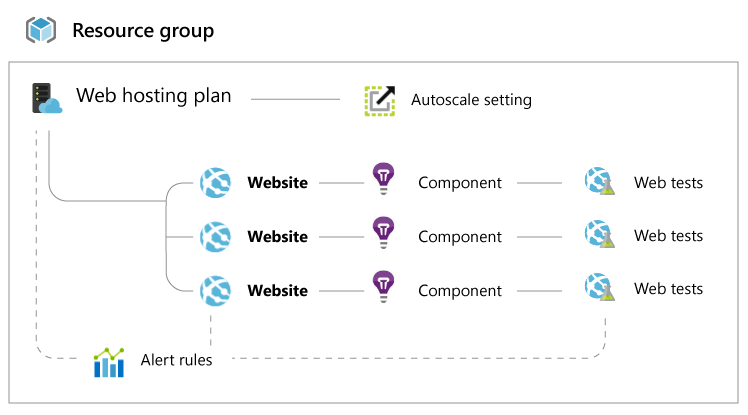

<properties urlDisplayName="" pageTitle="Role based access control troubleshooting" metaKeywords="" description="" metaCanonical="" services="" documentationCenter="" title="Role based access control troubleshooting" authors="Stephen Siciliano"  solutions="" writer="" manager="" editor=""  />

<tags ms.service="multiple" ms.workload="multiple" ms.tgt_pltfrm="ibiza" ms.devlang="na" ms.topic="article" ms.date="01/01/1900" ms.author="Stephen Siciliano" />

# Role based access control troubleshooting

## Introduction

Role based access control is a powerful feature that allows you to delegate fine-grained access to resources in Azure. This means you can feel confident granting a specific person the right to just exactly what they need. However, at times the resource model for Azure resources can be complicated and it can be difficult to understand exactly what you are granting permissions to.

This document will let you know what to expect when using some of the new roles in the preview portal.  There are three pre-built roles that are included in this release:
* Owner
* Contributor
* Reader

Owners and contributors will have full access to the management experience, the difference being that a contributor can’t give access to other users or groups.  Things get a little more interesting with the reader role, so that’s where we’ll spend some time.

## Website workloads

### Having read-access only 

If you grant a user, or yourself only have, read access to a website, then there may be some features that are disabled that you might not expect. The following management capabilities require **write** access to the website (either Contributor or Owner), and won’t be available in any read only scenario. 
 
1. Commands (e.g. start, stop, etc.)
2. Changing settings like general configuration, scale settings, backup settings, and monitoring settings.
3. Accessing publishing credentials and other secrets like app settings and connection strings.
4. Streaming logs
5. Diagnostic logs configuration
6. Websites Console (command prompt)
7. Active and recent deployments (for local git continuous deployment)
8. Estimated spend
9. Web tests
10. Virtual network (only visible to a reader if a virtual network has previously been configured by a user with write access).
 
If you can't access any of these parts, you'll need to have Contributor access to the Website. 

### Dealing with related resources
 
Websites are complicated by the presence of a few different resources that interplay. Here is a typical resource group with a couple websites:

As a result, if you grant someone access to just the website, much functionality on the website blade will be completley disabled. 
 
1. These items require access to the **Web hosting plan** that corresponds to your website.
    * Viewing the website’s pricing tier (e.g. Free, Shared, Basic, or Standard).
    * Scale configuration (i.e. # of instances, VM size, auto scale settings).
    * Quotas (e.g. Storage, bandwidth, CPU).
2. These items require access to the whole **Resource group** that contains your website.
    * SSL Certificates and bindings (This is because SSL certificates can be shared between sites in the same resource group and geo-location).
    * Alert rules
    * Autoscale settings
    * Application insights components
    * Web tests

## Virtual machine workloads

### Having read-only access

Much like with websites, some features on the Virtual Machine blade require write access to the Virtual Machine:

### Dealing with related resources

Virtual machines also have related resources, including:
* Domain names
* Virtual networks
* Alert rules

