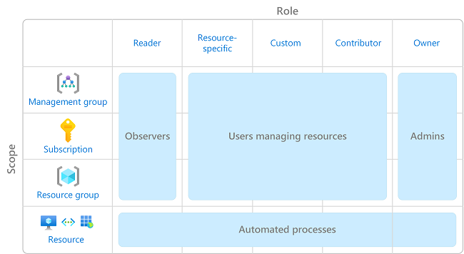

# Best practices for Azure RBAC

This article describes some best practices for using Azure role-based access control (Azure RBAC). These best practices are derived from our experience with Azure RBAC and the experiences of customers like yourself.

## Only grant the access users need

Using Azure RBAC, you can segregate duties within your team and grant only the amount of access to users that they need to perform their jobs. Instead of giving everybody unrestricted permissions in your Azure subscription or resources, you can allow only certain actions at a particular scope.

When planning your access control strategy, it's a best practice to grant users the least privilege to get their work done. Avoid assigning broader roles at broader scopes even if it initially seems more convenient to do so. When creating custom roles, only include the permissions users need. By limiting roles and scopes, you limit what resources are at risk if the security principal is ever compromised.

The following diagram shows a suggested pattern for using Azure RBAC.

For information about how to assign roles, see [Assign Azure roles using the Azure portal](role-assignments-portal.md).

## Limit the number of subscription owners

You should have a maximum of 3 subscription owners to reduce the potential for breach by a compromised owner. This recommendation can be monitored in Microsoft Defender for Cloud. For other identity and access recommendations in Defender for Cloud, see [Security recommendations - a reference guide](../security-center/recommendations-reference.md).

## Limit privileged administrator role assignments

Some roles are identified as [privileged administrator roles](./role-assignments-steps.md#privileged-administrator-roles). Consider taking the following actions to improve your security posture:

- Remove unnecessary privileged role assignments.
- Avoid assigning a privileged administrator role when a [job function role](./role-assignments-steps.md#job-function-roles) can be used instead.
- If you must assign a privileged administrator role, use a narrow scope, such as resource group or resource, instead of a broader scope, such as management group or subscription.
- If you are assigning a role with permission to create role assignments, consider adding a condition to constrain the role assignment. For more information, see [Delegate the Azure role assignment task to others with conditions (preview)](delegate-role-assignments-portal.md).

For more information, see [List or manage privileged administrator role assignments](./role-assignments-list-portal.md#list-or-manage-privileged-administrator-role-assignments).

## Use Microsoft Entra Privileged Identity Management

To protect privileged accounts from malicious cyber-attacks, you can use Microsoft Entra Privileged Identity Management (PIM) to lower the exposure time of privileges and increase your visibility into their use through reports and alerts. PIM helps protect privileged accounts by providing just-in-time privileged access to Microsoft Entra ID and Azure resources. Access can be time bound after which privileges are revoked automatically. 

For more information, see [What is Microsoft Entra Privileged Identity Management?](../active-directory/privileged-identity-management/pim-configure.md).

## Assign roles to groups, not users

To make role assignments more manageable, avoid assigning roles directly to users. Instead, assign roles to groups. Assigning roles to groups instead of users also helps minimize the number of role assignments, which has a [limit of role assignments per subscription](../azure-resource-manager/management/azure-subscription-service-limits.md#azure-rbac-limits).

## Assign roles using the unique role ID instead of the role name

There are a couple of times when a role name might change, for example:

- You are using your own custom role and you decide to change the name.
- You are using a preview role that has **(Preview)** in the name. When the role is released, the role is renamed.

Even if a role is renamed, the role ID does not change. If you are using scripts or automation to create your role assignments, it's a best practice to use the unique role ID instead of the role name. Therefore, if a role is renamed, your scripts are more likely to work.

For more information, see [Assign a role using the unique role ID and Azure PowerShell](role-assignments-powershell.md#assign-a-role-for-a-user-using-the-unique-role-id-at-a-resource-group-scope) and [Assign a role using the unique role ID and Azure CLI](role-assignments-cli.md#assign-a-role-for-a-user-using-the-unique-role-id-at-a-resource-group-scope).

## Avoid using a wildcard when creating custom roles

When creating custom roles, you can use the wildcard (`*`) character to define permissions. It's recommended that you specify `Actions` and `DataActions` explicitly instead of using the wildcard (`*`) character. The additional access and permissions granted through future `Actions` or `DataActions` might be unwanted behavior using the wildcard. For more information, see [Azure custom roles](custom-roles.md#wildcard-permissions).

## Next steps

- [Troubleshoot Azure RBAC](troubleshooting.md)
