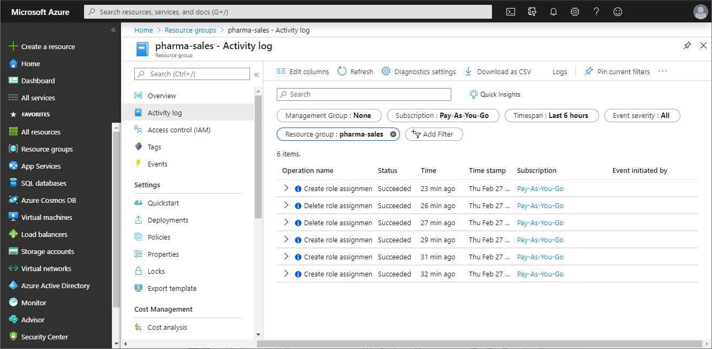
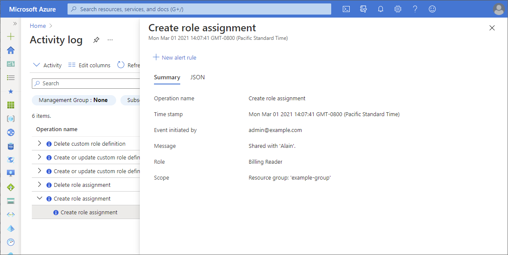
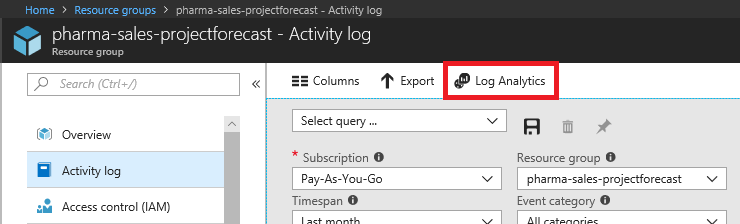
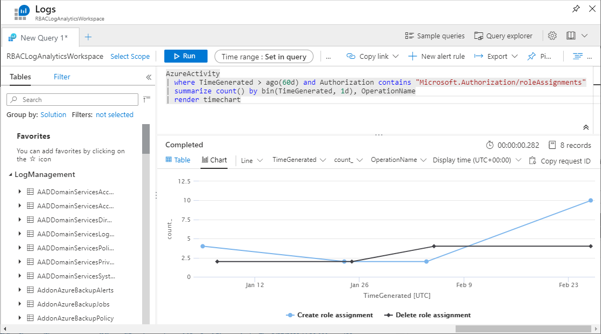

# View activity logs for Azure RBAC changes

Sometimes you need information about Azure role-based access control (Azure RBAC) changes, such as for auditing or troubleshooting purposes. Anytime someone makes changes to role assignments or role definitions within your subscriptions, the changes get logged in [Azure Activity Log](../azure-monitor/essentials/platform-logs-overview.md). You can view the activity logs to see all the Azure RBAC changes for the past 90 days.

## Operations that are logged

Here are the Azure RBAC-related operations that are logged in Activity Log:

- Create role assignment
- Delete role assignment
- Create or update custom role definition
- Delete custom role definition

## Azure portal

The easiest way to get started is to view the activity logs with the Azure portal. The following screenshot shows an example of role assignment operations in the activity log. It also includes an option to download the logs as a CSV file.



To get more information, click an entry to open the summary pane. Click the **JSON** tab to get a detailed log.



The activity log in the portal has several filters. Here are the Azure RBAC-related filters:

| Filter | Value |
| --------- | --------- |
| Event category | <ul><li>Administrative</li></ul> |
| Operation | <ul><li>Create role assignment</li><li>Delete role assignment</li><li>Create or update custom role definition</li><li>Delete custom role definition</li></ul> |

For more information about activity logs, see [Azure Activity log](../azure-monitor/essentials/activity-log.md).


## Interpret a log entry

The log output from the JSON tab, Azure PowerShell, or Azure CLI can include a lot of information. Here are some of the key properties to look for when trying to interpret a log entry. For ways to filter the log output using Azure PowerShell or Azure CLI, see the following sections.

> [!div class="mx-tableFixed"]
> | Property | Example values | Description |
> | --- | --- | --- |
> | authorization:action | Microsoft.Authorization/roleAssignments/write | Create role assignment |
> |  | Microsoft.Authorization/roleAssignments/delete | Delete role assignment |
> |  | Microsoft.Authorization/roleDefinitions/write | Create or update role definition |
> |  | Microsoft.Authorization/roleDefinitions/delete | Delete role definition |
> | authorization:scope | /subscriptions/{subscriptionId}<br/>/subscriptions/{subscriptionId}/resourceGroups/{resourceGroupName}/providers/Microsoft.Authorization/roleAssignments/{roleAssignmentId} | Scope for the action |
> | caller | admin@example.com<br/>{objectId} | Who initiated the action |
> | eventTimestamp | 2021-03-01T22:07:41.126243Z | Time that action occurred |
> | status:value | Started<br/>Succeeded<br/>Failed | Status of the action |

## Azure PowerShell

To view activity logs with Azure PowerShell, use the [Get-AzLog](/powershell/module/Az.Monitor/Get-AzLog) command.

This command lists all role assignment changes in a subscription for the past seven days:

```azurepowershell
Get-AzLog -StartTime (Get-Date).AddDays(-7) | Where-Object {$_.Authorization.Action -like 'Microsoft.Authorization/roleAssignments/*'}
```

This command lists all role definition changes in a resource group for the past seven days:

```azurepowershell
Get-AzLog -ResourceGroupName pharma-sales -StartTime (Get-Date).AddDays(-7) | Where-Object {$_.Authorization.Action -like 'Microsoft.Authorization/roleDefinitions/*'}
```

### Filter log output

The log output can include a lot of information. This command lists all role assignment and role definition changes in a subscription for the past seven days and filters the output:

```azurepowershell
Get-AzLog -StartTime (Get-Date).AddDays(-7) | Where-Object {$_.Authorization.Action -like 'Microsoft.Authorization/role*'} | Format-List Caller,EventTimestamp,{$_.Authorization.Action},Properties
```

The following shows an example of the filtered log output when creating a role assignment:

```azurepowershell
Caller                  : admin@example.com
EventTimestamp          : 3/1/2021 10:07:42 PM
$_.Authorization.Action : Microsoft.Authorization/roleAssignments/write
Properties              :
                          statusCode     : Created
                          serviceRequestId: {serviceRequestId}
                          eventCategory  : Administrative
                          entity         : /subscriptions/{subscriptionId}/resourceGroups/example-group/providers/Microsoft.Authorization/roleAssignments/{roleAssignmentId}
                          message        : Microsoft.Authorization/roleAssignments/write
                          hierarchy      : {tenantId}/{subscriptionId}

Caller                  : admin@example.com
EventTimestamp          : 3/1/2021 10:07:41 PM
$_.Authorization.Action : Microsoft.Authorization/roleAssignments/write
Properties              :
                          requestbody    : {"Id":"{roleAssignmentId}","Properties":{"PrincipalId":"{principalId}","PrincipalType":"User","RoleDefinitionId":"/providers/Microsoft.Authorization/roleDefinitions/fa23ad8b-c56e-40d8-ac0c-ce449e1d2c64","Scope":"/subscriptions/
                          {subscriptionId}/resourceGroups/example-group"}}
                          eventCategory  : Administrative
                          entity         : /subscriptions/{subscriptionId}/resourceGroups/example-group/providers/Microsoft.Authorization/roleAssignments/{roleAssignmentId}
                          message        : Microsoft.Authorization/roleAssignments/write
                          hierarchy      : {tenantId}/{subscriptionId}

```

If you are using a service principal to create role assignments, the Caller property will be a service principal object ID. You can use [Get-AzADServicePrincipal](/powershell/module/az.resources/get-azadserviceprincipal) to get information about the service principal.

```Example
Caller                  : {objectId}
EventTimestamp          : 3/1/2021 9:43:08 PM
$_.Authorization.Action : Microsoft.Authorization/roleAssignments/write
Properties              : 
                          statusCode     : Created
                          serviceRequestId: {serviceRequestId}
                          eventCategory  : Administrative
```

## Azure CLI

To view activity logs with the Azure CLI, use the [az monitor activity-log list](/cli/azure/monitor/activity-log#az-monitor-activity-log-list) command.

This command lists the activity logs in a resource group from March 1, looking forward seven days:

```azurecli
az monitor activity-log list --resource-group example-group --start-time 2021-03-01 --offset 7d
```

This command lists the activity logs for the Authorization resource provider from March 1, looking forward seven days:

```azurecli
az monitor activity-log list --namespace "Microsoft.Authorization" --start-time 2021-03-01 --offset 7d
```

### Filter log output

The log output can include a lot of information. This command lists all role assignment and role definition changes in a subscription looking forward seven days and filters the output:

```azurecli
az monitor activity-log list --namespace "Microsoft.Authorization" --start-time 2021-03-01 --offset 7d --query '[].{authorization:authorization, caller:caller, eventTimestamp:eventTimestamp, properties:properties}'
```

The following shows an example of the filtered log output when creating a role assignment:

```azurecli
[
 {
    "authorization": {
      "action": "Microsoft.Authorization/roleAssignments/write",
      "role": null,
      "scope": "/subscriptions/{subscriptionId}/resourceGroups/example-group/providers/Microsoft.Authorization/roleAssignments/{roleAssignmentId}"
    },
    "caller": "admin@example.com",
    "eventTimestamp": "2021-03-01T22:07:42.456241+00:00",
    "properties": {
      "entity": "/subscriptions/{subscriptionId}/resourceGroups/example-group/providers/Microsoft.Authorization/roleAssignments/{roleAssignmentId}",
      "eventCategory": "Administrative",
      "hierarchy": "{tenantId}/{subscriptionId}",
      "message": "Microsoft.Authorization/roleAssignments/write",
      "serviceRequestId": "{serviceRequestId}",
      "statusCode": "Created"
    }
  },
  {
    "authorization": {
      "action": "Microsoft.Authorization/roleAssignments/write",
      "role": null,
      "scope": "/subscriptions/{subscriptionId}/resourceGroups/example-group/providers/Microsoft.Authorization/roleAssignments/{roleAssignmentId}"
    },
    "caller": "admin@example.com",
    "eventTimestamp": "2021-03-01T22:07:41.126243+00:00",
    "properties": {
      "entity": "/subscriptions/{subscriptionId}/resourceGroups/example-group/providers/Microsoft.Authorization/roleAssignments/{roleAssignmentId}",
      "eventCategory": "Administrative",
      "hierarchy": "{tenantId}/{subscriptionId}",
      "message": "Microsoft.Authorization/roleAssignments/write",
      "requestbody": "{\"Id\":\"{roleAssignmentId}\",\"Properties\":{\"PrincipalId\":\"{principalId}\",\"PrincipalType\":\"User\",\"RoleDefinitionId\":\"/providers/Microsoft.Authorization/roleDefinitions/fa23ad8b-c56e-40d8-ac0c-ce449e1d2c64\",\"Scope\":\"/subscriptions/{subscriptionId}/resourceGroups/example-group\"}}"
    }
  }
]
```

## Azure Monitor logs

[Azure Monitor logs](../azure-monitor/logs/log-query-overview.md) is another tool you can use to collect and analyze Azure RBAC changes for all your Azure resources. Azure Monitor logs has the following benefits:

- Write complex queries and logic
- Integrate with alerts, Power BI, and other tools
- Save data for longer retention periods
- Cross-reference with other logs such as security, virtual machine, and custom

Here are the basic steps to get started:

1. [Create a Log Analytics workspace](../azure-monitor/logs/quick-create-workspace.md).

1. [Configure the Activity](../azure-monitor/essentials/activity-log.md) for your workspace.

1. [View the activity logs Insights](../azure-monitor/essentials/activity-log.md). A quick way to navigate to the Activity Log Overview page is to click the **Logs** option.

   

1. Optionally use the [Azure Monitor Log Analytics](../azure-monitor/logs/log-analytics-tutorial.md) to query and view the logs. For more information, see [Get started with log queries in Azure Monitor](../azure-monitor/logs/get-started-queries.md).

Here's a query that returns new role assignments organized by target resource provider:

```Kusto
AzureActivity
| where TimeGenerated > ago(60d) and Authorization contains "Microsoft.Authorization/roleAssignments/write" and ActivityStatus == "Succeeded"
| parse ResourceId with * "/providers/" TargetResourceAuthProvider "/" *
| summarize count(), makeset(Caller) by TargetResourceAuthProvider
```

Here's a query that returns role assignment changes displayed in a chart:

```Kusto
AzureActivity
| where TimeGenerated > ago(60d) and Authorization contains "Microsoft.Authorization/roleAssignments"
| summarize count() by bin(TimeGenerated, 1d), OperationName
| render timechart
```



## Next steps

* [Alert on privileged Azure role assignments](role-assignments-alert.md)
* [View activity logs to monitor actions on resources](../azure-monitor/essentials/activity-log.md)
* [Monitor subscription activity with the Azure Activity log](../azure-monitor/essentials/platform-logs-overview.md)
