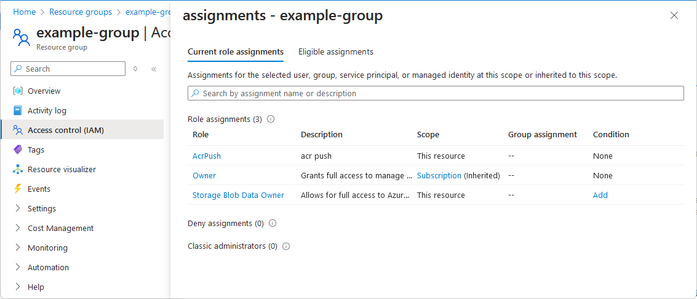

# Quickstart: Check access for a user to Azure resources

Sometimes you need to check what access a user has to a set of Azure resources. You check their access by listing their assignments. A quick way to check the access for a single user is to use the **Check access** feature on the **Access control (IAM)** page.

## Step 1: Open the Azure resources

To check the access for a user, you first need to open the Azure resources you want to check access for. Azure resources are organized into levels that are typically called the *scope*. In Azure, you can specify a scope at four levels from broad to narrow: management group, subscription, resource group, and resource.

Follow these steps to open the set of Azure resources that you want to check access for.

1. Open the [Azure portal](https://portal.azure.com).

1. Open the set of Azure resources, such as **Management groups**, **Subscriptions**, **Resource groups**, or a particular resource.

1. Click the specific resource in that scope.

    The following shows an example resource group.

    

## Step 2: Check access for a user

Follow these steps to check the access for a single user, group, service principal, or managed identity to the previously selected Azure resources.

1. Click **Access control (IAM)**.

    The following shows an example of the Access control (IAM) page for a resource group.

    

1. On the **Check access** tab, in the **Find** list, select the user, group, service principal, or managed identity you want to check access for.

1. In the search box, enter a string to search the directory for display names, email addresses, or object identifiers.

    

1. Click the security principal to open the **assignments** pane.

    On this pane, you can see the access for the selected security principal at this scope and inherited to this scope. Assignments at child scopes are not listed. You see the following assignments:

    - Role assignments added with Azure RBAC.
    - Deny assignments added using Azure Blueprints or Azure managed apps.
    - Classic Service Administrator or Co-Administrator assignments for classic deployments. 

    

## Step 3: Check your access

Follow these steps to check your access to the previously selected Azure resources.

1. Click **Access control (IAM)**.

1. On the **Check access** tab, click the **View my access** button.

    An assignments pane appears that lists your access at this scope and inherited to this scope. Assignments at child scopes are not listed.

    

## Next steps

> [!div class="nextstepaction"]
> [List Azure role assignments using the Azure portal](role-assignments-list-portal.md)
