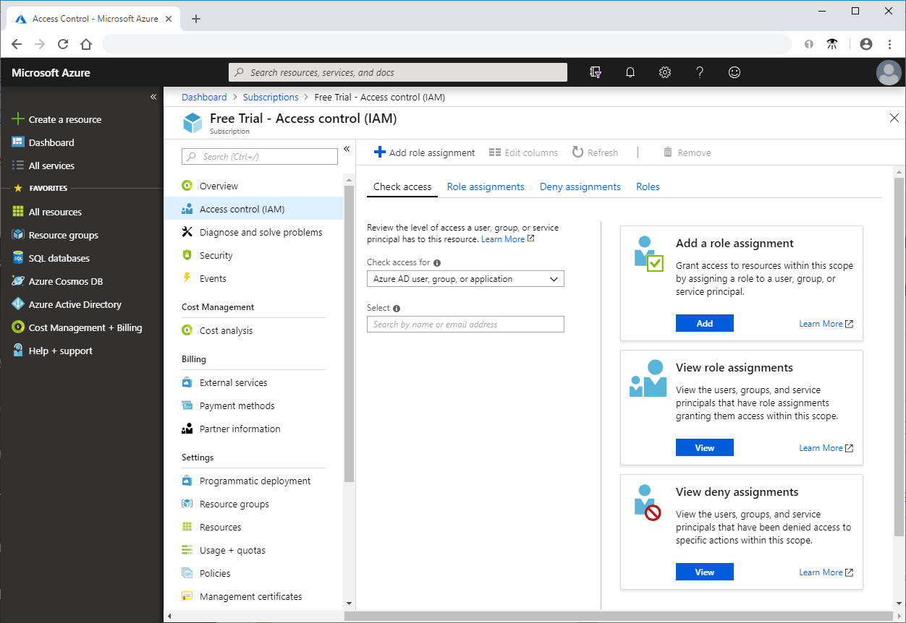
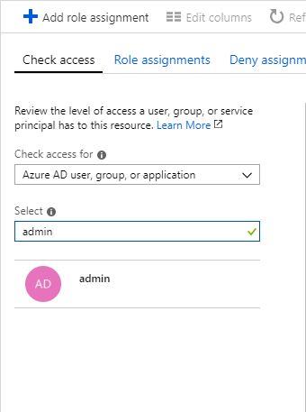
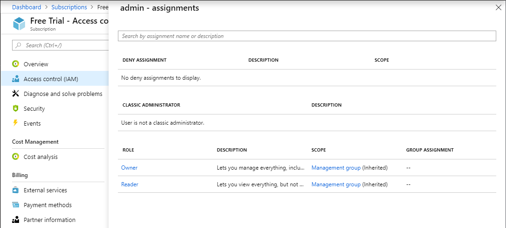

# Quickstart: View the access a user has to Azure resources

You can use the **Access control (IAM)** blade in [role-based access control (RBAC)](overview.md) to view the access a user or another security principal has to Azure resources. However, sometimes you just need to quickly view the access for a single user or another security principal. The easiest way to do this is to use the **Check access** feature in the Azure portal.

## View role assignments

 The way that you view the access for a user is to list their roles assignments. Follow these steps to view the role assignments for a single user, group, service principal, or managed identity at the subscription scope.

1. In the Azure portal, click **All services** and then **Subscriptions**.

1. Click your subscription.

1. Click **Access control (IAM)**.

1. Click the **Check access** tab.

    

1. In the **Find** list, select the type of security principal you want to check access for.

1. In the search box, enter a string to search the directory for display names, email addresses, or object identifiers.

    

1. Click the security principal to open the **assignments** pane.

    

    On this pane, you can see the roles assigned to the selected security principal and the scope. If there are any deny assignments at this scope or inherited to this scope, they will be listed.

## Next steps

> [!div class="nextstepaction"]
> [Tutorial: Grant a user access to Azure resources using RBAC and the Azure portal](quickstart-assign-role-user-portal.md)
