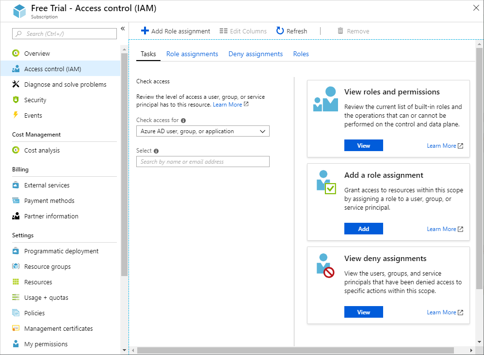
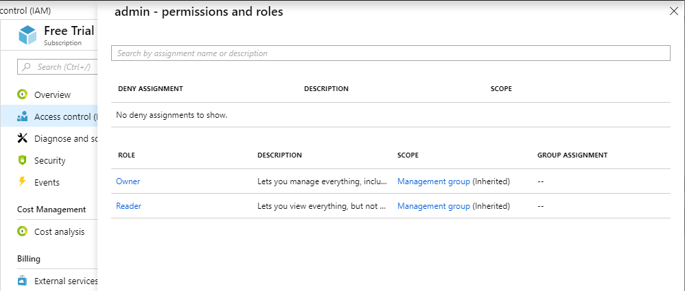

# Quickstart: View the roles and permissions for a user using the Azure portal

You can use the **Access control (IAM)** blade in [role-based access control (RBAC)](overview.md) to list access details for several users, groups, and applications, but sometimes you just need to quickly view the access for a single user, group, or application. The easiest way to do this is to use the **Check access** feature in the Azure portal.

## View the roles and permissions

Follow these steps to view the access for a single user, group, or application at the subscription scope.

1. In the Azure portal, click **All services** and then **Subscriptions**.

1. Click your subscription.

1. Click **Access control (IAM)**.

    On the **Tasks** tab, you see **Check access**.

    

1. In the **Check Access for** list, select the type of security principal you want to check access for.

1. In the **Select** list, select a security principal. If you don't see the security principal in the list, you can type in the **Select** box to search the directory for display names, email addresses, and object identifiers.

    

1. Click the security principal to open the **permissions and roles** pane.

    

    On this pane, you can see the roles assigned to the selected security principal and the scope. If there are any deny assignments, they will also be listed.

## Next steps

> [!div class="nextstepaction"]
> [Tutorial: Grant access for a user using RBAC and the Azure portal](quickstart-assign-role-user-portal.md)
