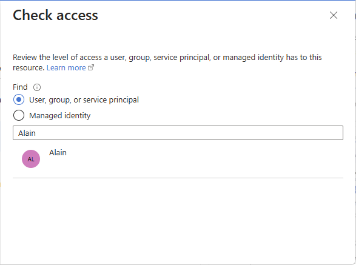
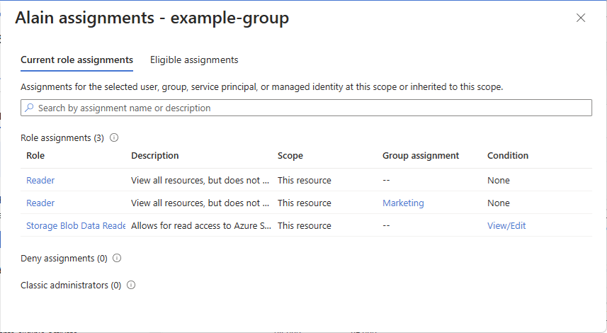

# Quickstart: Check access for a user to a single Azure resource

Sometimes you need to check what access a user has to an Azure resource. You check their access by listing their assignments. A quick way to check the access for a single user is to use the **Check access** feature on the **Access control (IAM)** page.

## Step 1: Open the Azure resource

To check the access for a user, you first need to open the Azure resource you want to check access for. Azure resources are organized into levels that are typically called the *scope*. In Azure, you can specify a scope at four levels from broad to narrow: management group, subscription, resource group, and resource.

Follow these steps to open the Azure resource that you want to check access for.

1. Open the [Azure portal](https://portal.azure.com).

1. Open the Azure resource you want to check access for, such as **Management groups**, **Subscriptions**, **Resource groups**, or a particular resource.

1. Click the specific resource in that scope.

    The following shows an example resource group.

    

## Step 2: Check access for a user

Follow these steps to check the access for a single user, group, service principal, or managed identity to the previously selected Azure resource.

1. Click **Access control (IAM)**.

    The following shows an example of the Access control (IAM) page for a resource group.

    

1. On the **Check access** tab, click the **Check access** button.

1. In the **Check access** pane, click **User, group, or service principal**.

1. In the search box, enter a string to search the directory for display names, email addresses, or object identifiers.

    

1. Click the user to open the **assignments** pane.

    On this pane, you can see the access for the selected user at this scope and inherited to this scope. Assignments at child scopes aren't listed. You see the following assignments:

    - Role assignments added with Azure RBAC.
    - Deny assignments added using Azure Blueprints or Azure managed apps.
    - Classic Service Administrator or Co-Administrator assignments for classic deployments. 

    

## Step 3: Check your access

Follow these steps to check your access to the previously selected Azure resource.

1. Click **Access control (IAM)**.

1. On the **Check access** tab, click the **View my access** button.

    An assignments pane appears that lists your access at this scope and inherited to this scope. Assignments at child scopes aren't listed.

    

## Next steps

> [!div class="nextstepaction"]
> [List Azure role assignments using the Azure portal](role-assignments-list-portal.md)
