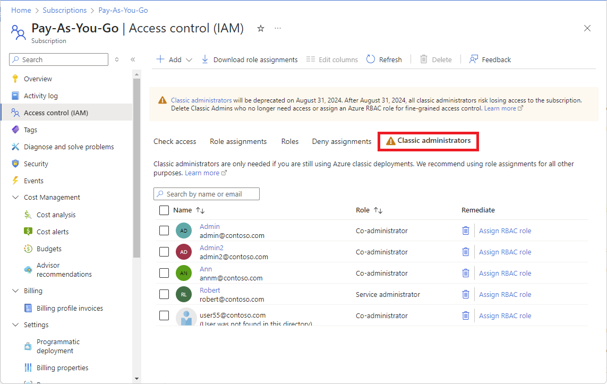
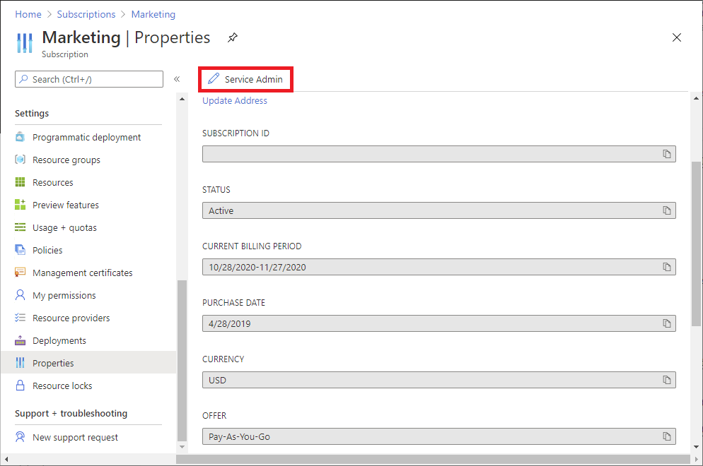
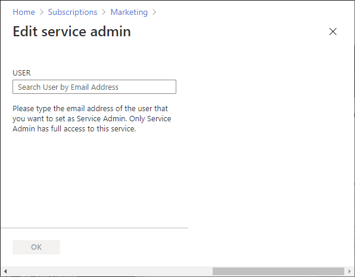
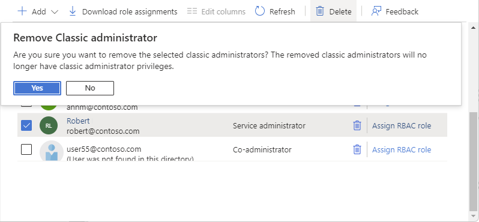

# Azure classic subscription administrators

> [!IMPORTANT]
> Classic resources and classic administrators will be [retired on August 31, 2024](https://azure.microsoft.com/updates/cloud-services-retirement-announcement/). Starting February 26, 2024, you won't be able to add new Co-Administrators. Remove unnecessary Co-Administrators and use Azure RBAC for fine-grained access control.

Microsoft recommends that you manage access to Azure resources using Azure role-based access control (Azure RBAC). However, if you are still using the classic deployment model, you'll need to use a classic subscription administrator role: Service Administrator and Co-Administrator. For information about how to migrate your resources from classic deployment to Resource Manager deployment, see [Azure Resource Manager vs. classic deployment](../azure-resource-manager/management/deployment-models.md).

This article describes how to remove or change the Co-Administrator and Service Administrator roles, and how to view the Account Administrator.

## Frequently asked questions

Will Co-Administrators lose access after August 31, 2024?

- Starting on August 31, 2024, Microsoft will start the process to remove access for Co-Administrators.

What is the equivalent Azure role I should assign for Co-Administrators?

- [Owner](built-in-roles.md#owner) role at subscription scope has the equivalent access. However, Owner is a [privileged administrator role](role-assignments-steps.md#privileged-administrator-roles) and grants full access to manage Azure resources. You should consider another Azure role with fewer permissions or reduce the scope.

What should I do if I have a strong dependency on Co-Administrators?

- Email ACARDeprecation@microsoft.com and describe your scenario.

## View Co-Administrators

Follow these steps to view the Co-Administrators for a subscription using the Azure portal.

1. Sign in to the [Azure portal](https://portal.azure.com) as an [Owner](built-in-roles.md#owner) of a subscription.

1. Open [Subscriptions](https://portal.azure.com/#blade/Microsoft_Azure_Billing/SubscriptionsBlade) and select a subscription.

1. Click **Access control (IAM)**.

1. Click the **Classic administrators** tab to view a list of the Co-Administrators.

    

## Assess Co-Administrators

Use the following table to assess how to remove or re-assign Co-Administrators.

| Assessment | Next steps|
| --- | --- |
| User no longer needs access | Follow steps to [remove Co-Administrator](#remove-a-co-administrator). |
| User still needs some access, but not full access | 1. Determine the Azure role the user needs. 2. Determine the scope the user needs. 3. Follow steps to [assign an Azure role to user](role-assignments-portal.md). 4. [Remove Co-Administrator](#remove-a-co-administrator). |
| User needs the same access as a Co-Administrator | 1. Assign the [Owner role at subscription scope](role-assignments-portal-subscription-admin.md). 2. [Remove Co-Administrator](#remove-a-co-administrator). |

## Remove a Co-Administrator

> [!IMPORTANT]
> Classic resources and classic administrators will be [retired on August 31, 2024](https://azure.microsoft.com/updates/cloud-services-retirement-announcement/). Starting February 26, 2024, you won't be able to add new Co-Administrators. Remove unnecessary Co-Administrators and use Azure RBAC for fine-grained access control.

Follow these steps to remove a Co-Administrator.

1. Sign in to the [Azure portal](https://portal.azure.com) as an [Owner](built-in-roles.md#owner) of a subscription.

1. Open [Subscriptions](https://portal.azure.com/#blade/Microsoft_Azure_Billing/SubscriptionsBlade) and select a subscription.

1. Click **Access control (IAM)**.

1. Click the **Classic administrators** tab to view a list of the Co-Administrators.

1. Add a check mark next to the Co-Administrator you want to remove.

1. Click **Remove**.

1. In the message box that appears, click **Yes**.

    

## Add a Co-Administrator

> [!IMPORTANT]
> Classic resources and classic administrators will be [retired on August 31, 2024](https://azure.microsoft.com/updates/cloud-services-retirement-announcement/). Starting February 26, 2024, you won't be able to add new Co-Administrators. Remove unnecessary Co-Administrators and use Azure RBAC for fine-grained access control.
> 
> You only need to add a Co-Administrator if the user needs to manage Azure classic deployments by using [Azure Service Management PowerShell Module](/powershell/azure/servicemanagement/install-azure-ps). If the user only uses the Azure portal to manage the classic resources, you won’t need to add the classic administrator for the user.

1. Sign in to the [Azure portal](https://portal.azure.com) as an [Owner](built-in-roles.md#owner) of a subscription.

1. Open [Subscriptions](https://portal.azure.com/#blade/Microsoft_Azure_Billing/SubscriptionsBlade) and select a subscription.

    Co-Administrators can only be assigned at the subscription scope.

1. Click **Access control (IAM)**.

1. Click the **Classic administrators** tab.

    

1. Click **Add** > **Add co-administrator** to open the Add co-administrators pane.

    If the Add co-administrator option is disabled, you do not have permissions.

1. Select the user that you want to add and click **Add**.

    

## Add a guest user as a Co-Administrator

To add a guest user as a Co-Administrator, follow the same steps as in the previous [Add a Co-Administrator](#add-a-co-administrator) section. The guest user must meet the following criteria:

- The guest user must have a presence in your directory. This means that the user was invited to your directory and accepted the invite.

For more information, about how to add a guest user to your directory, see [Add Microsoft Entra B2B collaboration users in the Azure portal](../active-directory/external-identities/add-users-administrator.md).

Before you remove a guest user from your directory, you should first remove any role assignments for that guest user. For more information, see [Remove a guest user from your directory](./role-assignments-external-users.md#remove-a-guest-user-from-your-directory).

### Differences for guest users

Guest users that have been assigned the Co-Administrator role might see some differences as compared to member users with the Co-Administrator role. Consider the following scenario:

- User A with a Microsoft Entra account (work or school account) is the Service Administrator for an Azure subscription.
- User B has a Microsoft account.
- User A assigns the Co-Administrator role to user B.
- User B can do almost everything, but is unable to register applications or look up users in the Microsoft Entra directory.

You would expect that user B could manage everything. The reason for this difference is that the Microsoft account is added to the subscription as a guest user instead of a member user. Guest users have different default permissions in Microsoft Entra ID as compared to member users. For example, member users can read other users in Microsoft Entra ID and guest users cannot. Member users can register new service principals in Microsoft Entra ID and guest users cannot.

If a guest user needs to be able to perform these tasks, a possible solution is to assign the specific Microsoft Entra roles the guest user needs. For example, in the previous scenario, you could assign the [Directory Readers](../active-directory/roles/permissions-reference.md#directory-readers) role to read other users and assign the [Application Developer](../active-directory/roles/permissions-reference.md#application-developer) role to be able to create service principals. For more information about member and guest users and their permissions, see [What are the default user permissions in Microsoft Entra ID?](../active-directory/fundamentals/users-default-permissions.md). For more information about granting access for guest users, see [Assign Azure roles to external guest users using the Azure portal](role-assignments-external-users.md).

Note that the [Azure built-in roles](../role-based-access-control/built-in-roles.md) are different than the [Microsoft Entra roles](../active-directory/roles/permissions-reference.md). The built-in roles don't grant any access to Microsoft Entra ID. For more information, see [Understand the different roles](../role-based-access-control/rbac-and-directory-admin-roles.md).

For information that compares member users and guest users, see [What are the default user permissions in Microsoft Entra ID?](../active-directory/fundamentals/users-default-permissions.md).

## Change the Service Administrator

Only the Account Administrator can change the Service Administrator for a subscription. By default, when you sign up for an Azure subscription, the Service Administrator is the same as the Account Administrator.

The user with the Account Administrator role can access the Azure portal and manage billing, but they can't cancel subscriptions. The user with the Service Administrator role has full access to the Azure portal and they can cancel subscriptions. The Account Administrator can make themself the Service Administrator.

Follow these steps to change the Service Administrator in the Azure portal.

1. Make sure your scenario is supported by checking the [limitations for changing the Service Administrator](#limitations-for-changing-the-service-administrator).

1. Sign in to the [Azure portal](https://portal.azure.com) as the Account Administrator.

1. Open **Cost Management + Billing** and select a subscription.

1. In the left navigation, click **Properties**.

1. Click **Change service admin**.

    

1. In the **Edit service admin** page, enter the email address for the new Service Administrator.

    

1. Click **OK** to save the change.

### Limitations for changing the Service Administrator

There can only be one Service Administrator per Azure subscription. Changing the Service Administrator will behave differently depending on whether the Account Administrator is a Microsoft account or whether it is a Microsoft Entra account (work or school account).

| Account Administrator account | Can change the Service Administrator to a different Microsoft account? | Can change the Service Administrator to a Microsoft Entra account in the same directory? | Can change the Service Administrator to a Microsoft Entra account in a different directory? |
| --- | --- | --- | --- |
| Microsoft account | Yes | No | No |
| Microsoft Entra account | Yes | Yes | No |

If the Account Administrator is a Microsoft Entra account, you can change the Service Administrator to a Microsoft Entra account in the same directory, but not in a different directory. For example, abby@contoso.com can change the Service Administrator to bob@contoso.com, but cannot change the Service Administrator to john@notcontoso.com unless john@notcontoso.com has a presence in the contoso.com directory.

For more information about Microsoft accounts and Microsoft Entra accounts, see [What is Microsoft Entra ID?](../active-directory/fundamentals/active-directory-whatis.md).

## Remove the Service Administrator

You might want to remove the Service Administrator, for example, if they are no longer with the company. If you do remove the Service Administrator, you must have a user who is assigned the [Owner](built-in-roles.md#owner) role at subscription scope to avoid orphaning the subscription. A subscription Owner has the same access as the Service Administrator.

1. Sign in to the [Azure portal](https://portal.azure.com) as an [Owner](built-in-roles.md#owner) of a subscription.

1. Open [Subscriptions](https://portal.azure.com/#blade/Microsoft_Azure_Billing/SubscriptionsBlade) and select a subscription.

1. Click **Access control (IAM)**.

1. Click the **Classic administrators** tab.

1. Add a check mark next to the Service Administrator.

1. Click **Remove**.

1. In the message box that appears, click **Yes**.

    

## View the Account Administrator

The Account Administrator is the user that initially signed up for the Azure subscription, and is responsible as the billing owner of the subscription. To change the Account Administrator of a subscription, see [Transfer ownership of an Azure subscription to another account](../cost-management-billing/manage/billing-subscription-transfer.md).

Follow these steps to view the Account Administrator.

1. Sign in to the [Azure portal](https://portal.azure.com).

1. Open **Cost Management + Billing** and select a subscription.

1. In the left navigation, click **Properties**.

    The Account Administrator of the subscription is displayed in the **Account Admin** box.

    

## Next steps

* [Understand the different roles](../role-based-access-control/rbac-and-directory-admin-roles.md)
* [Assign Azure roles using the Azure portal](../role-based-access-control/role-assignments-portal.md)
* [Add or change Azure subscription administrators](../cost-management-billing/manage/add-change-subscription-administrator.md)
