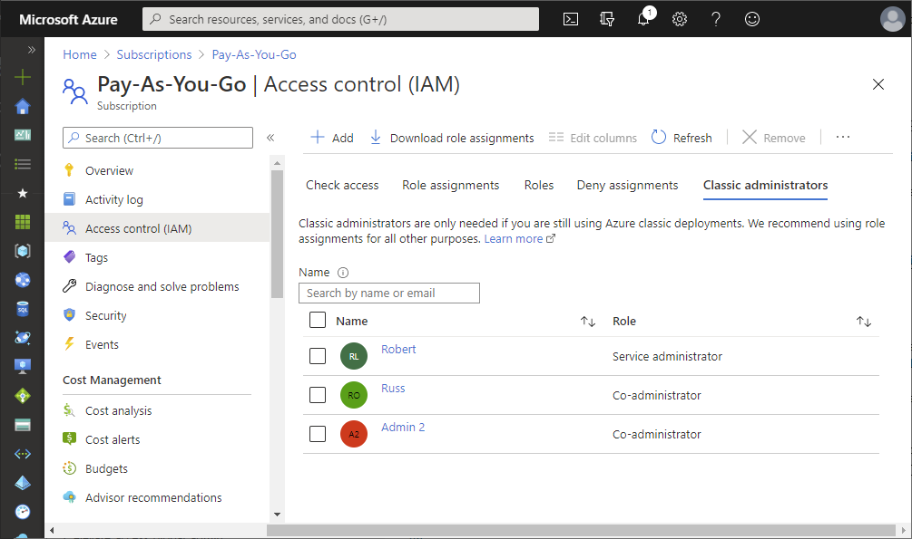
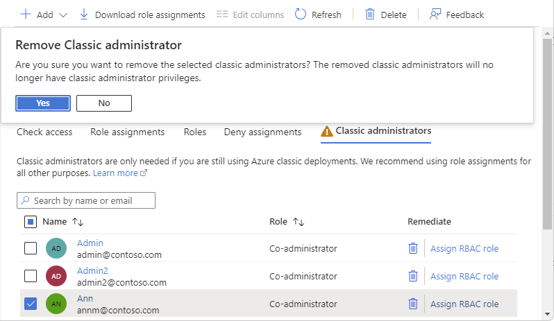
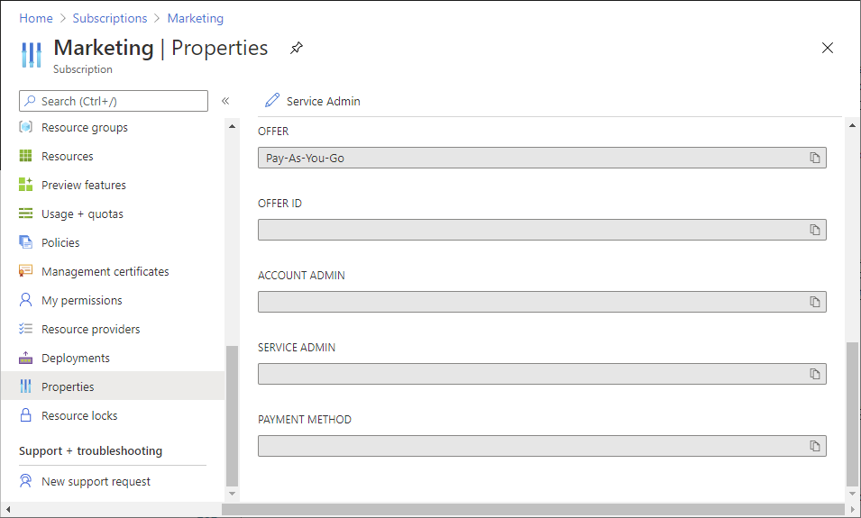
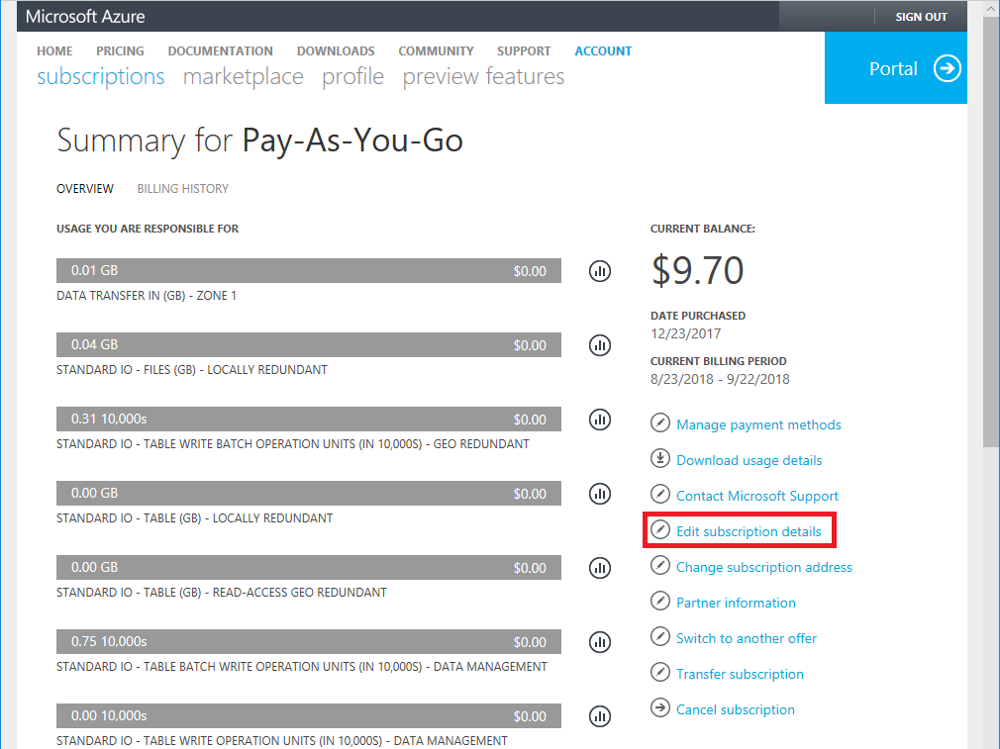
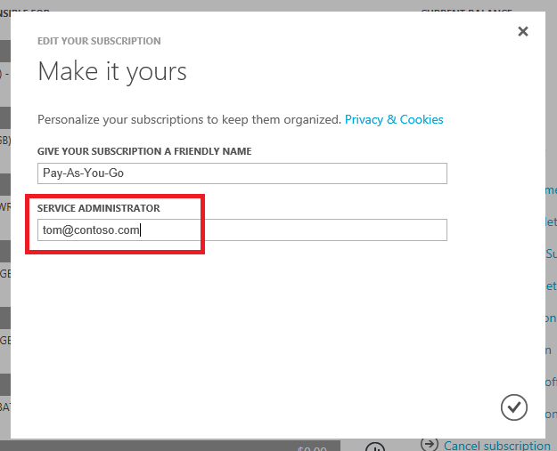

# Azure classic subscription administrators

Microsoft recommends that you manage access to Azure resources using role-based access control (RBAC). However, if you are still using the classic deployment model, you'll need to use a classic subscription administrator role: Service Administrator and Co-Administrator. For more information, see [Azure Resource Manager vs. classic deployment](../azure-resource-manager/resource-manager-deployment-model.md).

This article describes how to add or change the Co-Administrator and Service Administrator roles, and how to view the Account Administrator.

## Add a Co-Administrator

> [!TIP]
> You only need to add a Co-Administrator if the user needs to manage Azure classic deployments by using [Azure Service Management PowerShell Module](https://docs.microsoft.com/powershell/module/servicemanagement/azure). If the user only uses the Azure portal to manage the classic resources, you won’t need to add the classic administrator for the user.

1. Sign in to the [Azure portal](https://portal.azure.com) as a Service Administrator.

1. Open [Subscriptions](https://portal.azure.com/#blade/Microsoft_Azure_Billing/SubscriptionsBlade) and select a subscription.

    Co-Administrators can only be assigned at the subscription scope.

1. Click **Access control (IAM)**.

1. Click the **Classic administrators** tab.

    

1. Click **Add** > **Add co-administrator** to open the Add co-administrators pane.

    If the Add co-administrator option is disabled, you do not have permissions.

1. Select the user that you want to add and click **Add**.

    

### Adding a guest user as a Co-Administrator

[Guest users](../active-directory/b2b/b2b-quickstart-add-guest-users-portal.md) that have been assigned the Co-Administrator role might see some differences as compared to member users with the Co-Administrator role. Consider the following scenario:

- User A with an Azure AD Work or School account is a Service Administrator for an Azure subscription.
- User B has a Microsoft account.
- User A assigns the Co-Administrator role to user B.
- User B can do almost everything, but is unable to register applications or look up users in the Azure AD directory.

You would expect that user B could manage everything. The reason for this difference is that the Microsoft account is added to the subscription as a guest user instead of a member user. Guest users have different default permissions in Azure AD as compared to member users. For example, member users can read other users in Azure AD and guest users cannot. Member users can register new service principals in Azure AD and guest users cannot. If a guest user needs to be able to perform these tasks, a possible solution is to assign the specific Azure AD administrator roles the guest user needs. For example, in the previous scenario, you could assign the [Directory Readers](../active-directory/users-groups-roles/directory-assign-admin-roles.md#directory-readers) role to read other users and assign the [Application Developer](../active-directory/users-groups-roles/directory-assign-admin-roles.md#application-developer) role to be able to create service principals. For more information about member and guest users and their permissions, see [What are the default user permissions in Azure Active Directory?](../active-directory/fundamentals/users-default-permissions.md).

Note that the [built-in roles for Azure resources](../role-based-access-control/built-in-roles.md) are different than the [Azure AD administrator roles](../active-directory/users-groups-roles/directory-assign-admin-roles.md). The built-in roles don't grant any access to Azure AD. For more information, see [Understand the different roles](../role-based-access-control/rbac-and-directory-admin-roles.md).

## Remove a Co-Administrator

1. Sign in to the [Azure portal](https://portal.azure.com) as a Service Administrator.

1. Open [Subscriptions](https://portal.azure.com/#blade/Microsoft_Azure_Billing/SubscriptionsBlade) and select a subscription.

1. Click **Access control (IAM)**.

1. Click the **Classic administrators** tab.

1. Add a checkmark next to the Co-Administrator you want to remove.

1. Click **Remove**.

1. In the message box that appears, click **Yes**.

    

## Change the Service Administrator

Only the Account Administrator can change the Service Administrator for a subscription. By default, when you sign up for an Azure subscription, the Service Administrator is the same as the Account Administrator. The user with the Account Administrator role has no access to the Azure portal. The user with the Service Administrator role has full access to the Azure portal. If the Account Administrator and Service Administrator are the same user and you change the Service Administrator to a different user, then the Account Administrator loses access to Azure portal. However, the Account Administrator can always use Account Center to change the Service Administrator back to themselves.

There are two ways to change the Service Administrator. You can change in the **Azure portal** or **Account Center**.

### Azure portal

1. Make sure your scenario is supported by checking the limitations for changing Service Administrators.

1. Sign in to the [Azure portal](https://portal.azure.com) as the Account Administrator.

1. Open [Subscriptions](https://portal.azure.com/#blade/Microsoft_Azure_Billing/SubscriptionsBlade) and select a subscription.

1. Click **Properties**.

    

1. At the top, click **Service Admin** to open the Service administrator pane.

    If the Service Admin button is disabled, you do not have permissions. Only the user who is the Account Administrator can change the Service Administrator.

1. Select a new Service Administrator and then click **Save**.

### Account Center

1. Make sure your scenario is supported by checking the limitations for changing Service Administrators.

1. Sign in to [Account Center](https://account.windowsazure.com/subscriptions) as the Account Administrator.

1. Click a subscription.

1. On the right side, click **Edit subscription details**.

    

1. In the **SERVICE ADMINISTRATOR** box, enter the email address of the new Service Administrator.

    

1. Click the checkmark to save the change.

### Limitations for changing the Service Administrator

Each subscription is associated with an Azure AD directory. To find the directory the subscription is associated with, open **Subscriptions** in the Azure portal and then select a subscription to see the directory.

If you are signed in with a work or school account, you can add other accounts in your organization as Service Administrator. For example, abby@contoso.com can add bob@contoso.com as Service Administrator, but can't add john@notcontoso.com unless john@notcontoso.com has presence in the contoso.com directory. Users signed in with work or school accounts can continue to add Microsoft account users as Service Administrator.

  | Sign-in method | Add Microsoft account user as a Service Administrator? | Add work or school account in the same organization as a Service Administrator? | Add work or school account in different organization as a Service Administrator? |
  | --- | --- | --- | --- |
  |  Microsoft account |Yes |No |No |
  |  Work or school account |Yes |Yes |No |

## View the Account Administrator

The Account Administrator is the user that initially signed up for the Azure subscription, and is responsible as the billing owner of the subscription. To change the Account Administrator of a subscription, see [Transfer ownership of an Azure subscription to another account](../billing/billing-subscription-transfer.md).

Follow these steps to view the Account Administrator.

1. Sign in to the [Azure portal](https://portal.azure.com).

1. Open [Subscriptions](https://portal.azure.com/#blade/Microsoft_Azure_Billing/SubscriptionsBlade) and select a subscription.

1. Click **Properties**.

    The Account Administrator of the subscription is displayed in the **Account Admin** box.

    

## Next steps

* [Understand the different roles in Azure](../role-based-access-control/rbac-and-directory-admin-roles.md)
* [Manage access to Azure resources using RBAC and the Azure portal](../role-based-access-control/role-assignments-portal.md)
* [Add or change Azure subscription administrators](../billing/billing-add-change-azure-subscription-administrator.md)
