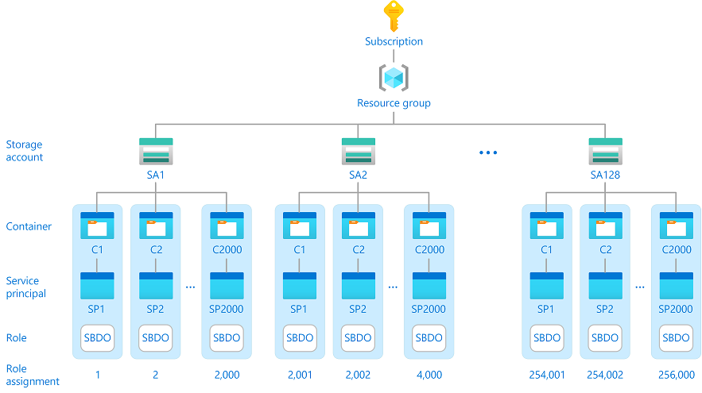
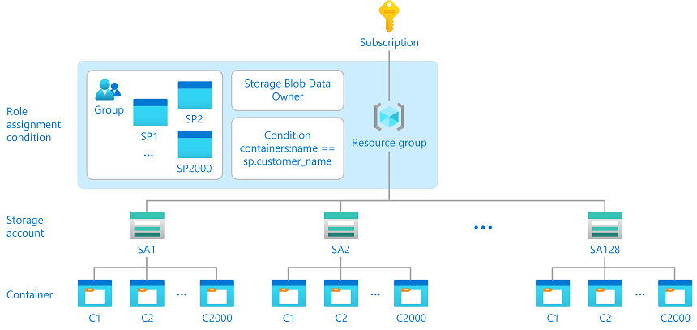

# Scale the management of Azure role assignments by using conditions and custom security attributes (Preview)

> [!IMPORTANT]
> Custom security attributes are currently in PREVIEW.
> See the [Supplemental Terms of Use for Microsoft Azure Previews](https://azure.microsoft.com/support/legal/preview-supplemental-terms/) for legal terms that apply to Azure features that are in beta, preview, or otherwise not yet released into general availability.

Azure role-based access control (Azure RBAC) has a [limit of role assignments per subscription](../azure-resource-manager/management/azure-subscription-service-limits.md#azure-rbac-limits). If you need to create hundreds or even thousands of Azure role assignments, you might encounter this limit. Managing hundreds or thousands of role assignments can be difficult. Depending on your scenario, you might be able to reduce the number of role assignments and make it easier to manage access.

This article describes a solution to scale the management of role assignments by using [Azure attribute-based access control (Azure ABAC)](conditions-overview.md) conditions and [Azure AD custom security attributes](../active-directory/fundamentals/custom-security-attributes-overview.md) for principals.

## Example scenario

Consider a company named Contoso with thousands of customers that wants to set up the following configuration:

- Distribute customer data across 128 storage accounts for security and performance reasons​.
- Add 2,000 containers to each storage account where there is a container for each customer.
- Represent each customer by a unique Azure AD service principal.
- Allow each customer to access objects in their container, but not other containers.​

This configuration could potentially require 256,000 [Storage Blob Data Owner](built-in-roles.md#storage-blob-data-owner) role assignments in a subscription, which is well beyond the role assignments limit. Having this many role assignments would be difficult, if not impossible, to maintain.



## Example solution

A way to handle this scenario in a maintainable manner is to use role assignment conditions. The following diagram shows a solution to reduce the 256,000 role assignments to just one role assignment by using a condition. The role assignment is at a higher resource group scope and a condition helps controls access to the containers. The condition checks whether the container name matches the custom security attribute on the service principal for the customer.



Here is the expression in the condition that makes this solution work:

```
  @Resource[Microsoft.Storage/storageAccounts/blobServices/containers:name]
  StringEquals
  @Principal[Microsoft.Directory/CustomSecurityAttributes/Id:Contosocustomer_name]
```

The full condition would be similar to the following. The list of actions could be adjusted to just the [actions](conditions-format.md#actions) you need.

```
(
 (
  !(ActionMatches{'Microsoft.Storage/storageAccounts/blobServices/containers/blobs/delete'})
  AND
  !(ActionMatches{'Microsoft.Storage/storageAccounts/blobServices/containers/blobs/read'})
  AND
  !(ActionMatches{'Microsoft.Storage/storageAccounts/blobServices/containers/blobs/write'})
  AND
  !(ActionMatches{'Microsoft.Storage/storageAccounts/blobServices/containers/blobs/add/action'})
  AND
  !(ActionMatches{'Microsoft.Storage/storageAccounts/blobServices/containers/blobs/deleteBlobVersion/action'})
  AND
  !(ActionMatches{'Microsoft.Storage/storageAccounts/blobServices/containers/blobs/manageOwnership/action'})
  AND
  !(ActionMatches{'Microsoft.Storage/storageAccounts/blobServices/containers/blobs/modifyPermissions/action'})
  AND
  !(ActionMatches{'Microsoft.Storage/storageAccounts/blobServices/containers/blobs/move/action'})
  AND
  !(ActionMatches{'Microsoft.Storage/storageAccounts/blobServices/containers/blobs/permanentDelete/action'})
  AND
  !(ActionMatches{'Microsoft.Storage/storageAccounts/blobServices/containers/blobs/runAsSuperUser/action'})
  AND
  !(ActionMatches{'Microsoft.Storage/storageAccounts/blobServices/containers/blobs/tags/read'})
  AND
  !(ActionMatches{'Microsoft.Storage/storageAccounts/blobServices/containers/blobs/tags/write'})
 )
 OR 
 (
  @Resource[Microsoft.Storage/storageAccounts/blobServices/containers:name] StringEquals @Principal[Microsoft.Directory/CustomSecurityAttributes/Id:Contosocustomer_name]
 )
)
```

## Why use this solution?

There are several access control mechanisms that you could use to provide access to data plane resources.

Access keys are a common way to provide access to data plane resources. Access keys provide read, write, and delete permissions to whoever possesses the access key. This means attackers can get access to your sensitive data if they can get your access keys. Access keys do not have identity binding, do not have an expiration, and are a security risk to store.

Like access keys, shared access signature (SAS) tokens do not have identity binding, but expire on a regular basis. The lack of identity binding represents the same security risks as access keys do. You must manage the expiration to ensure that clients do not get errors. SAS tokens require additional code to manage and operate daily and can be a significant overhead for a DevOps team.

Azure RBAC provides centralized fine-grained access control. Azure RBAC has identity binding that reduces your security risk. Using conditions you can potentially scale the management of role assignments and make access control easier to maintain because access is based on flexible and dynamic attributes.

Here are some of the benefits of this solution:

- Centralized access control
- Easier to maintain
- Does not rely on access keys or SAS tokens
- Does not require you to manage access on each object
- Can potentially improve your security posture

## Can you use this solution?

If you have a similar scenario, follow these steps to see if you could potentially use this solution.

#### Step 1: Determine if you meet the prerequisites

To use this solution, you must have:

- Multiple built-in or custom role assignments that have [blob storage data actions](../storage/blobs/storage-auth-abac-attributes.md). These include the following built-in roles:

    - [Storage Blob Data Contributor](built-in-roles.md#storage-blob-data-contributor)
    - [Storage Blob Data Owner](built-in-roles.md#storage-blob-data-owner)
    - [Storage Blob Data Reader](built-in-roles.md#storage-blob-data-reader)

#### Step 2: Identify the attributes you could use in your condition

There are several attributes you could use in your condition, such as the following:

- Container name
- Blob path
- Blob index tags [Keys]
- Blob index tags [Values in key]

You can also define your own custom security attributes for users, enterprise applications, and managed identities.

For more information, see [Azure role assignment condition format and syntax](conditions-format.md#attributes) and [What are custom security attributes in Azure AD?](../active-directory/fundamentals/custom-security-attributes-overview.md).

#### Step 3: Create a condition at a higher scope

Create one or more role assignments that use a condition at a higher scope to manage access. For more information, see [Add or edit Azure role assignment conditions using the Azure portal](conditions-role-assignments-portal.md).

## Next steps

- [What is Azure attribute-based access control (Azure ABAC)?](conditions-overview.md)
- [What are custom security attributes in Azure AD?](../active-directory/fundamentals/custom-security-attributes-overview.md)
- [Allow read access to blobs based on tags and custom security attributes (Preview)](conditions-custom-security-attributes.md)
