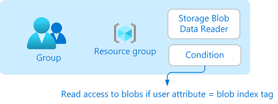
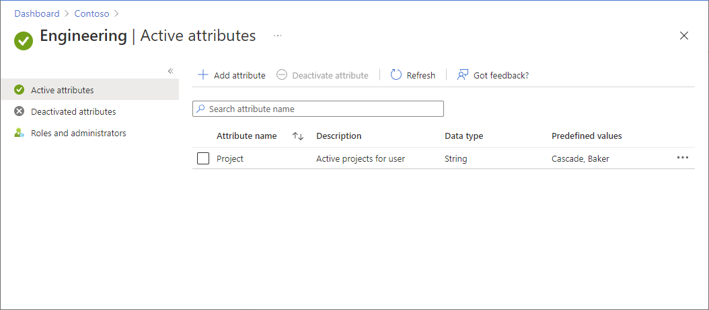
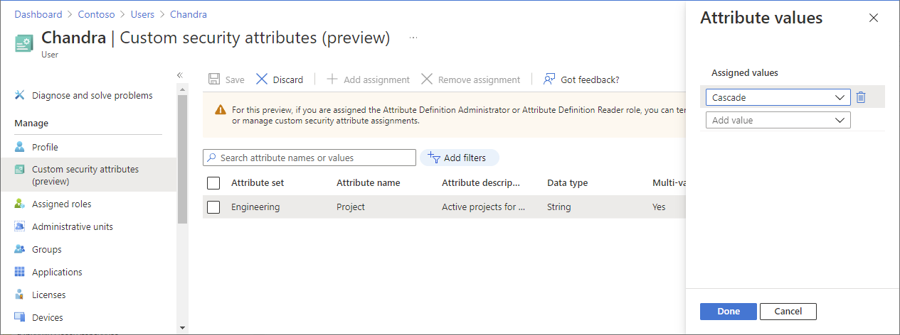
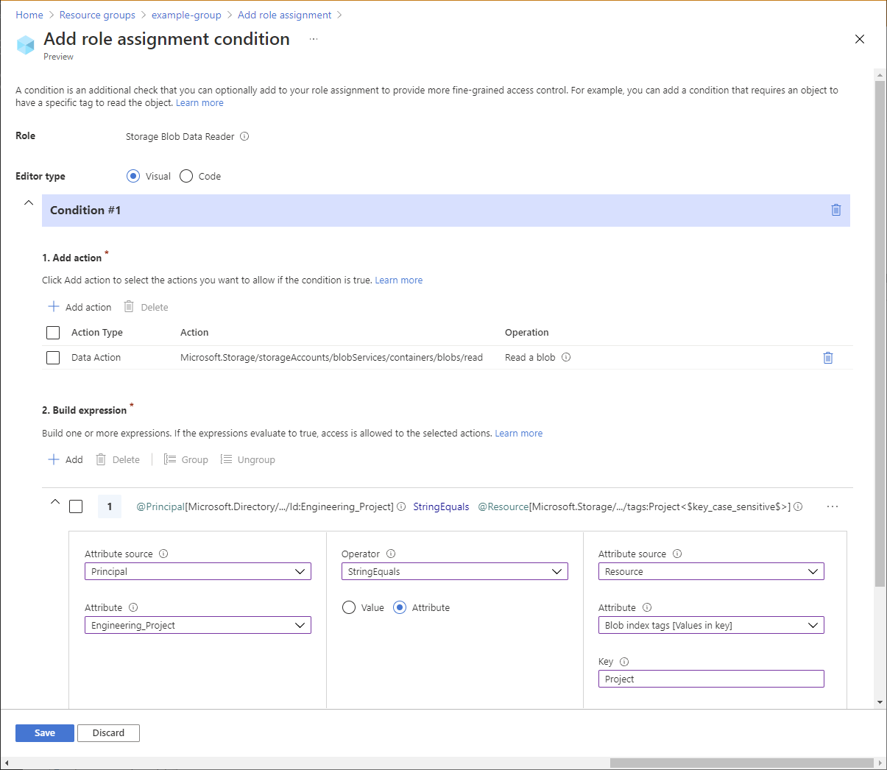
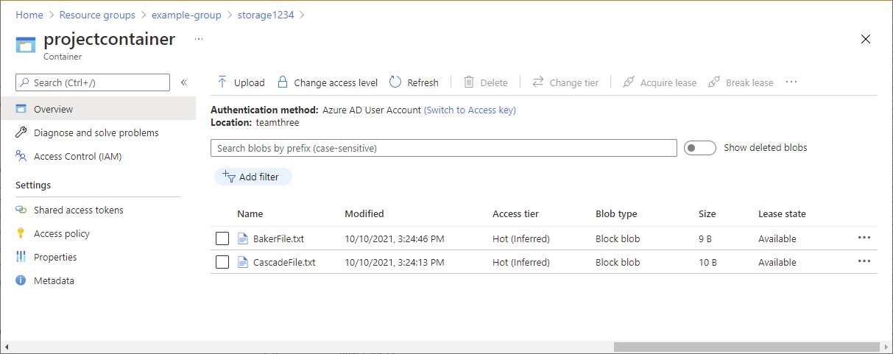

# Allow read access to blobs based on tags and custom security attributes (Preview)

> [!IMPORTANT]
> Custom security attributes are currently in PREVIEW.
> See the [Supplemental Terms of Use for Microsoft Azure Previews](https://azure.microsoft.com/support/legal/preview-supplemental-terms/) for legal terms that apply to Azure features that are in beta, preview, or otherwise not yet released into general availability.

In this article, you learn how to allow read access to blobs based on blob index tags and custom security attributes by using attribute-based access control (ABAC) conditions. This can make it easier to manage access to blobs.

## Prerequisites

To assign custom security attributes and add role assignments conditions in your Microsoft Entra tenant, you need:

- Microsoft Entra ID P1 or P2 license
- [Attribute Definition Administrator](../active-directory/roles/permissions-reference.md#attribute-definition-administrator) and [Attribute Assignment Administrator](../active-directory/roles/permissions-reference.md#attribute-assignment-administrator)
- [User Access Administrator](built-in-roles.md#user-access-administrator) or [Owner](built-in-roles.md#owner)

> [!IMPORTANT]
> By default, [Global Administrator](../active-directory/roles/permissions-reference.md#global-administrator) and other administrator roles do not have permissions to read, define, or assign custom security attributes. If you do not meet these prerequisites, you won't see the principal/user attributes in the condition editor.

## Condition

In this article, you allow read access to blobs if the user has a custom security attribute that matches the blob index tag. This is accomplished by adding a condition to the role assignment.
 


For example, if Brenda has the attribute `Project=Baker`, she can only read blobs with the `Project=Baker` blob index tag. Similarly, Chandra can only read blobs with `Project=Cascade`.


Here is what the condition looks like in code:

```
(
 (
  !(ActionMatches{'Microsoft.Storage/storageAccounts/blobServices/containers/blobs/read'} AND NOT SubOperationMatches{'Blob.List'})
 )
 OR 
 (
  @Principal[Microsoft.Directory/CustomSecurityAttributes/Id:Engineering_Project] StringEquals @Resource[Microsoft.Storage/storageAccounts/blobServices/containers/blobs/tags:Project<$key_case_sensitive$>]
 )
)
```

For more information about conditions, see [What is Azure attribute-based access control (Azure ABAC)? (preview)](conditions-overview.md).

## Step 1: Add a new custom security attribute

1. Sign in to the [Azure portal](https://portal.azure.com).

1. Click **Microsoft Entra ID** > **Custom security attributes (Preview)**.

1. Add an attribute named `Project` with values of `Baker` and `Cascade`. Or use an existing attribute. For more information, see [Add or deactivate custom security attributes in Microsoft Entra ID](../active-directory/fundamentals/custom-security-attributes-add.md).

    

## Step 2: Assign the custom security attribute to a user

1. In Microsoft Entra ID, create a security group.

1. Add a user as a member of the group.

1. Assign the `Project` attribute with a value of `Cascade` to the user. For more information, see [Assign, update, list, or remove custom security attributes for a user](../active-directory/enterprise-users/users-custom-security-attributes.md). 

    

1. Be sure to click **Save** to save your assignment.

## Step 3: Set up storage and blob index tags

1. Create a storage account that is compatible with the blob index tags feature. For more information, see [Manage and find Azure Blob data with blob index tags](../storage/blobs/storage-manage-find-blobs.md).

1. Create a new container within the storage account and set the **Public access level** to **Private (no anonymous access)**.

1. Set the authentication type to **Microsoft Entra user Account**.

1. Upload text files to the container and set the following blob index tags.

    | File | Key | Value |
    | --- | --- | --- |
    | Baker text file | Project | Baker |
    | Cascade text file | Project | Cascade |

    > [!TIP]
    > For information about the characters that are allowed for blob index tags, see [Setting blob index tags](../storage/blobs/storage-manage-find-blobs.md#setting-blob-index-tags).

## Step 4: Assign Storage Blob Data Reader role with a condition

1. Open a new tab and sign in to the [Azure portal](https://portal.azure.com).

1. Open the resource group that has the storage account.

1. Click **Access control (IAM)**.

1. Click the **Role assignments** tab to view the role assignments at this scope.

1. Click **Add** > **Add role assignment**.
 
1. On the **Role** tab, select the [Storage Blob Data Reader](built-in-roles.md#storage-blob-data-reader) role.
 
1. On the **Members** tab, select the security group you created earlier.

1. (Optional) In the **Description** box, enter **Read access to blobs if the user has a custom security attribute that matches the blob index tag**.

1. On the **Conditions (optional)** tab, click **Add condition**.

    The Add role assignment condition page appears.
 
1. In the **Add action** section, click **Add action**.

    The Select an action pane appears. This pane is a filtered list of data actions based on the role assignment that will be the target of your condition.
 
1. Click **Read a blob** and then click **Select**.

1. In the **Build expression** section, click **Add**.

1. Enter the following settings:

    | Setting | Value |
    | --- | --- |
    | Attribute source | Principal |
    | Attribute | &lt;attributeset&gt;_Project |
    | Operator | StringEquals |
    | Option | Attribute |
    | Attribute source | Resource |
    | Attribute | Blob index tags [Values in key] |
    | Key | Project |

    > [!NOTE]
    > If Principal is not listed as an option in Attribute source, make sure you have defined custom security attribute as described earlier in [Step 1: Add a new custom security attribute](#step-1-add-a-new-custom-security-attribute).

    

1. Scroll up to **Editor type** and click **Code**.

    Your condition should look similar to the following:

    ```
    (
     (
      !(ActionMatches{'Microsoft.Storage/storageAccounts/blobServices/containers/blobs/read'} AND NOT SubOperationMatches{'Blob.List'})
     )
     OR 
     (
      @Principal[Microsoft.Directory/CustomSecurityAttributes/Id:Engineering_Project] StringEquals @Resource[Microsoft.Storage/storageAccounts/blobServices/containers/blobs/tags:Project<$key_case_sensitive$>]
     )
    )
    ```

1. Click **Save** to save the condition.

1. On the Review + assign tab, click **Review + assign** to assign the Storage Blob Data Reader role with a condition.

## Step 5: Assign Reader role

- Repeat the previous steps to assign the [Reader](built-in-roles.md#reader) role for the security group at resource group scope.

    > [!NOTE]
    > You typically don't need to assign the Reader role. However, this is done so that you can test the condition using the Azure portal.

## Step 6: Test the condition

1. In a new window, open the [Azure portal](https://portal.azure.com).

1. Sign in as the user you created with the `Project=Cascade` custom security attribute.

1. Open the storage account and container you created.

1. Ensure that the authentication method is set to **Microsoft Entra user Account** and not **Access key**.

    

1. Click the Baker text file.

    You should **NOT** be able to view or download the blob and an authorization failed message should be displayed.
 
1. Click Cascade text file.

    You should be able to view and download the blob.

## Azure PowerShell

You can also use Azure PowerShell to add role assignment conditions. The following commands show how to add conditions. For information, see [Tutorial: Add a role assignment condition to restrict access to blobs using Azure PowerShell (preview)](../storage/blobs/storage-auth-abac-powershell.md).

### Add a condition

1. Use the [Connect-AzAccount](/powershell/module/az.accounts/connect-azaccount) command and follow the instructions that appear to sign in to your directory as User Access Administrator or Owner.

    ```powershell
    Connect-AzAccount
    ```

1. Use [Get-AzRoleAssignment](/powershell/module/az.resources/get-azroleassignment) to get the role assignment you assigned to the security group.

    ```powershell
    $groupRoleAssignment = Get-AzRoleAssignment -ObjectId <groupObjectId> -Scope <scope>
    ```
    
1. Set the `Condition` property of the role assignment object. Be sure to use your attribute set name.

    ```powershell
    $groupRoleAssignment.Condition="((!(ActionMatches{'Microsoft.Storage/storageAccounts/blobServices/containers/blobs/read'} AND NOT SubOperationMatches{'Blob.List'})) OR (@Principal[Microsoft.Directory/CustomSecurityAttributes/Id:Engineering_Project] StringEquals @Resource[Microsoft.Storage/storageAccounts/blobServices/containers/blobs/tags:Project<`$key_case_sensitive`$>]))"
    ```

1. Set the `ConditionVersion` property of the role assignment object.

    ```powershell
    $groupRoleAssignment.ConditionVersion = "2.0"
    ```

1. Use [Set-AzRoleAssignment](/powershell/module/az.resources/set-azroleassignment) to update the role assignment.

    ```powershell
    Set-AzRoleAssignment -InputObject $groupRoleAssignment
    ```

### Test the condition

1. In a new PowerShell window, use the [Connect-AzAccount](/powershell/module/az.accounts/connect-azaccount) command to sign in as a member of the security group.

    ```powershell
    Connect-AzAccount
    ```

1. Use [New-AzStorageContext](/powershell/module/az.storage/new-azstoragecontext) to set the context for the storage account.

    ```powershell
    $bearerCtx = New-AzStorageContext -StorageAccountName <accountName>
    ```

1. Use [Get-AzStorageBlob](/powershell/module/az.storage/get-azstorageblob) to try to read the Baker file.

    ```powershell
    Get-AzStorageBlob -Container <containerName> -Blob <blobNameBaker> -Context $bearerCtx
    ```

    You should **NOT** be able to read the blob and an authorization failed message should be displayed.

    ```powershell
    Get-AzStorageBlob : This request is not authorized to perform this operation using this permission. HTTP Status Code:
    403 - HTTP Error Message: This request is not authorized to perform this operation using this permission.
    ...
    ```

1. Use [Get-AzStorageBlob](/powershell/module/az.storage/get-azstorageblob) to try to read the Cascade file.

    ```powershell
    Get-AzStorageBlob -Container <containerName> -Blob <blobNameCascade> -Context $bearerCtx
    You should be able to read the blob.
    AccountName: <storageAccountName>, ContainerName: <containerName>
    
    Name                 BlobType  Length          ContentType                    LastModified         AccessTier SnapshotT
                                                                                                                  ime
    ----                 --------  ------          -----------                    ------------         ---------- ---------
    CascadeFile.txt      BlockBlob 7               text/plain                     2021-04-24 05:35:24Z Hot
    ```

## Azure CLI

You can also use Azure CLI to add role assignments conditions. The following commands show how to add conditions. For information, see [Tutorial: Add a role assignment condition to restrict access to blobs using Azure CLI (preview)](../storage/blobs/storage-auth-abac-cli.md).

### Add a condition

1. Use the [az login](/cli/azure/reference-index#az-login) command and follow the instructions that appear to sign in to your directory as User Access Administrator or Owner.

    ```azurecli
    az login
    ```

1. Use [az role assignment list](/cli/azure/role/assignment#az-role-assignment-list) to get the role assignment you assigned to the security group.

    ```azurecli
    az role assignment list --assignee <groupObjectId> --scope <scope>
    ```

1. Create a JSON file with the following format.

    ```azurecli
    {
        "canDelegate": null,
        "condition": "",
        "conditionVersion": "",
        "description": "",
        "id": "/subscriptions/{subscriptionId}/resourceGroups/{resourceGroup}/providers/Microsoft.Authorization/roleAssignments/{roleAssignmentId}",
        "name": "{roleAssignmentId}",
        "principalId": "{groupObjectId}",
        "principalName": "{principalName}",
        "principalType": "Group",
        "resourceGroup": "{resourceGroup}",
        "roleDefinitionId": "/subscriptions/{subscriptionId}/providers/Microsoft.Authorization/roleDefinitions/2a2b9908-6ea1-4ae2-8e65-a410df84e7d1",
        "roleDefinitionName": "Storage Blob Data Reader",
        "scope": "/subscriptions/{subscriptionId}/resourceGroups/{resourceGroup}",
        "type": "Microsoft.Authorization/roleAssignments"
    }
    ```

1. Update the `condition` property. Be sure to use your attribute set name.

    ```azurecli
    "condition": "((!(ActionMatches{'Microsoft.Storage/storageAccounts/blobServices/containers/blobs/read'} AND NOT SubOperationMatches{'Blob.List'})) OR (@Principal[Microsoft.Directory/CustomSecurityAttributes/Id:Engineering_Project] StringEquals @Resource[Microsoft.Storage/storageAccounts/blobServices/containers/blobs/tags:Project<$key_case_sensitive$>]))",
    ```

1. Update the `conditionVersion` property.

    ```azurecli
    "conditionVersion": "2.0",
    ```

1. Use [az role assignment update](/cli/azure/role/assignment#az-role-assignment-update) to add the condition to the role assignment.

    ```azurecli
    az role assignment update --role-assignment "./path/roleassignment.json"
    ```

### Test the condition

1. In a new command window, use the [az login](/cli/azure/reference-index#az-login) command to sign in as a member of the security group.

    ```azurecli
    az login
    ```

1. Use [az storage blob show](/cli/azure/storage/blob#az-storage-blob-show) to try to read the properties for the Baker file.

    ```azurecli
    az storage blob show --account-name <storageAccountName> --container-name <containerName> --name <blobNameBaker> --auth-mode login
    ```

    You should **NOT** be able to read the blob and an authorization failed message should be displayed.

    ```azurecli
    You do not have the required permissions needed to perform this operation.
    ...
    ```

1. Use [az storage blob show](/cli/azure/storage/blob#az-storage-blob-show) to try to read the properties for the Cascade file.

    ```azurecli
    az storage blob show --account-name <storageAccountName> --container-name <containerName> --name <blobNameCascade> --auth-mode login
    You should be able to read the blob.
    {
      "container": "<containerName>",
      "content": "",
      "deleted": false,
      "encryptedMetadata": null,
      "encryptionKeySha256": null,
      "encryptionScope": null,
    ...
    }
    ```

## Next steps

- [What are custom security attributes in Microsoft Entra ID? (Preview)](../active-directory/fundamentals/custom-security-attributes-overview.md)
- [Azure role assignment condition format and syntax (preview)](conditions-format.md)
- [Example Azure role assignment conditions for Blob Storage (preview)](../storage/blobs/storage-auth-abac-examples.md?toc=/azure/role-based-access-control/toc.json)
