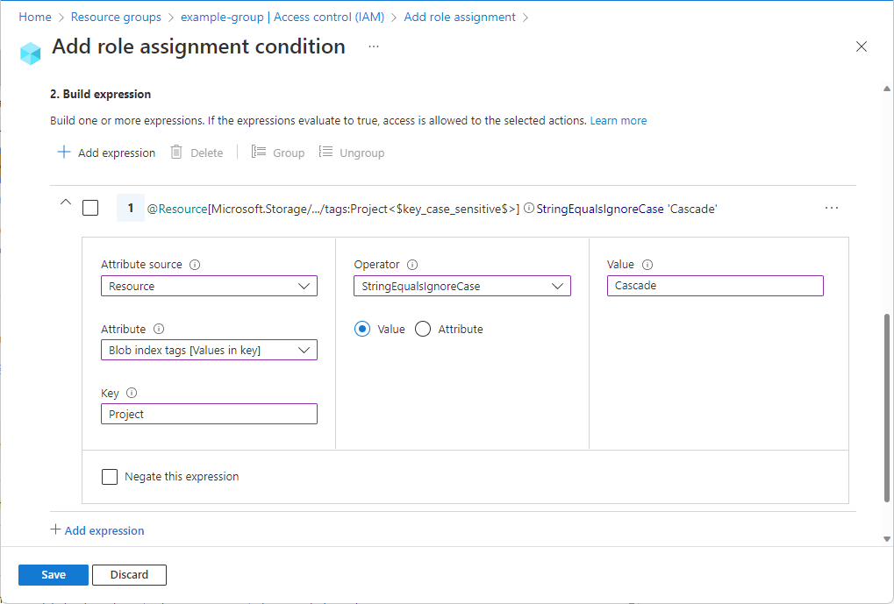

# What is Azure attribute-based access control (Azure ABAC)? (preview)

> [!IMPORTANT]
> Azure ABAC and Azure role assignment conditions are currently in preview.
> This preview version is provided without a service level agreement, and it's not recommended for production workloads. Certain features might not be supported or might have constrained capabilities.
> For more information, see [Supplemental Terms of Use for Microsoft Azure Previews](https://azure.microsoft.com/support/legal/preview-supplemental-terms/).

Attribute-based access control (ABAC) is an authorization system that defines access based on attributes associated with security principals, resources, and environment. With ABAC, you can grant a security principal access to a resource based on attributes. Azure ABAC refers to the implementation of ABAC for Azure.

## What are role assignment conditions?

Azure role-based access control (Azure RBAC) is an authorization system that helps you manage who has access to Azure resources, what they can do with those resources, and what areas they have access to. In most cases, Azure RBAC will provide the access management you need by using role definitions and role assignments. However, in some cases you might want to provide more fined-grained access management or simplify the management of hundreds of role assignments.

Azure ABAC builds on Azure RBAC by adding role assignment conditions based on attributes in the context of specific actions. A *role assignment condition* is an additional check that you can optionally add to your role assignment to provide more fine-grained access control. A condition filters down permissions granted as a part of the role definition and role assignment. For example, you can add a condition that requires an object to have a specific tag to read the object. You cannot explicitly deny access to specific resources using conditions.

## Why use conditions?

There are three primary benefits for using role assignment conditions:

- **Provide more fine-grained access control** - A role assignment uses a role definition with actions and data actions to grant a security principal permissions. You can write conditions to filter down those permissions for more fine-grained access control. You can also add conditions to specific actions. For example, you can grant John read access to blobs in your subscription only if the blobs are tagged as Project=Blue. 
- **Help reduce the number of role assignments** - Each Azure subscription currently has a 2000 role assignment limit. There are scenarios that would require thousands of role assignments. All of those role assignments would have to be managed. In these scenarios, you could potentially add conditions to use significantly fewer role assignments. 
- **Use attributes that have specific business meaning** - Conditions allow you to use attributes that have specific business meaning to you in access control. Some examples of attributes are project name, software development stage, and classification levels. The values of these resource attributes are dynamic and change as users move across teams and projects.

## Example scenarios for conditions

There are several scenarios where you might want to add a condition to your role assignment. Here are some examples.

- Read access to blobs with the tag Project=Cascade
- New blobs must include the tag Project=Cascade
- Existing blobs must be tagged with at least one Project key or Program key
- Existing blobs must be tagged with a Project key and Cascade, Baker, or Skagit values
- Read, write, or delete blobs in containers named blobs-example-container
- Read access to blobs in containers named blobs-example-container with a path of readonly
- Write access to blobs in containers named Contosocorp with a path of uploads/contoso
- Read access to blobs with the tag Program=Alpine and a path of logs

For more information about how to create these examples, see [Examples of Azure role assignment conditions](../storage/common/storage-auth-abac-examples.md).

## Where can conditions be added?

Currently, conditions can be added to built-in or custom role assignments that have [storage blob data actions](conditions-format.md#actions). These include the following built-in roles:

- [Storage Blob Data Contributor](built-in-roles.md#storage-blob-data-contributor)
- [Storage Blob Data Owner](built-in-roles.md#storage-blob-data-owner)
- [Storage Blob Data Reader](built-in-roles.md#storage-blob-data-reader)

Conditions are added at the same scope as the role assignment. Just like role assignments, you must have `Microsoft.Authorization/roleAssignments/write` permissions to add a condition.

Here are the storage attributes you can use in your conditions.

- Container name
- Blob path
- Blob index tags keys
- Blob index tags

> [!TIP]
> Blobs also support the ability to store arbitrary user-defined key-value metadata. Although metadata is similar to blob index tags, you must use blob index tags with conditions. For more information, see [Manage and find Azure Blob data with blob index tags (preview)](../storage/blobs/storage-manage-find-blobs.md).

## What does a condition look like?

You can add conditions to new or existing role assignments. Here is the [Storage Blob Data Reader](built-in-roles.md#storage-blob-data-reader) role that has been assigned to a user named Chandra at a resource group scope. A condition has also been added that only allows read access to blobs with the tag Project=Cascade.


If Chandra tries to read a blob without the Project=Cascade tag, access will not be allowed.


Here is what the condition looks like in the Azure portal:



Here is what the condition looks like in code:

```
(
    (
        !(ActionMatches{'Microsoft.Storage/storageAccounts/blobServices/containers/blobs/read'}
        AND
        @Request[subOperation] ForAnyOfAnyValues:StringEqualsIgnoreCase {'Blob.Read.WithTagConditions'})
    )
    OR
    (
        @Resource[Microsoft.Storage/storageAccounts/blobServices/containers/blobs/tags:Project<$key_case_sensitive$>] StringEqualsIgnoreCase 'Cascade'
    )
)
```

For more information about the format of conditions, see [Azure role assignment condition format and syntax](conditions-format.md).

## Conditions and Privileged Identity Management (PIM)

You can also add conditions to eligible role assignments using Privileged Identity Management (PIM). With PIM, your end users must activate an eligible role assignment to get permission to perform certain actions. Using conditions in PIM enables you not only to limit a user's access to a resource using fine-grained conditions, but also to use PIM to secure it with a time-bound setting, approval workflow, audit trail, and so on. For more information, see [Assign Azure resource roles in Privileged Identity Management](../active-directory/privileged-identity-management/pim-resource-roles-assign-roles.md).

## Terminology

To better understand Azure RBAC and Azure ABAC, you can refer back to the following list of terms.

| Term | Definition |
| --- | --- |
| attribute-based access control (ABAC) | An authorization system that defines access based on attributes associated with security principals, resources, and environment. With ABAC, you can grant a security principal access to a resource based on attributes. |
| Azure ABAC | Refers to the implementation of ABAC for Azure. |
| role assignment condition | An additional check that you can optionally add to your role assignment to provide more fine-grained access control. |
| attribute | In this context, a key-value pair such as Project=Blue, where Project is the attribute key and Blue is the attribute value. Attributes and tags are synonymous for access control purposes. |
| expression | A statement in a condition that evaluates to true or false. An expression has the format of &lt;attribute&gt; &lt;operator&gt; &lt;value&gt;. |

## Next steps

- [FAQ for Azure role assignment conditions (preview)](conditions-faq.md)
- [Example Azure role assignment conditions (preview)](../storage/common/storage-auth-abac-examples.md)
- [Tutorial: Add a role assignment condition to restrict access to blobs using the Azure portal (preview)](../storage/common/storage-auth-abac-portal.md)
