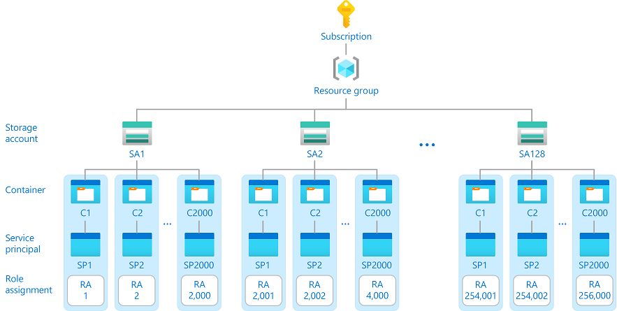
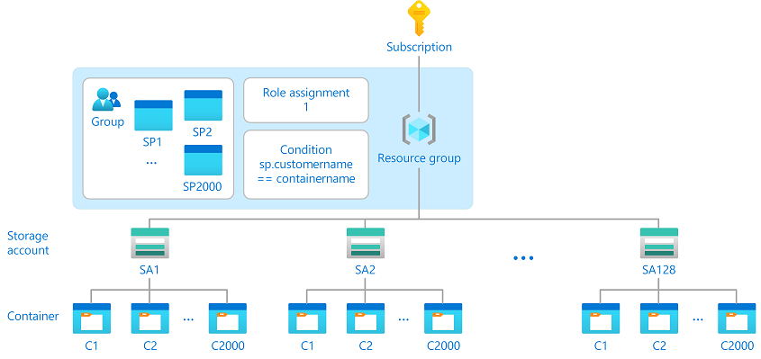

# Use Azure role assignment conditions and principal attributes to manage access (Preview)

> [!IMPORTANT]
> Custom security attributes are currently in PREVIEW.
> See the [Supplemental Terms of Use for Microsoft Azure Previews](https://azure.microsoft.com/support/legal/preview-supplemental-terms/) for legal terms that apply to Azure features that are in beta, preview, or otherwise not yet released into general availability.

Azure role-based access control (Azure RBAC) currently supports 2000 role assignments in a subscription. If you need to create role assignments for hundreds or even thousands of storage account containers, you can potentially encounter this limit. The following diagram shows an example this scenario:

An alternative approach is to create a smaller number of role assignments at a higher scope and then use Azure attribute-based access control (Azure ABAC) conditions to control access to the containers. The following diagram shows an example:

## Next steps