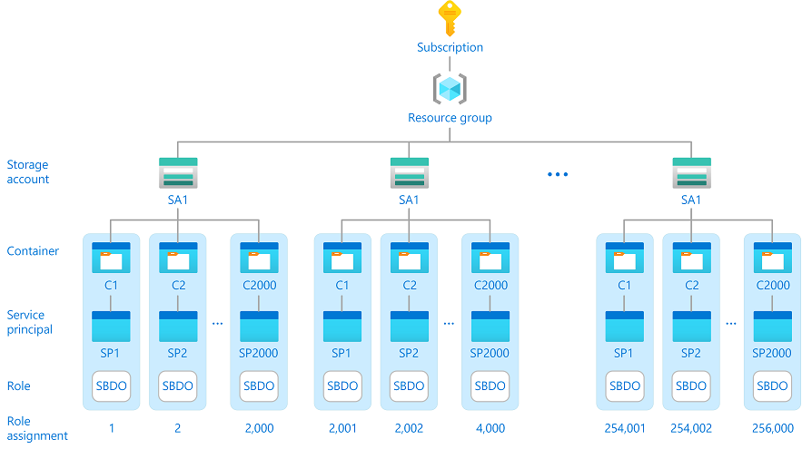
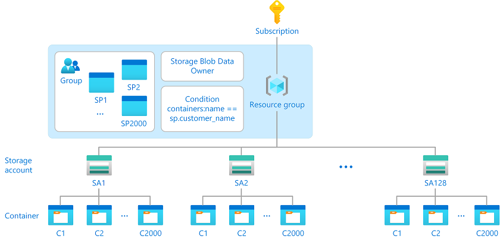

# Reduce Azure role assignments by using conditions and principal attributes (Preview)

> [!IMPORTANT]
> Custom security attributes are currently in PREVIEW.
> See the [Supplemental Terms of Use for Microsoft Azure Previews](https://azure.microsoft.com/support/legal/preview-supplemental-terms/) for legal terms that apply to Azure features that are in beta, preview, or otherwise not yet released into general availability.

Azure role-based access control (Azure RBAC) currently supports 2,000 role assignments in a subscription. If you need to create hundreds or even thousands of Azure role assignments, you might encounter this limit. Managing hundreds or thousands of role assignments can difficult. Depending on your scenario, you might be able to reduce the number of role assignments and make it easier to manage access. This article describes a solution to reduce the number of role assignments by using [Azure attribute-based access control (Azure ABAC)](conditions-overview.md) conditions and [Azure AD custom security attributes](../active-directory/fundamentals/custom-security-attributes-overview.md) for principals.

## Example scenario

Consider a company named Contoso with thousands of customers that want to set up the following configuration:

- Distribute customer date across 128 storage accounts for high performance​.
- Add 2,000 containers to each storage account where there is a container for each customer.
- Represent each customer by a unique Azure AD service principal.
- Allow each customer to access objects in their container, but not other containers.​

This configuration could potentially require 256,000 [Storage Blob Data Owner](built-in-roles.md#storage-blob-data-owner) role assignments in a subscription, which is well beyond the 2,000 role assignments limit. Having this many role assignments will difficult, if not impossible, to maintain.



## Example solution

Another way to handle this scenario is to use role assignment conditions. The following diagram shows a solution to reduce the 256,000 role assignments to just one role assignment by using a condition. The role assignment is at a higher resource group scope and a condition helps controls access to the containers. The condition checks whether the container name matches the custom security attribute on the service principal for the customer.



Here is the expression in the condition that makes the solution work:

```
  @Resource[Microsoft.Storage/storageAccounts/blobServices/containers:name]
  StringEquals
  @Principal[Microsoft.Directory/CustomSecurityAttributes/Id:Contosocustomer_name]
```

The full condition would be similar to the following:

```
(
 (
  !(ActionMatches{'Microsoft.Storage/storageAccounts/blobServices/containers/blobs/delete'})
  AND
  !(ActionMatches{'Microsoft.Storage/storageAccounts/blobServices/containers/blobs/read'})
  AND
  !(ActionMatches{'Microsoft.Storage/storageAccounts/blobServices/containers/blobs/write'})
  AND
  !(ActionMatches{'Microsoft.Storage/storageAccounts/blobServices/containers/blobs/add/action'})
  AND
  !(ActionMatches{'Microsoft.Storage/storageAccounts/blobServices/containers/blobs/deleteBlobVersion/action'})
  AND
  !(ActionMatches{'Microsoft.Storage/storageAccounts/blobServices/containers/blobs/manageOwnership/action'})
  AND
  !(ActionMatches{'Microsoft.Storage/storageAccounts/blobServices/containers/blobs/modifyPermissions/action'})
  AND
  !(ActionMatches{'Microsoft.Storage/storageAccounts/blobServices/containers/blobs/move/action'})
  AND
  !(ActionMatches{'Microsoft.Storage/storageAccounts/blobServices/containers/blobs/permanentDelete/action'})
  AND
  !(ActionMatches{'Microsoft.Storage/storageAccounts/blobServices/containers/blobs/runAsSuperUser/action'})
  AND
  !(ActionMatches{'Microsoft.Storage/storageAccounts/blobServices/containers/blobs/tags/read'})
  AND
  !(ActionMatches{'Microsoft.Storage/storageAccounts/blobServices/containers/blobs/tags/write'})
 )
 OR 
 (
  @Resource[Microsoft.Storage/storageAccounts/blobServices/containers:name] StringEquals @Principal[Microsoft.Directory/CustomSecurityAttributes/Id:Contosocustomer_name]
 )
)
```

## Programmatic setup

Manually setting up this configuration would be difficult. A better way would be to use a programmatic approach. Here is a PowerShell script to set up this configuration.

```powershell
# Utility function to pause the script
function Pause{

    param(
        $step
    )

    Write-Host "Finished step: $($step)";
    Write-Host -NoNewLine 'Press any key to continue ...';
    $null = $Host.UI.RawUI.ReadKey('NoEcho,IncludeKeyDown');
}

###############################################################
#
#  Variables
#
###############################################################
# Sign in vars
$tenant = "00000000-0000-0000-0000-000000000000"
$subscription = "11111111-1111-1111-1111-111111111111"
$resourceGroupName = "contosorg"

# Azure AD Group vars
$AADGroupName = "Contosocustomergroup"
$AADGroupRD = "Storage Blob Data Owner"
$AADGroupCondition = "(
 (
  !(ActionMatches{'Microsoft.Storage/storageAccounts/blobServices/containers/blobs/delete'})
  AND
  !(ActionMatches{'Microsoft.Storage/storageAccounts/blobServices/containers/blobs/read'})
  AND
  !(ActionMatches{'Microsoft.Storage/storageAccounts/blobServices/containers/blobs/write'})
  AND
  !(ActionMatches{'Microsoft.Storage/storageAccounts/blobServices/containers/blobs/add/action'})
  AND
  !(ActionMatches{'Microsoft.Storage/storageAccounts/blobServices/containers/blobs/deleteBlobVersion/action'})
  AND
  !(ActionMatches{'Microsoft.Storage/storageAccounts/blobServices/containers/blobs/manageOwnership/action'})
  AND
  !(ActionMatches{'Microsoft.Storage/storageAccounts/blobServices/containers/blobs/modifyPermissions/action'})
  AND
  !(ActionMatches{'Microsoft.Storage/storageAccounts/blobServices/containers/blobs/move/action'})
  AND
  !(ActionMatches{'Microsoft.Storage/storageAccounts/blobServices/containers/blobs/permanentDelete/action'})
  AND
  !(ActionMatches{'Microsoft.Storage/storageAccounts/blobServices/containers/blobs/runAsSuperUser/action'})
  AND
  !(ActionMatches{'Microsoft.Storage/storageAccounts/blobServices/containers/blobs/tags/read'})
  AND
  !(ActionMatches{'Microsoft.Storage/storageAccounts/blobServices/containers/blobs/tags/write'})
 )
 OR 
 (
  @Resource[Microsoft.Storage/storageAccounts/blobServices/containers:name] StringEquals @Principal[Microsoft.Directory/CustomSecurityAttributes/Id:Contosocustomer_name]
 )
)"

# Service principal vars
$SPName_prefix = "Contosocustomer"
$SPName_suffix = ""

# Key vault vars
$KVName = "contosoKV10"
# Location of Contoso resource group
$KVLocation = "West US"

# Storage vars
$storageLocation = "South Central US"
$storageAccountNameBase = "ContosoCustomerSA"
$nameList = "Alice","Bob","Chandra","Daniel","Elizabeth" 

###############################################################
#
#  Config
#
###############################################################

# Connect to Azure with admin credentials
# Tenant and subscription parameters are optional in most cases, but can help if PowerShell is having trouble with contexts
$userCredentials = Get-Credential -UserName <user>@<domain>.com
Connect-AzAccount -Tenant $tenant -Subscription $subscription -Credential $userCredentials

###############################################################
#
#  Key vault operations
#  Used to help log back in as the different service principals
#
###############################################################

# Create a key vault to store service principal passwords
New-AzKeyVault -Name $KVName -ResourceGroupName $resourceGroupName -Location $KVLocation

# Give yourself CRUD permissions to store secrets in key vault
Set-AzKeyVaultAccessPolicy -VaultName $KVName -UserPrincipalName "<user>@<domain>.com" -PermissionsToSecrets get,set,delete,list,recover,purge

Pause -step "Create key vault"

###############################################################
#
#  Create storage accounts and containers
#  Add test blobs
#
###############################################################

# Create 2 storage accounts with 5 containers each (1 for each customer)
for ($i=1; $i -le 2 ; $i++){
    $storageAccountName = "$($storageAccountNameBase.ToLower())$($i)"
    # Create storage account
    New-AzStorageAccount -ResourceGroupName $resourceGroupName -Name $storageAccountName -Location $storageLocation -SkuName Standard_RAGRS -Kind StorageV2
    # Wait 5 minutes for account to be accessible, but typically not necessary
    Start-Sleep -s 600
    # Retrieve context for storage related operations
    $context = New-AzStorageContext -StorageAccountName $storageAccountName
    foreach($name in $nameList) {
        $containerName = "$($name.ToLower())"
        # Create container
        New-AzStorageContainer -Name "$($containerName)" -Permission blob -Context $context
        # Waiting 5 minutes for container to be accessible
        Start-Sleep -s 600
        # Add blob for testing
        Set-AzStorageBlobContent -File "C:\\testdoc.txt" -Container $containerName -Blob "$($containerName).txt" -Context $context
    }
}

Pause -step "Create storage"

###############################################################
#
#  Create Azure AD group or fetch existing group and add permissions
#
###############################################################

# Uncomment relevant lines as necessary

# Create group
# $AADGroup = New-AzureADMSGroup -DisplayName $AADGroupName -MailEnabled $false -MailNickname $AADGroupName -SecurityEnabled $true -IsAssignableToRole $true
# Use existing group
#$AADGroup = Get-AzADGroup -SearchString $AADGroupName

# Create role assignment for the group
$ra = New-AzRoleAssignment -PrincipalId $AADGroup.Id -RoleDefinitionName $AADGroupRD -Scope "/subscriptions/$($subscription)/resourceGroups/$($resourceGroupName)" -Condition $AADGroupCondition -ConditionVersion "2.0"

Pause -step "Create Azure AD group"

###############################################################
#
# Create service principals and add them to Azure AD group
#
###############################################################

for ($i=1; $i -le 5 ; $i++){
    # Name builders can be more complex, but this is a simple prefix-suffix example
    $SPName = "$($SPName_prefix)$($i)$($SPName_suffix)"
    # Create service principal
    $sp = New-AzADServicePrincipal -DisplayName $SPName -SkipAssignment
    # Save password
    Set-AzKeyVaultSecret -VaultName $KVName -Name "$($SPName)-password" -SecretValue $sp.secret
    # Add service principal to group
    Add-AzADGroupMember -TargetGroupObjectId $($AADGroup.Id) -MemberObjectId $($sp.Id)
}

Pause -step "Create service principals and add to group"

###############################################################
#
# Example of access with each service principal
#
###############################################################

for ($i=1; $i -le 5 ; $i++){
    # Name builders can be more complex, but this is a simple prefix-suffix example
    $SPName = "$($SPName_prefix)$($i)$($SPName_suffix)"
    # Get service principal object
    $sp = Get-AzADServicePrincipal -DisplayName $SPName
    # Retrieve password for sign in
    $spSecret = Get-AzKeyVaultSecret -VaultName $KVName -Name "$($SPName)-password" -AsPlainText
    $spSecret = ConvertTo-SecureString -String $spSecret -AsPlainText -Force
    # Build credential for sign in
    $pscredential = New-Object -TypeName System.Management.Automation.PSCredential($sp.ApplicationId, $spSecret)
    # Sign in
    $account = Connect-AzAccount -Tenant $tenant -Subscription $subscription -Credential $pscredential -ServicePrincipal
    
    foreach($name in $nameList) {
        $containerName = "$($name.ToLower())"
        Write-Host "Service principal: $($SPName) Container: $($containerName)"
        # Get blob for testing
        Get-AzStorageBlobContent -Container $containerName -Blob "$($containerName).txt" -Context $context
    }

    Disconenct-AzAccount $account
    Connect-AzAccount -Tenant $tenant -Subscription $subscription -Credential $userCredentials
    Pause -step "Demo with service principal: $($SPName)"
}
```

## Can you use this solution?

If you have a similar scenario, follow these steps to see if you could potentially use this solution.

#### Step 1: Determine if you meet the prerequisites

To use this solution, you must have:

- Multiple built-in or custom role assignments that have [storage blob data actions](../storage/common/storage-auth-abac-attributes.md). These include the following built-in roles:

    - [Storage Blob Data Contributor](built-in-roles.md#storage-blob-data-contributor)
    - [Storage Blob Data Owner](built-in-roles.md#storage-blob-data-owner)
    - [Storage Blob Data Reader](built-in-roles.md#storage-blob-data-reader)

#### Step 2: Identify the attributes you could use in your condition

There are several attributes you could use in your condition, such as the following:

- Container name
- Blob path
- Blob index tags [Keys]
- Blob index tags [Values in key]

You can also add your own custom security attributes for users, enterprise applications, and managed identities.

For more information, see [Azure role assignment condition format and syntax](conditions-format.md#attributes) and [What are custom security attributes in Azure AD?](../active-directory/fundamentals/custom-security-attributes-overview.md).

#### Step 3: Create a condition at a higher scope

Create one or more role assignments that use a condition at a higher scope to manage access. For more information, see [Add or edit Azure role assignment conditions using the Azure portal](conditions-role-assignments-portal.md).

## Next steps