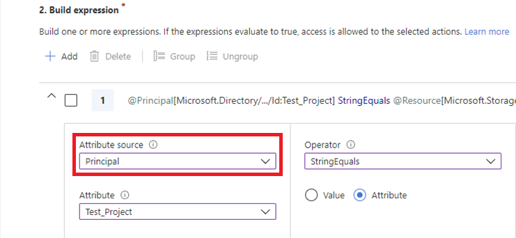
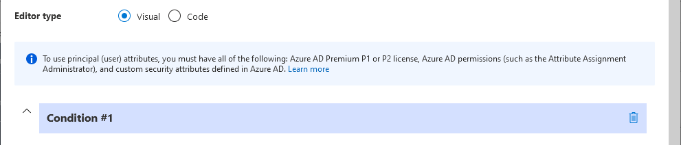
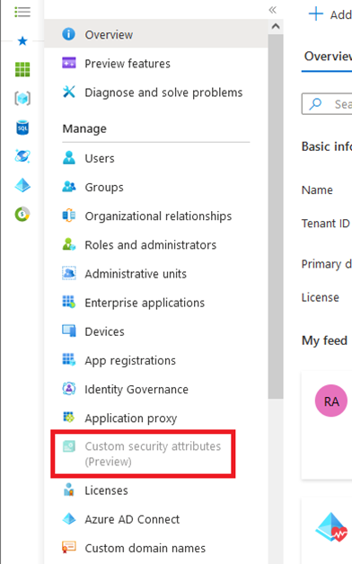
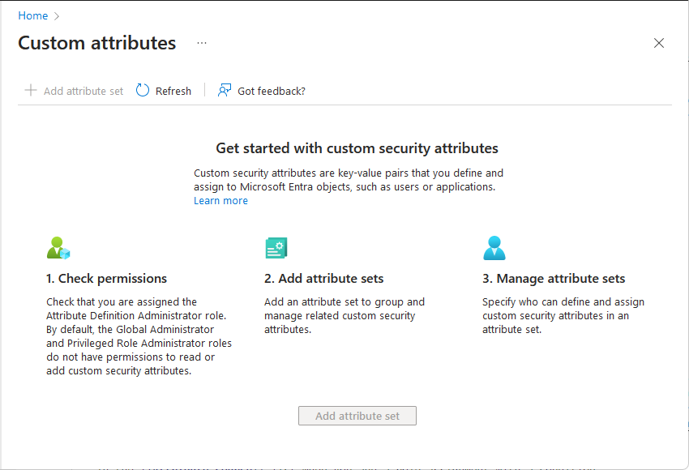
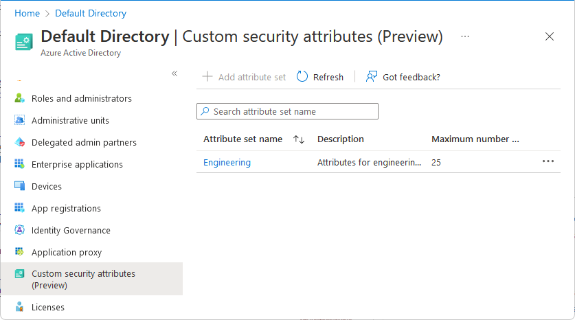

# Troubleshoot Azure role assignment conditions

## General issues

### Symptom - Condition is not enforced

**Cause 1**

Security principals have one or more role assignments at the same or higher scope.

**Solution 1**

Ensure that the security principals don't have multiple role assignments (with or without conditions) that grant access to the same data action leading to non-enforcement of conditions. For information about the evaluation logic, see [How Azure RBAC determines if a user has access to a resource](overview.md#how-azure-rbac-determines-if-a-user-has-access-to-a-resource).

**Cause 2**

Your role assignment has multiple actions that grant a permission and your condition does not target all the actions. For example, you can create a blob if you have either `/blobs/write` or `/blobs/add/action` data actions. If your role assignment has both data actions and you target only one of them in a condition, the role assignment will grant the permission to create blobs and bypass the condition.

**Solution 2**

If your role assignment has multiple actions that grant a permission, ensure that you target all relevant actions.

**Cause 3**

When you add a condition to a role assignment, it can take up to 5 minutes for the condition to be enforced. When you add a condition, resource providers (such as Microsoft Storage) are notified of the update. Resource providers make updates to their local caches immediately to ensure that they have the latest role assignments. This process completes in 1 or 2 minutes, but can take up to 5 minutes.

**Solution 3**

Wait for 5 minutes and test the condition again.

### Symptom - Condition is not valid error when adding a condition

When you try to add a role assignment with a condition, you get an error similar to:

`The given role assignment condition is invalid.`

**Cause**

Your condition is not formatted correctly. 

**Solution**

Fix any [condition format or syntax](conditions-format.md) issues. Alternatively, add the condition using the [visual editor in the Azure portal](conditions-role-assignments-portal.md).

## Issues in the visual editor

### Symptom - Principal does not appear in Attribute source

When you try to add a role assignment with a condition, **Principal** does not appear in the **Attribute source** list.



Instead, you see the message:

To use principal (user) attributes, you must have all of the following: Azure AD Premium P1 or P2 license, Azure AD permissions (such as the [Attribute Assignment Administrator](../active-directory/roles/permissions-reference.md#attribute-assignment-administrator) role), and custom security attributes defined in Azure AD.



**Cause**

You don't meet the prerequisites. To use principal attributes, you must have **all** of the following:

- Azure AD Premium P1 or P2 license
- Azure AD permissions for the signed-in user to read at least one attribute set
- Custom security attributes defined in Azure AD

**Solution**

1. Open **Azure Active Directory** > **Custom security attributes**.

    If the **Custom security attributes** page is disabled, you don't have an Azure AD Premium P1 or P2 license. Open **Azure Active Directory** > **Overview** and check the license for your tenant.

    

    If you see the **Get started** page, you don't have permissions to read at least one attribute set or custom security attributes haven't been defined yet.

    

1. If custom security attributes have been defined, assign one of the following roles at tenant scope or attribute set scope. For more information, see [Manage access to custom security attributes in Azure AD](../active-directory/fundamentals/custom-security-attributes-manage.md).

    - [Attribute Definition Reader](../active-directory/roles/permissions-reference.md#attribute-definition-reader)
    - [Attribute Assignment Reader](../active-directory/roles/permissions-reference.md#attribute-assignment-reader)
    - [Attribute Definition Administrator](../active-directory/roles/permissions-reference.md#attribute-definition-administrator)
    - [Attribute Assignment Administrator](../active-directory/roles/permissions-reference.md#attribute-assignment-administrator)
    
    > [!IMPORTANT]
    > By default, [Global Administrator](../active-directory/roles/permissions-reference.md#global-administrator) and other administrator roles do not have permissions to read, define, or assign custom security attributes.

1. If custom security attributes haven't been defined yet, assign the [Attribute Definition Administrator](../active-directory/roles/permissions-reference.md#attribute-definition-administrator) role at tenant scope and add custom security attributes. For more information, see [Add or deactivate custom security attributes in Azure AD](../active-directory/fundamentals/custom-security-attributes-add.md).

    When finished, you should be able to read at least one attribute set. **Principal** should now appear in the **Attribute source** list when you add a role assignment with a condition.

    

### Symptom - Principal does not appear in Attribute source when using PIM 

When you try to add a role assignment with a condition using [Azure AD Privileged Identity Management (PIM)](../active-directory/privileged-identity-management/pim-configure.md), **Principal** does not appear in the **Attribute source** list.


**Cause**

PIM currently does not support using the principal attribute in a role assignment condition.

## Error messages in visual editor

### Symptom - Condition not recognized

After using the code editor, you switch to the visual editor and get a message similar to the following:

`The current expression cannot be recognized. Switch to the code editor to edit the expression or delete the expression and add a new one.`

**Cause**

Updates were made to the condition that the visual editor is not able to parse.

**Solution**

Fix any [condition format or syntax](conditions-format.md) issues. Alternatively, you can delete the condition and try again.

### Symptom - Attribute does not apply error for previously saved condition

When you open a previously saved condition in the visual editor, you get the following message:

`Attribute does not apply for the selected actions. Select a different set of actions.`

**Cause**

In May 2022, the Read a blob action was changed from the following format:

`!(ActionMatches{'Microsoft.Storage/storageAccounts/blobServices/containers/blobs/read'})`

To exclude the `Blob.List` suboperation:

`!(ActionMatches{'Microsoft.Storage/storageAccounts/blobServices/containers/blobs/read'} AND NOT SubOperationMatches{'Blob.List'})`

If you created a condition with the Read a blob action prior to May 2022, you might see this error message in the visual editor.

**Solution**

Open the **Select an action** pane and reselect the **Read a blob** action.

### Symptom - Attribute does not apply error

When you select one or more actions in the visual editor with an existing expression, you get the following message and the previously selected attribute is removed:

`Attribute does not apply for the selected actions. Select a different set of actions.`

**Cause**

The previously selected attribute no longer applies to the currently selected actions.

**Solution 1**

In the **Add action** section, select an action that applies to the selected attribute. For a list of storage actions that each storage attribute supports, see [Actions and attributes for Azure role assignment conditions for Azure Blob Storage (preview)](../storage/blobs/storage-auth-abac-attributes.md) and [Actions and attributes for Azure role assignment conditions for Azure queues (preview)](../storage/queues/queues-auth-abac-attributes.md).

**Solution 2**

In the **Build expression** section, select an attribute that applies to the currently selected actions. For a list of storage attributes that each storage action supports, see [Actions and attributes for Azure role assignment conditions for Azure Blob Storage (preview)](../storage/blobs/storage-auth-abac-attributes.md) and [Actions and attributes for Azure role assignment conditions for Azure queues (preview)](../storage/queues/queues-auth-abac-attributes.md).

### Symptom - Attribute does not apply in this context warning

When you make edits in the code editor and then switch to the visual editor, you get the following message and the previously selected attribute is removed:

`Attribute does not apply in this context. Use a different role assignment scope or remove the expression.`

**Cause**

The specified attribute is not available in the current scope, such as using `Version ID` in a storage account with hierarchical namespace enabled.

**Solution**

If you want to use the currently specified attribute, create the role assignment condition at a different scope, such as resource group scope. Or remove and re-create the expression using the currently selected actions.

### Symptom - Attribute is not recognized error

When you make edits in the code editor and then switch to the visual editor, you get the following message and the previously selected attribute is removed:

`Attribute is not recognized. Select a valid attribute or remove the expression.`

**Cause**

The specified attribute is not recognized, possibly because of a typo.

**Solution**

In the code editor, fix the typo. Or remove the existing expression and use the visual editor to select an attribute.

### Symptom - Attribute value is invalid error

When you make edits in the code editor and then switch to the visual editor, you get the following message and the previously selected attribute is removed:

`Attribute value is invalid. Select another attribute or value.`

**Cause**

The right side of the expression contains an attribute or value that is not valid.

**Solution**

Use the visual editor to select an attribute or specify a value.

### Symptom - No actions selected error

When you remove all of the actions in the visual editor, you get the following message:

`No actions selected. Select one or more actions to edit expressions.`

**Cause**

There is an existing expression, but no actions have been selected as a target.

**Solution**

In the **Add action** section, add one or more actions that the expression should target.

### Symptom - No options available error

When you attempt to add an expression, you get the following message:

`No options available`

**Cause**

You selected to target multiple actions and there aren't any attributes that apply to all of the currently selected actions.

**Solution**

In the **Add action** section, select fewer actions to target. To target the actions you removed, add multiple conditions.

### Symptom - Role definition IDs not found

When you attempt to add an expression, you get the following message:

`Cannot find built-in or custom role definitions with IDs: <role IDs>. These IDs were removed. Check that the IDs are valid and try to add again. You can also refresh the page or sign out and sign in again.`

**Cause**

One or more role definition IDs that you attempted to add for the [Role definition ID](conditions-authorization-actions-attributes.md#role-definition-id) attribute was not found or does not have the correct GUID format: `00000000-0000-0000-0000-000000000000`.

**Solution**

Use the condition editor to select the role. If you recently added the custom role, refresh the page or sign out and sign in again.

### Symptom - Principal IDs not found

When you attempt to add an expression, you get the following message:

`Cannot find users, groups, or service principals in Azure Active Directory with principal IDs: <principal IDs>. These IDs were removed. Check that the IDs are valid and try to add again. You can also refresh the page or sign out and sign in again.`

**Cause**

One or more principal IDs that you attempted to add for the [Principal ID](conditions-authorization-actions-attributes.md#principal-id) attribute was not found or does not have the correct GUID format: `00000000-0000-0000-0000-000000000000`.

**Solution**

Use the condition editor to select the principal. If you recently added the principal, refresh the page or sign out and sign in again.

## Error messages in Azure PowerShell

### Symptom - Resource attribute is not valid error

When you try to add a role assignment with a condition using Azure PowerShell, you get an error similar to:

```
New-AzRoleAssignment : Resource attribute
Microsoft.Storage/storageAccounts/blobServices/containers/blobs/tags:Project<$> is not valid.
```

**Cause**

If your condition includes a dollar sign ($), you must prefix it with a backtick (\`).

**Solution**

Add a backtick (\`) before each dollar sign. The following shows an example. For more information about rules for quotation marks in PowerShell, see [About Quoting Rules](/powershell/module/microsoft.powershell.core/about/about_quoting_rules).

```azurepowershell
$condition = "((!(ActionMatches{'Microsoft.Storage/storageAccounts/blobServices/containers/blobs/read'} AND NOT SubOperationMatches{'Blob.List'})) OR (@Resource[Microsoft.Storage/storageAccounts/blobServices/containers/blobs/tags:Project<`$key_case_sensitive`$>] StringEquals 'Cascade'))"
```

### Symptom - Error when copying and pasting a condition

**Cause**

If you use PowerShell and copy a condition from a document, it might include special characters that cause the following error. Some editors (such as Microsoft Word) add control characters when formatting text that does not appear.

`The given role assignment condition is invalid.`

**Solution**

If you copied a condition from a rich text editor and you are certain the condition is correct, delete all spaces and returns and then add back the relevant spaces. Alternatively, use a plain text editor or a code editor, such as Visual Studio Code.

## Error messages in Azure CLI

### Symptom - Resource attribute is not valid error

When you try to add a role assignment with a condition using Azure CLI, you get an error similar to:

```
Resource attribute Microsoft.Storage/storageAccounts/blobServices/containers/blobs/tags:Project<$> is not valid.
```

**Cause**

If your condition includes a dollar sign ($), you must prefix it with a backslash (\\).

**Solution**

Add a backslash (\\) before each dollar sign. The following shows an example. For more information about rules for quotation marks in Bash, see [Double Quotes](https://www.gnu.org/software/bash/manual/html_node/Double-Quotes.html).

```azurecli
condition="((!(ActionMatches{'Microsoft.Storage/storageAccounts/blobServices/containers/blobs/read'} AND NOT SubOperationMatches{'Blob.List'})) OR (@Resource[Microsoft.Storage/storageAccounts/blobServices/containers/blobs/tags:Project<\$key_case_sensitive\$>] StringEquals 'Cascade'))"
```

### Symptom - Unrecognized arguments error

When you try to add a role assignment with a condition using Azure CLI, you get an error similar to:

`az: error: unrecognized arguments: --description {description} --condition {condition} --condition-version 2.0`

**Cause**

You are likely using an earlier version of Azure CLI that does not support role assignment condition parameters.

**Solution**

Update to the latest version of Azure CLI (2.18 or later). For more information, see [Install the Azure CLI](/cli/azure/install-azure-cli).

### Symptom - Error when assigning a condition string to a variable in Bash

When you try to assign a condition string to a variable in Bash, you get the `bash: !: event not found` message.

**Cause**

In Bash, if history expansion is enabled, you might see the message `bash: !: event not found` because of the exclamation point (!).

**Solution**

Disable history expansion with the command `set +H`. To re-enable history expansion, use `set -H`.

## Next steps

- [Azure role assignment condition format and syntax](conditions-format.md)
- [FAQ for Azure role assignment conditions](conditions-faq.md)
- [Troubleshoot custom security attributes in Azure AD (Preview)](../active-directory/fundamentals/custom-security-attributes-troubleshoot.md)
