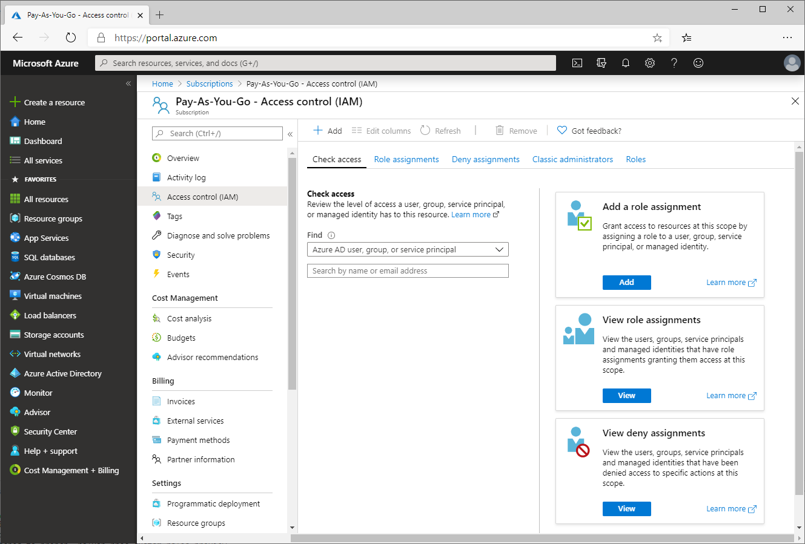
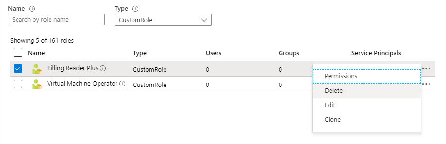

# Create custom roles using the Azure portal (Preview)

If the [built-in roles](built-in-roles.md) don't meet the specific needs of your organization, you can create your own custom roles. Just like built-in roles, you can assign custom roles to users, groups, and service principals at subscription, resource group, and resource scopes. Custom roles are stored in an Azure Active Directory (Azure AD) directory and can be shared across subscriptions. Each directory can have up to 2000 custom roles. Custom roles can be created using the Azure portal, Azure PowerShell, Azure CLI, or the REST API. This article describes how to create custom roles using the Azure portal (currently in preview).

## Prerequisites

To create custom roles, you need:

- Permissions to create custom roles, such as [Owner](built-in-roles.md#owner) or [User Access Administrator](built-in-roles.md#user-access-administrator)

## List custom roles

A role definition is a collection of permissions that you use for role assignments. Follow these steps to view your custom roles, if any.

1. Open a subscription, resource group, or resource and then open **Access control (IAM)**.

    The following shows the Access control (IAM) blade opened for a subscription.

    

1. Click the **Roles** tab to see a list of all the built-in and custom roles.

    

1. In the **Type** list, select **CustomRole** to just see your custom roles.

    You might not have any custom roles.

    

## Create a custom role

To create a custom role using the Azure portal, you start from **Access control (IAM)** and then specify a name, permissions, and assignable scopes.

1. Open a subscription, resource group, or resource where you want to the custom role to be assignable and then open **Access control (IAM)**.

    The following shows the Access control (IAM) blade opened for a subscription.

    

1. Click **Add** and then click **Add custom role (preview)**.

    

    This opens the **Basics** tab to create a custom role.

    

1. In the **Custom role name** box, specify a name for the custom role. The name must be unique for the Azure AD directory. The name can include letters, numbers, spaces, and special characters.

1. In the **Description** box, specify an optional description for the custom role. This will become the tooltip for the custom role.

1. For **Baseline permissions**, click **Clone a role** or **Start from scratch**.

    When you create a custom role, you can copy the permissions from an existing role or you can start from scratch. If you click Clone a role, a list will appear where you can select the role that you want to clone.

    

1. Click **Next** to open the **Permissions** tab.

    

1. Click **Add permissions** to open the **Add permissions** pane. On this pane, you specify the management or data operations that your custom role allows to be performed.

    

    The default list of permissions are generic wildcard actions, such as read, write, and delete. To select specific permissions, you must select first select a resource provider.

1. In the **Resource provider** list, select a resource provider that has a permission you want to use.

    For example, click the Microsoft.Compute resource provider to list the permissions related to virtual machines and other compute resources. For a complete list of resource providers, see [Azure Resource Manager resource provider operations](resource-provider-operations.md).

1. Use the **Resource type**, **Operation**, and **Permission type** lists to further refine your list. For Permission type, Actions apply to management operations and DataActions apply to data operations.

1. In the **Select** box, type a string to search the list of permissions.

1. Once you find one or more permissions, add a check mark next to the permissions and then click the **Add** button.

    

    The permission gets added to your list as an Action.

    

1. Click **Exclude permissions** to open the **Exclude permissions** pane. On this pane, you specify the management or data operations that are excluded or subtracted from the allowed Actions or DataActions.

1. Once you find one or more permissions, add a check mark next to the permissions to exclude and then click the **Add** button.

    

    The permission gets added to your list as a NotAction.

    

    The effective permissions are computed by adding all of the Actions and then subtracting all of the NotActions.

1. Once you have specified all your permissions, click **Next** to open the **Assignable scopes** tab.

    

    The Assignable scopes tab enables you to specify where your custom role is available for assignment, such as subscription, resource group, or resource.

1. Click **Add assignable scopes** to open the **Add assignable scopes** pane.

1. Click a scope that you want to use, typically your subscription.

    

1. Click the **Add** button to add your assignable scope.

    

1. Click **Next** to open the **JSON** tab.

    On this tab, you can see how your custom role is formatted in JSON.

1. If you want to add a wildcard (*) permission or directly edit the JSON, click **Edit**.

1. Click **Next** to open the **Review + create** tab.

    

1. Click **Create** to create your custom role.

    After a few moments, a message box appears indicating your custom role was successfully created.

    

1. Click **OK** in the success message box.

    Your custom role appears in the list of roles.

    

## Update a custom role

1. As described earlier in this article, open your list of custom roles.

    

1. Click the ellipsis (**...**) for the custom role you want to edit and then click **Edit**.

    

1. On the **Basics** tab, you can update the name or description.

1. On the **Permissions** tab, you can add or remove permissions.

1. On the **Assignable scopes** tab, you can update the assignable scopes.

1. On the **JSON** tab, you can directly edit the JSON.

1. Once you are finished with your changes, click the **Review + create** tab to review your changes.

1. Click the **Update** button to update your custom role.

## Delete a custom role

1. As described earlier in this article, open your list of custom roles.

    

1. Click the ellipsis (**...**) for the custom role you want to delete and then click **Delete**.

    

    After a few moments, your custom role is deleted.

## Next steps

- [Tutorial: Create a custom role using Azure PowerShell](tutorial-custom-role-powershell.md)
- [Custom roles in Azure](custom-roles.md)
- [Azure Resource Manager resource provider operations](resource-provider-operations.md)
