# Create or update Azure custom roles using the Azure portal

If the [Azure built-in roles](built-in-roles.md) don't meet the specific needs of your organization, you can create your own Azure custom roles. Just like built-in roles, you can assign custom roles to users, groups, and service principals at management group, subscription and resource group scopes. Custom roles are stored in a Microsoft Entra directory and can be shared across subscriptions. Each directory can have up to 5000 custom roles. Custom roles can be created using the Azure portal, Azure PowerShell, Azure CLI, or the REST API. This article describes how to create custom roles using the Azure portal.

## Prerequisites

To create custom roles, you need:

- Permissions to create custom roles, such as [Owner](built-in-roles.md#owner) or [User Access Administrator](built-in-roles.md#user-access-administrator)

## Step 1: Determine the permissions you need

Azure has thousands of permissions that you can potentially include in your custom role. Here are some methods that can help you determine the permissions you will want to add to your custom role:

- Look at existing [built-in roles](built-in-roles.md).
- List the Azure services you want to grant access to.
- Determine the [resource providers that map to the Azure services](../azure-resource-manager/management/azure-services-resource-providers.md). A search method is described later in [Step 4: Permissions](#step-4-permissions).
- Search the [available permissions](resource-provider-operations.md) to find permissions you want to include. A search method is described later in [Step 4: Permissions](#step-4-permissions).

## Step 2: Choose how to start

There are three ways that you can start to create a custom role. You can clone an existing role, start from scratch, or start with a JSON file. The easiest way is to find an existing role that has most of the permissions you need and then clone and modify it for your scenario. 

### Clone a role

If an existing role does not quite have the permissions you need, you can clone it and then modify the permissions. Follow these steps to start cloning a role.

1. In the Azure portal, open a management group, subscription, or resource group where you want the custom role to be assignable and then open **Access control (IAM)**.

    The following screenshot shows the Access control (IAM) page opened for a subscription.

    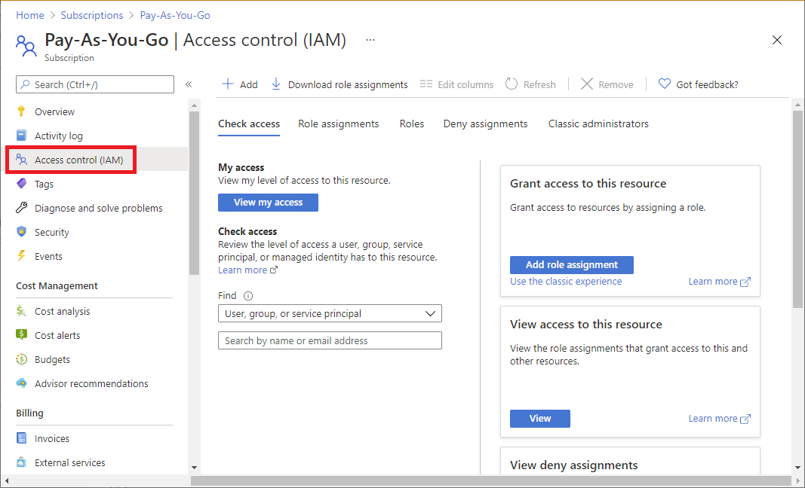

1. Click the **Roles** tab to see a list of all the built-in and custom roles.

1. Search for a role you want to clone such as the Billing Reader role.

1. At the end of the row, click the ellipsis (**...**) and then click **Clone**.

    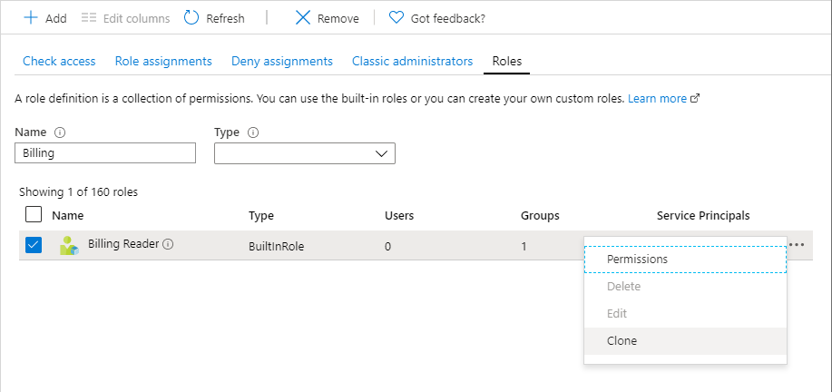

    This opens the custom roles editor with the **Clone a role** option selected.

1. Proceed to [Step 3: Basics](#step-3-basics).

### Start from scratch

If you prefer, you can follow these steps to start a custom role from scratch.

1. In the Azure portal, open a management group, subscription, or resource group where you want the custom role to be assignable and then open **Access control (IAM)**.

1. Click **Add** and then click **Add custom role**.

    

    This opens the custom roles editor with the **Start from scratch** option selected.

1. Proceed to [Step 3: Basics](#step-3-basics).

### Start from JSON

If you prefer, you can specify most of your custom role values in a JSON file. You can open the file in the custom roles editor, make additional changes, and then create the custom role. Follow these steps to start with a JSON file.

1. Create a JSON file that has the following format:

    ```json
    {
        "properties": {
            "roleName": "",
            "description": "",
            "assignableScopes": [],
            "permissions": [
                {
                    "actions": [],
                    "notActions": [],
                    "dataActions": [],
                    "notDataActions": []
                }
            ]
        }
    }
    ```

1. In the JSON file, specify values for the various properties. Here's an example with some values added. For information about the different properties, see [Understand Azure role definitions](role-definitions.md).

    ```json
    {
        "properties": {
            "roleName": "Billing Reader Plus",
            "description": "Read billing data and download invoices",
            "assignableScopes": [
                "/subscriptions/11111111-1111-1111-1111-111111111111"
            ],
            "permissions": [
                {
                    "actions": [
                        "Microsoft.Authorization/*/read",
                        "Microsoft.Billing/*/read",
                        "Microsoft.Commerce/*/read",
                        "Microsoft.Consumption/*/read",
                        "Microsoft.Management/managementGroups/read",
                        "Microsoft.CostManagement/*/read",
                        "Microsoft.Support/*"
                    ],
                    "notActions": [],
                    "dataActions": [],
                    "notDataActions": []
                }
            ]
        }
    }
    ```
    
1. In the Azure portal, open the **Access control (IAM)** page.

1. Click **Add** and then click **Add custom role**.

    

    This opens the custom roles editor.

1. On the Basics tab, in **Baseline permissions**, select **Start from JSON**.

1. Next to the Select a file box, click the folder button to open the Open dialog box.

1. Select your JSON file and then click **Open**.

1. Proceed to [Step 3: Basics](#step-3-basics).

## Step 3: Basics

On the **Basics** tab, you specify the name, description, and baseline permissions for your custom role.

1. In the **Custom role name** box, specify a name for the custom role. The name must be unique for the Microsoft Entra directory. The name can include letters, numbers, spaces, and special characters.

1. In the **Description** box, specify an optional description for the custom role. This will become the tooltip for the custom role.

    The **Baseline permissions** option should already be set based on the previous step, but you can change.

    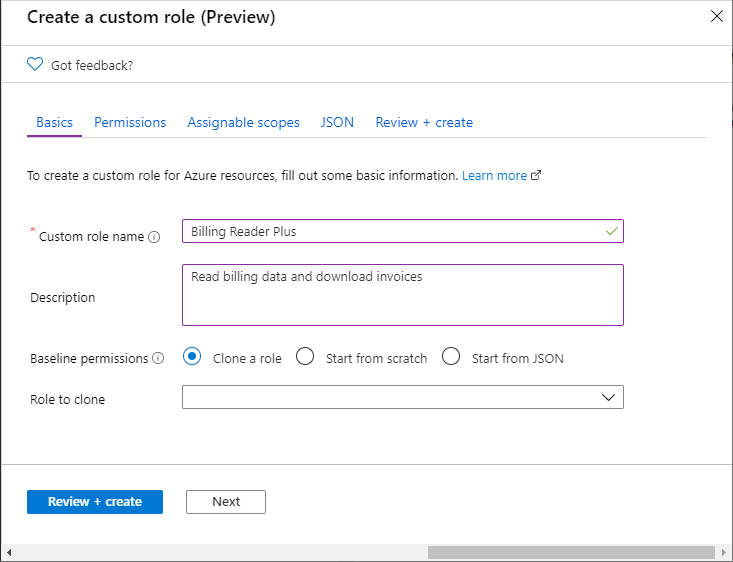

## Step 4: Permissions

On the **Permissions** tab, you specify the permissions for your custom role. Depending on whether you cloned a role or if you started with JSON, the Permissions tab might already list some permissions.

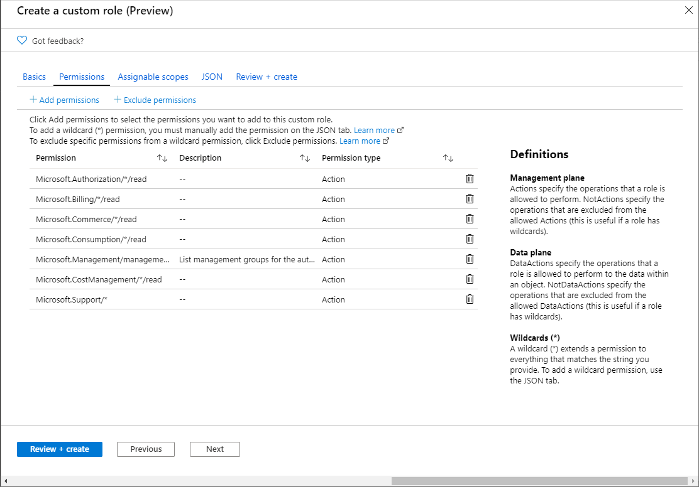

### Add or remove permissions

Follow these steps to add or remove permissions for your custom role.

1. To add permissions, click **Add permissions** to open the Add permissions pane.

    This pane lists all available permissions grouped into different categories in a card format. Each category represents a *resource provider*, which is a service that supplies Azure resources.

1. In the **Search for a permission** box, type a string to search for permissions. For example, search for *invoice* to find permissions related to invoice.

    A list of resource provider cards will be displayed based on your search string. For a list of how resource providers map to Azure services, see [Resource providers for Azure services](../azure-resource-manager/management/azure-services-resource-providers.md).

    

1. Click a resource provider card that might have the permissions you want to add to your custom role, such as **Microsoft Billing**.

    A list of the management permissions for that resource provider is displayed based on your search string.

    

1. If you are looking for permissions that apply to the data plane, click **Data Actions**. Otherwise, leave the actions toggle set to **Actions** to list permissions that apply to the control plane. For more information, about the differences between the control plane and data plane, see [Control and data actions](role-definitions.md#control-and-data-actions).

1. If necessary, update the search string to further refine your search.

1. Once you find one or more permissions you want to add to your custom role, add a check mark next to the permissions. For example, add a check mark next to **Other : Download Invoice** to add the permission to download invoices.

1. Click **Add** to add the permission to your permission list.

    The permission gets added as an `Actions` or a `DataActions`.

    

1. To remove permissions, click the delete icon at the end of the row. In this example, since a user will not need the ability to create support tickets, the `Microsoft.Support/*` permission can be deleted.

### Add wildcard permissions

Depending on how you chose to start, you might have permissions with wildcards (`*`) in your list of permissions. A wildcard (`*`) extends a permission to everything that matches the action string you provide. For example, the following wildcard string adds all permissions related to Azure Cost Management and exports. This would also include any future export permissions that might be added.

```
Microsoft.CostManagement/exports/*
```

If you want to add a new wildcard permission, you can't add it using the **Add permissions** pane. To add a wildcard permission, you have to add it manually using the **JSON** tab. For more information, see [Step 6: JSON](#step-6-json).

> [!NOTE]
> It's recommended that you specify `Actions` and `DataActions` explicitly instead of using the wildcard (`*`) character. The additional access and permissions granted through future `Actions` or `DataActions` may be unwanted behavior using the wildcard.

### Exclude permissions

If your role has a wildcard (`*`) permission and you want to exclude or subtract specific permissions from that wildcard permission, you can exclude them. For example, let's say that you have the following wildcard permission:

```
Microsoft.CostManagement/exports/*
```

If you don't want to allow an export to be deleted, you could exclude the following delete permission:

```
Microsoft.CostManagement/exports/delete
```

When you exclude a permission, it is added as a `NotActions` or `NotDataActions`. The effective management permissions are computed by adding all of the `Actions` and then subtracting all of the `NotActions`. The effective data permissions are computed by adding all of the `DataActions` and then subtracting all of the `NotDataActions`.

> [!NOTE]
> Excluding a permission is not the same as a deny. Excluding permissions is simply a convenient way to subtract permissions from a wildcard permission.

1. To exclude or subtract a permission from an allowed wildcard permission, click **Exclude permissions** to open the Exclude permissions pane.

    On this pane, you specify the management or data permissions that are excluded or subtracted.

1. Once you find one or more permissions that you want to exclude, add a check mark next to the permissions and then click the **Add** button.

    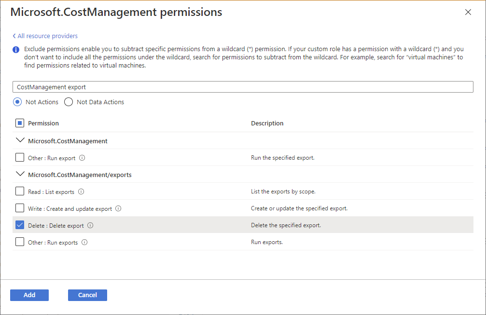

    The permission gets added as a `NotActions` or `NotDataActions`.

    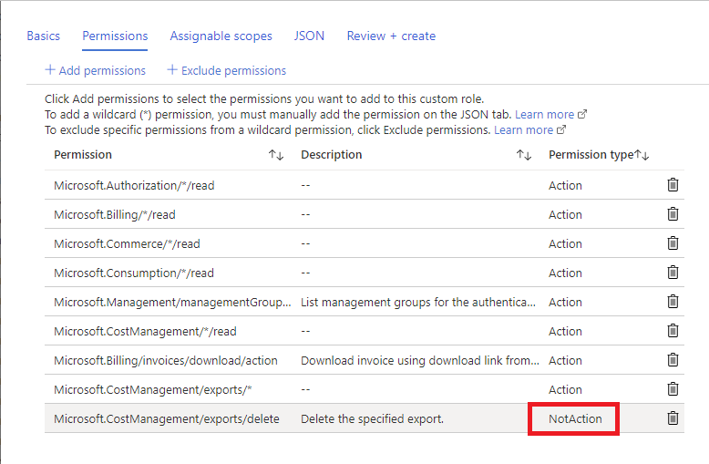

## Step 5: Assignable scopes

On the **Assignable scopes** tab, you specify where your custom role is available for assignment, such as management group, subscriptions, or resource groups. Depending on how you chose to start, this tab might already list the scope where you opened the Access control (IAM) page.

 You can define only one management group in assignable scopes. Setting assignable scope to root scope ("/") is not supported.

1. Click **Add assignable scopes** to open the Add assignable scopes pane.

    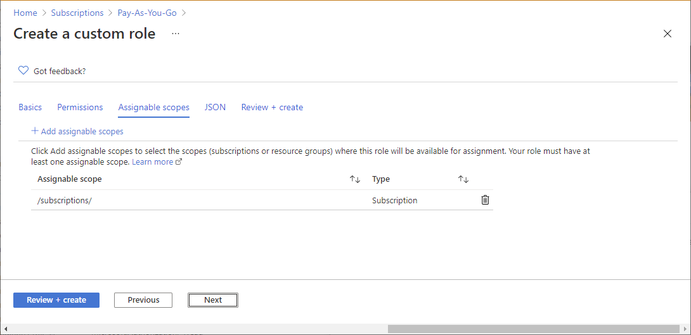

1. Click one or more scopes that you want to use, typically your subscription.

    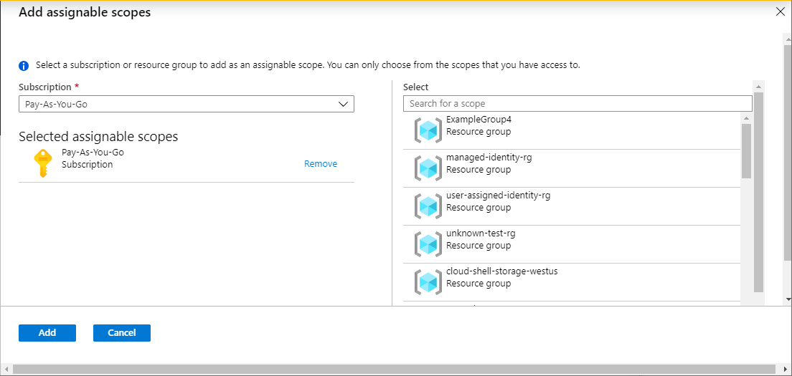

1. Click the **Add** button to add your assignable scope.

## Step 6: JSON

On the **JSON** tab, you see your custom role formatted in JSON. If you want, you can directly edit the JSON.

1. To edit the JSON, click **Edit**.

    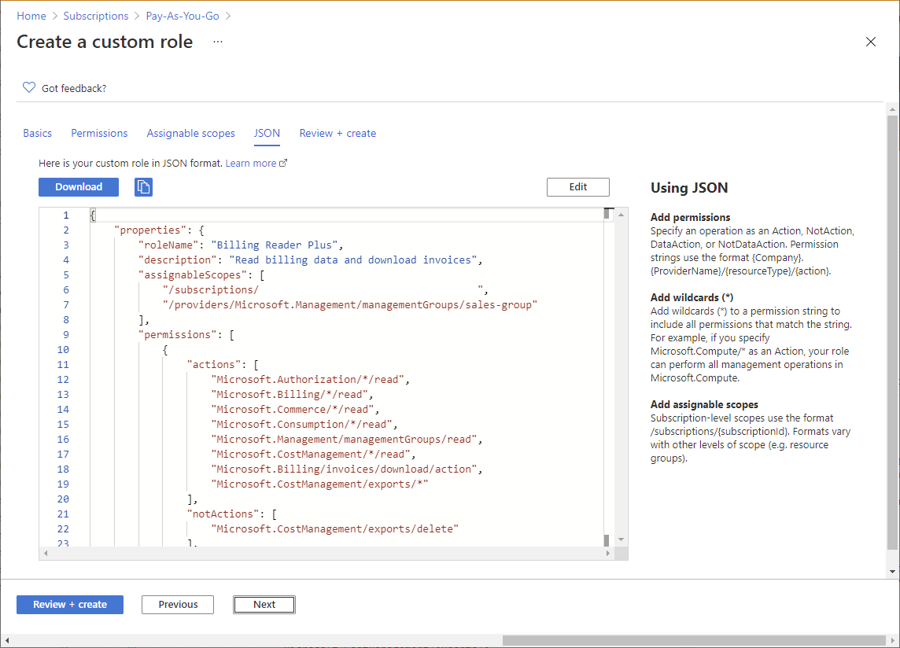

1. Make changes to the JSON.

    If the JSON is not formatted correctly, you will see a red jagged line and an indicator in the vertical gutter.

1. When finished editing, click **Save**.

## Step 7: Review + create

On the **Review + create** tab, you can review your custom role settings.

1. Review your custom role settings.

    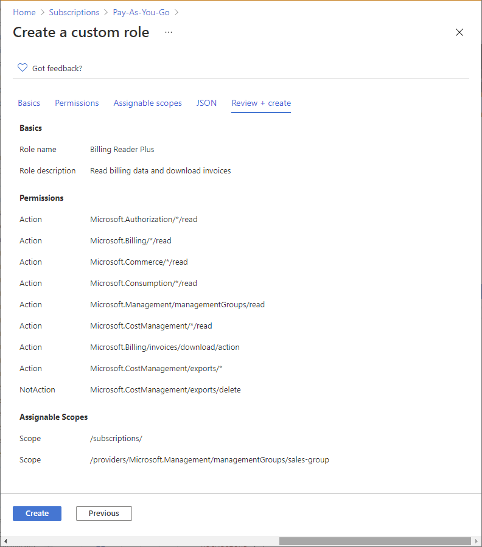

1. Click **Create** to create your custom role.

    After a few moments, a message box appears indicating your custom role was successfully created.

    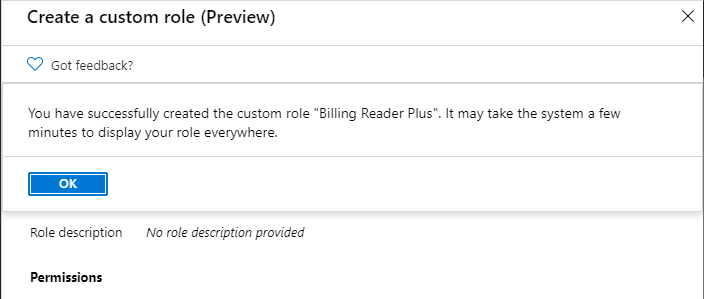

    If any errors are detected, a message will be displayed.

    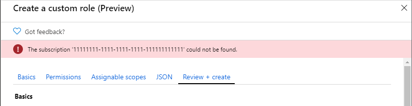

1. View your new custom role in the **Roles** list. If you don't see your custom role, click **Refresh**.

     It can take a few minutes for your custom role to appear everywhere.

## List custom roles

Follow these steps to view your custom roles.

1. Open a management group, subscription, or resource group and then open **Access control (IAM)**.

1. Click the **Roles** tab to see a list of all the built-in and custom roles.

1. In the **Type** list, select **CustomRole** to just see your custom roles.

    If you just created your custom role and you don't see it in the list, click **Refresh**.

    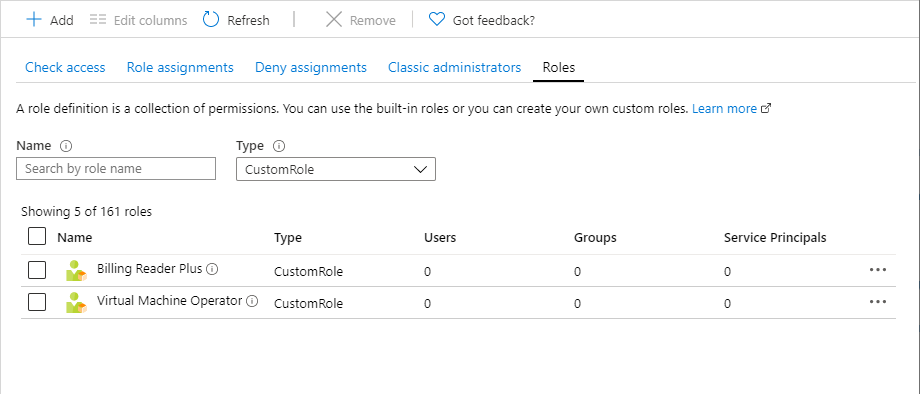

## Update a custom role

1. As described earlier in this article, open your list of custom roles.

1. Click the ellipsis (**...**) for the custom role you want to update and then click **Edit**. Note that you can't update built-in roles.

    The custom role is opened in the editor.

    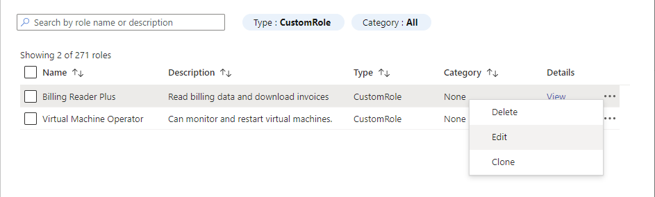

1. Use the different tabs to update the custom role.

1. Once you are finished with your changes, click the **Review + create** tab to review your changes.

1. Click the **Update** button to update your custom role.

## Delete a custom role

1. Remove any role assignments that use the custom role. For more information, see [Find role assignments to delete a custom role](custom-roles.md#find-role-assignments-to-delete-a-custom-role).

1. As described earlier in this article, open your list of custom roles.

1. Click the ellipsis (**...**) for the custom role you want to delete and then click **Delete**.

    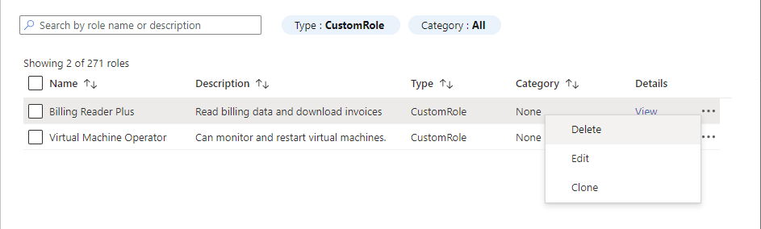

    It can take a few minutes for your custom role to be completely deleted.

## Next steps

- [Tutorial: Create an Azure custom role using Azure PowerShell](tutorial-custom-role-powershell.md)
- [Azure custom roles](custom-roles.md)
- [Azure resource provider operations](resource-provider-operations.md)
