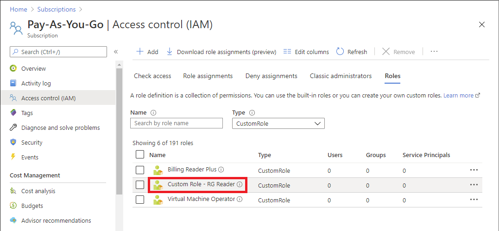

# Create or update Azure custom roles using an ARM template

If the [Azure built-in roles](built-in-roles.md) don't meet the specific needs of your organization, you can create your own [custom roles](custom-roles.md). This article describes how to create or update a custom role using an Azure Resource Manager template (ARM template).

[!INCLUDE [About Azure Resource Manager](../../includes/resource-manager-quickstart-introduction.md)]

To create a custom role, you specify a role name, permissions, and where the role can be used. In this article, you create a role named _Custom Role - RG Reader_ with resource permissions that can be assigned at a subscription scope or lower.

If your environment meets the prerequisites and you're familiar with using ARM templates, select the **Deploy to Azure** button. The template will open in the Azure portal.

:::image type="content" source="~/reusable-content/ce-skilling/azure/media/template-deployments/deploy-to-azure-button.svg" alt-text="Button to deploy the Resource Manager template to Azure." border="false" link="https://portal.azure.com/#create/Microsoft.Template/uri/https%3A%2F%2Fraw.githubusercontent.com%2FAzure%2Fazure-quickstart-templates%2Fmaster%2Fsubscription-deployments%2Fcreate-role-def%2Fazuredeploy.json":::

## Prerequisites

To create a custom role, you must have:

- Permissions to create custom roles, such as [User Access Administrator](built-in-roles.md#user-access-administrator).

You must use the following version:

- `2018-07-01` or later

For more information, see [API versions of Azure RBAC REST APIs](/rest/api/authorization/versions).

## Review the template

The template used in this article is from [Azure Quickstart Templates](https://azure.microsoft.com/resources/templates/create-role-def). The template has four parameters and a resources section. The four parameters are:

- Array of actions with a default value of `["Microsoft.Resources/subscriptions/resourceGroups/read"]`.
- Array of `notActions` with an empty default value.
- Role name with a default value of `Custom Role - RG Reader`.
- Role description with a default value of `Subscription Level Deployment of a Role Definition`.

The scope where this custom role can be assigned is set to the current subscription.

:::code language="json" source="~/quickstart-templates/subscription-deployments/create-role-def/azuredeploy.json":::

The resource defined in the template is:

- [Microsoft.Authorization/roleDefinitions](/azure/templates/Microsoft.Authorization/roleDefinitions)

## Deploy the template

Follow these steps to deploy the previous template.

1. Sign in to the [Azure portal](https://portal.azure.com).

1. Open Azure Cloud Shell for PowerShell.

1. Copy and paste the following script into Cloud Shell.

    ```azurepowershell-interactive
    $location = Read-Host -Prompt "Enter a location (i.e. centralus)"
    [string[]]$actions = Read-Host -Prompt "Enter actions as a comma-separated list (i.e. action1,action2)"
    $actions = $actions.Split(',')
    $templateUri = "https://raw.githubusercontent.com/Azure/azure-quickstart-templates/master/subscription-deployments/create-role-def/azuredeploy.json"
    New-AzDeployment -Location $location -TemplateUri $templateUri -actions $actions
    ```

1. Enter a location for the deployment such as `centralus`.

1. Enter a list of actions for the custom role as a comma-separated list such as `Microsoft.Resources/resources/read,Microsoft.Resources/subscriptions/resourceGroups/read`.

1. If necessary, press Enter to run the `New-AzDeployment` command.

    The [New-AzDeployment](/powershell/module/az.resources/new-azdeployment) command deploys the template to create the custom role.

    You should see output similar to the following:

    ```azurepowershell-interactive
    PS> New-AzDeployment -Location $location -TemplateUri $templateUri -actions $actions

    Id                      : /subscriptions/{subscriptionId}/providers/Microsoft.Resources/deployments/azuredeploy
    DeploymentName          : azuredeploy
    Location                : centralus
    ProvisioningState       : Succeeded
    Timestamp               : 6/25/2020 8:08:32 PM
    Mode                    : Incremental
    TemplateLink            :
                              Uri            : https://raw.githubusercontent.com/Azure/azure-quickstart-templates/master/subscription-deployments/create-role-def/azuredeploy.json
                              ContentVersion : 1.0.0.0

    Parameters              :
                              Name               Type                       Value
                              =================  =========================  ==========
                              actions            Array                      [
                                "Microsoft.Resources/resources/read",
                                "Microsoft.Resources/subscriptions/resourceGroups/read"
                              ]
                              notActions         Array                      []
                              roleName           String                     Custom Role - RG Reader
                              roleDescription    String                     Subscription Level Deployment of a Role Definition

    Outputs                 :
    DeploymentDebugLogLevel :
    ```

## Review deployed resources

Follow these steps to verify that the custom role was created.

1. Run the [Get-AzRoleDefinition](/powershell/module/az.resources/get-azroledefinition) command to list the custom role.

    ```azurepowershell-interactive
    Get-AzRoleDefinition "Custom Role - RG Reader" | ConvertTo-Json
    ```

    You should see output similar to the following:

    ```azurepowershell-interactive
    {
      "Name": "Custom Role - RG Reader",
      "Id": "11111111-1111-1111-1111-111111111111",
      "IsCustom": true,
      "Description": "Subscription Level Deployment of a Role Definition",
      "Actions": [
        "Microsoft.Resources/resources/read",
        "Microsoft.Resources/subscriptions/resourceGroups/read"
      ],
      "NotActions": [],
      "DataActions": [],
      "NotDataActions": [],
      "AssignableScopes": [
        "/subscriptions/{subscriptionId}"
      ]
    }
    ```

1. In the Azure portal, open your subscription.

1. In the left menu, select **Access control (IAM)**.

1. Select the **Roles** tab.

1. Set the **Type** list to **CustomRole**.

1. Verify that the **Custom Role - RG Reader** role is listed.

   

## Update a custom role

Similar to creating a custom role, you can update an existing custom role by using a template. To update a custom role, you must specify the role you want to update.

Here are the changes you would need to make to the previous Quickstart template to update the custom role.

- Include the role ID as a parameter.
    ```json
        ...
        "roleDefName": {
          "type": "string",
          "metadata": {
            "description": "ID of the role definition"
          }
        ...
    ```

- Include the role ID parameter in the role definition.

    ```json
      ...
      "resources": [
        {
          "type": "Microsoft.Authorization/roleDefinitions",
          "apiVersion": "2022-04-01",
          "name": "[parameters('roleDefName')]",
          "properties": {
            ...
    ```

Here's an example of how to deploy the template.

```azurepowershell
$location = Read-Host -Prompt "Enter a location (i.e. centralus)"
[string[]]$actions = Read-Host -Prompt "Enter actions as a comma-separated list (i.e. action1,action2)"
$actions = $actions.Split(',')
$roleDefName = Read-Host -Prompt "Enter the role ID to update"
$templateFile = "rg-reader-update.json"
New-AzDeployment -Location $location -TemplateFile $templateFile -actions $actions -roleDefName $roleDefName
```

## Clean up resources

To remove the custom role, follow these steps.

1. Run the following command to remove the custom role.

    ```azurepowershell-interactive
    Get-AzRoleDefinition -Name "Custom Role - RG Reader" | Remove-AzRoleDefinition
    ```

1. Enter **Y** to confirm that you want to remove the custom role.

## Next steps

- [Understand Azure role definitions](role-definitions.md)
- [Quickstart: Assign an Azure role using an Azure Resource Manager template](quickstart-role-assignments-template.md)
- [ARM template documentation](../azure-resource-manager/templates/index.yml)
